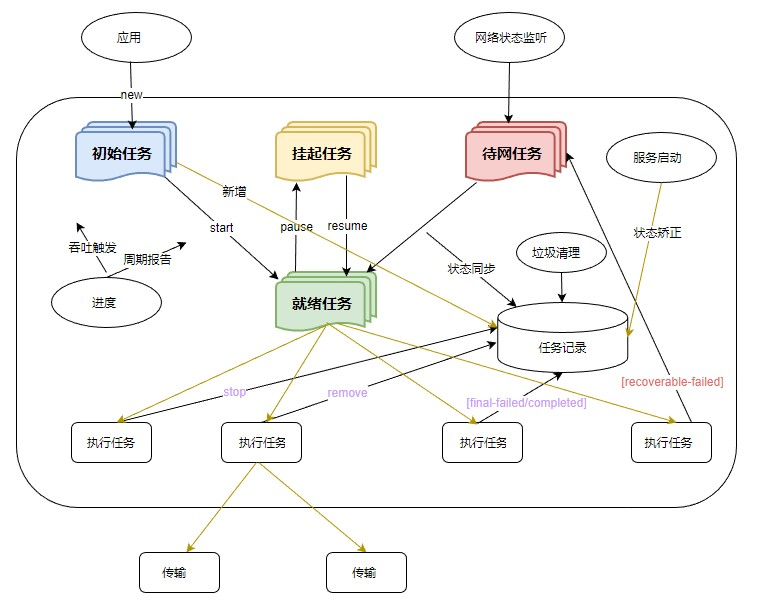

# 文件上传下载性能提升指导

## 概述

在开发应用时，要实现高效的客户端跟服务器之间数据交换，文件传输的性能是至关重要的。一个数据交换性能较低的应用会导致其在加载过程中耗费较长时间，在很多的场景造成页面卡顿，极大的影响了用户体验。相反，一个数据交换高效的应用，则会让应用变得更加流畅。

本文将介绍两种常见的上传下载传输和网络请求的关键技术：数据压缩和断点续传，可提升上传下载的性能、减少宽带占用，从而提高数据传输效率。

## 上传下载接口

目前系统内提供给文件上传下载可用的模块有[@ohos.net.http](../reference/apis-network-kit/js-apis-http.md)模块和[@ohos.request](../reference/apis-basic-services-kit/js-apis-request.md)模块。[@ohos.net.http](../reference/apis-network-kit/js-apis-http.md)模块提供基础的HTTP数据请求能力，功能较为基础，本文不做介绍。[@ohos.request](../reference/apis-basic-services-kit/js-apis-request.md)模块主要给应用提供上传下载文件、后台传输代理的基础能力。它具备任务管理系统的默认并发功能，简化下载功能的实现和管理，提升数据传输的安全，整合通知机制，新增任务状态与进度查询功能，具有灵活性、高效性、可扩展性、可靠性、一致性和安全性的优势。

具体来说，[@ohos.request](../reference/apis-basic-services-kit/js-apis-request.md)模块包括以下功能：

1. 任务管理：任务管理操作包括创建任务、暂停任务、恢复任务、删除任务、文件上传、文件下载、系统通知等。创建的任务分为前端任务和后台任务。前端任务是立即的、模态界面的、同步的，跟随应用的生命周期，通常数据量较小、耗时短，例如发布微信朋友圈、微博，通常优先级高且倾斜带宽资源。后台任务为可等待的、任意界面的、异步的，通常数据量较大、耗时长，例如缓存一部电影、同步数百兆字节乃至若干吉字节的数据，优先级相较于前端任务低且与应用生命周期无关。
  
2. 任务查询管理：系统查询所有任务、过滤上传任务、过滤下载任务、过滤时间段内任务、过滤前端任务、过滤后台任务、用户查询指定任务信息、用户查询指定隐藏任务信息、系统查询指定任务信息、系统清理指定任务等。
  
3. 任务自动恢复：网络条件不满足时任务不启动或者暂停，满足后自动启动或者恢复（需要HTTP服务器支持断点续传）。
  
4. 安全隐私保护：包括网络权限检查、普通接口仅操作自己创建的任务、任务信息加密存储、系统接口检查、系统接口查询隐匿任务敏感字段、普通接口查询隐匿任务敏感字段、遍历攻击、DOS、僵尸任务、恶意的静默后台任务、系统管理接口权限等。
  
5. 日志：包括调试模式和发布模式。调试模式可打印所有内存修改、磁盘、网络读写、逻辑分支等日志。发布模式下除了导致任务失败、服务异常的日志，其余日志都会关闭。
  
6. 任务失败重试：对于不可恢复的原因，直接失败；对于可恢复的原因，网络断开、网络类型不匹配等，不现场重试，任务到等待网络恢复队列；网络超时则就地重试1次，仍网络超时，则立即失败。
  
7. 服务按需启停：上传下载服务不随系统自启。应用主动调用任意接口，上传下载服务自动启动。网络连接事件会触发上传下载服务启动。在任务队列中，没有正在处理的任务，或者等待网络恢复的任务，延迟10秒钟，再check一次，仍旧没有的，则通知系统服务框架（SAMGR）可以停止并卸载上传下载服务。在服务退出过程中，新的接口请求可能失败，在客户端检查服务状态、通过重试按需启动。
  
8. 通知：任务从第一次开始到最终结束都应该有进度通知。目前采用固定时间间隔触发进度通知，前台任务1秒，后台任务3秒。任务状态的每次变化也要触发进度通知。当任务完成和失败，则触发其专用的进度通知。提供了抑制开关，可以在创建任务时打开，以避免频繁通知。
  

### 下载任务的状态迁移流程

使用[@ohos.request](../reference/apis-basic-services-kit/js-apis-request.md)模块执行下载的任务，具有四种运行状态：初始任务、就绪任务、挂起任务、待网任务、成功任务、失败任务。可以通过create创建任务，start开始任务，pause挂起任务，resume恢复任务，remove移除任务，stop停止任务，任务结果有final-failed任务失败，final-completed下载完成，recoverable-failed重试失败，并支持查询任务状态，具体流程如图一所示：

**图一 模块流程图**



## 常见场景与方案

**场景1：低带宽网络上传琐碎文件场景**

在网络连接较差，低带宽的网络环境中，HTTP连接的建立耗时可能会大幅提升。这时候进行[数据压缩](#数据压缩)可以加快页面加载速度，并减少HTTP请求数量和移动数据流量。

**场景2：处理大量资源的场景**

如应用商店、网盘应用等，这类应用通常拥有大体积的文件资源。当用户从暂停或者断网中重新恢复时，如果从头开始上传下载则会额外耗费大量的时间。此时可以采用[断点续传](#断点续传)方法进行上传下载。

### 数据压缩

数据压缩是指在应用中对数据进行压缩，以减少存储空间和数据传输量、节省带宽，提高加载速度。数据压缩通常在网络传输和存储方面发挥着重要作用，特别是在处理大量数据或需要频繁传输数据的场景下。

在应用开发中，常见的数据压缩技术分类如下：

- 有损压缩：仅限图片视频音频等文件适用。通过减少图片视频文件的分辨率，降低音频的音质等手段，以减少文件的大小，来实现减少加载时间和带宽消耗。
- 无损压缩：对一些零碎文件可以使用 [@ohos.zlib（Zip模块）](../reference/apis-basic-services-kit/js-apis-zlib.md)来进行打包压缩，减少上传请求次数；对一些大文件可以利用缓存技术，服务器将曾经上传过的大文件MD5码缓存起来，本地在上传前预生成MD5码并传输到服务器进行比对，如果相同则说明服务器存在该文件，可以跳过该文件上传，从而省略重复传输时间。
  

以从相册批量上传图片为例，介绍大量文件打包无损压缩上传相关技术，下图为相关示例的界面截图：

**图二 相册批量上传图片示例图**


以批量上传照片（分辨率为480\*640，24位，平均大小50\~120KB）为例，在RK设备上测试的结果如下表所示：

| 上传照片数量 | 优化前耗时（ms） | 优化后耗时（ms） |
| --- | --- | ---|
| 10 | 470 | 526 |
| 20 | 1124 | 1091 |
| ... | ... | ... |
| 50 | 2379 | 2138 |
| 80 | 3950 | 3258 |
| ... | ... | ... |
| 100 | 5276 | 3909 |

**图三 上传数量和耗时对比图表**


由于上传耗时收到网络状态影响偏差较大，结果取的几次测量结果的最小值。但是仍然可以从数据中看出，优化前的耗时基本为线性增长，压缩优化后的耗时在上传文件数量较低时并不明显，还会因为多余的压缩处理影响耗时。不过随着上传的照片数量增多，优化后的耗时和优化之前的耗时差距越来越明显，优化效果越好。

**数据压缩的相关示例代码如下：**

1. 导入相关模块：
  
```ts
import common from '@ohos.app.ability.common';
import fs from '@ohos.file.fs';
import zlib from '@ohos.zlib';
```
2. 创建压缩上传相关类：
  
```ts
class ZipUpload {
  // 创建任务前存放的uri
  private waitList: Array<string> = [];
  // 需要上传的文件uri
  private fileUris: Array<string> = [];
  ...
}
```
3. 建立用于接收图库图片的临时文件夹，并将整个临时文件夹打包添加到待上传list内：
  
```ts
// 文件压缩处理
async zipUploadFiles(fileUris: Array<string>): Promise<void> {
  this.context = getContext(this) as common.UIAbilityContext;
  let cacheDir = this.context.cacheDir;
  let tempDir = fs.mkdtempSync(`${cacheDir}/XXXXXX`);
  // 将图库图片获取的uri放入fileUris中，遍历复制到临时文件夹
  for (let i = 0; i < fileUris.length; i++) {
    let fileName = fileUris[i].split('/').pop();
    let resourceFile: fs.File = fs.openSync(fileUris[i], fs.OpenMode.READ_ONLY);
    fs.copyFileSync(resourceFile.fd, `${tempDir}/${fileName}`, 0);
    fs.closeSync(resourceFile);
  }
  // 文件压缩，将之前生成的临时文件夹内打包到test.zip内
  let options: zlib.Options = {
    level: zlib.CompressLevel.COMPRESS_LEVEL_DEFAULT_COMPRESSION,
    memLevel: zlib.MemLevel.MEM_LEVEL_DEFAULT,
    strategy: zlib.CompressStrategy.COMPRESS_STRATEGY_DEFAULT_STRATEGY
  };
  let data = await zlib.compressFile(tempDir, `${cacheDir}/test.zip`, options);
  // 删除临时文件夹
  fs.rmdirSync(tempDir);
  // 将生成的zip包放到传输队列
  this.waitList.push(`${cacheDir}/test.zip`);
}
```
### 断点续传

断点续传功能的实现，不管是应用端还是服务器端都需要用到合理的技术来互相协同。在实际开发中，开发者无需亲自实现断点续传功能，只需对SDK进行合理配置。

在应用端需要用到的技术和API：

- [@ohos.file.fs（文件管理）](../reference/apis-core-file-kit/js-apis-file-fs.md)：用于处理文件上传操作，提供了读取文件内容，文件分片和组合的功能。
- [@ohos.file.hash（文件哈希处理）](../reference/apis-core-file-kit/js-apis-file-hash.md)：用于实现文件MD5的计算，将计算的MD5值预先传到服务器端进行预处理，实现文件秒传，同时确保传输的准确性和可靠性。
- [@ohos.request（上传下载）](../reference/apis-basic-services-kit/js-apis-request.md)：用于实现文件上传操作，并支持在上传过程中的断点续传功能。
  

在服务器端需要用到的技术：

- 协议需要支持Range：用于在服务器端支持范围请求，方便处理文件上传下载断点续传功能。
- 文件校验相关逻辑：需要实现校验文件是否有错，确保在传输中断后能够准确恢复并继续传输。
  

通过结合应用端和服务器端的相关技术，可以共同实现高效且可靠的文件断点续传功能，提供更好的用户体验并确保数据传输的稳定性。

本文基于[上传和下载](https://gitee.com/openharmony/applications_app_samples/tree/master/code/BasicFeature/Connectivity/UploadAndDownLoad)中的后台上传场景，给出了部分断点续传的示例代码，具体可以参考该工程。

#### 文件上传

对于大文件断点续传上传，本文采用[@ohos.request（上传下载）](../reference/apis-basic-services-kit/js-apis-request.md)模块中的**request.agent**任务托管接口，可以自动实现暂停继续重试等操作，无需手动将文件分片和记录上传分片信息。流程图如图四所示：

**图四 断点续传上传流程图**


 **断点续传上传示例代码如下：**

具体可以参考[RequestUpload.ets](https://gitee.com/openharmony/applications_app_samples/blob/master/code/BasicFeature/Connectivity/UploadAndDownLoad/features/uploadanddownload/src/main/ets/upload/RequestUpload.ets)

1. 导入相关模块：
```ts
import common from '@ohos.app.ability.common';
import request from '@ohos.request';
```

2. 创建相关上传类：
```ts
class Upload {
  // 后台任务
  private backgroundTask: request.agent.Task | undefined = undefined;
  // 创建任务前存放的uri
  private waitList: Array<string> = [];
  ...
}
```
3. 生成MD5码，上传到服务器进行校验：
```ts
async checkFileExist(fileUri: string): Promise<boolean> {
  let httpRequest = http.createHttp();
  // 生成md5码
  let md5 = await hash.hash(fileUri, 'md5');
  let requestOption: http.HttpRequestOptions = {
    method: http.RequestMethod.POST,
    extraData: {
      'MD5': md5
    }
  }
  let response = await httpRequest.request('http://XXX.XXX.XXX.XXX/XXXX', requestOption);
  let result = response.result;
  let flag = false;
  ... // 根据服务器返回对应数据判断是否存在
  if (flag) {
    return true;
  } else {
    return false;
  }
}
```
4. 配置Config，创建后台上传任务：
```ts
private config: request.agent.Config = {
  action: request.agent.Action.UPLOAD,
  headers: HEADER,
  url: '',
  mode: request.agent.Mode.BACKGROUND,
  method: 'POST',
  title: 'upload',
  network: request.agent.Network.ANY,
  data: [],
  token: 'UPLOAD_TOKEN'
}
...
// 转换uri
private async getFilesAndData(cacheDir: string, fileUris: Array<string>): Promise<Array<request.agent.FormItem>> {
...
}
// 创建文件上传后台任务
async createBackgroundTask(fileUris: Array<string>) {
 // 获取上传url
  this.config.url = 'http://XXX.XXX.XXX.XXX';
  this.config.mode = request.agent.Mode.BACKGROUND;
  let tempData = await this.getFilesAndData(this.context.cacheDir, fileUris);
  // 判断每个文件是否为空
  for (let i = 0; i < tempData.length; i++) {
    let flag = await this.checkFileExist(`${this.context.cacheDir}/${tempData[i].name}`);
    if (!flag) {
      this.config.data.push(tempData[i])
    }
  }
  let isFileExist = await this.checkFileExist(`${this.context.cacheDir}/${this.config.data[0].name}`);
  if (this.config.data.length === 0) {
    return;
  }
  this.backgroundTask = await request.agent.create(this.context, this.config);
}
```
5. 任务开始：
```ts
await this.backgroundTask.start();
```
6. 任务暂停：
```ts
async pause() {
  if (this.backgroundTask === undefined) {
    return;
  }
  await this.backgroundTask.pause();
}
```
7. 任务继续：
```ts
async resume() {
  if (this.backgroundTask === undefined) {
    return;
  }
  await this.backgroundTask.resume();
}
```
#### 文件下载

对于大文件断点续传下载，也可以直接调用**request.agent**接口，该接口的断点续传是基于HTTP协议Header里的Range字段实现的，在任务暂停重启的时候，会自动设置Header中的Range字段，无需进行额外的配置。

> **Range简介**
> 
> HTTP协议里面的Range字段，官方名称为范围请求，它允许服务器只发送 HTTP
> 消息的一部分到客户端，可以用来请求部分数据而不是整个资源。
> 
> Range的格式通常是Range:
> `<unit>=<start>-<end>`，其中`<unit>`表示范围所采用的单位，通常是字节（bytes），`<start>` 和 `<end>` 表示请求的起始字节和结束字节的位置。
> 
> Range语法如下：
> ```ts
> // 表示从range-start到文件末尾
> Range: <unit>=<range-start>-
> // 表示从range-start到range-end
> Range: <unit>=<range-start>-<range-end>
> // 可以同时选择多段，用逗号分隔
> Range: <unit>=<range-start>-<range-end>, <range-start>-<range-end>
> 
> // 示例：表示返回1024btyes之后的文件
> Range: bytes=1024-
> ```
> 服务器收到请求后，正确处理请求会回复206 Partial
> Content，未正常处理则会回复其他响应码。下表是服务器回复的常见响应码：
> 
> | 服务器响应码 | 常见的原因 |
> | ------------------ | -----------------|
> | 206 Partial Content | 服务器收到正常Range请求的响应码，返回部分内容的响应。|
> | 416 Range Not Satisfiable | 所请求的范围不合法，表示服务器错误。|
> |200 OK | 服务器忽略了 Range 首部，返回整个文件。|
> 

**断点续传下载示例代码如下：**

具体可以参考[RequestDownload.ets](https://gitee.com/openharmony/applications_app_samples/blob/master/code/BasicFeature/Connectivity/UploadAndDownLoad/features/uploadanddownload/src/main/ets/download/RequestDownload.ets)

1. 导入模块：
```ts
import common from '@ohos.app.ability.common';
import request from '@ohos.request';
```
2. 创建下载类：
```ts
class Download {
  // 任务存放前的uri
  private waitList: Array<string[]> = [];
  // 下载任务
  private downloadTask: request.agent.Task | undefined = undefined;
  // 后台任务下载列表
  private backgroundDownloadTaskList: Array<request.agent.Task> = [];
  ...
}
```
3. 配置Config，创建后台下载任务：
```ts
async createBackgroundTask(downloadList: Array<string[]>) {
  let splitUrl = url.split('//')[1].split('/');
  let context: common.UIAbilityContext = getContext(this) as common.UIAbilityContext;
  let downloadConfig: request.agent.Config = {
    action: request.agent.Action.DOWNLOAD,
    url: url,
    method: 'POST',
    title: 'download',
    mode: request.agent.Mode.FOREGROUND, // 必须是后台任务才能续传
    network: request.agent.Network.ANY,
    saveas: `./${folder}/${splitUrl[splitUrl.length-1]}`,
    overwrite: true
  }
  this.downloadTask = await request.agent.create(context, downloadConfig);
  if (this.backgroundDownloadTaskList.findIndex(task => task.config.url === downTask.config.url) === -1) {
    this.backgroundDownloadTaskList.push(downTask);
  }
}
```
4. 任务开始：
```ts
...
await downTask.start();
...
```
5. 任务暂停：
```ts
async pause() {
  if (this.backgroundDownloadTaskList.length === 0) {
    return;
  }
  this.backgroundDownloadTaskList.forEach(async task => {
    await task.pause();
  })
}
```
6. 任务继续：
```ts
async resume() {
  if (this.backgroundDownloadTaskList.length === 0) {
    return;
  }
  this.backgroundDownloadTaskList.forEach(async task => {
    await task.resume();
  })
}
```
7. 任务停止：
```ts
async deleteAllBackTasks() {
  if (this.backgroundDownloadTaskList.length > 0) {
    this.backgroundDownloadTaskList.forEach(async task => {
      await request.agent.remove(task.tid);
    })
    this.backgroundDownloadTaskList = [];
  }
}
```

## 相关实例

针对断点续传，有以下相关实例可以参考：  

- [上传和下载](https://gitee.com/openharmony/applications_app_samples/tree/master/code/BasicFeature/Connectivity/UploadAndDownLoad)