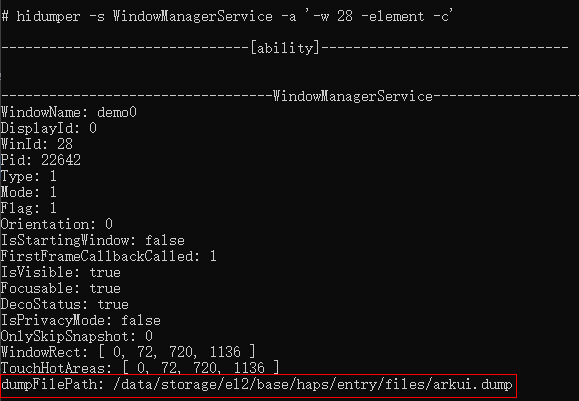

# 使用HiDumper命令行工具优化性能

## 简介

HiDumper是系统为开发、测试人员、IDE工具提供的系统信息获取工具，帮助开发者分析、定位问题。在应用开发过程中，开发者可以使用HiDumper命令行工具获取UI界面组件树信息，配合ArkUI Inspector等图形化工具定位布局性能问题；还可以使用该命令行工具获取如内存和CPU使用情况等各项系统数据，对应用性能进行评估。本文通过一些示例介绍在优化应用性能过程中如何使用HiDumper命令行工具。

开发者可参考下面步骤，通过使用HiDumper提供的-s、--mem、--cpuusage等命令进行性能分析。有关HiDumper其他功能的详细介绍可查看[《HiDumper概述》](../../device-dev/subsystems/subsys-dfx-hidumper.md)。


## HiDumper查看组件信息

开发者可以按照以下步骤获取组件信息，相比ArkUI Inspector可更灵活的获取组件的细粒度信息。

1. 开启ArkUI的debug模式。
    ```
    hdc shell param set persist.ace.debug.enabled 1
    ```
2. 重新启动应用。
3. 获取当前页面对应应用的window ID。
    ```
    hdc shell hidumper -s WindowManagerService -a '-a'
    ```

   


   * `hidumper -s`: 导出系统全部的元能力信息。
   * `hidumper -s WindowManagerService -a ['-a']`: 以 `-a` 为参数导出当前设备打开的窗口的系统元能力信息，其中 `-a` 表示执行打印操作，`['-a']` 表示打印的具体信息。
   * `WindowName`: 表示当前打开应用的窗口名，其中 `demo0` 为示例应用的默认窗口名。
   * 常见的WindowName与内置应用窗口对应关系如下：
   
     | WindowName           | 说明   |
     |----------------------|------|
     | EntryView            | 桌面   |
     | RecentView           | 最近任务 |
     | SystemUi_NavigationB | 三键导航 |
     | SystemUi_StatusBar   | 状态栏  |
     | ScreenLockWindow     | 锁屏   |

4. 通过WinId获取对应页面的控件树文件。
   ```
   hdc shell hidumper -s WindowManagerService -a '-w 28 -element -c' // 28 即为查找到的WinId
   ```

   


5. 下载组件树文件到本地。由于安全机制此处的路径非真实路径，需要使用 `find` 命令查找对应文件的准确路径。
   ```
   hdc shell find /data/ -name arkui.dump
   ```

   

   ```
   hdc file recv /data/app/el2/100/base/com.example.demo/haps/entry/files/arkui.dump  // 获取文件到本地
   ```
6. 打开文件查看应用组件树。组件树文件详细列出了每个组件的各项属性，如子组件数量childSize、组件ID、背景色BackgroundColor等。
   ```
   // arkui.dump文件内容片断
   |-> GridItem childSize:1
     | ID: 22
     | Depth: 9
     | IsDisappearing: 0
     | FrameRect: RectT (360.00, 0.00) - [180.00 x 29.00]
     | BackgroundColor: #00000000
     // ...
     |-> Stack childSize:1
       | ID: 23
       | Depth: 10
       | IsDisappearing: 0
       | FrameRect: RectT (0.00, 0.00) - [180.00 x 29.00]
       | BackgroundColor: #FFFFFF00
       // ...
       |-> Stack childSize:1
         | ID: 24
         | Depth: 11
         | IsDisappearing: 0
         | FrameRect: RectT (0.00, 0.00) - [180.00 x 29.00]
         | BackgroundColor: #FF0000FF
         // ...
         |-> Stack childSize:1
           | ID: 25
           | Depth: 12
           | IsDisappearing: 0
           | FrameRect: RectT (0.00, 0.00) - [180.00 x 29.00]
           | BackgroundColor: #00000000
           // ...
           |-> Text childSize:0
               ID: 26
               Depth: 13
               IsDisappearing: 0
               FrameRect: RectT (83.00, 0.00) - [14.00 x 29.00]
               BackgroundColor: #00000000
               // ... 
   ```

### 查看if/else控件

当使用if/else时，if/else语句会被当成一个组件，作为节点存在于组件树上。使用HiDumper命令时，打印的组件树内容包含if/else组件信息（使用ArkUI Inspector工具，if/else组件不会被作为节点项显示在组件树上）。下述代码中通过if语句： `if(this.isShow)` 实现Row组件的创建和销毁。
```
@Entry
@Component
struct ConditionComponent {
  @State isShow: boolean = true;

  build() {
    Column() {
      Button("显隐切换")
        .onClick(() => {
          this.isShow = !this.isShow;
        })
      if (this.isShow) {
        Row()
          .width(300).height(300).backgroundColor(Color.Pink)
      }
    }.width('100%')
  }
}
```
当isShow为true时，Row组件显示，此时使用HiDumper查看组件树文件，可以发现使用if/else条件语句时，if/else组件也被当作节点被创建，Row组件被当作子组件嵌套在其中。
```
|-> IfElse childSize:1
  | ID: 9
  | Depth: 6
  | IsDisappearing: 0
  |-> Row childSize:0
      ID: 12
      Depth: 7
      IsDisappearing: 0
      FrameRect: RectT (135.00, 60.00) - [450.00 x 450.00]
      BackgroundColor: #FFFFC0CB
      ParentLayoutConstraint: minSize: [[0.00 x 0.00]]maxSize: [[720.00 x 1136.00]]percentReference: [[720.00 x 1136.00]]parentIdealSize: [[720.00 x NA]]selfIdealSize: [[NA x NA]]
      top: 60.000000 left: 135.000000
      Active: 1
      Visible: 0
      ...
```
当isShow为false时，Row组件隐藏，此时使用HiDumper查看组件树文件，可以发现使用if/else条件语句时，if/else组件也被当作节点被创建，但Row组件并不会被加载。
```
|-> IfElse childSize:0
    ID: 9
    Depth: 6
    IsDisappearing: 0
```

### 查看visibility属性

开发者可以使用visibility属性控制组件的显隐。下述代码中通过visibility属性： `visibility(this.isVisible)` 实现Row组件的显示和隐藏。
```
@Entry
@Component
struct VisibilityComponent {
  @State isVisible: Visibility = Visibility.Visible;

  build() {
    Column() {
      Button("Visible")
        .onClick(() => {
          this.isVisible = Visibility.Visible;
        })
      Button("Hidden")
        .onClick(() => {
          this.isVisible = Visibility.Hidden;
        })
      Button("None")
        .onClick(() => {
          this.isVisible = Visibility.None;
        })
      Row().visibility(this.isVisible)
        .width(720).height(300).backgroundColor(Color.Pink)
    }.width('100%')
  }
}
```
当isVisible为Visible时，Row组件显示，此时使用HiDumper查看控件树文件，Visible属性为0，FrameRect属性内组件的宽和高为450。
```
|-> Row childSize:0
    ID: 13
    Depth: 6
    IsDisappearing: 0
    FrameRect: RectT (135.00, 180.00) - [450.00 x 450.00]
    BackgroundColor: #FFFFC0CB
    ParentLayoutConstraint: minSize: [[0.00 x 0.00]]maxSize: [[720.00 x 1136.00]]percentReference: [[720.00 x 1136.00]]parentIdealSize: [[720.00 x NA]]selfIdealSize: [[NA x NA]]
    top: 180.000000 left: 135.000000
    Active: 1
    Visible: 0
    ...
```
当isVisible为Hidden时，Row组件隐藏，此时使用HiDumper查看控件树文件，Visible属性为1，FrameRect属性内组件的宽和高为450。
```
|-> Row childSize:0
    ID: 13
    Depth: 6
    IsDisappearing: 0
    FrameRect: RectT (135.00, 180.00) - [450.00 x 450.00]
    BackgroundColor: #FFFFC0CB
    ParentLayoutConstraint: minSize: [[0.00 x 0.00]]maxSize: [[720.00 x 1136.00]]percentReference: [[720.00 x 1136.00]]parentIdealSize: [[720.00 x NA]]selfIdealSize: [[NA x NA]]
    top: 180.000000 left: 135.000000
    Active: 1
    Visible: 1
    ...
```
当isVisible为None时，Row组件隐藏，此时使用HiDumper查看控件树文件，Visible属性为2，FrameRect属性内组件的宽和高为0。
```
|-> Row childSize:0
    ID: 13
    Depth: 6
    IsDisappearing: 0
    FrameRect: RectT (135.00, 180.00) - [0.00 x 0.00]
    BackgroundColor: #FFFFC0CB
    ParentLayoutConstraint: minSize: [[0.00 x 0.00]]maxSize: [[720.00 x 1136.00]]percentReference: [[720.00 x 1136.00]]parentIdealSize: [[720.00 x NA]]selfIdealSize: [[NA x NA]]
    top: 180.000000 left: 135.000000
    Active: 1
    Visible: 2
    ...
```
对比三种情况的组件数可以发现：
* 当使用visibility属性控制组件显隐时，该组件通过改变Visible属性实现功能，但组件的其他结构依然会被创建。
* 当visibility属性为Hidden时，组件虽然不会显示，但仍然在页面中占用实际位置。

## HiDumper查看内存信息

开发者可以通过以下步骤，获取到当前应用的内存信息。

1. 打开示例应用，运行 `hdc shell hidumper -s WindowManagerService -a '-a'` ，获取到当前应用的pid。
2. 输入 `hidumper --mem [pid]` ，并将命令中的 `[pid]` 换成当前应用的pid，就可以获取到示例应用的内存信息了，如下图所示：
```
hdc shell hidumper --mem [pid]
```


一般情况下，开发者只需要关注PSS （Proportional Set Size（实际使用物理内存））Total一列的数据，即示例应用实际使用的物理内存。在上图中可以看到，应用总共占用了53395KB的内存，主要包括ark ts heap（ArkUI堆内存）的3411KB以及native heap的45846KB。

## HiDumper查看CPU信息

在应用开发中，经常会遇到需要大量计算的场景，HiDumper提供了查看CPU使用率的功能，方便开发者进行性能优化。下面将以[Chat](https://gitee.com/openharmony/applications_app_samples/tree/master/code/Solutions/IM/Chat)为例，展示如何使用HiDumper查看CPU信息。 

1. 编译项目、安装并打开Chat应用，运行以下HiDumper命令获取当前应用的Pid。
    ```
    hdc shell hidumper -s WindowManagerService -a '-a'
    ```
2. 运行 `hidumper --cpuusage [pid]` ，获取Chat应用的CPU信息，如下图所示：
    ```
    hdc shell hidumper --cpuusage [pid]
    ```
   
    
    
    一般情况下，只需要关注Total Usage（总使用率）、User Space（用户程序的运行空间）、Kernel Space（内核的运行空间）。其中，Total Usage用于统计应用的总CPU使用率，User Space用于执行简单的运算，Kernel Space用于调用系统的资源。通过上图可以看到，当前示例的三项数据分别是11%，11%，0%，表示当前应用并没有调用系统资源，只需要查看应用的运行空间即可。如果想要查看CPU在一段时间内的使用率，则可以通过Shell脚本，多次执行 `hdc shell hidumper --cpuusage [pid]` 命令，并通过 `hdc shell hidumper --zip --cpuusage` 将结果输出到手机的/data/log/hidumper目录下，方便进行分析。 