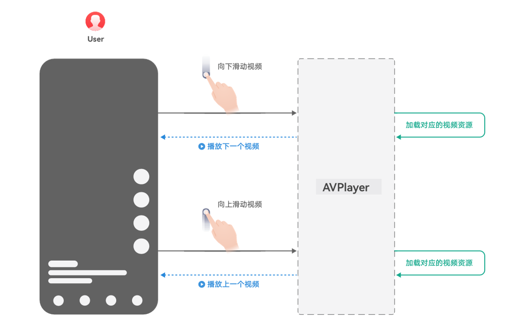
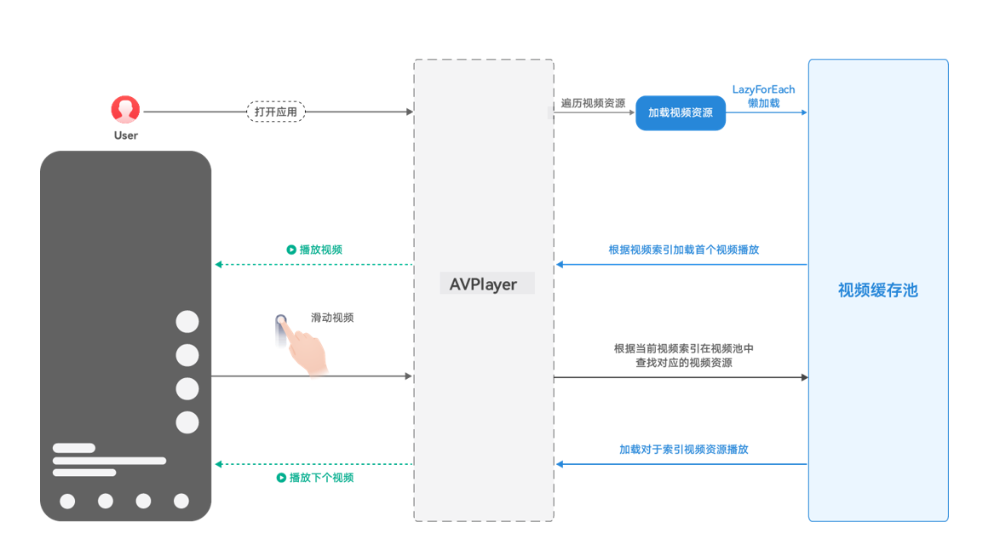
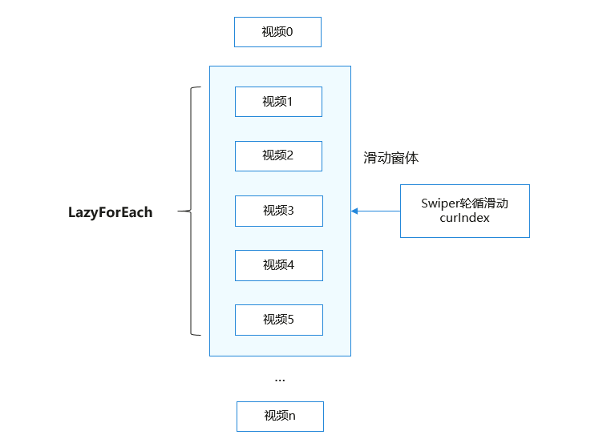
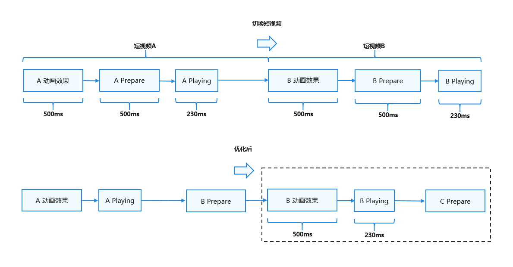
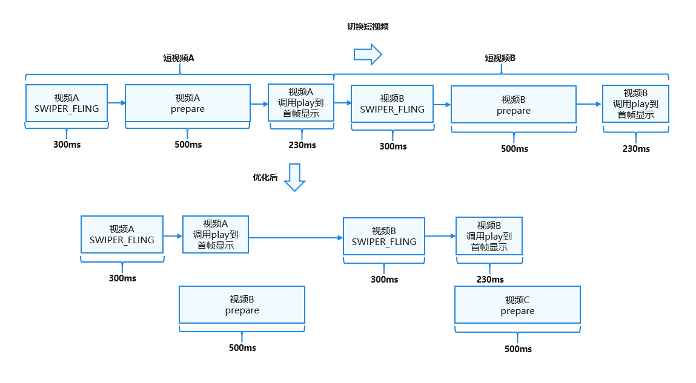

# 在线短视频流畅切换

## 简介
为了帮助开发者解决在应用中在线短视频快速切换时容易出现快速切换播放时延过长的问题，将提供对应场景的解决方案。

该解决方案使用：
- 视频播放框架AVPlayer和滑块视图容器Swiper进行短视频滑动轮播切换。
- 绘制组件XComponent的Surface类型动态渲染视频流。
- 使用LazyForEach进行数据懒加载，设置cachedCount属性来指定缓存数量，同时搭配组件复用能力以达到高性能效果，（在冷启动过程中创建一个AVPlayer并进行数据初始化到prepared阶段，在轮播过程中，每次异步创建一个播放器为下一个视频播放做准备）。
  
最终实现短视频快速切换起播时延达到≤230ms的效果。

**如果开发者使用自研播放器引擎而非AVPlayer，也可以参考该解决方案思路达成最佳实践**。

## 效果展示

在线短视频滑动切换。


## 场景说明

### 适用范围

适用于应用中在线短视频快速切换，容易出现快速切换播放起播慢体验不佳的场景。

### 场景体验指标

起播时延计时标准。

1. 以用户滑动屏幕后抬手，手指离屏时刻为起点，以视频第二帧画面显示时刻为终点（不是封面帧）。

2. 转场动画时长建议设置300ms。

3. 在动画开始时使用预先准备的播放器起播，起播时延控制在230ms内。

| **描述**   | **类型**        | **适用设备** | **说明** |
|----------|---------------|----------|--------|
| 应用内滑动视频，新视频起播时延应≤230ms。 | 规则 | 手机、折叠屏、平板   | 无  |

## 场景分析
### 典型场景及优化方案

**典型场景描述**

短视频：以小于5分钟的短视频为例进行说明。

1. 应用内滑动视频，新视频起播时延≤230ms(不包含滑动动画效果耗时)。
2. 起点时间：滑动离手；时间终点：视频内容开始播放，画面发生变化。

**场景优化方案**

AVPlayer：

1. 数据懒加载。

   在线短视频预加载，冷启动时创建第一个播放器，播放当前视频时预加载下一个播放视频，绘制组件XComponent的Surface类型将视频流进行动态渲染、使用LazyForEach进行数据懒加载，设置cachedCount属性来指定缓存数量，同时搭配组件复用能力以达到高性能效果。
2. 异步在线视频预加载。

   在轮播过程中，对下一个视频提前进入AVPlayer的prepared状态。
3. 在线视频播放预接力。

   滑动过程中手指离开屏幕，此时滑动动效开始播放，在动效开始时就可以调用AVPlayer的play方法进行播放。

三方自研播放器：

1. 数据懒加载。

   在线短视频预加载，冷启动时创建第一个播放器，播放当前视频时预加载下一个播放视频，绘制组件XComponent的Surface类型将视频流进行动态渲染、使用LazyForEach进行数据懒加载，设置cachedCount属性来指定缓存数量，同时搭配组件复用能力以达到高性能效果。
2. 异步在线视频预加载。

   在轮播过程中，对下一个视频提前初始化播放器所需内容（视频源下载、AudioRender初始化、解码器初始化等），并对视频提前预解析首帧画面。
3. 在线视频播放预接力。

   滑动过程中手指离开屏幕，此时滑动动效开始播放，在动效开始时就可以调用播放引擎进行播放。
   为了保证用户的起播体验，在前几帧画面送显时应优先送显，而不是等AudioRender写入音频数据才送显，因为音频硬件时延比显示时延大。播放起始几帧建议不要做强音画同步，而是采用慢追帧策略进行同步，视频帧稍微增大送显间隔，直到完成音画同步。

## 场景实现

### 场景整体介绍
基于AVPlayer实现了在线流媒体的短视频流畅播放和控制功能。基于对应的播放器，使用滑块视图容器Swiper进行短视频滑动轮播切换、绘制组件XComponent的Surface类型将视频流进行动态渲染、懒加载，最终实现短视频快速切换，实现起播≤230ms，提供开发者解决此类问题的方案。

**功能时序图**




### 在线短视频快速切换
**实现流程图**



**关键点**

**AVPlayer**

AVPlayer可以将Audio/Video媒体资源（比如mp4/mp3/mkv/mpeg-ts等）转码为可供渲染的图像和可听见的音频模拟信号，并通过输出设备进行播放。

**LazyForEach数据懒加载**

LazyForEach数据懒加载可以通过设置cachedCount属性来指定缓存数量（目前设置为3），同时搭配组件复用能力以达到高性能效果。SurfaceID每次都会创建，不共用SurfaceID，AVPlayer也会同时创建，不共用AVPlayer，进而将提前加载好的视频（prepared阶段）放到缓存池中。
在通过Swiper切换时，会根据当前轮询滑动的窗口索引index到缓存池中找到对应的视频（prepared阶段），直接进行播放，从而提升切换性能。



**异步视频预加载**

异步视频预加载：在Swiper轮播过程中，在播放当前视频时，提前加载好下一个视频，在缓存中同时存在多个播放器实例，根据视频当前的索引来确定使用缓存中的哪个播放器来播放，从而达到流畅切换的效果。

（1）本地播放一个短视频的耗时。


（2）播放视频A的时候，提前预加载视频B。在切换短视频时，可以马上开始播放已预加载完成的视频B，从而减少了切换时间，提高了切换性能。




**视频播放预启动能力**

为了进一步提升滑动播放体验，在动效开始时就开始播放，做到动效和播放并行进行：

（1）在收到AnimationStart回调时开始播放，而不是动效结束再播放。

（2）不要用默认的弹簧曲线（弹簧动效有560ms，视频窗口在400ms左右已经全面铺开了，最后150ms位移随时间变化较小），可以把curve改成Curve.Ease，duration改为300ms（视APP UX确定）。

视频播放预启动接力：类似于4*100接力赛，想要尽快完成接力赛，当第一个选手快到达终点时，第二个选手就提前起跑并且和第一个选手完美完成接力棒，从而减少整个接力赛过程中的时间。短视频切换也是如此，如下图所示：



**关键代码片段**

1. 初始化AVPlayer播放器。
   ```typescript
   async initAVPlayer() {
     Logger.info(TAG, 'createAVPlayer begin');
     media.createAVPlayer().then((video: media.AVPlayer) => {
       if (video !== null) {
         this.avPlayer = video;
         this.setAVPlayerCallback(this.avPlayer);
         // 设置播放源，使其进入initialized状态
         if (typeof this.curSource === 'string') {
           this.avPlayer.url = this.curSource;
         } else {
           this.avPlayer.fdSrc = this.curSource;
         }
         Loggor.info(TAG, 'createAVPlayer success');
       } else {
         Loggor.error(TAG, 'createAVPlayer fail');
       }
     }).catch((error: BusinessError) => {
       Logger.error(TAG, `AVPlayer catchCallback,error message:${error.message}`);
     })
   }
   ```
2. 设置业务需要的监听事件。
   ```typescript
   setAVPlayerCallback(avPlayer: media.avPlayer) {
     // 用于进度条，监听进度条当前位置，刷新当前时间
     avPlayer.on('timeUpdate', (time: number) => {
       if (!this.isSliderMoving) {
         this.currentTime = Math.floor(time * this.durationTime / this.duration);
         this.currentStringTime = secondToTime(Math.floor((time / CommConstants.SECOND_TO_MS)));
       }
     })
     // 适配一多，根据屏幕尺寸的变化同步更新视频的长宽
     avPlayer.on('videoSizeChange', (width: number, height: number) => {
       this.viewHeight = height;
       this.viewWidth = width;
       this.autoVideoSize();
     })
     // 必要事件，监听播放器的错误信息
     avPlayer.on('error', (error: BusinessError) => {
       Logger.error(TAG,
         `Invoke avPlayer failed, code is ${error.code},message is ${error.message}` + `---state:${avPlayer.state}`);
       avPlayer.reset();
     })
     this.setAVPlayerStateListen(avPlayer);
   }
   ```
3. 设置状态机变化回调函数。
   ```typescript
   setAVPlayerStateListen(avPlayer: media.AVPlayer) {
     avPlayer.on('stateChange', async (state: string) => {
       switch (state) {
         case 'idle': // 成功调用reset接口后触发该状态机上报
           Logger.info(TAG, 'AVPlayer state idle called.' + `this.curIndex:${this.curIndex}` + `this.index:${this.index}`);
           break;
         case 'initialized': // avplayer 设置播放源后触发该状态上报
           Logger.info(TAG,
             'AVPlayer state initialized called.' + `this.curIndex:${this.curIndex}` + `this.index:${this.index}`);
           avPlayer.surfaceId = this.surfaceID;
           avPlayer.prepare();
           break;
         case 'prepared': // prepare调用成功后上报该状态机
           Logger.info(TAG,
             'AVPlayer state prepared called.' + `this.curIndex:${this.curIndex}` + `this.index:${this.index}`);
           avPlayer.audioInterruptMode = audio.InterruptMode.INDEPENDENT_MODE; // 避免同时出现两个视频的声音
           this.flag = true;
           avPlayer.loop = true;
           this.duration = avPlayer.duration;
           this.durationTime = Math.floor(this.duration / CommConstants.SECOND_TO_MS);
           this.currentStringTime = secondToTime(this.durationTime);
           if (this.firstFlag && this.index === 0 && this.isPageShow) {
             avPlayer.play(); // 应用启动后的第一个视频启动播放
             this.firstFlag = false;
           }
           break;
         case 'completed': // 播放结束后触发该状态机上报
           Logger.info(TAG,
             'AVPlayer state completed called.' + `this.curIndex:${this.curIndex}` + `this.index:${this.index}`);
           this.isPlaying = false;
           break;
         case 'playing': // play成功调用后触发该状态机上报
           Logger.info(TAG,
             'AVPlayer state playing called.' + `this.curIndex:${this.curIndex}` + `this.index:${this.index}` +
               `source:${this.curSource}`);
           this.isPlaying = true;
           break;
         case 'paused': // pause成功调用后触发该状态机上报
           Logger.info(TAG,
             'AVPlayer state paused called.' + `this.curIndex:${this.curIndex}` + `this.index:${this.index}`);
           break;
         case 'stopped': // stop接口成功调用后触发该状态机上报
           Logger.info(TAG,
             'AVPlayer state stopped called.' + `this.curIndex:${this.curIndex}` + `this.index:${this.index}`);
           break;
         case 'released':
           Logger.info(TAG,
             'AVPlayer state released called.' + `this.curIndex:${this.curIndex}` + `this.index:${this.index}`);
           break;
         case 'error':
           Logger.info(TAG,
             'AVPlayer state released called.' + `this.curIndex:${this.curIndex}` + `this.index:${this.index}`);
           avPlayer.reset();
           break;
         default:
           Logger.info(TAG, 'AVPlayer state unknown called.' + state);
           break;
       }
     })
   }
   ```
4. 视频轮播：使用Swiper组件进行视频轮播，设置cachedCount（3）缓存视频数量。

   ```typescript
   build() {
     Swiper(this.swiperController) {
       LazyForEach(new MyDataSource(this.sources), (item: string, index: number) => {
         VideoPlayer({
           curSource: item,
           curIndex: this.curIndex,
           index: index,
           firstFlag: this.firstFlag,
           isPageShow: this.isPageShow,
           foldStatus: this.foldStatus
         })
       }, (item: string, index: number) => JSON.stringify(item) + index)
     }
     .cachedCount(3) // 缓存视频数量
     .width(CommComstants.WIDTH_FULL_PERCENT)
     .height(CommComstants.HEIGHT_FULL_PERCENT)
     .vertical(true)
     .loop(true)
     .curve(Curve.Ease)
     .duration(CommComstants.DURATION_TIME)
     .indicator(false)
     .backgroundColor(Color.Black)
     .onGestureSwipe((index: number, extraInfo: SwiperAnimationEvent) => {
       Logger.info(TAG, `onGestureSwipe index:${index}}`);
     })
     .onAnimationStart((index: number, targetIndex: number, extraInfo: SwiperAnimationEvent) => {
       this.curIndex = targetIndex; // 优化点：视频播放和动画启动同步进行，覆盖动画效果
     })
     .onAnimationEnd((index: number, extraInfo: SwiperAnimationEvent) => {
       Logger.info(TAG, `onAnimationEnd index:${index}}`);
     })
   }
   ```

5. 窗口设置：设置XComponent组件用于视频流渲染，获取并设置SurfaceID，用户设置显示画面，在onLoad时异步创建并初始化AVPlayer播放器。

   ```typescript
   XComponent({
     id: 'XComponent',
     type: XComponentType.SURFACE,
     controller: this.xComponentController
     })
       .width(this.XComponentWidth)
       .height(this.XComponentHeight)
       .onLoad(async () => {
         this.surfaceID = this.xComponentController.getXComponentSurfaceId();
         this.initAVPlayer(); // 优化点：创建AVPlayer的播放器放入到缓存池中，不可共用播放器。
       })
   ```

6. 视频播放设置：监听Swiper轮播的this.curIndex值，在视频缓存流中跟this.index进行比较，从而判断视频流中哪个播放，其余的均暂停。

   ```typescript
   onIndexChange() {
     if (this.curIndex !== this.index) {
       pauseVideo(this.avPlayer, this.curIndex, this.index);
       this.isPlaying = false;
       this.trackThicknessSize = CommConstants.TRACK_SIZE_MIN;
     } else {
       if (this.flag === true) {
         playVideo(this.avPlayer, this.curIndex, this.index);
         this.isPlaying = true;
         this.trackThicknessSize = CommConstants.TRACK_SIZE_MIN;
       } else {
         let countNum = 0;
         let interValFlag = setInterval(() => {
           countNum++;
           // 此处有必要再次判断索引，否则会出现索引错乱导致播放异常
           if (this.curIndex !== this.index) {
             clearInterval(interValFlag);
           }
           if (this.flag === true && this.isPageShow) {
             countNum = 0;
             playVideo(this.avPlayer, this.curIndex, this.index);
             this.isPlaying = true;
             this.trackThicknessSize = CommConstants.TRACK_SIZE_MIN;
             clearInterval(interValFlag);
           } else {
             if (countNum > 15) {
               countNum = 0;
               this.initAVPlayer();
             }
           }
         }, 100);
       }
     }
   }
   ```

7. 设置AVPlayer监听关闭并释放资源。

   ```typescript
   export function releaseVideo(avPlayer: media.AVPlayer | undefined, curIndex: number, index: number) {
     if (avPlayer) {
       Logger.info(TAG, 'releaseVideo:' + `state:${avPlayer.state}` + `curIndex:${curIndex},index:${index}`);
       avPlayer.off('timeUpdate');
       avPlayer.off('seekDone');
       avPlayer.off('speedDone');
       avPlayer.off('error');
       avPlayer.off('stateChange');
       avPlayer.release();
     }
   }
   aboutToDisappear(): void {
     releaseVideo(this.avPlayer, this.curIndex, this.index);
   }
   ```

## 参考文档

[使用AVPlayer开发音频播放功能(ArkTS)](../media/media/using-avplayer-for-playback.md)

[LazyForEach:数据懒加载](../quick-start/arkts-rendering-control-lazyforeach.md)

[容器组件：Swiper](../reference/apis-arkui/arkui-ts/ts-container-swiper.md)

[基础组件：Slider](../reference/apis-arkui/arkui-ts/ts-basic-components-slider.md)