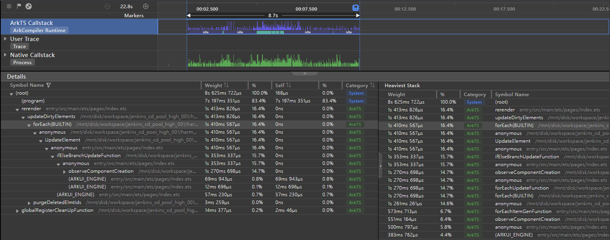
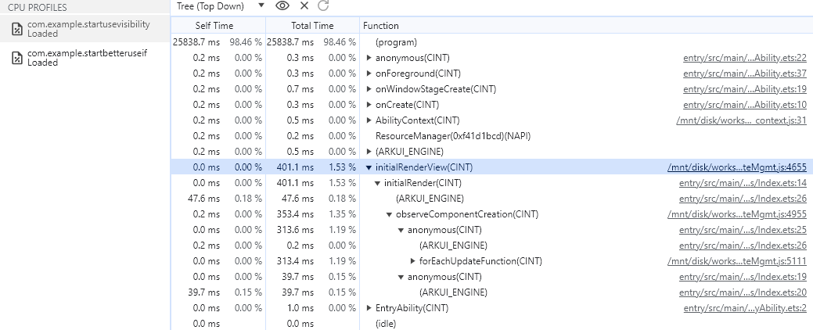
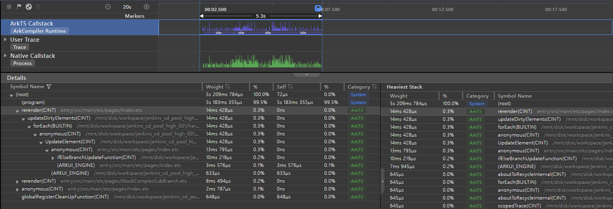

# 合理选择条件渲染和显隐控制

开发者可以通过条件渲染或显隐控制两种方式来实现组件在显示和隐藏间的切换。本文从两者原理机制的区别出发，对二者适用场景分别进行说明，实现相应适用场景的示例并给出性能对比数据。

## 原理机制

### 条件渲染

if/else条件渲染是ArkUI应用开发框架提供的渲染控制的能力之一。条件渲染可根据应用的不同状态，渲染对应分支下的UI描述。条件渲染的作用机制如下：

- 页面初始构建时，会评估条件语句，构建适用分支的组件，若缺少适用分支，则不构建任何内容。
- 应用状态变化时，会重新评估条件语句，删除不适用分支的组件，构建适用分支的组件，若缺少适用分支，则不构建任何内容。

关于条件渲染的详细说明，可以参考[if/else：条件渲染](../quick-start/arkts-rendering-control-ifelse.md)。

### 显隐控制

显隐控制visibility是ArkUI应用开发框架提供的组件通用属性之一。开发者可以通过设定组件属性visibility不同的属性值，进而控制组件的显隐状态。visibility属性值及其描述如下：

| 名称    | 描述                                     |
| ------- | ---------------------------------------- |
| Visible | 组件状态为可见                           |
| Hidden  | 组件状态为不可见，但参与布局、进行占位   |
| None    | 组件状态为不可见，不参与布局、不进行占位 |

关于显隐控制的详细说明，可以参考[显隐控制](../reference/apis-arkui/arkui-ts/ts-universal-attributes-visibility.md)。

### 机制区别

具体针对实现组件显示和隐藏间切换的场景，条件渲染和显隐控制的作用机制区别总结如下：

| 机制描述                                               | 条件渲染 | 显隐控制 |
| ------------------------------------------------------ | -------- | -------- |
| 页面初始构建时，若组件隐藏，组件是否会被创建           | 否       | 是       |
| 若组件由显示变为隐藏时，组件是否会被销毁、从组件树取下 | 是       | 否       |
| 若组件隐藏时，是否占位                                 | 否       | 可以配置 |

## 适用场景

通过条件渲染或显隐控制，实现组件的显示和隐藏间的切换，两者的适用场景分别如下：

条件渲染的适用场景：

- 在应用冷启动阶段，应用加载绘制首页时，如果组件初始不需要显示，建议使用条件渲染替代显隐控制，以减少渲染时间，加快启动速度。
- 如果组件不会较频繁地在显示和隐藏间切换，或者大部分时间不需要显示，建议使用条件渲染替代显隐控制，以减少界面复杂度、减少嵌套层次，提升性能。
- 如果被控制的组件所占内存庞大，开发者优先考虑内存时，建议使用条件渲染替代显隐控制，以即时销毁不需要显示的组件，节省内存。
- 如果组件子树结构比较复杂，且反复切换条件渲染的控制分支，建议使用条件渲染配合组件复用机制，提升应用性能。

显隐控制的适用场景：

- 如果组件频繁地在显示和隐藏间切换时，建议使用显隐控制替代条件渲染，以避免组件的频繁创建与销毁，提升性能。
- 如果组件隐藏后，在页面布局中，需要保持占位，建议适用显隐控制。

### 显隐控制

针对显示和隐藏间频繁切换的场景，下面示例通过按钮点击，实现1000张图片显示与隐藏，来简单复现该场景，并进行正反例性能数据的对比。

**反例**

使用条件循环实现显示和隐藏间的切换。

```ts
@Entry
@Component
struct WorseUseIf {
  @State isVisible: boolean = true;
  private data: number[] = [];

  aboutToAppear() {
    for (let i: number = 0; i < 1000; i++) {
      this.data.push(i);
    }
  }

  build() {
    Column() {
      Button("Switch visible and hidden").onClick(() => {
        this.isVisible = !this.isVisible;
      }).width('100%')
      Stack() {
        if (this.isVisible) {// 使用条件渲染切换，会频繁创建与销毁组件
          Scroll() {
            Column() {
              ForEach(this.data, (item: number) => {
                Image($r('app.media.icon')).width('25%').height('12.5%')
              }, (item: number) => item.toString())
            }
          }
        }
      }
    }
  }
}
```

**正例**

使用显隐控制实现显示和隐藏间的切换。

```ts
@Entry
@Component
struct BetterUseVisibility {
  @State isVisible: boolean = true;
  private data: number[] = [];

  aboutToAppear() {
    for (let i: number = 0; i < 1000; i++) {
      this.data.push(i);
    }
  }

  build() {
    Column() {
      Button("Switch visible and hidden").onClick(() => {
        this.isVisible = !this.isVisible;
      }).width('100%')
      Stack() {
        Scroll() {
          Column() {
            ForEach(this.data, (item: number) => {
              Image($r('app.media.icon')).width('25%').height('12.5%')
            }, (item: number) => item.toString())
          }
        }.visibility(this.isVisible ? Visibility.Visible : Visibility.None)// 使用显隐控制切换，不会频繁创建与销毁组件
      }
    }
  }
}
```

**效果对比**

正反例相同的操作步骤：通过点击按钮，将初始状态为显示的循环渲染组件切换为隐藏状态，再次点击按钮，将隐藏状态切换为显示状态。两次切换间的时间间隔长度，需保证页面渲染完成。

此时组件从显示切换到隐藏状态，由于条件渲染会触发一次销毁组件，再从隐藏切换到显示，二次触发创建组件，此时用条件渲染实现切换的方式， 核心函数forEach耗时1s。

 

基于上例，由于显隐控制会将组件缓存到组件树，从缓存中取状态值修改，再从隐藏切换到显示，继续从缓存中取状态值修改，没有触发创建销毁组件，此时用显隐控制实现切换的方式，核心函数forEach耗时2ms。

 

可见，如果组件频繁地在显示和隐藏间切换时，使用显隐控制替代条件渲染，避免组件的频繁创建与销毁，可以提高性能。

### 条件渲染

针对应用冷启动，加载绘制首页时，如果组件初始不需要显示的场景，下面示例通过初始时，隐藏1000个Text组件，来简单复现该场景，并进行正反例性能数据的对比。

**反例**

对于首页初始时，不需要显示的组件，通过显隐控制进行隐藏。

```ts
@Entry
@Component
struct WorseUseVisibility {
  @State isVisible: boolean = false; // 启动时，组件是隐藏状态
  private data: number[] = [];

  aboutToAppear() {
    for (let i: number = 0; i < 1000; i++) {
      this.data.push(i);
    }
  }

  build() {
    Column() {
      Button("Show the Hidden on start").onClick(() => {
        this.isVisible = !this.isVisible;
      }).width('100%')
      Stack() {
        Image($r('app.media.icon')).objectFit(ImageFit.Contain).width('50%').height('50%')
        Scroll() {
          Column() {
            ForEach(this.data, (item: number) => {
              Text(`Item value: ${item}`).fontSize(20).width('100%').textAlign(TextAlign.Center)
            }, (item: number) => item.toString())
          }
        }.visibility(this.isVisible ? Visibility.Visible : Visibility.None)// 使用显隐控制，启动时即使组件处于隐藏状态，也会创建
      }
    }
  }
}
```

**正例**

对于首页初始时，不需要显示的组件，通过条件渲染进行隐藏。

```ts
@Entry
@Component
struct BetterUseIf {
  @State isVisible: boolean = false; // 启动时，组件是隐藏状态
  private data: number[] = [];

  aboutToAppear() {
    for (let i: number = 0; i < 1000; i++) {
      this.data.push(i);
    }
  }

  build() {
    Column() {
      Button("Show the Hidden on start").onClick(() => {
        this.isVisible = !this.isVisible;
      }).width('100%')
      Stack() {
        Image($r('app.media.icon')).objectFit(ImageFit.Contain).width('50%').height('50%')
        if (this.isVisible) { // 使用条件渲染，启动时组件处于隐藏状态，不会创建
          Scroll() {
            Column() {
              ForEach(this.data, (item: number) => {
                Text(`Item value: ${item}`).fontSize(20).width('100%').textAlign(TextAlign.Center)
              }, (item: number) => item.toString())
            }
          }
        }
      }
    }
  }
}
```

**效果对比**

正反例相同的操作步骤：通过hdc命令方式，采集应用主线程冷启动的CPU Profiler数据。具体操作，可以参考[应用性能分析工具CPU Profiler的使用指导](./application-performance-analysis.md#hdc-shell命令采集)。

当应用加载绘制首页，大量组件初始不需要显示的冷启动场景时，如果组件初始不需要显示，此时使用显隐控制，启动时即使组件为隐藏状态也会创建组件。在UIAbility 启动阶段，以下为使用显隐控制的方式，渲染初始页面initialRenderView耗时401.1ms。

 

基于上例，如果组件初始不需要显示，此时使用条件渲染由于不满足渲染条件，启动时组件不会创建。在UIAbility 启动阶段，以下为使用条件渲染的方式，渲染初始页面initialRenderView耗时12.6ms。

 

可见，如果在应用冷启动阶段，应用加载绘制首页时，如果组件初始不需要显示，使用条件渲染替代显隐控制，可以减少渲染时间，加快启动速度。

**效果对比**

正反例相同的操作步骤：通过点击按钮，将初始状态为显示的Text组件切换为隐藏状态，再次点击按钮，将隐藏状态切换为显示状态。两次切换间的时间间隔长度，需保证页面渲染完成。

容器内有Text组件被if条件包含，if条件结果变更会触发创建和销毁该组件，此时影响到父组件Column容器的布局，该容器内所有组件都会刷新，包括模块ForEach，因此导致主线程UI刷新耗时过长。

以下为未使用容器限制条件渲染组件的刷新范围的方式，Column组件被标记脏区，ForEach耗时13ms。

 

基于上例，容器内有Text组件被if条件包含，if条件结果变更会触发创建和销毁该组件，此时对于这种受状态变量控制的组件，在if外套一层Stack容器，只局部刷新if条件包含的组件。因此减少了主线程UI刷新耗时。

以下为使用容器限制条件渲染组件的刷新范围的方式，Column组件没有被标记脏区，没有ForEach耗时。

 

可见，如果切换项仅涉及部分组件的情况，且反复切换条件渲染的控制分支，使用条件渲染配合容器限制，精准控制组件更新的范围，可以提升应用性能。

### 条件渲染和组件复用

针对反复切换条件渲染的控制分支，且控制分支中的每种分支内，组件子树结构都比较复杂的场景，当有可以复用的组件情况时，可以用组件复用配合条件渲染的方式提升性能。下面示例通过定义一个自定义复杂子组件MockComplexSubBranch配合条件渲染，来展示两种场景的性能效果对比，并对该组件复用与否做正反例性能数据的对比。

**反例**

没有使用组件复用实现条件渲染控制分支中的复杂子组件。

```ts
@Entry
@Component
struct IfWithoutReusable {
  @State isAlignStyleStart: boolean = true;

  build() {
    Column() {
      Button("Change FlexAlign").onClick(() => {
        this.isAlignStyleStart = !this.isAlignStyleStart;
      })
      Stack() {
        if (this.isAlignStyleStart) {
          MockComplexSubBranch({ alignStyle: FlexAlign.Start }); // 未使用组件复用机制实现的MockComplexSubBranch
        } else {
          MockComplexSubBranch({ alignStyle: FlexAlign.End });
        }
      }
    }
  }
}
```

其中MockComplexSubBranch是由3个Flex容器组件分别弹性布局200个Text组件构造而成，用以模拟组件复杂的子树结构，代码如下：

```ts
@Component
export struct MockComplexSubBranch {
  @State alignStyle: FlexAlign = FlexAlign.Center;

  build() {
    Column() {
      Column({ space: 5 }) {
        Text('ComplexSubBranch not reusable').fontSize(9).fontColor(0xCCCCCC).width('90%')
        AlignContentFlex({ alignStyle: this.alignStyle });
        AlignContentFlex({ alignStyle: this.alignStyle });
        AlignContentFlex({ alignStyle: this.alignStyle });
      }
    }
  }
}

@Component
struct AlignContentFlex {
  @Link alignStyle: FlexAlign;
  private data: number[] = [];

  aboutToAppear() {
    for (let i: number = 0; i < 200; i++) {
      this.data.push(i);
    }
  }

  build() {
    Flex({ wrap: FlexWrap.Wrap, alignContent: this.alignStyle }) {
      ForEach(this.data, (item: number) => {
        Text(`${item % 10}`).width('5%').height(20).backgroundColor(item % 2 === 0 ? 0xF5DEB3 : 0xD2B48C)
      }, (item: number) => item.toString())
    }.size({ width: '100%', height: 240 }).padding(10).backgroundColor(0xAFEEEE)
  }
}
```

**正例**

使用组件复用实现条件渲染控制分支中的复杂子组件。

```ts
@Entry
@Component
struct IfWithReusable {
  @State isAlignStyleStart: boolean = true;

  build() {
    Column() {
      Button("Change FlexAlign").onClick(() => {
        this.isAlignStyleStart = !this.isAlignStyleStart;
      })
      Stack() {
        if (this.isAlignStyleStart) {
          MockComplexSubBranch({ alignStyle: FlexAlign.Start }); // 使用组件复用机制实现的MockComplexSubBranch
        } else {
          MockComplexSubBranch({ alignStyle: FlexAlign.End });
        }
      }
    }
  }
}
```

其中MockComplexSubBranch实现如下方所示，AlignContentFlex 代码一致，此处不再赘述。

```ts
@Component
@Reusable // 添加Reusable装饰器，声明组件具备可复用的能力
export struct MockComplexSubBranch {
  @State alignStyle: FlexAlign = FlexAlign.Center;

  aboutToReuse(params: ESObject) { // 从缓存复用组件前，更新组件的状态变量
    this.alignStyle = params.alignStyle;
  }

  build() {
    Column() {
      Column({ space: 5 }) {
        Text('ComplexSubBranch reusable').fontSize(9).fontColor(0xCCCCCC).width('90%')
        AlignContentFlex({ alignStyle: this.alignStyle });
        AlignContentFlex({ alignStyle: this.alignStyle });
        AlignContentFlex({ alignStyle: this.alignStyle });
      }
    }
  }
}

```

**效果对比**

正反例相同的操作步骤：通过点击按钮，Text组件会在Flex容器主轴上，由首端对齐转换为尾端对齐，再次点击按钮，由尾端对齐转换为首端对齐。两次切换间的时间间隔长度，需保证页面渲染完成。

此时由于按钮反复切换了条件渲染分支，且每一分支中的MockComplexSubBranch组件子树结构都比较复杂，会造成大量的组件销毁创建过程，以下为不使用组件复用实现条件渲染控制分支中的子组件的方式，应用Index主页面渲染耗时180ms。

 

基于上例，考虑到将控制分支中的复杂组件子树结构在父组件中进行组件复用，此时从组件树缓存中拿出子组件，避免大量的组件销毁创建过程，以下为使用组件复用实现条件渲染控制分支中的子组件的方式，应用Index主页面渲染耗时14ms。

 

可见，针对反复切换条件渲染的控制分支的情况，且控制分支中的组件子树结构比较复杂，使用组件复用机制，可以提升应用性能。