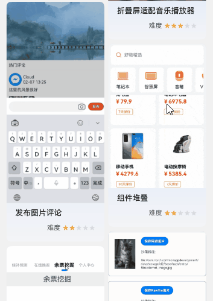
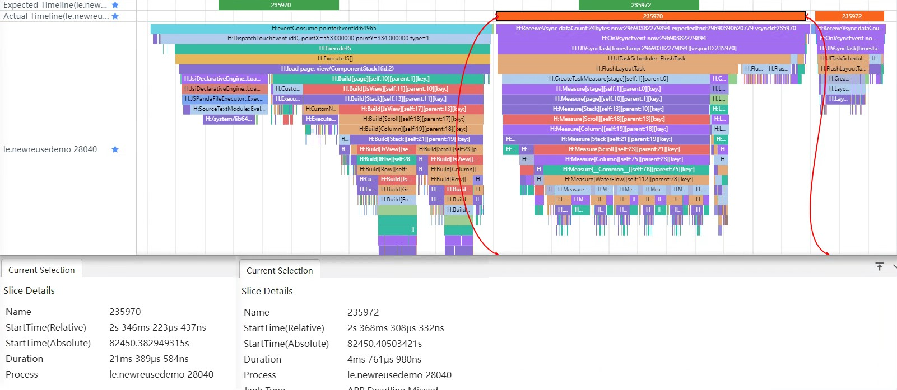
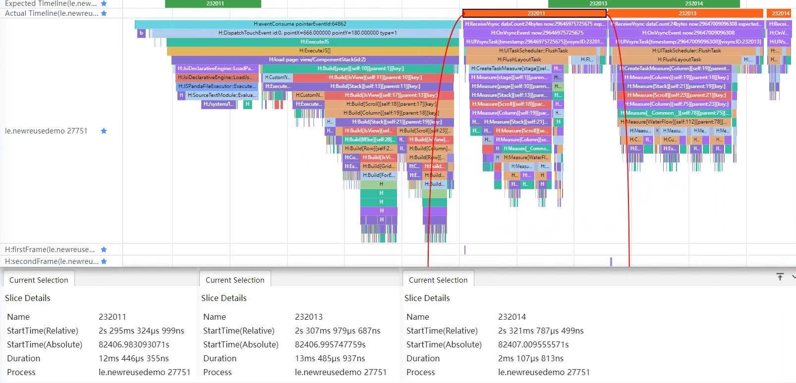
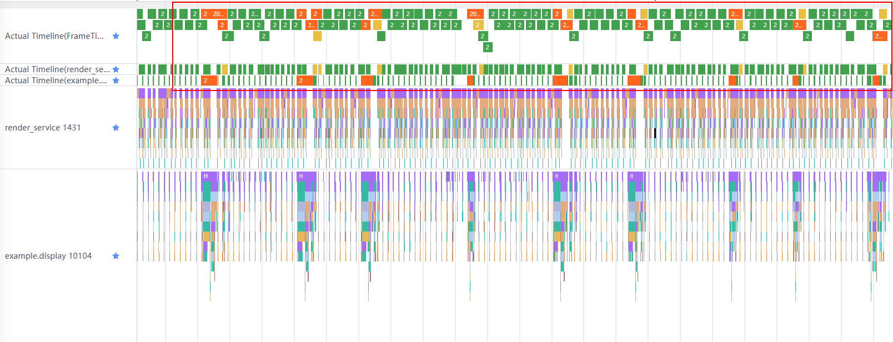
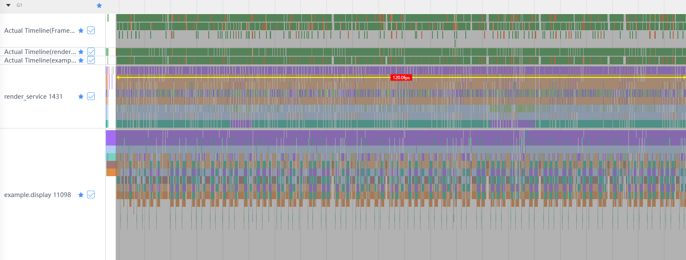
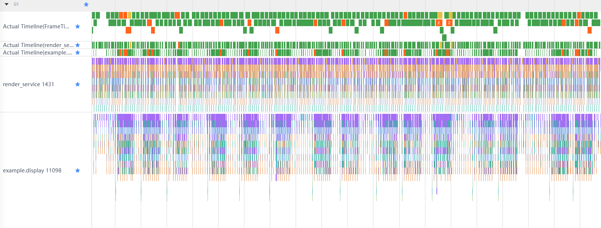
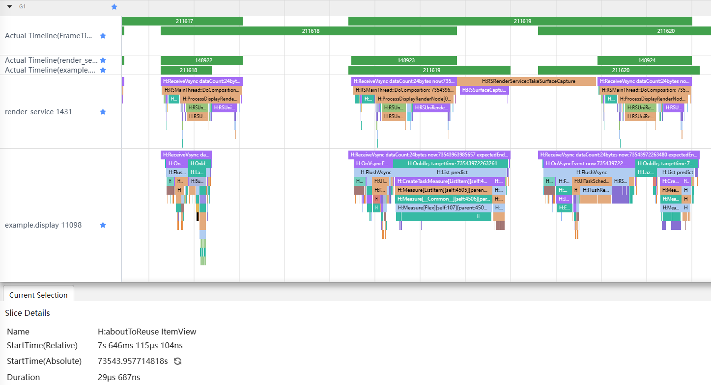
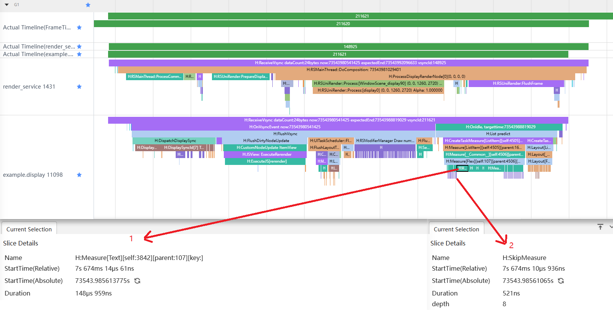

# 合理处理高负载组件的渲染

## 简介

在应用开发中，有的页面需要在列表中加载大量的数据，就会导致组件数量较多或者嵌套层级较深，从而引起组件负载加重，绘制耗时增长。虽然可以通过组件复用避免组件重复创建，但是如果每个列表项中包含的组件较多，在转场或者列表滑动的时候列表项就会一次性加载大量的数据，可能引起卡顿掉帧等性能问题。

## 转场场景

由于业务需求，从当前页面进入一个新页面时，会有转场动画播放，并且在动画首帧中加载新页面所需要的数据。如果数据量较多，那么动画首帧的响应时延就会变长，导致后面的动画帧延迟播放，产生卡顿的情况。



### 解决思路

既然转场时一次性加载大量的数据会导致卡顿情况，那么将数据拆分成多份并分批次进行加载就是一种解决思路。ArkTS中提供了[DisplaySync（可变帧率）](../reference/apis-arkgraphics2d/js-apis-graphics-displaySync.md)，可以设置帧回调监听，让开发者在不同的帧中进行一些操作，这样就可以将本来在一帧中加载的数据分到多帧中加载，减少动画首帧的响应时间，降低完成时延。

### 常规代码

在自定义列表组件中一次性加载全部数据，可参考[组件堆叠场景](https://gitee.com/harmonyos-cases/cases/tree/master/CommonAppDevelopment/feature/componentstack)中的具体实现。

```
// CommonAppDevelopment/feature/componentstack/src/main/ets/view/ProductList.ets
@Component
export struct ProductList {
  private productData: ProductDataSource = new ProductDataSource();

  aboutToAppear(): void {
    this.productData.pushData(PRODUCT_DATA)
  }

  build() {
    WaterFlow() {
      LazyForEach(this.productData, (item: ProductDataModel) => {
        FlowItem() {
          ItemView({ item: item })
        }
      }, (item: ProductDataModel) => item.id.toString())
    }
    ...
  }
}
```

这段代码里，在aboutToAppear()接口中，将数据放入productData中，并通过瀑布流加载。编译运行后，可以通过Trace图看到，转场动画的首帧（235970）耗时21ms左右，这是因为在点击进入页面时将6条数据全部放入瀑布流，在235970帧中需要计算6个子组件的尺寸，导致了响应时间增长。如果数据量更大，那么这个时间会变得更长，动画的卡顿效果就会更加明显。

图1 第一帧加载全部数据



### 优化代码

在aboutToAppear()接口中添加DisplaySync的帧回调，并将数据拆分进行加载。

```
@Component
export struct ProductList {
  private productData: ProductDataSource = new ProductDataSource();
  private displaySync: displaySync.DisplaySync | undefined = undefined;
  private frame: number = 1;

  aboutToAppear(): void {
    // 创建DisplaySync对象
    this.displaySync = displaySync.create();
    // 设置期望帧率
    const range: ExpectedFrameRateRange = {
      expected: 120,
      min: 60,
      max: 120
    };
    this.displaySync.setExpectedFrameRateRange(range);
    // 添加帧回调
    this.displaySync.on("frame", () => {
      if (this.frame === 1) {
        hiTraceMeter.startTrace('firstFrame', 1);
        this.productData.pushData(PRODUCT_DATA.slice(0, 2))
        this.frame += 1;
        hiTraceMeter.finishTrace('firstFrame', 1);
      } else if (this.frame === 2) {
        hiTraceMeter.startTrace('secondFrame', 2);
        this.productData.pushData(PRODUCT_DATA.slice(2, PRODUCT_DATA.length));
        hiTraceMeter.finishTrace('secondFrame', 2);
        this.frame += 1;
        this.displaySync?.stop();
      }
    });
    // 开启帧回调监听
    this.displaySync.start();
  }

  aboutToDisappear(): void {
    // 页面销毁时需要停止帧回调
    this.displaySync?.stop();
  }

  build() {
    // TODO: 知识点：瀑布流容器，由“行”和“列”分割的单元格所组成，通过容器自身的排列规则，将不同大小的“项目”自上而下，如瀑布般紧密布局。
    WaterFlow() {
      LazyForEach(this.productData, (item: ProductDataModel) => {
        FlowItem() {
          ItemView({ item: item })
        }
      }, (item: ProductDataModel) => item.id.toString())
    }
    .nestedScroll({
      scrollForward: NestedScrollMode.PARENT_FIRST,
      scrollBackward: NestedScrollMode.SELF_FIRST
    })
    .columnsTemplate("1fr 1fr")
    .columnsGap(COLUMNSGAP)
    .rowsGap(ROWSGAP)
    .padding({ bottom: $r("app.integer.component_stack_water_flow_padding_bottom") })
  }
}
```

在这段代码中，aboutToAppear()接口中并没有一次性加载全部数据，而是将数据拆分，在帧回调中分成2次进行加载。编译运行后，通过Trace图可以看到，动画首帧（232011）的耗时是12ms。相较于优化前的代码，不再是首帧占据大量的时间，而是将耗时分摊到了后面的动画帧中。在点击进入页面时，只放入了2条数据，所以232011帧的Measure[WaterFlow]只需要计算2个子组件的尺寸，并将剩余的4条数据放入productData，让后面的一帧（232013）计算剩余子组件的尺寸。当数据量更大时，可以将数据进行更多次拆分，将不会直接出现在屏幕上的数据放到第二帧或者第三帧中进行加载，降低首帧的响应时延，进而减少转场动画的卡顿现象。

图2 分帧加载数据



## 滑动场景

在日历应用中，需要在一个List里面加载每个月的全部天数，包括公历和农历日期，这样在一个Item中就会有最少58条数据加载，也就相当于需要58个组件。当列表滑动的时候，通过[组件复用](component-recycle.md)的aboutToReuse()接口设置新的数据，就会导致可能有58个组件一起刷新，可能会引起掉帧卡顿现象。


### 解决思路

由于一次性加载大量数据、刷新大量组件会导致卡顿丢帧，那么减少一次性加载的数据量就是一种解决方法。但是由于业务需求，需要加载的数据总量和绘制的组件数量是不能减少的，那么只能想办法将数据进行拆分，将和数据相关的组件分成多次进行绘制。ArkTS中提供了[DisplaySync（可变帧率）](../reference/apis-arkgraphics2d/js-apis-graphics-displaySync.md)，支持开发者设置回调监听，可以在回调里做一些数据的处理，在每一帧中加载少量的数据，减少卡顿或者滑动动画的掉帧现象。

### 优化示例

#### 常规代码

通常情况下，会在aboutToReuse()中设置新的数据，并一次性绘制所有的组件。

```ts
@Entry
@Component
struct Direct {
  ...
  // 初始化日历中一年的数据
  initCalenderData() {
    ...
  }

  aboutToAppear() {
	...
    this.initCalenderData();
  }

  build() {
    Column() {
      ...
      List() {
        LazyForEach(this.contentData, (monthItem: Month) => {
          // 每个月的日期
          ListItem() {
            ItemView({
              monthItem: monthItem,
              currentMonth: this.currentMonth,
              currentDay: this.currentDay
            })
            // 根据每月的天数设置复用ID，组件复用时会选择相同ID的组件进行复用
            .reuseId("reuse_id_" + monthItem.days.length.toString())
          }
        })
      }
      ...
  }
}
@Reusable
@Component
struct ItemView {
  @State monthItem: Month = { month: '', num: 0, days: [], lunarDays: [] };
  ...

  aboutToReuse(params: Record<string, Object>): void {
    hiTraceMeter.startTrace("reuse_" + (params.monthItem as Month).month, 1);
    this.monthItem = params.monthItem as Month;
    hiTraceMeter.finishTrace("reuse_" + (params.monthItem as Month).month, 1);
  }

  build() {
    Flex({ wrap: FlexWrap.Wrap }) {
      ...
      // 日期信息
      ForEach(this.monthItem.days, (day: number, index: number) => {
        ...
      }, (index: number): string => index.toString())
    }
    ...
  }
}
```

在上面的代码中，通过组件复用，在ItemView的aboutToReuse()接口中，将一个月的数据直接设置到状态变量monthItem中，这样下面的Flex就会收到状态变量变更的消息通知，从而刷新组件中的数据。编译运行后，进入日历页面，通过[SmartPerf Host工具](performance-optimization-using-smartperf-host.md)，开始抓取Trace，然后滑动列表到最底端，结束Trace的抓取，通过SmartPerf Host对抓取的Trace文件进行分析，选中标签和相关数据区域，可以得到图3。图中三个Actual Timeline标签分别代表应用和RenderService每帧的总耗时、应用每帧的绘制时间和RenderService层每帧的绘制时间，render_service标签表示RenderService层每帧中的绘制操作，example.display标签是应用的bundlename，表示应用在每一帧中的操作，包括创建组件、加载数据等。

图3 组件复用帧率


通过图中信息可以看到，滑动期间的帧率是113帧，按照手机120帧来计算，滑动期间掉帧率约为5.8%。放大图3后可以看到，应用每次加载新数据时（图4中橙色部分）RenderService层都会有一帧出现异常情况（图4中黄色部分）。此处对于图中颜色区域的解释，可参考[SmartPerf Host工具](performance-optimization-using-smartperf-host.md)。

图4 绘制耗时



将其中一部分继续放大后可以得到图5。选中Actual Timeline（render_service）标签中的146272后，可以通过箭头看到它所关联到的位置是Actual Timeline（example.display）标签中的209136和209137，即RenderService层出现的异常情况是由应用层中前面两帧里面的操作引起的。结合代码和箭头2的标签可以看到，在209135中调用了aboutToReuse接口，此时系统开始了组件复用的绘制操作。通过代码可以看到，在aboutToReuse接口将一个月的所有数据全部放入了当前被复用的组件中，并更新了所有的用于显示日期的Text组件中的数据（箭头3，diffIndexArray.lenght：35，表示有35个不同的元素），这就导致209136需要计算35个子组件的尺寸（箭头1），从而引起146272的绘制时间延长。在列表数据量较少时，其实并不会引起掉帧现象，因为每次延长帧的时间都很短，对帧率的影响较小，但是在列表数据较多时，就会因为延长帧过多，发生掉帧现象。

图5 详细耗时


#### 优化代码

通过DisplaySync中的帧回调方法，将数据拆分到每一帧中进行加载和绘制。此处只需要修改自定义子组件ItemView中加载数据的方式，所以与常规代码中相同的部分进行了省略。

首先，需要在ItemView中第一次使用时创建DisplaySync对象，设置期望帧率，添加帧回调的监听，然后进行启动。

```ts
@Reusable
@Component
struct ItemView {
  ...
  aboutToAppear(): void {
    // 创建DisplaySync对象
    this.displaySync = displaySync.create();
    // 初始化期望帧率
    let range: ExpectedFrameRateRange = {
      expected: 120,
      min: 60,
      max: 120
    };
    // 设置期望帧率
    this.displaySync.setExpectedFrameRateRange(range);
    // 设置帧回调监听
    this.displaySync.on("frame", () => {
      ...
    });
    // 开启监听帧回调
    this.displaySync.start();
    ...  
  }
  ...
}
```

然后，在监听中添加更新数据的代码。这里将每个月的数据更新拆分开来，第一步用来更新月份数据和计算总的执行步骤，最后一步将计数数据初始化，其余需要执行步骤的多少根据每次加载数据量会有所改变。

```ts
...
private temp: Month[] = [];
...
this.displaySync.on("frame", () => {
  // 数组中有数据时才开始执行
  if (this.temp.length > 0) {
    if (this.step === 0) {
      // 第一步：放入月份数据，并计算最多需要几帧完成数据操作
      hiTraceMeter.startTrace("reuse_" + this.step, 1);
      this.month = this.temp[0].month;
      this.monthNumber = this.temp[0].num;
      this.year = this.temp[0].year;
      this.maxStep = this.maxStep + Math.ceil(this.temp[0].days.length / this.MAX_EVERY_FRAME);
      hiTraceMeter.finishTrace("reuse_" + this.step, 1);
      this.step += 1;
    } else if (this.step === this.maxStep - 1) {
      // 最后一步：初始化部分计数数据
      this.temp.shift();
      this.step = 0;
      this.maxStep = 2;
    } else {
      hiTraceMeter.startTrace("reuse_" + this.step, 1);
      // 计算从所有数据中取值时的开始索引  
      let start: number = this.MAX_EVERY_FRAME * (this.step - 1);
      // 计算从所有数据中取值时的结束索引  
      let end: number = (this.MAX_EVERY_FRAME * this.step) > this.temp[0].days.length ? 
            this.temp[0].days.length : this.MAX_EVERY_FRAME * this.step;
      // 更新日期数据  
      for (let i = start; i < end; i++) {
        this.days[i] = this.temp[0].days[i];
        this.lunarDays[i] = this.temp[0].lunarDays[i];
      }
      hiTraceMeter.finishTrace("reuse_" + this.step, 1);
      this.step += 1;
    }
  }
});
...
```

最后，在aboutToReuse接口中将数据放入数组中，用于帧回调中开始执行数据更新。

```ts
aboutToReuse(params: Record<string, Object>): void {
  hiTraceMeter.startTrace("reuse_" + (params.monthItem as Month).month, 1);
  this.temp.push(params.monthItem as Month);
  hiTraceMeter.finishTrace("reuse_" + (params.monthItem as Month).month, 1);
}
```

编译运行后，使用相同的方法，查看优化后的Trace信息，如图6所示。

图6 优化后帧率



从图6中可以看到，通过代码优化后，帧率是正常的120帧了。然后将图6中的Trace结果放大后可以看到图7，RenderService层出现的延长帧（Actual Timeline（render_service）标签中的黄色部分）明显减少了，已经不是优化前每次加载数据都会出现的情况了。

图7 优化后绘制耗时



下面将图7中的信息继续放大一些，看一下现在每一帧里都做了什么操作，如图8所示。在211618中，开始调用aboutToReuse接口，由于只是将数据放入一个数组中，并没有更新复用组件中的数据，所以这一帧并没有发生延长现象。在211619中开始逐步更新复用组件中的数据，但是由于前一帧（211618）中并没有更新当前复用组件中的数据，所以在211619中并不需要绘制组件，所以此帧耗时依旧很短。结合代码可以看到，在211620中放入了5天的日期数据，由于前一帧（211619）只是设置了2条数据，并且只有1条会更新组件（this.month = this.temp[0].month会更新显示月份的Text），所以这一帧的绘制时间也不会超时。

图8 优化后详细耗时1



继续看后面的Trace信息，如图9所示。和前一帧（211621）一样，此帧中更新了5天的日期数据，并且会重新测量上一帧（211621）中更新数据的5个Text组件尺寸（箭头1），而其余的组件由于数据并没有变动，所以测量被略过了（箭头2）。后面的帧是类似的，每次只会放入5天的数据，并且更新上一帧中设置的数据所关联的Text组件。由于每次更新的组件数量较少，每帧基本上都能在规定的时间内（1秒120帧，即8ms一帧）绘制完成，所以延长帧就会较少。这样不论列表中数据多还是少，都不会引起掉帧现象的发生。

图9 优化后详细耗时2



#### 不建议锁定最高帧率运行

不建议将ExpectedFrameRateRange中的expected、min、max都设置为120，否则会干扰系统的可变帧率机制运行，产生不必要的负载，进而影响到整机的性能和功耗。

**反例**

```ts
let sync = displaySync.create();
sync.setExpectedFrameRateRange({
  expected: 120,
  min: 120,
  max: 120
})
```
**正例**
```ts
let sync = displaySync.create();
sync.setExpectedFrameRateRange({
  expected: 60,
  min: 0,
  max: 60
})
```

主要原因有以下三点：

1. ExpectedFrameRateRange中关键参数是expected（期望帧率），系统会优先按照expected设置的帧率执行。当系统难以满足expected帧率诉求时，会在min和max之间选一个更合适的帧率给到应用。
2. 如果应用锁定120HZ，系统会优先满足应用的显式设置，按照120帧运行。此时手机功耗会显著增加，长时间运行会引起手机过热等严重影响用户体验的问题。同时也由于不必要的高帧率，会额外占据更多的算力，可能导致其他场景的响应受到不必要的延迟。
3. 如果系统持续按照120HZ运行，从某种意义上来说此时系统的可变帧率能力已失效，这显然与可变帧率的设计原则不相符。

## 总结

通过上面的示例代码和优化过程，可以看到在列表中使用组件复用时，一次性全部加载时可能会引起掉帧。虽然在数据量较少时，单帧绘制的延长并不会引起掉帧，但是数据量变多后，这种延长帧的影响就会比较明显。合理进行数据拆分后，可以有效减少延长帧的发生，从而减少掉帧引起的性能问题。

## 参考链接

[使用SmartPerf-Host分析应用性能](performance-optimization-using-smartperf-host.md)

[DisplaySync 文档](../reference/apis-arkgraphics2d/js-apis-graphics-displaySync.md)

[示例代码](https://gitee.com/harmonyos-cases/cases/tree/master/CommonAppDevelopment/feature/perfermance/highlyloadedcomponentrender)

## FAQ

**Q：在ItemView中，为什么要给ForEach设置第三个参数？**

A：在组件复用中，如果有用到ForEach，必须设置第三个参数，即给每个数据设置一个key，否则ForEach中添加的组件不会被复用，而是会全部重新创建。

**Q：对List中每一个ListItem的子组件都设置一个DisplaySync的帧回调监听，会不会引起性能问题？**

A：并不会，通过示例中的Trace图可以看到，除了正在被复用的ItemView的DisplaySync的回调监听外，其余的监听耗时非常短，对性能的影响可以忽略不计。如图10所示。

图10 DisplaySync监听耗时


**Q：为什么抓取到的Trace中没有示例中那么多的标签？**

A：需要通过hdc shell命令开启标签

```shell
hdc shell
param set persist.ace.debug.enabled 1
param set persist.ace.trace.enabled 1
param set persist.ace.trace.layout.enabled true
param set const.security.developermode.state true
param set persist.ace.trace.build.enabled 1
```

