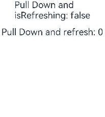

# $$语法：内置组件双向同步


$$运算符为系统内置组件提供TS变量的引用，使得TS变量和系统内置组件的内部状态保持同步。


内部状态具体指什么取决于组件。例如，[Refresh](../reference/arkui-ts/ts-container-refresh.md)组件的refreshing参数。


## 使用规则

- 当前$$支持基础类型变量，以及\@State、\@Link和\@Prop装饰的变量。

- 当前$$仅支持[Refresh](../reference/arkui-ts/ts-container-refresh.md)组件的refreshing参数。

- $$绑定的变量变化时，会触发UI的同步刷新。


## 使用示例

以[Refresh](../reference/arkui-ts/ts-container-refresh.md)组件的refreshing参数为例：

当使用了$$符号来绑定isRefreshing状态变量时，当页面进行下拉操作时，isRefreshing会变成true。

同时，Text中的isRefreshing状态也会同步改变为true，如果不使用$$符号绑定，则不会同步改变。


```ts
// xxx.ets
@Entry
@Component
struct RefreshExample {
  @State isRefreshing: boolean = false;
  @State counter: number = 0;

  build() {
    Column() {
      Text('Pull Down and isRefreshing: ' + this.isRefreshing)
        .fontSize(30)
        .margin(10)

      Refresh({ refreshing: $$this.isRefreshing, offset: 120, friction: 100 }) {
        Text('Pull Down and refresh: ' + this.counter)
          .fontSize(30)
          .margin(10)
      }
      .onStateChange((refreshStatus: RefreshStatus) => {
        console.info('Refresh onStateChange state is ' + refreshStatus)
      })
      .onRefreshing(() => {
        setTimeout(() => {
          this.isRefreshing = false;
          this.counter++;
        }, 2000)
      })
    }
  }
}
```



