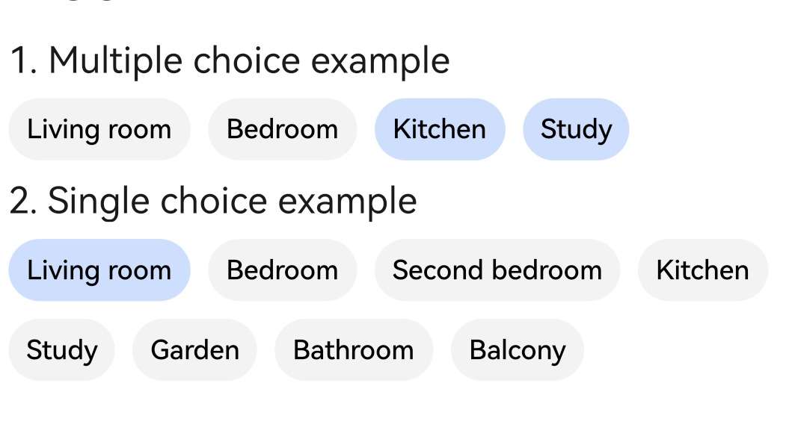

# toggle

>  **说明：**
>  从API version 5开始支持。后续版本如有新增内容，则采用上角标单独标记该内容的起始版本。

状态按钮用于从一组选项中进行选择，并可能在界面上实时显示选择后的结果。通常这一组选项都是由状态按钮构成。


## 权限列表

无


## 子组件

不支持。


## 属性

除支持[通用属性](js-components-common-attributes.md)外，还支持如下属性：

| 名称      | 类型      | 默认值   | 必填   | 描述         |
| ------- | ------- | ----- | ---- | ---------- |
| value   | string  | -     | 是    | 状态按钮的文本值。  |
| checked | boolean | false | 否    | 状态按钮是否被选中。 |


## 样式

除支持[通用样式](js-components-common-styles.md)外，还支持如下样式：

| 名称          | 类型                         | 默认值        | 必填   | 描述                                       |
| ----------- | -------------------------- | ---------- | ---- | ---------------------------------------- |
| text-color  | &lt;color&gt;              | \#E5000000 | 否    | 状态按钮的文本颜色。                               |
| font-size   | &lt;length&gt;             | 16px       | 否    | 状态按钮的文本尺寸。                               |
| allow-scale | boolean                    | true       | 否    | 状态按钮的文本尺寸是否跟随系统设置字体缩放尺寸进行放大缩小。<br/>如果在config描述文件中针对ability配置了fontSize的config-changes标签，则应用不会重启而直接生效。 |
| font-style  | string                     | normal     | 否    | 状态按钮的字体样式。                               |
| font-weight | number&nbsp;\|&nbsp;string | normal     | 否    | 状态按钮的字体粗细。见[text组件font-weight的样式属性](js-components-basic-text.md#样式)。 |
| font-family | &lt;string&gt;             | sans-serif | 否    | 状态按钮的字体列表，用逗号分隔，每个字体用字体名或者字体族名设置。列表中第一个系统中存在的或者通过[自定义字体](js-components-common-customizing-font.md)指定的字体，会被选中作为文本的字体。 |


## 事件

除支持[通用事件](js-components-common-events.md)外，还支持如下事件：

| 名称     | 参数                              | 描述             |
| ------ | ------------------------------- | -------------- |
| change | {&nbsp;checked：isChecked&nbsp;} | 组件选中状态发生变化时触发。 |


## 方法

支持[通用方法](js-components-common-methods.md)。


## 示例

```html
<!-- xxx.hml -->
<div style="flex-direction: column;">
  <text class="margin">1. Multiple choice example</text>
  <div style="flex-wrap: wrap">
    <toggle class="margin" for="{{toggles}}">{{$item}}</toggle>
  </div>
  <text class="margin">2. Single choice example</text>
  <div style="flex-wrap: wrap">
    <toggle class="margin" for="{{toggle_list}}" id="{{$item.id}}" checked="{{$item.checked}}" 
      value="{{$item.name}}" @change="allchange" @click="allclick({{$item.id}})"></toggle>
  </div>
</div>
```

```css
/* xxx.css */
.margin {
  margin: 7px;
}
```

```js
// xxx.js
export default {
    data: {
        toggle_list: [
            {
                "id": "1001", "name": "Living room", "checked": true
            },
            {
                "id": "1002", "name": "Bedroom", "checked": false
            },
            {
                "id": "1003", "name": "Second bedroom", "checked": false
            },
            {
                "id": "1004", "name": "Kitchen", "checked": false
            },
            {
                "id": "1005", "name": "Study", "checked": false
            },
            {
                "id": "1006", "name": "Garden", "checked": false
            },
            {
                "id": "1007", "name": "Bathroom", "checked": false
            },
            {
                "id": "1008", "name": "Balcony", "checked": false
            },
        ],
        toggles: ["Living room", "Bedroom", "Kitchen", "Study"],
        idx: ""
    },
    allclick(arg) {
        this.idx = arg;
    },
    allchange(e) {
        if (e.checked != true) {
            return;
        }
        for (var i = 0; i < this.toggle_list.length; i++) {
            if (this.toggle_list[i].id === this.idx) {
                this.toggle_list[i].checked = true;
            } else {
                this.toggle_list[i].checked = false;
            }
        }
    }
}
```


