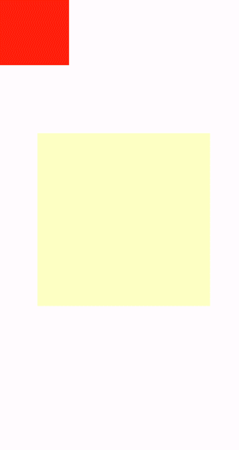
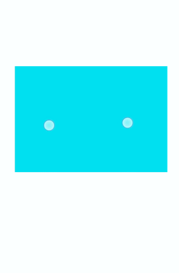

# div

>  **说明：**
>  从API version 4开始支持。后续版本如有新增内容，则采用上角标单独标记该内容的起始版本。

基础容器，用作页面结构的根节点或将内容进行分组。

## 权限列表

无


## 子组件

支持。


## 属性

支持[通用属性](js-components-common-attributes.md)。


## 样式

除支持组件[通用样式](js-components-common-styles.md)外，还支持如下样式：

| 名称                           | 类型           | 默认值       | 必填 | 描述                                                         |
| ------------------------------ | -------------- | ------------ | ---- | ------------------------------------------------------------ |
| flex-direction                 | string         | row          | 否   | flex容器主轴方向。可选项有：<br/>-&nbsp;column：垂直方向从上到下。<br/>-&nbsp;row：水平方向从左到右。 |
| flex-wrap                      | string         | nowrap       | 否   | flex容器是单行还是多行显示，该值暂不支持动态修改。可选项有：<br/>-&nbsp;nowrap：不换行，单行显示。<br/>-&nbsp;wrap：换行，多行显示。 |
| justify-content                | string         | flex-start   | 否   | flex容器当前行的主轴对齐格式。可选项有：<br/>-&nbsp;flex-start：项目位于容器的开头。<br/>-&nbsp;flex-end：项目位于容器的结尾。<br/>-&nbsp;center：项目位于容器的中心。<br/>-&nbsp;space-between：项目位于各行之间留有空白的容器内。<br/>-&nbsp;space-around：项目位于各行之前、之间、之后都留有空白的容器内。<br/>-&nbsp;space-evenly<sup>5+</sup>:&nbsp;&nbsp;均匀排列每个元素，每个元素之间的间隔相等。 |
| align-items                    | string         | stretch<br/> | 否   | flex容器当前行的交叉轴对齐格式，可选值为：<br/>-&nbsp;stretch：弹性元素在交叉轴方向被拉伸到与容器相同的高度或宽度。<br/>-&nbsp;flex-start：元素向交叉轴起点对齐。<br/>-&nbsp;flex-end：元素向交叉轴终点对齐。<br/>-&nbsp;center：元素在交叉轴居中。<br/>-&nbsp;baseline：如Flex布局纵向排列，则该值与’flex-start‘等效。横向布局时，内容元素存在文本时按照文本基线对齐，否则底部对齐。 |
| align-content                  | string         | flex-start   | 否   | 交叉轴中有额外的空间时，多行内容对齐格式，可选值为：<br/>-&nbsp;flex-start：所有行从交叉轴起点开始填充。第一行的交叉轴起点边和容器的交叉轴起点边对齐。接下来的每一行紧跟前一行。<br/>-&nbsp;flex-end：所有行从交叉轴末尾开始填充。最后一行的交叉轴终点和容器的交叉轴终点对齐。同时所有后续行与前一个对齐。<br/>-&nbsp;center：所有行朝向容器的中心填充。每行互相紧挨，相对于容器居中对齐。容器的交叉轴起点边和第一行的距离相等于容器的交叉轴终点边和最后一行的距离。<br/>-&nbsp;space-between：所有行在容器中平均分布。相邻两行间距相等。容器的交叉轴起点边和终点边分别与第一行和最后一行的边对齐。<br/>-&nbsp;space-around：所有行在容器中平均分布，相邻两行间距相等。容器的交叉轴起点边和终点边分别与第一行和最后一行的距离是相邻两行间距的一半。 |
| grid-template-[columns\|rows]  | string         | 1行1列       | 否   | 用于设置当前网格布局行和列的数量，不设置时默认1行1列，仅当display为grid时生效。<br/>示例：如设置grid-template-columns为：<br/>-&nbsp;50px&nbsp;100px&nbsp;60px：分三列，第一列50px，第二列100px，第三列60px；<br/>-&nbsp;1fr&nbsp;1fr&nbsp;2fr：分三列，将父组件允许的宽分为4等份，第一列占1份，第二列占一份，第三列占2份；<br/>-&nbsp;30%&nbsp;20%&nbsp;50%：分三列，将父组件允许的宽为基准，第一列占30%，第二列占20%，第三列占50%；<br/>-&nbsp;repeat(2,100px)：分两列，第一列100px，第二列100px；<br/>-&nbsp;repeat(auto-fill,100px)<sup>5+</sup>：按照每列100px的大小和交叉轴大小计算最大正整数重复次数，按照该重复次数布满交叉轴；<br/>-&nbsp;auto&nbsp;1fr&nbsp;1fr：分三列，第一列自适应内部子组件所需宽度，剩余空间分为两等份，第二列占一份，第三列占一份。 |
| grid-[columns\|rows]-gap       | &lt;length&gt; | 0            | 否   | 用于设置行与行的间距或者列与列的间距，也可以支持通过grid-gap设置相同的行列间距，仅当display为grid时生效。 |
| grid-row-[start\|end]          | number         | -            | 否   | 用于设置当前元素在网格布局中的起止行号，仅当父组件display样式为grid时生效（仅div支持display样式设置为grid）。 |
| grid-column-[start\|end]       | number         | -            | 否   | 用于设置当前元素在网格布局中的起止列号，仅当父组件display样式为grid时生效（仅div支持display样式设置为grid）。 |
| grid-auto-flow<sup>5+</sup>    | string         | -            | 否   | 使用框架自动布局算法进行网格的布局，可选值为：<br/>-&nbsp;row：逐行填充元素，如果行空间不够，则新增行；<br/>-&nbsp;column：逐列填充元素，如果列空间不够，则新增列。 |
| overflow<sup>6+</sup>          | string         | visible      | 否   | 设置元素内容区超过元素本身大小时的表现形式。<br/>-&nbsp;visible：多个子元素内容超过元素大小时，显示在元素外面；<br/>-&nbsp;hidden：元素内容超过元素大小时，进行裁切显示；<br/>-&nbsp;scroll：元素内容超过元素大小时，进行滚动显示并展示滚动条（当前只支持纵向）。<br/>overflow:&nbsp;scroll样式需要元素设置固定的大小，默认滚动方向与容器方向一致。 |
| align-items<sup>6+</sup>       | string         | -            | 否   | 设置容器中元素交叉轴上的对齐方式：<br/>-&nbsp;stretch：Flex容器内容在交叉轴方向被拉伸到与容器相同的高度或宽度；<br/>-&nbsp;flex-start：Flex布局容器内元素向交叉轴起点对齐；<br/>-&nbsp;flex-end：Flex布局容器内元素向交叉轴终点对齐；<br/>-&nbsp;center：Flex布局容器内元素在交叉轴居中对齐；<br/>-&nbsp;baseline：如Flex布局纵向排列，则该值与'flex-start'等效。横向布局时，内容元素存在文本时按照文本基线对齐，否则底部对齐。 |
| scrollbar-color<sup>6+</sup>   | &lt;color&gt;  | -            | 否   | 设置滚动条的颜色。                                           |
| scrollbar-width<sup>6+</sup>   | &lt;length&gt; | -            | 否   | 设置滚动条的宽度。                                           |
| overscroll-effect<sup>6+</sup> | string         | -            | 否   | 设置滚动边缘效果，可选值为：<br/>-&nbsp;spring：弹性物理动效，滑动到边缘后可以根据初始速度或通过触摸事件继续滑动一段距离，松手后回弹；<br/>-&nbsp;fade：渐隐物理动效，滑动到边缘后展示一个波浪形的渐隐，根据速度和滑动距离的变化渐隐也会发送一定的变化；<br/>-&nbsp;none：滑动到边缘后无效果 |


## 事件


除支持[通用事件](js-components-common-events.md)外，还支持如下事件：

| 名称                       | 参数   | 描述                                       |
| ------------------------ | ---- | ---------------------------------------- |
| reachstart<sup>6+</sup>  | -    | 当页面滑动到最开始的点时触发的事件回调，当flex-direction:&nbsp;row时才会触发。 |
| reachend<sup>6+</sup>    | -    | 当页面滑动到最末尾的点时触发的事件回调，当flex-direction:&nbsp;row时才会触发。 |
| reachtop<sup>6+</sup>    | -    | 当页面滑动到最上部的点时触发的事件回调，当flex-direction:&nbsp;column时才会触发。 |
| reachbottom<sup>6+</sup> | -    | 当页面滑动到最下部的点时触发的事件回调，当flex-direction:&nbsp;column时才会触发。 |

## 方法

除支持[通用方法](js-components-common-methods.md)外，还支持如下方法：

| 名称                           | 参数          | 返回值          | 描述                                      |
| ---------------------------- | ----------- | ------------ | --------------------------------------- |
| getScrollOffset<sup>6+</sup> | -           | ScrollOffset | 获取元素内容的滚动偏移。<br/>需要设置overflow样式为scroll。 |
| scrollBy<sup>6+</sup>        | ScrollParam | -            | 指定元素内容的滚动偏移。<br/>需要设置overflow样式为scroll。 |

**表1** ScrollOffset<sup>6+</sup>

| 名称   | 类型     | 描述              |
| ---- | ------ | --------------- |
| x    | number | 在x轴方向的偏移，单位为px。 |
| y    | number | 在y轴方向的偏移，单位为px。 |

**表2** ScrollParam<sup>6+</sup>

| 名称     | 类型      | 描述               |
| ------ | ------- | ---------------- |
| dx     | number  | 水平方向滑动的偏移量，单位px。 |
| dy     | number  | 垂直方向滑动的偏移量，单位px。 |
| smooth | boolean | 是否平滑处理。设置为true时表示平滑处理，设置为false时表示不平滑处理。         |


## 示例

1. Flex样式
   ```html
   <!-- xxx.hml -->
   <div class="container">
     <div class="flex-box">
       <div class="flex-item color-primary"></div>
       <div class="flex-item color-warning"></div>
       <div class="flex-item color-success"></div>
     </div>
   </div>
   ```

   ```css
   /* xxx.css */
   .container {
     flex-direction: column;
     justify-content: center;
     align-items: center;
     width: 454px;
     height: 454px;
   }
   .flex-box {
     justify-content: space-around;
     align-items: center;
     width: 400px;
     height: 140px;
     background-color: #ffffff;
   }
   .flex-item {
     width: 120px;
     height: 120px;
     border-radius: 16px;
   }
   .color-primary {
     background-color: #007dff;
   }
   .color-warning {
     background-color: #ff7500;
   }
   .color-success {
     background-color: #41ba41;
   }
   ```

   

2. Flex Wrap样式
   ```html
   <!-- xxx.hml -->
   <div class="container">
     <div class="flex-box">
       <div class="flex-item color-primary"></div>
       <div class="flex-item color-warning"></div>
       <div class="flex-item color-success"></div>
     </div>
   </div>
   ```

   ```css
   /* xxx.css */
   .container {
     flex-direction: column;
     justify-content: center;
     align-items: center;
     width: 454px;
     height: 454px;
   }
   .flex-box {
     justify-content: space-around;
     align-items: center;
     flex-wrap: wrap;
     width: 300px;
     height: 250px;
     background-color: #ffffff;
   }
   .flex-item {
     width: 120px;
     height: 120px;
     border-radius: 16px;
   }
   .color-primary {
     background-color: #007dff;
   }
   .color-warning {
     background-color: #ff7500;
   }
   .color-success {
     background-color: #41ba41;
   }
   ```

   

3. Grid样式

   ```html
   <!-- xxx.hml -->
   <div class="common grid-parent">
     <div class="grid-child grid-left-top"></div>
     <div class="grid-child grid-left-bottom"></div>
     <div class="grid-child grid-right-top"></div>
     <div class="grid-child grid-right-bottom"></div>
   </div>
   ```

   ```css
   /* xxx.css */
   .common {
     width: 400px;
     height: 400px;
     background-color: #ffffff;
     align-items: center;
     justify-content: center;
     margin: 24px;
   }
   .grid-parent {
     display: grid;
     grid-template-columns: 35% 35%;
     grid-columns-gap: 24px;
     grid-rows-gap: 24px;
     grid-template-rows: 35% 35%;
   }
   .grid-child {
     width: 100%;
     height: 100%;
     border-radius: 8px;
   }
   .grid-left-top {
     grid-row-start: 0;
     grid-column-start: 0;
     grid-row-end: 0;
     grid-column-end: 0;
     background-color: #3f56ea;
   }
   .grid-left-bottom {
     grid-row-start: 1;
     grid-column-start: 0;
     grid-row-end: 1;
     grid-column-end: 0;
     background-color: #00aaee;
   }
   .grid-right-top {
     grid-row-start: 0;
     grid-column-start: 1;
     grid-row-end: 0;
     grid-column-end: 1;
     background-color: #00bfc9;
   }
   .grid-right-bottom {
     grid-row-start: 1;
     grid-column-start: 1;
     grid-row-end: 1;
     grid-column-end: 1;
     background-color: #47cc47;
   }
   ```

   

4. 拖拽<sup>7+</sup>
   ```html
   <!-- xxx.hml -->
   <div class="container">
     <div class="content" ondragstart="dragstart" ondrag="drag" ondragend="dragend" style="position: absolute;left: {{left}};top: {{top}};">
     </div>
   </div>
   ```

   ```css
    /* xxx.css */
    .container {
    flex-direction: column;
    width: 100%;
    height: 100%;
    }
    .content {
    width: 200px;
    height: 200px;
    background-color: red;
    }
   ```

   ```js
   // xxx.js
   import promptAction from '@ohos.promptAction';
   export default {
     data:{
       left:0,
       top:0,
     },
     dragstart(e){
       prompt.showToast({
         message: 'Start to be dragged'
       })
     },
     drag(e){
       this.left = e.globalX;
       this.top = e.globalY;
     },
     dragend(e){
       promptAction.showToast({
         message: 'End Drag'
       })
     }
   }
   ```

   

   ```html
   <!-- xxx.hml -->
   <div class="container">
     <div class="content" ondrag="drag" style="position: absolute;left: {{left}};top: {{top}};"></div>
     <div style="width: 500px; height: 500px; background-color: yellow; position: fixed; left: 15%; top: 30%; opacity:0.3"
       ondragenter="dragenter" ondragover="dragover" ondragleave="dragleave" ondrop="drop">
     </div>
   </div>
   ```

   ```css
   /* xxx.css */
   .container {
     flex-direction: column;
     width: 100%;
     position: relative;
     max-width: 100%;
   }
   .content{
     width: 200px;
     height: 200px;
     background-color: red;
     position: absolute;
   }
   ```

   ```js
   // xxx.js
   import promptAction from '@ohos.promptAction';
   export default {
     data:{
       left:0,
       top:0,
     },
     drag(e){
       this.left = e.globalX;
       this.top = e.globalY;
     },
     dragenter(e){
       promptAction.showToast({
         message: 'enter'
       })
     },
     dragover(e){
       promptAction.showToast({
         message: 'over'
       })
     },
     dragleave(e){
       promptAction.showToast({
         message: 'leave'
       })
     },
     drop(e){
       promptAction.showToast({
         message: 'drop'
       })
     }
   }
   ```

   

5. 手指捏合<sup>7+</sup>
   ```html
   <!-- xxx.hml -->
   <div class="container">
     <div class="content" onpinchstart="pinchstart" onpinchend="pinchend" onpinchupdate="pinchupdate"
       onpinchcancel="pinchcancel"> 
     </div>
   </div>
   ```

   ```css
   /* xxx.css */
   .container {
     flex-direction: column;
     justify-content: center;
     align-items: center;
     width: 454px;
     height: 454px;
   }
   .content {
     width: 400px;
     height: 400px;
     background-color: aqua;
     margin: 30px;
   }
   ```

   ```js
   // xxx.js
   import promptAction from '@ohos.promptAction';
   export default {
     pinchstart(e){
       promptAction.showToast({
         message: 'pinchstart!!!'
       })
     },
     pinchupdate(e){
       promptAction.showToast({
         message: 'Two-finger pinch update'
       })
     },
     pinchend(e){
       promptAction.showToast({
         message: 'Finished with two fingers pinching'
       })
     },
     pinchcancel(e){
       promptAction.showToast({
         message: 'Finger pinching is interrupted'
       })
     }
   }
   ```

   
