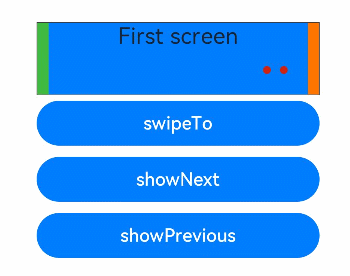

# swiper

>  **说明：**
>  从API version 4开始支持。后续版本如有新增内容，则采用上角标单独标记该内容的起始版本。

滑动容器，提供切换子组件显示的能力。

## 权限列表

无


## 子组件

可以包含子组件。


## 属性

除支持[通用属性](js-components-common-attributes.md)外，还支持如下属性：

| 名称                             | 类型      | 默认值    | 必填   | 描述                                       |
| ------------------------------ | ------- | ------ | ---- | ---------------------------------------- |
| index                          | number  | 0      | 否    | 当前在容器中显示的子组件的索引值。                        |
| autoplay                       | boolean | false  | 否    | 子组件是否自动播放，自动播放状态下，导航点不可操作<sup>5+</sup>。  |
| interval                       | number  | 3000   | 否    | 使用自动播放时播放的时间间隔，单位为ms。                    |
| indicator                      | boolean | true   | 否    | 是否启用导航点指示器，默认true。                       |
| digital<sup>5+</sup>           | boolean | false  | 否    | 是否启用数字导航点，默认为false。<br/>必须设置indicator时才能生效数字导航点。 |
| indicatordisabled<sup>5+</sup> | boolean | false  | 否    | 指示器是否禁止用户手势操作，设置为true时，指示器不会响应用户的点击拖拽。   |
| loop                           | boolean | true   | 否    | 是否开启循环滑动。                                |
| duration                       | number  | -      | 否    | 子组件切换的动画时长。                              |
| vertical                       | boolean | false  | 否    | 是否为纵向滑动，纵向滑动时采用纵向的指示器。                   |
| cachedsize<sup>7+</sup>        | number  | -1     | 否    | swiper延迟加载时item最少缓存数量。-1表示全部缓存。          |
| scrolleffect<sup>7+</sup>      | string  | spring | 否    | 滑动效果。目前支持如下：<br/>-&nbsp;spring：弹性物理动效，滑动到边缘后可以根据初始速度或通过触摸事件继续滑动一段距离，松手后回弹。<br/>-&nbsp;fade：渐隐物理动效，滑动到边缘后展示一个波浪形的渐隐，根据速度和滑动距离的变化渐隐也会发送一定的变化。<br/>-&nbsp;none：滑动到边缘后无效果。<br/>该属性仅在loop属性为false时生效。 |


## 样式

除支持[通用样式](js-components-common-styles.md)外，还支持如下样式：

| 名称                                 | 类型                                       | 默认值        | 必填   | 描述                   |
| ---------------------------------- | ---------------------------------------- | ---------- | ---- | -------------------- |
| indicator-color                    | &lt;color&gt;                            | -          | 否    | 导航点指示器的填充颜色。         |
| indicator-selected-color           | &lt;color&gt;                            | \#ff007dff | 否    | 导航点指示器选中的颜色。         |
| indicator-size                     | &lt;length&gt;                           | 4px        | 否    | 导航点指示器的直径大小。         |
| indicator-top\|left\|right\|bottom | &lt;length&gt;&nbsp;\|&nbsp;&lt;percentage&gt; | -          | 否    | 导航点指示器在swiper中的相对位置。 |
| next-margin<sup>7+</sup>           | &lt;length&gt;&nbsp;\|&nbsp;&lt;percentage&gt; | -          | 否    | 后边距，用于露出后一项的一小部分。    |
| previous-margin<sup>7+</sup>       | &lt;length&gt;&nbsp;\|&nbsp;&lt;percentage&gt; | -          | 否    | 前边距，用于露出前一项的一小部分。    |


## 事件

除支持[通用事件](js-components-common-events.md)外，还支持如下事件：

| 名称                           | 参数                                      | 描述                 |
| ---------------------------- | --------------------------------------- | ------------------ |
| change                       | {&nbsp;index:&nbsp;currentIndex&nbsp;}  | 当前显示的组件索引变化时触发该事件。 |
| rotation                     | {&nbsp;value:&nbsp;rotationValue&nbsp;} | 智能穿戴表冠旋转事件触发时的回调。  |
| animationfinish<sup>7+</sup> | -                                       | 动画结束时触发该事件。        |

## 方法

除支持[通用方法](js-components-common-methods.md)外，还支持如下方法：

| 名称           | 参数                                     | 描述              |
| ------------ | -------------------------------------- | --------------- |
| swipeTo      | {&nbsp;index:&nbsp;number(指定位置)&nbsp;} | 切换到index位置的子组件。 |
| showNext     | 无                                      | 显示下一个子组件。       |
| showPrevious | 无                                      | 显示上一个子组件。       |


## 示例

```html
<!-- xxx.hml -->
<div class="container">
  <swiper class="swiper" id="swiper" index="0" indicator="true" loop="true" digital="false" cachedsize="-1"
    scrolleffect="spring">
    <div class = "swiperContent1" >
      <text class = "text">First screen</text>
    </div>
    <div class = "swiperContent2">
      <text class = "text">Second screen</text>
    </div>
    <div class = "swiperContent3">
      <text class = "text">Third screen</text>
    </div>
  </swiper>
  <input class="button" type="button" value="swipeTo" onclick="swipeTo"></input>
  <input class="button" type="button" value="showNext" onclick="showNext"></input>
  <input class="button" type="button" value="showPrevious" onclick="showPrevious"></input>
</div>
```

```css
/* xxx.css */
.container {
  flex-direction: column;
  width: 100%;
  height: 100%;
  align-items: center;
}
.swiper {
  flex-direction: column;
  align-content: center;
  align-items: center;
  width: 70%;
  height: 130px;
  border: 1px solid #000000;
  indicator-color: #cf2411;
  indicator-size: 14px;
  indicator-bottom: 20px;
  indicator-right: 30px;
  margin-top: 100px;
  next-margin:20px;
  previous-margin:20px;
}
.swiperContent1{
  height: 100%;
  width: 100%;
  justify-content: center;
  background-color: #007dff;
}
.swiperContent2{
  height: 100%;
  width: 100%;
  justify-content: center;
  background-color: #ff7500;
}
.swiperContent3{
  height: 100%;
  width: 100%;
  justify-content: center;
  background-color: #41ba41;
}
.button {
  width: 70%;
  margin: 10px;
}
.text {
  font-size: 40px;
}
```

```js
// xxx.js
export default {
  swipeTo() {
    this.$element('swiper').swipeTo({index: 2});
  },
  showNext() {
    this.$element('swiper').showNext();
  },
  showPrevious() {
    this.$element('swiper').showPrevious();
  }
}
```




