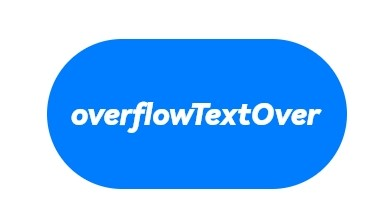

# Button

按钮组件，可快速创建不同样式的按钮。

>  **说明：**
>
>  该组件从API Version 7开始支持。后续版本如有新增内容，则采用上角标单独标记该内容的起始版本。


## 子组件

可以包含单个子组件。


## 接口

### Button

Button(options: ButtonOptions)

创建可以包含单个子组件的按钮。

**卡片能力：** 从API version 9开始，该接口支持在ArkTS卡片中使用。

**系统能力：** SystemCapability.ArkUI.ArkUI.Full

**参数：** 

| 参数名  | 类型                                    | 必填 | 说明                 |
| ------- | --------------------------------------- | ---- | -------------------- |
| options | [ButtonOptions](#buttonoptions对象说明) | 是   | 配置按钮的显示样式。 |

### Button

Button(label: ResourceStr, options?: ButtonOptions)

使用文本内容创建相应的按钮组件，此时Button无法包含子组件。

文本内容默认单行显示。

**卡片能力：** 从API version 9开始，该接口支持在ArkTS卡片中使用。

**系统能力：** SystemCapability.ArkUI.ArkUI.Full

**参数：** 

| 参数名  | 类型                                    | 必填 | 说明                 |
| ------- | --------------------------------------- | ---- | -------------------- |
| label   | [ResourceStr](ts-types.md#resourcestr)  | 是   | 按钮文本内容。       |
| options | [ButtonOptions](#buttonoptions对象说明) | 否   | 配置按钮的显示样式。 |

## ButtonOptions对象说明

| 名称                      | 类型                                          | 必填 | 描述                                                         |
| ------------------------- | --------------------------------------------- | ---- | ------------------------------------------------------------ |
| type                      | [ButtonType](#buttontype枚举说明)             | 否   | 描述按钮显示样式。<br/>默认值：ButtonType.Capsule            |
| stateEffect               | boolean                                       | 否   | 按钮按下时是否开启按压态显示效果，当设置为false时，按压效果关闭。<br/>默认值：true<br/>**说明：** <br/>当开启按压态显示效果，开发者设置状态样式时，会基于状态样式设置完成后的背景色再进行颜色叠加。 |
| buttonStyle<sup>11+</sup> | [ButtonStyleMode](#buttonstylemode11枚举说明) | 否   | 描述按钮的样式和重要程度。<br/>默认值：ButtonStyleMode.EMPHASIZED <br/>**说明：**  <br/>按钮重要程度：强调按钮>普通按钮>文字按钮。 |
| controlSize<sup>11+</sup> | [ControlSize](#controlsize11枚举说明)         | 否   | 描述按钮的尺寸。<br/>默认值：ControlSize.NORMAL              |

## 属性

除支持[通用属性](ts-universal-attributes-size.md)外，还支持以下属性：

| 名称          | 参数类型           | 描述                                |
| ----------- | ----------- | --------------------------------- |
| type        | [ButtonType](#buttontype枚举说明) | 设置Button样式。<br/>默认值：ButtonType.Capsule<br/>从API version 9开始，该接口支持在ArkTS卡片中使用。 |
|  fontSize | [Length](ts-types.md#length)    | 文本显示字号。<br/>默认值：若controlSize的值为：controlSize.NORMAL，取'16fp'，若controlSize的值为：controlSize.SMALL，取'12fp' |
| fontColor   | [ResourceColor](ts-types.md#resourcecolor) | 设置文本显示颜色。<br/>默认值：'\#ffffff' |
| fontWeight  | [FontWeight](ts-appendix-enums.md#fontweight) \| number \| string | 设置文本的字体粗细，number类型取值[100, 900]，取值间隔为100，取值越大，字体越粗。<br>默认值：400 \| FontWeight.Normal |
| fontStyle   | [FontStyle](ts-appendix-enums.md#fontstyle) | 设置文本的字体样式。<br>默认值：FontStyle.Normal。 |
| fontFamily | [Resource](ts-types.md#resource)&nbsp;\|&nbsp;string | 字体列表。默认字体'HarmonyOS Sans'，当前支持'HarmonyOS Sans'字体和[注册自定义字体](../js-apis-font.md)。 |
| stateEffect | boolean     | 按钮按下时是否开启按压态显示效果，当设置为false时，按压效果关闭。<br/>默认值：true<br/>从API version 9开始，该接口支持在ArkTS卡片中使用。 |
| labelStyle<sup>10+</sup> | [LabelStyle](#labelstyle10对象说明) | 设置Button组件label文本和字体的样式。 |
| buttonStyle<sup>11+</sup> | [ButtonStyleMode](#buttonstylemode11枚举说明) | 设置Button组件的样式和重要程度。<br>默认值:ButtonStyleMode.EMPHASIZED。 |
| controlSize<sup>11+</sup> | [ControlSize](#controlsize11枚举说明) | 设置Button组件的尺寸。<br>默认值:ControlSize.NORMAL。 |

## ButtonType枚举说明

从API version 9开始，该接口支持在ArkTS卡片中使用。

| 名称      | 描述                 |
| ------- | ------------------ |
| Capsule | 胶囊型按钮（圆角默认为高度的一半）。 |
| Circle  | 圆形按钮。              |
| Normal  | 普通按钮（默认不带圆角）。      |

>  **说明：**
>  - 按钮圆角通过[通用属性borderRadius](ts-universal-attributes-border.md#borderradius)设置（不支持通过border接口设置圆角），且只支持设置参数为[Length](ts-types.md#length)的圆角。
>  - 当按钮类型为Capsule时，borderRadius设置不生效，按钮圆角始终为宽、高中较小值的一半。
>  - 当按钮类型为Circle时，若同时设置了宽和高，则borderRadius不生效，且按钮半径为宽高中较小值的一半；若只设置宽、高中的一个，则borderRadius不生效，且按钮半径为所设宽或所设高值的一半；若不设置宽高，则borderRadius为按钮半径；若borderRadius的值为负，则borderRadius的值按照0处理。
>  - 按钮文本通过[通用文本样式](ts-universal-attributes-text-style.md#属性)进行设置。
>  - 设置[颜色渐变](ts-universal-attributes-gradient-color.md)需先设置[backgroundColor](ts-universal-attributes-background.md#backgroundcolor)为透明色。

## LabelStyle<sup>10+</sup>对象说明

| 名称                 | 参数类型                                                     | 必填 | 描述                                                         |
| -------------------- | ------------------------------------------------------------ | ---- | ------------------------------------------------------------ |
| overflow             | [TextOverflow](ts-appendix-enums.md#textoverflow)            | 否   | 设置label文本超长时的显示方式。文本截断是按字截断。例如，英文以单词为最小单位进行截断，若需要以字母为单位进行截断，可在字母间添加零宽空格。<br>默认值：TextOverflow.Ellipsis |
| maxLines             | number                                                       | 否   | 设置label文本的最大行数。默认情况下，文本是自动折行的，如果指定此参数，则文本最多不会超过指定的行。如果有多余的文本，可以通过overflow来指定截断方式。<br>默认值：1 |
| minFontSize          | number \| [ResourceStr](ts-types.md#resourcestr)             | 否   | 设置label文本最小显示字号。需配合maxFontSize以及maxLines或布局大小限制使用。<br/>**说明：**  <br/>minFontSize小于或等于0时，自适应字号不生效。 |
| maxFontSize          | number \| [ResourceStr](ts-types.md#resourcestr)             | 否   | 设置label文本最大显示字号。需配合minFontSize以及maxLines或布局大小限制使用。 |
| heightAdaptivePolicy | [TextHeightAdaptivePolicy](ts-appendix-enums.md#textheightadaptivepolicy10) | 否   | 设置label文本自适应高度的方式。<br>默认值：TextHeightAdaptivePolicy.MAX_LINES_FIRST。 |
| font                 | [Font](ts-types.md#font)                                     | 否   | 设置label文本字体样式。<br>默认值：默认值参考[Font](ts-types.md#font)。 |

## ButtonStyleMode<sup>11+</sup>枚举说明

从API version 11开始，该接口支持在ArkTS卡片中使用。

| 名称      | 描述                 |
| ------- | ------------------ |
| EMPHASIZED | 强调按钮（用于强调当前操作）。 |
| NORMAL  | 普通按钮（一般界面操作）。              |
| TEXTUAL  | 文本按钮（纯文本，无背景颜色）。      |

## ControlSize<sup>11+</sup>枚举说明

从API version 11开始，该接口支持在ArkTS卡片中使用。

| 名称      | 描述                 |
| ------- | ------------------ |
| SMALL | 小尺寸按钮。 |
| NORMAL  | 正常尺寸按钮。              |

## 事件

支持[通用事件](ts-universal-events-click.md)。
## 示例

### 示例1

```ts
// xxx.ets
@Entry
@Component
struct ButtonExample {
  build() {
    Flex({ direction: FlexDirection.Column, alignItems: ItemAlign.Start, justifyContent: FlexAlign.SpaceBetween }) {
      Text('Normal button').fontSize(9).fontColor(0xCCCCCC)
      Flex({ alignItems: ItemAlign.Center, justifyContent: FlexAlign.SpaceBetween }) {
        Button('OK', { type: ButtonType.Normal, stateEffect: true })
          .borderRadius(8)
          .backgroundColor(0x317aff)
          .width(90)
          .onClick(() => {
            console.log('ButtonType.Normal')
          })
        Button({ type: ButtonType.Normal, stateEffect: true }) {
          Row() {
            LoadingProgress().width(20).height(20).margin({ left: 12 }).color(0xFFFFFF)
            Text('loading').fontSize(12).fontColor(0xffffff).margin({ left: 5, right: 12 })
          }.alignItems(VerticalAlign.Center)
        }.borderRadius(8).backgroundColor(0x317aff).width(90).height(40)

        Button('Disable', { type: ButtonType.Normal, stateEffect: false }).opacity(0.4)
          .borderRadius(8).backgroundColor(0x317aff).width(90)
      }

      Text('Capsule button').fontSize(9).fontColor(0xCCCCCC)
      Flex({ alignItems: ItemAlign.Center, justifyContent: FlexAlign.SpaceBetween }) {
        Button('OK', { type: ButtonType.Capsule, stateEffect: true }).backgroundColor(0x317aff).width(90)
        Button({ type: ButtonType.Capsule, stateEffect: true }) {
          Row() {
            LoadingProgress().width(20).height(20).margin({ left: 12 }).color(0xFFFFFF)
            Text('loading').fontSize(12).fontColor(0xffffff).margin({ left: 5, right: 12 })
          }.alignItems(VerticalAlign.Center).width(90).height(40)
        }.backgroundColor(0x317aff)

        Button('Disable', { type: ButtonType.Capsule, stateEffect: false }).opacity(0.4)
          .backgroundColor(0x317aff).width(90)
      }

      Text('Circle button').fontSize(9).fontColor(0xCCCCCC)
      Flex({ alignItems: ItemAlign.Center, wrap: FlexWrap.Wrap }) {
        Button({ type: ButtonType.Circle, stateEffect: true }) {
          LoadingProgress().width(20).height(20).color(0xFFFFFF)
        }.width(55).height(55).backgroundColor(0x317aff)

        Button({ type: ButtonType.Circle, stateEffect: true }) {
          LoadingProgress().width(20).height(20).color(0xFFFFFF)
        }.width(55).height(55).margin({ left: 20 }).backgroundColor(0xF55A42)
      }
    }.height(400).padding({ left: 35, right: 35, top: 35 })
  }
}
```


### 示例2 

```ts
// xxx.ets
@Entry
@Component
struct SwipeGestureExample {
  @State count: number = 0

  build() {
    Column() {
      Text(`${this.count}`)
        .fontSize(30)
        .onClick(() => {
          this.count++
        })
      if (this.count <= 0) {
        Button('count is negative').fontSize(30).height(50)
      } else if (this.count % 2 === 0) {
        Button('count is even').fontSize(30).height(50)
      } else {
        Button('count is odd').fontSize(30).height(50)
      }
    }.height('100%').width('100%').justifyContent(FlexAlign.Center)
  }
}
```


### 示例3 

```ts
// xxx.ets
@Entry
@Component
struct buttonTestDemo {
  @State txt: string = 'overflowTextOverlengthTextOverflow.Clip';
  @State widthShortSize: number = 200;

  build() {
    Row() {
      Column() {
        Button(this.txt)
          .width(this.widthShortSize)
          .height(100)
          .labelStyle({ overflow: TextOverflow.Clip,
            maxLines: 1,
            minFontSize: 20,
            maxFontSize: 20,
            font: {
              size: 20,
              weight: FontWeight.Bolder,
              family: 'cursive',
              style: FontStyle.Italic
            }
          })
          .fontSize(40)
      }
      .width('100%')
    }
    .height('100%')
  }
}
```



### 示例4
```ts
// xxx.ets
@Entry
@Component
struct ButtonExample {
  build() {
    Flex({ direction: FlexDirection.Column, alignItems: ItemAlign.Start, justifyContent: FlexAlign.SpaceBetween }) {
      Text('Normal size button').fontSize(9).fontColor(0xCCCCCC)
      Flex({ alignItems: ItemAlign.Center, justifyContent: FlexAlign.SpaceBetween }) {
        Button('Emphasized', { buttonStyle: ButtonStyleMode.EMPHASIZED });
        Button('Normal', { buttonStyle: ButtonStyleMode.NORMAL });
        Button('Textual', { buttonStyle: ButtonStyleMode.TEXTUAL });
      }

      Text('Small size button').fontSize(9).fontColor(0xCCCCCC)
      Flex({ alignItems: ItemAlign.Center, justifyContent: FlexAlign.SpaceBetween }) {
        Button('Emphasized', { controlSize: ControlSize.SMALL, buttonStyle: ButtonStyleMode.EMPHASIZED });
        Button('Normal', { controlSize: ControlSize.SMALL, buttonStyle: ButtonStyleMode.NORMAL });
        Button('Textual', { controlSize: ControlSize.SMALL, buttonStyle: ButtonStyleMode.TEXTUAL });
      }

      Text('Small size button').fontSize(9).fontColor(0xCCCCCC)
      Flex({ alignItems: ItemAlign.Center, justifyContent: FlexAlign.SpaceBetween }) {
        Button('Emphasized').controlSize(ControlSize.SMALL).buttonStyle(ButtonStyleMode.EMPHASIZED);
        Button('Normal').controlSize(ControlSize.SMALL).buttonStyle(ButtonStyleMode.NORMAL);
        Button('Textual').controlSize(ControlSize.SMALL).buttonStyle(ButtonStyleMode.TEXTUAL);
      }

    }.height(400).padding({ left: 35, right: 35, top: 35 })
  }
}
```
