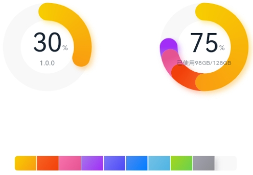
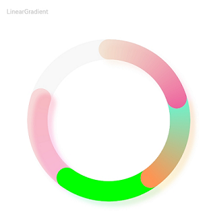
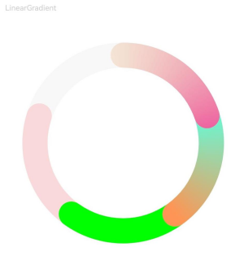

# DataPanel

数据面板组件，用于将多个数据占比情况使用占比图进行展示。

>  **说明：**
>
> 该组件从API Version 7开始支持。后续版本如有新增内容，则采用上角标单独标记该内容的起始版本。


## 子组件

无


## 接口

DataPanel(options: DataPanelOptions)

**卡片能力：** 从API version 9开始，该接口支持在ArkTS卡片中使用。

**原子化服务API：** 从API version 11开始，该接口支持在原子化服务中使用。

**系统能力：** SystemCapability.ArkUI.ArkUI.Full

**参数：** 

| 参数名 | 类型 | 必填 | 说明 |
| -------- | -------- | -------- | -------- |
| options |  [DataPanelOptions](#datapaneloptions对象说明)| 是 | 数据面板组件参数。 |

## DataPanelOptions对象说明

**卡片能力：** 从API version 9开始，该接口支持在ArkTS卡片中使用。

**原子化服务API：** 从API version 11开始，该接口支持在原子化服务中使用。

**系统能力：** SystemCapability.ArkUI.ArkUI.Full

| 名称            | 类型   | 必填  | 说明 |
| ----------------- | -------- | ----- | -------- |
| values            | number[]   | 是    | 数据值列表，最多包含9个数据，大于9个数据则取前9个数据。若数据值小于0则置为0。 |
| max               | number     | 否    |   -&nbsp;max大于0，表示数据的最大值。<br/>-&nbsp;max小于等于0，max等于value数组各项的和，按比例显示。<br/>默认值：100 |
| type<sup>8+</sup> | [DataPanelType](#datapaneltype8枚举说明) | 否 | 数据面板的类型（不支持动态修改）。<br/>默认值：DataPanelType.Circle |


## DataPanelType<sup>8+</sup>枚举说明

**卡片能力：** 从API version 9开始，该接口支持在ArkTS卡片中使用。

**原子化服务API：** 从API version 11开始，该接口支持在原子化服务中使用。

**系统能力：** SystemCapability.ArkUI.ArkUI.Full

| 名称 | 描述 |
| -------| ------------ |
| Line   | 线型数据面板。 |
| Circle | 环形数据面板。 |


## 属性

除支持[通用属性](ts-universal-attributes-size.md)外，还支持以下属性：

### closeEffect

closeEffect(value: boolean)

设置关闭数据占比图表旋转动效和投影效果。若未设置[trackShadow属性](#trackshadow10)，则该属性控制投影效果的开关，开启投影的效果为投影的默认效果。若设置trackShadow属性，则由trackShadow属性值控制投影效果的开关。

**卡片能力：** 从API version 9开始，该接口支持在ArkTS卡片中使用。

**原子化服务API：** 从API version 11开始，该接口支持在原子化服务中使用。

**系统能力：** SystemCapability.ArkUI.ArkUI.Full

**参数：** 

| 参数名 | 类型    | 必填 | 说明                                                   |
| ------ | ------- | ---- | ------------------------------------------------------ |
| value  | boolean | 是   | 关闭数据占比图表旋转动效和投影效果。<br/>默认值：false |

### valueColors<sup>10+</sup>

valueColors(value: Array<ResourceColor | LinearGradient>)

设置各数据段颜色。

**原子化服务API：** 从API version 11开始，该接口支持在原子化服务中使用。

**系统能力：** SystemCapability.ArkUI.ArkUI.Full

**参数：** 

| 参数名 | 类型                                                         | 必填 | 说明                                                        |
| ------ | ------------------------------------------------------------ | ---- | ----------------------------------------------------------- |
| value  | Array<[ResourceColor](ts-types.md#resourcecolor)&nbsp;\|&nbsp;[LinearGradient](#lineargradient10对象说明)> | 是   | 各数据段颜色，ResourceColor为纯色，LinearGradient为渐变色。 |

### trackBackgroundColor<sup>10+</sup>

trackBackgroundColor(value: ResourceColor)

设置底板颜色。

**原子化服务API：** 从API version 11开始，该接口支持在原子化服务中使用。

**系统能力：** SystemCapability.ArkUI.ArkUI.Full

**参数：** 

| 参数名 | 类型                                       | 必填 | 说明                                                         |
| ------ | ------------------------------------------ | ---- | ------------------------------------------------------------ |
| value  | [ResourceColor](ts-types.md#resourcecolor) | 是   | 底板颜色。<br/>默认值：'#08182431'，格式为十六进制ARGB值，前俩位代表透明度。 |

### strokeWidth<sup>10+</sup>

strokeWidth(value: Length)

设置圆环粗细。数据面板的类型为DataPanelType.Line时该属性不生效。

**原子化服务API：** 从API version 11开始，该接口支持在原子化服务中使用。

**系统能力：** SystemCapability.ArkUI.ArkUI.Full

**参数：** 

| 参数名 | 类型                         | 必填 | 说明                                                         |
| ------ | ---------------------------- | ---- | ------------------------------------------------------------ |
| value  | [Length](ts-types.md#length) | 是   | 圆环粗细。<br/>默认值：24<br/>单位：vp<br/>**说明：** <br/>设置小于0的值时，按默认值显示。<br/>请合理设置圆环粗细，当value大于圆环半径时，圆环粗细会自动设置为圆环半径的12%。当value过大时，圆环可能会消失。 |

### trackShadow<sup>10+</sup>

trackShadow(value: DataPanelShadowOptions)

设置投影样式。

**原子化服务API：** 从API version 11开始，该接口支持在原子化服务中使用。

**系统能力：** SystemCapability.ArkUI.ArkUI.Full

**参数：** 

| 参数名 | 类型                                                        | 必填 | 说明                                                  |
| ------ | ----------------------------------------------------------- | ---- | ----------------------------------------------------- |
| value  | [DataPanelShadowOptions](#datapanelshadowoptions10对象说明) | 是   | 投影样式。<br/>**说明：** <br/>设置null为不开启投影。 |

### contentModifier<sup>12+</sup>

contentModifier(modifier: ContentModifier\<DataPanelConfiguration>)

定制DataPanel内容区的方法。

**原子化服务API：** 从API version 12开始，该接口支持在原子化服务中使用。

**系统能力：** SystemCapability.ArkUI.ArkUI.Full

**参数：**

| 参数名 | 类型                                          | 必填 | 说明                                             |
| ------ | --------------------------------------------- | ---- | ------------------------------------------------ |
| modifier  | [ContentModifier\<DataPanelConfiguration>](#datapanelconfiguration12对象说明) | 是   | 在DataPanel组件上，定制内容区的方法。<br/>modifier: 内容修改器，开发者需要自定义class实现ContentModifier接口。 |


## DataPanelShadowOptions<sup>10+</sup>对象说明

DataPanelShadowOptions继承自[MultiShadowOptions](ts-types.md#multishadowoptions10)，具有MultiShadowOptions的全部属性。

**原子化服务API：** 从API version 11开始，该接口支持在原子化服务中使用。

**系统能力：** SystemCapability.ArkUI.ArkUI.Full

| 名称          | 类型 | 必填 | 说明 |
| ------------- | ------- | ---- | -------- |
| colors | Array<[ResourceColor](ts-types.md#resourcecolor) \| [LinearGradient](#lineargradient10对象说明)> | 否 | 各数据段投影的颜色。 <br/>默认值：与valueColors值相同 <br/>**说明：** <br/>若设置的投影颜色的个数少于数据段个数时，则显示的投影颜色的个数和设置的投影颜色个数一致。<br/>若设置的投影颜色的个数多于数据段个数时，则显示的投影颜色的个数和数据段个数一致。|

## LinearGradient<sup>10+</sup>对象说明

线性渐变颜色描述。

constructor(colorStops: ColorStop[])

**原子化服务API：** 从API version 11开始，该接口支持在原子化服务中使用。

| 名称          | 参数类型 | 必填 | 描述 |
| ------------- | ------- | ---- | -------- |
| colorStops | [ColorStop](#colorstop10枚举说明)[] | 是 | 存储渐变颜色和渐变点。|


## ColorStop<sup>10+</sup>枚举说明

颜色断点类型，用于描述渐进色颜色断点。

**原子化服务API：** 从API version 11开始，该接口支持在原子化服务中使用。

**系统能力：** SystemCapability.ArkUI.ArkUI.Full

| 名称          | 类型 | 必填 | 说明 |
| ------------- | ------- | ---- | -------- |
| color | [ResourceColor](ts-types.md#resourcecolor) | 是 | 颜色值。|
| offset | [Length](ts-types.md#length) | 是 | 渐变色断点（0~1之间的比例值，若数据值小于0则置为0，若数据值大于1则置为1）。<br>**说明：** <br/>若传入字符串类型且内容为数字，则转换为对应的数值。<br/>例如'10vp'转换为10，'10%'转换为0.1。 |

## DataPanelConfiguration<sup>12+</sup>对象说明

开发者需要自定义class实现ContentModifier接口。

**原子化服务API：** 从API version 12开始，该接口支持在原子化服务中使用。

**系统能力：** SystemCapability.ArkUI.ArkUI.Full

| 名称  | 类型    |    必填      |  说明              |
| ------ | ------ | ------ |-------------------------------- |
| values | number[] | 是 | 当前DataPanel的数据值，最大长度为9。 |
| maxValue | number | 是 | DataPanel显示的最大值。<br/>默认值：100。 |

## 示例

### 示例1（设置数据面板类型）

该示例通过type属性，实现了设置数据面板的类型的功能。

```ts
// xxx.ets
@Entry
@Component
struct DataPanelExample {
  public valueArr: number[] = [10, 10, 10, 10, 10, 10, 10, 10, 10]

  build() {
    Column({ space: 5 }) {
      Row() {
        Stack() {
          // 单段环形数据面板
          DataPanel({ values: [30], max: 100, type: DataPanelType.Circle }).width(168).height(168)
          Column() {
            Text('30').fontSize(35).fontColor('#182431')
            Text('1.0.0').fontSize(9.33).lineHeight(12.83).fontWeight(500).opacity(0.6)
          }

          Text('%')
            .fontSize(9.33)
            .lineHeight(12.83)
            .fontWeight(500)
            .opacity(0.6)
            .position({ x: 104.42, y: 78.17 })
        }.margin({ right: 44 })

        // 多段环形数据面板
        Stack() {
          DataPanel({ values: [50, 12, 8, 5], max: 100, type: DataPanelType.Circle }).width(168).height(168)
          Column() {
            Text('75').fontSize(35).fontColor('#182431')
            Text('已使用98GB/128GB').fontSize(8.17).lineHeight(11.08).fontWeight(500).opacity(0.6)
          }

          Text('%')
            .fontSize(9.33)
            .lineHeight(12.83)
            .fontWeight(500)
            .opacity(0.6)
            .position({ x: 104.42, y: 78.17 })
        }
      }.margin({ bottom: 59 })

      // 线形数据面板
      DataPanel({ values: this.valueArr, max: 100, type: DataPanelType.Line }).width(300).height(20)
    }.width('100%').margin({ top: 5 })
  }
}
```



### 示例2（设置渐变色和阴影）

该示例通过valueColors和trackShadow接口设置LinearGradient颜色，实现了设置渐变色效果和阴影效果。

```ts
// xxx.ets
@Entry
@Component
struct LinearGradientDataPanelExample {
  public values1: number[] = [20, 20, 20, 20]
  public color1: LinearGradient =
    new LinearGradient([{ color: "#65EEC9A3", offset: 0 }, { color: "#FFEF629F", offset: 1 }])
  public color2: LinearGradient =
    new LinearGradient([{ color: "#FF67F9D4", offset: 0 }, { color: "#FFFF9554", offset: 1 }])
  public colorShadow1: LinearGradient =
    new LinearGradient([{ color: "#65EEC9A3", offset: 0 }, { color: "#65EF629F", offset: 1 }])
  public colorShadow2: LinearGradient =
    new LinearGradient([{ color: "#65e26709", offset: 0 }, { color: "#65efbd08", offset: 1 }])
  public colorShadow3: LinearGradient =
    new LinearGradient([{ color: "#6572B513", offset: 0 }, { color: "#6508efa6", offset: 1 }])
  public colorShadow4: LinearGradient =
    new LinearGradient([{ color: "#65ed08f5", offset: 0 }, { color: "#65ef0849", offset: 1 }])
  @State color3: string = '#00FF00'
  @State color4: string = '#20FF0000'
  @State bgColor: string = '#08182431'
  @State offsetX: number = 15
  @State offsetY: number = 15
  @State radius: number = 5
  @State colorArray: Array<LinearGradient | ResourceColor> = [this.color1, this.color2, this.color3, this.color4]
  @State shadowColorArray: Array<LinearGradient | ResourceColor> =
    [this.colorShadow1, this.colorShadow2, this.colorShadow3, this.colorShadow4]

  build() {
    Column({ space: 5 }) {
      Text('LinearGradient')
        .fontSize(9)
        .fontColor(0xCCCCCC)
        .textAlign(TextAlign.Start)
        .width('100%')
        .margin({ top: 20, left: 20 })
      DataPanel({ values: this.values1, max: 100, type: DataPanelType.Circle })
        .width(300)
        .height(300)
        .valueColors(this.colorArray)
        .trackShadow({
          radius: this.radius,
          colors: this.shadowColorArray,
          offsetX: this.offsetX,
          offsetY: this.offsetY
        })
        .strokeWidth(30)
        .trackBackgroundColor(this.bgColor)
    }.width('100%').margin({ top: 5 })
  }
}
```



### 示例3（设置关闭动画和阴影）

该示例通过closeEffect接口，实现了关闭数据面板动画和阴影的功能。

```ts
// xxx.ets
@Entry
@Component
struct LinearGradientDataPanelExample {
  public values1: number[] = [20, 20, 20, 20]
  public color1: LinearGradient =
    new LinearGradient([{ color: "#65EEC9A3", offset: 0 }, { color: "#FFEF629F", offset: 1 }])
  public color2: LinearGradient =
    new LinearGradient([{ color: "#FF67F9D4", offset: 0 }, { color: "#FFFF9554", offset: 1 }])
  public colorShadow1: LinearGradient =
    new LinearGradient([{ color: "#65EEC9A3", offset: 0 }, { color: "#65EF629F", offset: 1 }])
  public colorShadow2: LinearGradient =
    new LinearGradient([{ color: "#65e26709", offset: 0 }, { color: "#65efbd08", offset: 1 }])
  public colorShadow3: LinearGradient =
    new LinearGradient([{ color: "#6572B513", offset: 0 }, { color: "#6508efa6", offset: 1 }])
  public colorShadow4: LinearGradient =
    new LinearGradient([{ color: "#65ed08f5", offset: 0 }, { color: "#65ef0849", offset: 1 }])
  @State color3: string = '#00FF00'
  @State color4: string = '#20FF0000'
  @State bgColor: string = '#08182431'
  @State offsetX: number = 15
  @State offsetY: number = 15
  @State radius: number = 5
  @State colorArray: Array<LinearGradient | ResourceColor> = [this.color1, this.color2, this.color3, this.color4]
  @State shadowColorArray: Array<LinearGradient | ResourceColor> =
    [this.colorShadow1, this.colorShadow2, this.colorShadow3, this.colorShadow4]

  build() {
    Column({ space: 5 }) {
      Text('LinearGradient')
        .fontSize(9)
        .fontColor(0xCCCCCC)
        .textAlign(TextAlign.Start)
        .width('100%')
        .margin({ top: 20, left: 20 })
      DataPanel({ values: this.values1, max: 100, type: DataPanelType.Circle })
        .width(300)
        .height(300)
        .valueColors(this.colorArray)
        .strokeWidth(30)
        .closeEffect(true)
        .trackBackgroundColor(this.bgColor)
    }.width('100%').margin({ top: 5 })
  }
}
```



### 示例4（设置定制内容区）

该示例通过contentModifier接口，实现了定制数据面板内容区的功能。

```ts
// xxx.ets
@Builder
function buildDataPanel(config: DataPanelConfiguration) {
  Column() {
    Column() {
      ForEach(config.values, (item: number, index: number) => {
        ChildItem({ item: item, index: index, max: config.maxValue })
      }, (item: string) => item)
    }.padding(10)

    Column() {
      Line().width("100%").backgroundColor("#ff373737").margin({ bottom: 5 })
    }.padding({ left: 20, right: 20 })

    Row() {
      Text('Length=' + config.values.length + '    ').margin({ left: 10 }).align(Alignment.Start)
      Text('Max=' + config.maxValue).margin({ left: 10 }).align(Alignment.Start)
    }
  }
}

class DataPanelBuilder implements ContentModifier<DataPanelConfiguration> {
  constructor() {
  }

  applyContent(): WrappedBuilder<[DataPanelConfiguration]> {
    return wrapBuilder(buildDataPanel)
  }
}

@Entry
@Component
struct Index {
  build() {
    Column() {
      Text("Data panel").margin({ top: 12 });
      Row() {
        DataPanel({ values: [12.3, 21.1, 13.4, 35.2, 26.0, 32.0], max: 140, type: DataPanelType.Circle })
          .width(400)
          .height(260)
          .constraintSize({ maxWidth: "100%" })
          .padding({ top: 10 })
          .contentModifier(new DataPanelBuilder())
      }.margin(15).backgroundColor("#fff5f5f5")
    }
  }
}

@Component
struct ChildItem {
  @Prop item: number;
  @Prop index: number;
  @Prop max: number;
  public color1: string = "#65ff00dd"
  public color2: string = "#6500ff99"
  public color3: string = "#65ffe600"
  public color4: string = "#6595ff00"
  public color5: string = "#65000dff"
  public color6: string = "#650099ff"
  public colorArray: Array<string> = [this.color1, this.color2, this.color3, this.color4, this.color5, this.color6]

  build() {
    RelativeContainer() {
      Row() {
        Rect()
          .height(25)
          .width(this.item * 600 / this.max)
          .foregroundColor(this.colorArray[this.index])
          .radius(5)
          .align(Alignment.Start)
        Text(" " + this.item)
          .fontSize(17)
      }
    }.height(28)
  }
}
```
