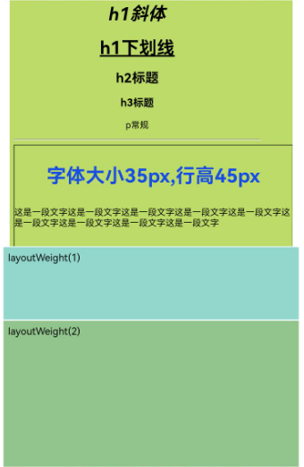

# RichText

富文本组件，解析并显示HTML格式文本。

- 适用场景：

  RichText组件适用于加载与显示一段HTML字符串，且不需要对显示效果进行较多自定义的应用场景。RichText组件仅支持有限的通用属性和事件。具体见[属性](#属性)与[事件](#事件)小节。

  RichText组件底层复用了Web组件来提供基础能力，包括但不限于HTML页面的解析、渲染等。因此使用RichText组件需要遵循Web约束条件。常见典型约束如下：

  移动设备的视口默认值大小为980px，默认值可以确保大部分网页在移动设备下可以正常浏览。如果RichText组件宽度低于这个值，content内部的HTML则可能会产生一个可以滑动的页面被RichText组件包裹。如果想替换默认值，可以在content中添加以下标签：

  ```html
  <meta name="viewport" content="width=device-width">
  ```

- 不适用场景：

  RichText组件不适用于对HTML字符串的显示效果进行较多自定义的应用场景。例如RichText组件不支持通过设置属性与事件，来修改背景颜色、字体颜色、字体大小、动态改变内容等。在这种情况下，推荐使用[Web组件](../../apis-arkweb/ts-basic-components-web.md#web)。

  RichText组件比较消耗内存资源，而且有一些重复使用RichText组件的场景下，比如在List下循环重复使用RichText时，会出现卡顿、滑动响应慢等现象。在这种情况下，推荐使用[RichEditor组件](../arkui-ts/ts-basic-components-richeditor.md#richeditor)。

>  **说明：**
>
> - 该组件从API Version 8开始支持。后续版本如有新增内容，则采用上角标单独标记该内容的起始版本。
> - 该组件无法根据内容自适应设置宽高属性，需要开发者设置显示布局。


## 子组件

不包含子组件。

## 接口

RichText(content:string)

**系统能力：** SystemCapability.ArkUI.ArkUI.Full

**参数:**

| 参数名 | 类型 | 必填  | 说明 |
| ------- | -------- | ------------- | -------- |
| content | string | 是   | 表示HTML格式的字符串。 |


## 事件

### onStart

onStart(callback: () => void)

加载网页时触发。

**系统能力：** SystemCapability.ArkUI.ArkUI.Full

### onComplete

onComplete(callback: () => void)

网页加载结束时触发。

**系统能力：** SystemCapability.ArkUI.ArkUI.Full

## 属性

只支持[通用属性](ts-universal-attributes-size.md)中width，height，size，layoutWeight四个属性。由于padding，margin，constraintSize属性使用时与通用属性描述不符，暂不支持。

## 支持标签

| 名称 | 描述 | 示例 |
| -------- | -------- | -------- |
| \<h1>--\<h6> | 被用来定义HTML，\<h1>定义重要等级最高的标题，\<h6>定义重要等级最低的标题。 | \<h1>这是一个标题\</h1>\<h2>这是h2标题\</h2> |
| \<p>\</p> | 定义段落。 | \<p>这是一个段落\</p> |
| \<br/> | 插入一个简单的换行符。 | \<p>这是一个段落\<br/>这是换行段落\</p> |
| \<font/> | 规定文本的字体、字体尺寸、字体颜色。在<font/>标签中font size能够设置的值只有1到7的数字，默认值是3，由于<font/>标签在HTML 4.01中不建议使用，在XHTML1.0 Strict DTD中不支持，所以不建议使用此标签，请使用CSS代替。CSS语法：\<p style="font-size: 35px; font-family: verdana; color: rgb(24,78,228)"> | \<font size="3" face="arial" color="red">这是一段红色字体。\</font> |
| \<hr/> | 定义HTML页面中的主题变化（比如话题的转移），并显示为一条水平线。 | \<p>这个一个段落\</p>\<hr/>\<p>这是一个段落\</p> |
| \<image>\</image> | 用来定义图片。 | \<image src="resource://rawfile/icon.png">\</image> |
| \<div>\</div> | 常用于组合块级元素，以便通过CSS来对这些元素进行格式化。 | \<div style='color:#0000FF'>\<h3>这是一个在div元素中的标题。\</h3>\</div> |
| \<i>\</i> | 定义与文本中其余部分不同的部分，并把这部分文本呈现为斜体文本。 | \<i>这是一个斜体\</i> |
| \<u>\</u> | 定义与常规文本风格不同的文本，像拼写错误的单词或者汉语中的专有名词，应尽量避免使用\<u>为文本加下划线，用户会把它混淆为一个超链接。 | \<p>\<u>这是带有下划线的段落\</u>\</p> |
| \<style>\</style> | 定义HTML文档的样式信息。 | \<style>h1{color:red;}p{color:blue;}\</style> |
| style | 属性规定元素的行内样式，写在标签内部，在使用的时候需用引号来进行区分，并以; 间隔样式，style='width: 500px;height: 500px;border: 1px soild;margin: 0 auto;'。 | \<h1 style='color:blue;text-align:center'>这是一个标题\</h1>\<p style='color:green'>这是一个段落。\</p> |
| \<script>\</script> | 用于定义客户端脚本，比如JavaScript。 | \<script>document.write("Hello World!")\</script> |

## 示例

示例效果请以真机运行为准，当前DevEco Studio预览器不支持。

```ts
// xxx.ets
@Entry
@Component
struct RichTextExample {
  @State data: string = '<h1 style="text-align: center;">h1标题</h1>' +
  '<h1 style="text-align: center;"><i>h1斜体</i></h1>' +
  '<h1 style="text-align: center;"><u>h1下划线</u></h1>' +
  '<h2 style="text-align: center;">h2标题</h2>' +
  '<h3 style="text-align: center;">h3标题</h3>' +
  '<p style="text-align: center;">p常规</p><hr/>' +
  '<div style="width: 500px;height: 500px;border: 1px solid;margin: 0 auto;">' +
  '<p style="font-size: 35px;text-align: center;font-weight: bold; color: rgb(24,78,228)">字体大小35px,行高45px</p>' +
  '<p style="background-color: #e5e5e5;line-height: 45px;font-size: 35px;text-indent: 2em;">' +
  '<p>这是一段文字这是一段文字这是一段文字这是一段文字这是一段文字这是一段文字这是一段文字这是一段文字这是一段文字</p>';

  build() {
    Flex({ direction: FlexDirection.Column, alignItems: ItemAlign.Center,
      justifyContent: FlexAlign.Center }) {
      RichText(this.data)
        .onStart(() => {
          console.info('RichText onStart');
        })
        .onComplete(() => {
          console.info('RichText onComplete');
        })
        .width(500)
        .height(500)
        .backgroundColor(0XBDDB69)
      RichText('layoutWeight(1)')
        .onStart(() => {
          console.info('RichText onStart');
        })
        .onComplete(() => {
          console.info('RichText onComplete');
        })
        .size({ width: '100%', height: 110 })
        .backgroundColor(0X92D6CC)
        .layoutWeight(1)
      RichText('layoutWeight(2)')
        .onStart(() => {
          console.info('RichText onStart');
        })
        .onComplete(() => {
          console.info('RichText onComplete');
        })
        .size({ width: '100%', height: 110 })
        .backgroundColor(0X92C48D)
        .layoutWeight(2)
    }
  }
}
```

 

