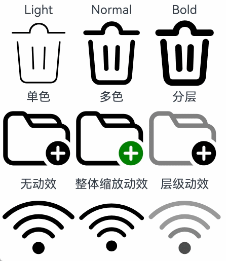

# SymbolSpan

作为Text组件的子组件，用于显示图标小符号的组件。

>  **说明：**
>
> - 该组件从API Version 11开始支持。后续版本如有新增内容，则采用上角标单独标记该内容的起始版本。
>
> - 该组件支持继承父组件Text的属性，即如果子组件未设置属性且父组件设置属性，则继承父组件设置的全部属性。
>
> - SymbolSpan拖拽不会置灰显示。

## 子组件

不支持子组件。

## 接口

SymbolSpan(value: Resource)

**卡片能力：** 从API version 12开始，该接口支持在ArkTS卡片中使用。

**原子化服务API：** 从API version 12开始，该接口支持在原子化服务中使用。

**系统能力：** SystemCapability.ArkUI.ArkUI.Full

**参数：** 

| 参数名 | 类型 | 必填 | 说明 |
| -------- | -------- | -------- | -------- |
| value | [Resource](ts-types.md#resource)| 是 | SymbolSpan组件的资源名，如 $r('sys.symbol.ohos_wifi')。 |

>  **说明：**
>
>  $r('sys.symbol.ohos_wifi')中引用的资源为系统预置，SymbolSpan仅支持系统预置的symbol资源名，引用非symbol资源将显示异常。

## 属性

不支持[通用属性](ts-universal-attributes-size.md)，支持以下属性：

### fontColor

fontColor(value: Array&lt;ResourceColor&gt;)

设置SymbolSpan组件颜色。

**卡片能力：** 从API version 12开始，该接口支持在ArkTS卡片中使用。

**原子化服务API：** 从API version 12开始，该接口支持在原子化服务中使用。

**系统能力：** SystemCapability.ArkUI.ArkUI.Full

**参数：** 

| 参数名 | 类型                                                | 必填 | 说明                                                         |
| ------ | --------------------------------------------------- | ---- | ------------------------------------------------------------ |
| value  | Array\<[ResourceColor](ts-types.md#resourcecolor)\> | 是   | SymbolSpan组件颜色。<br/> 默认值：不同渲染策略下默认值不同。 |

### fontSize

fontSize(value: number | string | Resource)

设置SymbolSpan组件大小。

**卡片能力：** 从API version 12开始，该接口支持在ArkTS卡片中使用。

**原子化服务API：** 从API version 12开始，该接口支持在原子化服务中使用。

**系统能力：** SystemCapability.ArkUI.ArkUI.Full

**参数：** 

| 参数名 | 类型                                                         | 必填 | 说明                                          |
| ------ | ------------------------------------------------------------ | ---- | --------------------------------------------- |
| value  | number&nbsp;\|&nbsp;string&nbsp;\|&nbsp;[Resource](ts-types.md#resource) | 是   | SymbolSpan组件大小。<br/>默认值：系统默认值。 |

### fontWeight

fontWeight(value: number | FontWeight | string)

设置SymbolSpan组件粗细。number类型取值[100,900]，取值间隔为100，默认为400，取值越大，字体越粗。string类型仅支持number类型取值的字符串形式，例如“400”，以及“bold”、“bolder”、“lighter”、“regular” 、“medium”分别对应FontWeight中相应的枚举值。

sys.symbol.ohos_lungs图标不支持设置fontWeight。

**卡片能力：** 从API version 12开始，该接口支持在ArkTS卡片中使用。

**原子化服务API：** 从API version 12开始，该接口支持在原子化服务中使用。

**系统能力：** SystemCapability.ArkUI.ArkUI.Full

**参数：** 

| 参数名 | 类型                                                         | 必填 | 说明                                               |
| ------ | ------------------------------------------------------------ | ---- | -------------------------------------------------- |
| value  | number&nbsp;\|&nbsp;[FontWeight](ts-appendix-enums.md#fontweight)&nbsp;\|&nbsp;string | 是   | SymbolSpan组件粗细。<br/>默认值：FontWeight.Normal |

### renderingStrategy

renderingStrategy(value: SymbolRenderingStrategy)

设置SymbolSpan渲染策略。

**卡片能力：** 从API version 12开始，该接口支持在ArkTS卡片中使用。

**原子化服务API：** 从API version 12开始，该接口支持在原子化服务中使用。

**系统能力：** SystemCapability.ArkUI.ArkUI.Full

**参数：** 

| 参数名 | 类型                                                         | 必填 | 说明                                                         |
| ------ | ------------------------------------------------------------ | ---- | ------------------------------------------------------------ |
| value  | [SymbolRenderingStrategy](ts-basic-components-symbolGlyph.md#symbolrenderingstrategy11枚举说明) | 是   | SymbolSpan渲染策略。<br/>默认值：SymbolRenderingStrategy.SINGLE |

不同渲染策略效果可参考以下示意图。


### effectStrategy

effectStrategy(value: SymbolEffectStrategy)

设置SymbolSpan动效策略。

**卡片能力：** 从API version 12开始，该接口支持在ArkTS卡片中使用。

**原子化服务API：** 从API version 12开始，该接口支持在原子化服务中使用。

**系统能力：** SystemCapability.ArkUI.ArkUI.Full

**参数：** 

| 参数名 | 类型                                                         | 必填 | 说明                                                       |
| ------ | ------------------------------------------------------------ | ---- | ---------------------------------------------------------- |
| value  | [SymbolEffectStrategy](ts-basic-components-symbolGlyph.md#symboleffectstrategy11枚举说明) | 是   | SymbolSpan动效策略。<br/>默认值：SymbolEffectStrategy.NONE |

### attributeModifier<sup>12+</sup>

attributeModifier(modifier: AttributeModifier\<SymbolSpanAttribute>)

设置组件的动态属性。

**原子化服务API：** 从API version 12开始，该接口支持在原子化服务中使用。

**系统能力：** SystemCapability.ArkUI.ArkUI.Full

**参数：** 

| 参数名 | 类型                                                | 必填 | 说明                                                         |
| ------ | --------------------------------------------------- | ---- | ------------------------------------------------------------ |
| modifier  | [AttributeModifier](ts-universal-attributes-attribute-modifier.md#attributemodifiert)\<SymbolSpanAttribute> | 是   | 动态设置组件的属性。 |

## 事件

不支持[通用事件](ts-universal-events-click.md)。

## 示例

该示例通过renderingStrategy、effectStrategy属性展示了不同的渲染和动效策略。

```ts
// xxx.ets
@Entry
@Component
struct Index {
  build() {
    Column() {
      Row() {
        Column() {
          Text("Light")
          Text() {
            SymbolSpan($r('sys.symbol.ohos_trash'))
              .fontWeight(FontWeight.Lighter)
              .fontSize(96)
          }
        }

        Column() {
          Text("Normal")
          Text() {
            SymbolSpan($r('sys.symbol.ohos_trash'))
              .fontWeight(FontWeight.Normal)
              .fontSize(96)
          }
        }

        Column() {
          Text("Bold")
          Text() {
            SymbolSpan($r('sys.symbol.ohos_trash'))
              .fontWeight(FontWeight.Bold)
              .fontSize(96)
          }
        }
      }

      Row() {
        Column() {
          Text("单色")
          Text() {
            SymbolSpan($r('sys.symbol.ohos_folder_badge_plus'))
              .fontSize(96)
              .renderingStrategy(SymbolRenderingStrategy.SINGLE)
              .fontColor([Color.Black, Color.Green, Color.White])
          }
        }

        Column() {
          Text("多色")
          Text() {
            SymbolSpan($r('sys.symbol.ohos_folder_badge_plus'))
              .fontSize(96)
              .renderingStrategy(SymbolRenderingStrategy.MULTIPLE_COLOR)
              .fontColor([Color.Black, Color.Green, Color.White])
          }
        }

        Column() {
          Text("分层")
          Text() {
            SymbolSpan($r('sys.symbol.ohos_folder_badge_plus'))
              .fontSize(96)
              .renderingStrategy(SymbolRenderingStrategy.MULTIPLE_OPACITY)
              .fontColor([Color.Black, Color.Green, Color.White])
          }
        }
      }

      Row() {
        Column() {
          Text("无动效")
          Text() {
            SymbolSpan($r('sys.symbol.ohos_wifi'))
              .fontSize(96)
              .effectStrategy(SymbolEffectStrategy.NONE)
          }
        }

        Column() {
          Text("整体缩放动效")
          Text() {
            SymbolSpan($r('sys.symbol.ohos_wifi'))
              .fontSize(96)
              .effectStrategy(1)
          }
        }

        Column() {
          Text("层级动效")
          Text() {
            SymbolSpan($r('sys.symbol.ohos_wifi'))
              .fontSize(96)
              .effectStrategy(2)
          }
        }
      }
    }
  }
}
```
