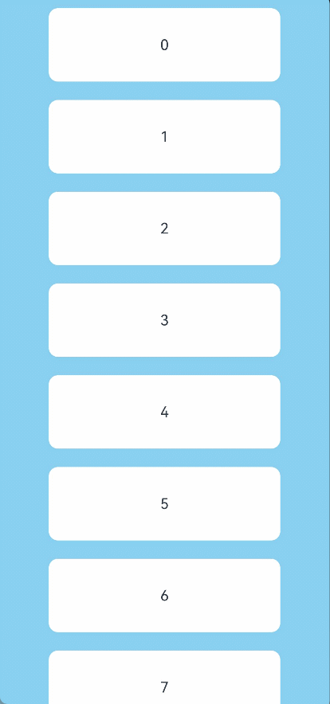

# Refresh

 可以进行页面下拉操作并显示刷新动效的容器组件。 

>  **说明：**
>
>  该组件从API Version 8开始支持。后续版本如有新增内容，则采用上角标单独标记该内容的起始版本。


## 子组件

支持单个子组件。

从API version 11开始，Refresh子组件会跟随手势下拉而下移。

## 接口

Refresh(value: RefreshOptions)

**参数：**

| 参数名 | 参数类型 | 必填 | 参数描述 |
| -------- | -------- | -------- | -------- |
| value |  [RefreshOptions](#refreshoptions对象说明)| 是 | 刷新组件参数。 |

## RefreshOptions对象说明

| 参数         | 参数名                                      | 必填   | 参数描述                                     |
| ---------- | ---------------------------------------- | ---- | ---------------------------------------- |
| refreshing | boolean                                  | 是    | 组件当前是否处于刷新中状态。true表示处于刷新中状态，false表示未处于刷新中状态。<br/>默认值：false<br/>该参数支持[$$](../../../quick-start/arkts-two-way-sync.md)双向绑定变量。 |
| offset<sup>(deprecated)</sup>    | string&nbsp;\|&nbsp;number               | 否    | 下拉起点距离组件顶部的距离。<br/>默认值：16，单位vp <br/>从API version 11开始废弃，无替代接口<br/>**说明：**<br/>offset取值范围[0vp,64vp]。大于64vp按照64vp处理。不支持百分比，不支持负数 。|
| friction<sup>(deprecated)</sup>   | number&nbsp;\|&nbsp;string               | 否    | 下拉摩擦系数，取值范围为0到100。<br/>默认值：62<br/>-&nbsp;0表示下拉刷新容器不跟随手势下拉而下拉。<br/>-&nbsp;100表示下拉刷新容器紧紧跟随手势下拉而下拉。<br/>-&nbsp;数值越大，下拉刷新容器跟随手势下拉的反应越灵敏。<br/>从API version 11开始废弃，无替代接口 |
| builder<sup>10+</sup>    | [CustomBuilder](ts-types.md#custombuilder8) | 否    | 下拉时，自定义刷新样式的组件。<br/>**说明：**<br/>API version 10及之前版本，自定义组件的高度限制在64vp之内。API version 11及以后版本没有此限制。<br/>自定义组件设置了固定高度时，自定义组件会以固定高度显示在刷新区域下方；自定义组件未设置高度时，自定义组件高度会自适应刷新区域高度，会发生自定义组件高度跟随刷新区域变化至0的现象。建议对自定义组件设置最小高度约束来避免自定义组件高度小于预期的情况发生，具体可参照[示例2](#示例2)。|

## 属性

支持[通用属性](ts-universal-attributes-size.md)。

## 事件

除支持[通用事件](ts-universal-events-click.md)外，还支持以下事件：


| 名称                                       | 描述                                     |
| ---------------------------------------- | -------------------------------------- |
| onStateChange(callback: (state: [RefreshStatus](#refreshstatus枚举说明)) => void) | 当前刷新状态变更时，触发回调。<br/>-&nbsp;state：刷新状态。 |
| onRefreshing(callback: () => void)       | 进入刷新状态时触发回调。                           |

## RefreshStatus枚举说明

| 名称       | 具体值       | 描述                   |
| -------- | -------- | -------------------- |
| Inactive | 0 | 默认未下拉状态。             |
| Drag     | 1 | 下拉中，下拉距离小于刷新距离。      |
| OverDrag | 2 | 下拉中，下拉距离超过刷新距离。      |
| Refresh  | 3 | 下拉结束，回弹至刷新距离，进入刷新中状态。 |
| Done     | 4 | 刷新结束，返回初始状态（顶部）。     |


## 示例 
### 示例1

刷新区域使用默认样式。

```ts
// xxx.ets
@Entry
@Component
struct RefreshExample {
  @State isRefreshing: boolean = false
  @State arr: String[] = ['0', '1', '2', '3', '4','5','6','7','8','9','10']

  build() {
    Column() {
      Refresh({ refreshing: $$this.isRefreshing}) {
        List() {
          ForEach(this.arr, (item: string) => {
            ListItem() {
              Text('' + item)
                .width('70%').height(80).fontSize(16).margin(10)
                .textAlign(TextAlign.Center).borderRadius(10).backgroundColor(0xFFFFFF)
            }
          }, (item: string) => item)
        }
        .onScrollIndex((first: number) => {
          console.info(first.toString())
        })
        .width('100%')
        .height('100%')
        .alignListItem(ListItemAlign.Center)
        .scrollBar(BarState.Off)
      }
      .onStateChange((refreshStatus: RefreshStatus) => {
        console.info('Refresh onStatueChange state is ' + refreshStatus)
      })
      .onRefreshing(() => {
        setTimeout(() => {
          this.isRefreshing = false
        }, 2000)
        console.log('onRefreshing test')
      })
      .backgroundColor(0x89CFF0)
    }
  }
}
```



### 示例2 

通过builder参数自定义刷新区域显示内容。

```ts
// xxx.ets
@Entry
@Component
struct RefreshExample {
  @State isRefreshing: boolean = false
  @State arr: String[] = ['0', '1', '2', '3', '4','5','6','7','8','9','10']
  @Builder
  customRefreshComponent()
  {
    Stack()
    {
      Row()
      {
        LoadingProgress().height(32)
        Text("Refreshing...").fontSize(16).margin({left:20})
      }
      .alignItems(VerticalAlign.Center)
    }
    .align(Alignment.Center)
    .clip(true)
    .constraintSize({minHeight:32}) // 设置最小高度约束保证自定义组件高度随刷新区域高度变化时自定义组件高度不会低于minHeight
    .width("100%")
  }

  build() {
    Column() {
      Refresh({ refreshing: $$this.isRefreshing,builder:this.customRefreshComponent()}) {
        List() {
          ForEach(this.arr, (item: string) => {
            ListItem() {
              Text('' + item)
                .width('70%').height(80).fontSize(16).margin(10)
                .textAlign(TextAlign.Center).borderRadius(10).backgroundColor(0xFFFFFF)
            }
          }, (item: string) => item)
        }
        .onScrollIndex((first: number) => {
          console.info(first.toString())
        })
        .width('100%')
        .height('100%')
        .alignListItem(ListItemAlign.Center)
        .scrollBar(BarState.Off)
      }
      .onStateChange((refreshStatus: RefreshStatus) => {
        console.info('Refresh onStatueChange state is ' + refreshStatus)
      })
      .onRefreshing(() => {
        setTimeout(() => {
          this.isRefreshing = false
        }, 2000)
        console.log('onRefreshing test')
      })
      .backgroundColor(0x89CFF0)
    }
  }
}
```

