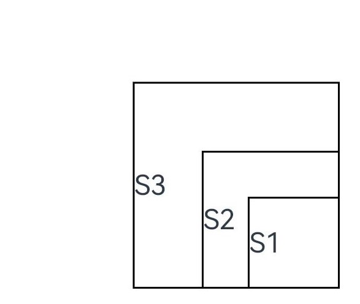
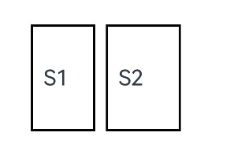

# 自定义组件的自定义布局

自定义组件的自定义布局通过数据计算的方式布局自定义组件内的子组件。

> **说明：**
>
> 本模块首批接口从API version 9开始支持，后续版本的新增接口，采用上角标单独标记接口的起始版本。
> 
> 在自定义组件内实现onMeasureSize, onPlaceChildren任一方法即视为实现自定义布局，推荐同时实现两种方法，具体参数说明可见对应接口参数说明。

## onMeasureSize<sup>10+</sup>

onMeasureSize?(selfLayoutInfo: GeometryInfo, children: Array&lt;Measurable&gt;, constraint: ConstraintSizeOptions): SizeResult

ArkUI框架会在自定义组件确定尺寸时，将该自定义组件的节点信息和尺寸范围通过onMeasureSize传递给该开发者。不允许在onMeasureSize函数中改变状态变量。

**原子化服务API：** 从API version 11开始，该接口支持在原子化服务中使用。

**系统能力：** SystemCapability.ArkUI.ArkUI.Full

**参数：**

| 参数名         | 类型                                                       | 必填|说明                                                         |
| -------------- | ---------------------------------------------------------- | ---|------------------------------------------------------------ |
| selfLayoutInfo | [GeometryInfo](#geometryinfo10)                            | 是|计算自定义组件大小后的自身布局信息。  <br/>**说明：** <br/>第一次布局时以自身设置的属性为准。                                    |
| children       | Array&lt;[Measurable](#measurable10)&gt;                   | 是|计算子组件大小后的子组件布局信息。<br/>**说明：** <br/>如果没有设置子组件的布局信息，子组件会维持上一次的布局信息，当子组件从来没有设置过尺寸时，尺寸默认为0。 |
| constraint     | [ConstraintSizeOptions](ts-types.md#constraintsizeoptions) | 是|自定义组件的布局约束信息。                                       |

**返回值：** 

| 类型                        | 说明           |
| --------------------------- | -------------- |
| [SizeResult](#sizeresult10) | 组件尺寸信息。 |

## onPlaceChildren<sup>10+</sup>

onPlaceChildren?(selfLayoutInfo: GeometryInfo, children: Array&lt;Layoutable&gt;, constraint: ConstraintSizeOptions):void

ArkUI框架会在自定义组件确定位置时，将该自定义组件的子节点自身的尺寸范围通过onPlaceChildren传递给该自定义组件。不允许在onPlaceChildren函数中改变状态变量。

**原子化服务API：** 从API version 11开始，该接口支持在原子化服务中使用。

**系统能力：** SystemCapability.ArkUI.ArkUI.Full

**参数：**

| 参数名            | 类型                                                         |必填| 说明               |
|----------------|------------------------------------------------------------|---|------------------|
| selfLayoutInfo | [GeometryInfo](#geometryinfo10)                            |是 |计算自定义组件大小后的自身布局信息。         |
| children       | Array&lt;[Layoutable](#layoutable10)&gt;                   |是 |计算子组件大小后的子组件布局信息。         |
| constraint     | [ConstraintSizeOptions](ts-types.md#constraintsizeoptions) |是 |自定义组件的布局约束信息。 |

**示例一：**
自定义布局代码示例。
```ts
// xxx.ets
@Entry
@Component
struct Index {
  build() {
    Column() {
      CustomLayout({ builder: ColumnChildren })
    }
  }
}

@Builder
function ColumnChildren() {
  ForEach([1, 2, 3], (index: number) => { //暂不支持lazyForEach的写法
    Text('S' + index)
      .fontSize(30)
      .width(100)
      .height(100)
      .borderWidth(2)
      .offset({ x: 10, y: 20 })
  })
}

@Component
struct CustomLayout {
  @Builder
  doNothingBuilder() {
  };

  @BuilderParam builder: () => void = this.doNothingBuilder;
  @State startSize: number = 100;
  result: SizeResult = {
    width: 0,
    height: 0
  };

  onPlaceChildren(selfLayoutInfo: GeometryInfo, children: Array<Layoutable>, constraint: ConstraintSizeOptions) {
    let startPos = 300;
    children.forEach((child) => {
      let pos = startPos - child.measureResult.height;
      child.layout({ x: pos, y: pos })
    })
  }

  onMeasureSize(selfLayoutInfo: GeometryInfo, children: Array<Measurable>, constraint: ConstraintSizeOptions) {
    let size = 100;
    children.forEach((child) => {
      let result: MeasureResult = child.measure({ minHeight: size, minWidth: size, maxWidth: size, maxHeight: size })
      size += result.width / 2
      ;
    })
    this.result.width = 100;
    this.result.height = 400;
    return this.result;
  }

  build() {
    this.builder()
  }
}
```



**示例二：**
通过组件的位置灵活判断是否参与布局计算。
```ts
// xxx.ets
@Entry
@Component
struct Index {
  build() {
    Column() {
      CustomLayout({ builder: ColumnChildren })
    }
    .justifyContent(FlexAlign.Center)
    .width("100%")
    .height("100%")
  }
}

@Builder
function ColumnChildren() {
  ForEach([1, 2, 3], (item: number, index: number) => { //暂不支持lazyForEach的写法
    Text('S' + item)
      .fontSize(20)
      .width(60 + 10 * index)
      .height(100)
      .borderWidth(2)
      .margin({ left:10 })
      .padding(10)
  })
}

@Component
struct CustomLayout {
  // 只布局一行，如果布局空间不够的子组件不显示的demo
  @Builder
  doNothingBuilder() {
  };

  @BuilderParam builder: () => void = this.doNothingBuilder;
  result: SizeResult = {
    width: 0,
    height: 0
  };
  overFlowIndex: number = -1;

  onPlaceChildren(selfLayoutInfo: GeometryInfo, children: Array<Layoutable>, constraint: ConstraintSizeOptions) {
    let currentX = 0;
    let infinity = 100000;
    if (this.overFlowIndex == -1) {
      this.overFlowIndex = children.length;
    }
    for (let index = 0; index < children.length; ++index) {
      let child = children[index];
      if (index >= this.overFlowIndex) {
        // 如果子组件超出父组件范围，将它布局到较偏的位置，达到不显示的目的
        child.layout({x: infinity, y: 0});
        continue;
      }
      child.layout({ x: currentX, y: 0 })
      let margin = child.getMargin();
      currentX += child.measureResult.width + margin.start + margin.end;
    }
  }

  onMeasureSize(selfLayoutInfo: GeometryInfo, children: Array<Measurable>, constraint: ConstraintSizeOptions) {
    let width = 0;
    let height = 0;
    this.overFlowIndex = -1;
    // 假定该组件的宽度不能超过200vp，也不能超过最大约束
    let maxWidth = Math.min(200, constraint.maxWidth as number);
    for (let index = 0; index < children.length; ++index) {
      let child = children[index];
      let childResult: MeasureResult = child.measure({
          minHeight: constraint.minHeight,
          minWidth: constraint.minWidth,
          maxWidth: constraint.maxWidth,
          maxHeight: constraint.maxHeight
      })
      let margin = child.getMargin();
      let newWidth = width + childResult.width + margin.start + margin.end;
      if (newWidth > maxWidth) {
        // 记录不该布局的组件的下标
        this.overFlowIndex = index;
        break;
      }
      // 累积父组件的宽度和高度
      width = newWidth;
      height = Math.max(height, childResult.height + margin.top + margin.bottom);
    }
    this.result.width = width;
    this.result.height = height;
    return this.result;
  }

  build() {
    this.builder()
  }
}
```



**示例三：** 
通过uniqueId获取子组件的[FrameNode](../js-apis-arkui-frameNode.md#framenode)，并调用FrameNode的API接口修改尺寸、背景颜色。
```ts
import { FrameNode, NodeController } from '@kit.ArkUI';
@Entry
@Component
struct Index {
  build() {
    Column() {
      CustomLayout()
    }
  }
}

class MyNodeController extends NodeController {
  private rootNode: FrameNode | null = null;
  makeNode(uiContext: UIContext): FrameNode | null {
    this.rootNode = new FrameNode(uiContext)
    return this.rootNode
  }
}

@Component
struct CustomLayout {
  @Builder
  childrenBuilder() {
    ForEach([1, 2, 3], (index: number) => { //暂不支持lazyForEach的写法
      NodeContainer(new MyNodeController())
    })
  };

  @BuilderParam builder: () => void = this.childrenBuilder;
  result: SizeResult = {
    width: 0,
    height: 0
  };

  onPlaceChildren(selfLayoutInfo: GeometryInfo, children: Array<Layoutable>, constraint: ConstraintSizeOptions) {
    let prev = 0;
    children.forEach((child) => {
      let pos = prev + 10;
      prev = pos + child.measureResult.width
      child.layout({ x: pos, y: 0 })
    })
  }

  onMeasureSize(selfLayoutInfo: GeometryInfo, children: Array<Measurable>, constraint: ConstraintSizeOptions) {
    let size = 100;
    children.forEach((child) => {
      console.log("child uniqueId: ", child.uniqueId)
      const uiContext = this.getUIContext()
      if (uiContext) {
        let node: FrameNode | null = uiContext.getFrameNodeByUniqueId(child.uniqueId) // 获取NodeContainer组件的FrameNode
        if (node) {
          node.getChild(0)!.commonAttribute.width(100)
          node.getChild(0)!.commonAttribute.height(100)
          node.getChild(0)!.commonAttribute.backgroundColor(Color.Pink) // 修改FrameNode的尺寸与背景颜色
        }
      }
      child.measure({ minHeight: size, minWidth: size, maxWidth: size, maxHeight: size })
    })
    this.result.width = 320;
    this.result.height = 100;
    return this.result;
  }

  build() {
    this.builder()
  }
}
```


## GeometryInfo<sup>10+</sup>

父组件布局信息，继承自[SizeResult](#sizeresult10)。

**原子化服务API：** 从API version 11开始，该接口支持在原子化服务中使用。

**系统能力：** SystemCapability.ArkUI.ArkUI.Full

| 属性          | 类型      |只读|可选| 说明                  |
|-------------|-----------|------|------|---------------------|
| borderWidth | [EdgeWidth](ts-types.md#edgewidths9) |否|否| 父组件边框宽度。<br>单位：vp            |
| margin      | [Margin](ts-types.md#margin)       | 否|否|父组件margin信息。 <br>单位：vp       |
| padding     | [Padding](ts-types.md#padding)   |否|否| 父组件padding信息。<br>单位：vp |

## Layoutable<sup>10+</sup>

子组件布局信息。

**系统能力：** SystemCapability.ArkUI.ArkUI.Full

### 属性

| 名称         | 类型       | 只读|可选|  说明                                                      |
|--------------|---------------------------------- | ------|-----------------------------------------------------|---------------------|
| measureResult| [MeasureResult](#measureresult10) |   否|否| 子组件测量后的尺寸信息。<br/>**原子化服务API：** 从API version 11开始，该接口支持在原子化服务中使用。<br>单位：vp     |
| uniqueId<sup>18+</sup>| number | 否 |否| 系统为子组件分配的唯一标识UniqueID。<br>取值范围[0,+∞)。<br/>**原子化服务API：** 从API version 18开始，该接口支持在原子化服务中使用。|

### layout

layout(position: Position)

调用此方法对子组件的位置信息进行限制。

**原子化服务API：** 从API version 11开始，该接口支持在原子化服务中使用。

**系统能力：** SystemCapability.ArkUI.ArkUI.Full

**参数：**

| 参数名         | 类型                                                    | 必填                 |说明         |
|-----------------|---------------------------------------------------------|---------------------|-------------|
|   position      | [Position](ts-types.md#position)                        | 是                  |   绝对位置。   |

### getMargin<sup>12+</sup>

getMargin() : DirectionalEdgesT\<number>

调用此方法获取子组件的margin信息。

**原子化服务API：** 从API version 12开始，该接口支持在原子化服务中使用。

**系统能力：** SystemCapability.ArkUI.ArkUI.Full

**返回值：**

| 类型                          | 说明                                        |
|------------------------------------|---------------------------------------------|
| [DirectionalEdgesT&lt;number&gt;](#directionaledgestt12)  |  子组件的margin信息。   |

 ### getPadding<sup>12+</sup>

getPadding() : DirectionalEdgesT\<number>

 调用此方法获取子组件的padding信息。

**原子化服务API：** 从API version 12开始，该接口支持在原子化服务中使用。

**系统能力：** SystemCapability.ArkUI.ArkUI.Full

 **返回值：**

| 类型                          | 说明                                        |
|------------------------------------|---------------------------------------------|
| [DirectionalEdgesT&lt;number&gt;](#directionaledgestt12)  |  子组件的padding信息。  |

### getBorderWidth<sup>12+</sup>

getBorderWidth() : DirectionalEdgesT\<number>

调用此方法获取子组件的borderWidth信息。

**原子化服务API：** 从API version 12开始，该接口支持在原子化服务中使用。

**系统能力：** SystemCapability.ArkUI.ArkUI.Full

**返回值：**

| 类型                          | 说明                                        |
|------------------------------------|---------------------------------------------|
| [DirectionalEdgesT&lt;number&gt;](#directionaledgestt12)  |  子组件的borderWidth信息。  |

## Measurable<sup>10+</sup>

子组件位置信息。

**原子化服务API：** 从API version 11开始，该接口支持在原子化服务中使用。

**系统能力：** SystemCapability.ArkUI.ArkUI.Full

### 属性

**原子化服务API：** 从API version 18开始，该接口支持在原子化服务中使用。

**系统能力：** SystemCapability.ArkUI.ArkUI.Full

| 名称         | 类型       | 必填      |  说明                                                      |
|--------------|---------------------------------- | -----------------------------------------------|---------------------|
| uniqueId<sup>18+</sup>| number | 否 | 系统为子组件分配的唯一标识UniqueID。|

### measure

 measure(constraint: ConstraintSizeOptions) : MeasureResult

 调用此方法限制子组件的尺寸范围。

 **原子化服务API：** 从API version 11开始，该接口支持在原子化服务中使用。

 **系统能力：** SystemCapability.ArkUI.ArkUI.Full


**参数：**

| 参数名         | 类型                                                    | 必填                 |说明         |
|-----------------|---------------------------------------------------------|---------------------|-------------|
|   constraint    | [ConstraintSizeOptions](ts-types.md#constraintsizeoptions)  | 是            |   约束尺寸。  |

**返回值：**

 | 类型                               | 说明                     |
 |------------------------------------|-------------------------|
 |[MeasureResult](#measureresult10)   | 测量后的组件布局信息。   |

 ### getMargin<sup>12+</sup>

 getMargin() : DirectionalEdgesT\<number\>

 获取子组件的margin信息。

**原子化服务API：** 从API version 12开始，该接口支持在原子化服务中使用。

**系统能力：** SystemCapability.ArkUI.ArkUI.Full

**返回值：**

 | 类型                               | 说明                     |
 |------------------------------------|-------------------------|
 |[DirectionalEdgesT&lt;number&gt;](#directionaledgestt12)  | 子组件的margin信息。   |

### getPadding<sup>12+</sup>

getPadding() : DirectionalEdgesT\<number\>

获取子组件的padding信息。

**原子化服务API：** 从API version 12开始，该接口支持在原子化服务中使用。

**系统能力：** SystemCapability.ArkUI.ArkUI.Full

**返回值：**

 | 类型                               | 说明                     |
 |------------------------------------|-------------------------|
 |[DirectionalEdgesT&lt;number&gt;](#directionaledgestt12)  | 子组件的padding信息。   |

 ### getBorderWidth<sup>12+</sup>

getBorderWidth() : DirectionalEdgesT\<number\>

获取子组件的borderWidth信息。

**原子化服务API：** 从API version 12开始，该接口支持在原子化服务中使用。

**系统能力：** SystemCapability.ArkUI.ArkUI.Full

**返回值：**

 | 类型                               | 说明                     |
 |------------------------------------|-------------------------|
 |[DirectionalEdgesT&lt;number&gt;](#directionaledgestt12)  | 子组件的borderWidth信息。|


## MeasureResult<sup>10+</sup>

测量后的组件布局信息。继承自[SizeResult](#sizeresult10)。

**原子化服务API：** 从API version 11开始，该接口支持在原子化服务中使用。

**系统能力：** SystemCapability.ArkUI.ArkUI.Full

## SizeResult<sup>10+</sup>

组件尺寸信息。

**原子化服务API：** 从API version 11开始，该接口支持在原子化服务中使用。

**系统能力：** SystemCapability.ArkUI.ArkUI.Full

| 名称     | 类型   |只读|可选| 说明    |
|--------|--------|------|------|-------|
| width  | number | 否|否|测量后的宽。<br>单位：vp |
| height | number | 否|否|测量后的高。<br>单位：vp |

## DirectionalEdgesT\<T><sup>12+</sup>

全球化的边缘属性。

**卡片能力：** 从API version 12开始，该接口支持在ArkTS卡片中使用。

**原子化服务API：** 从API version 12开始，该接口支持在原子化服务中使用。

**系统能力：** SystemCapability.ArkUI.ArkUI.Full

| 名称   | 类型 |只读|可选| 说明             |
| ------ | ---- |------|------| ---------------- |
| start   | T    |否|否| 起始边缘的属性。在LTR的方向下，为左边缘，在RTL的方向下，为右边缘。 |
| end    | T    | 否|否|终止边缘的属性。在LTR的方向下，为右边缘，在RTL的方向下，为左边缘。 |
| top  | T    | 否|否|顶部边缘的属性。 |
| bottom | T    | 否|否|底部边缘的属性。 |

> **说明：**
>
>- 自定义布局暂不支持LazyForEach写法。
>- 使用builder形式的自定义布局创建，自定义组件的build()方法内只允许存在this.builder()，即示例的推荐用法。
>- 父容器（自定义组件）上设置的尺寸信息，除aspectRatio之外，优先级小于onMeasureSize设置的尺寸信息。
>- 子组件设置的位置信息，offset、position、markAnchor优先级大于onPlaceChildren设置的位置信息，其他位置设置属性不生效。
>- 使用自定义布局方法时，需要同时调用onMeasureSize和onPlaceChildren方法，否则可能出现布局异常。

## onLayout<sup>(deprecated)</sup>

onLayout?(children: Array&lt;LayoutChild&gt;, constraint: ConstraintSizeOptions): void

ArkUI框架会在自定义组件布局时，将该自定义组件的子节点信息和自身的尺寸范围通过onLayout传递给该自定义组件。不允许在onLayout函数中改变状态变量。

该接口从API version 9开始支持，从API version 10开始废弃，推荐使用[onPlaceChildren](#onplacechildren10)替代。

**卡片能力：** 从API version 9开始，该接口支持在ArkTS卡片中使用。

**系统能力：** SystemCapability.ArkUI.ArkUI.Full

**参数：**

| 参数名        | 类型                                                         | 必填|说明               |
|------------|------------------------------------------------------------|------|------------------|
| children   | Array&lt;[LayoutChild](#layoutchilddeprecated)&gt;                | 是  | 子组件布局信息。         |
| constraint | [ConstraintSizeOptions](ts-types.md#constraintsizeoptions) | 是  |父组件constraint信息。 |

## onMeasure<sup>(deprecated)</sup>

onMeasure?(children: Array&lt;LayoutChild&gt;, constraint: ConstraintSizeOptions): void

ArkUI框架会在自定义组件确定尺寸时，将该自定义组件的子节点信息和自身的尺寸范围通过onMeasure传递给该自定义组件。不允许在onMeasure函数中改变状态变量。

该接口从API version 9开始支持，从API version 10开始废弃，推荐使用[onMeasureSize](#onmeasuresize10)替代。

**卡片能力：** 从API version 9开始，该接口支持在ArkTS卡片中使用。

**系统能力：** SystemCapability.ArkUI.ArkUI.Full

**参数：**

| 参数名        | 类型                                                         |必填| 说明               |
|------------|------------------------------------------------------------|------|------------------|
| children   | Array&lt;[LayoutChild](#layoutchilddeprecated)&gt;                  | 是  |子组件布局信息。         |
| constraint | [ConstraintSizeOptions](ts-types.md#constraintsizeoptions) | 是  |父组件constraint信息。 |

## LayoutChild<sup>(deprecated)</sup>

子组件布局信息。

从API version 9开始，从API version 10开始废弃，该接口支持在ArkTS卡片中使用。

**卡片能力：** 从API version 9开始，该接口支持在ArkTS卡片中使用。

**系统能力：** SystemCapability.ArkUI.ArkUI.Full

| 名称       | 类型                                                     | 只读|可选|说明                                   |
| ---------- | ------------------------------------------------------------ | ------|------|-------------------------------------- |
| name       | string                                                       | 否|否|子组件名称。                           |
| id         | string                                                       | 否|否|子组件id。                             |
| constraint | [ConstraintSizeOptions](ts-types.md#constraintsizeoptions)   | 否|否|子组件约束尺寸。                       |
| borderInfo | [LayoutBorderInfo](#layoutborderinfodeprecated)              | 否|否|子组件border信息。                     |
| position   | [Position](ts-types.md#position)                             | 否|否|子组件位置坐标。                       |
| measure    | (childConstraint: [ConstraintSizeOptions](ts-types.md#constraintsizeoptions))&nbsp;=&gt;&nbsp;void |否|否| 调用此方法对子组件的尺寸范围进行限制。 |
| layout     | (LayoutInfo: [LayoutInfo](#layoutinfodeprecated))&nbsp;=&gt;&nbsp;void | 否|否|调用此方法对子组件的位置信息进行限制。 |

## LayoutBorderInfo<sup>(deprecated)</sup>

子组件border信息。

从API version 9开始，从API version 10开始废弃，该接口支持在ArkTS卡片中使用。

**卡片能力：** 从API version 9开始，该接口支持在ArkTS卡片中使用。

**系统能力：** SystemCapability.ArkUI.ArkUI.Full

| 名称          | 类型                                 | 只读|可选|描述                      |
|-------------|--------------------------------------|------|------|-------------------------|
| borderWidth | [EdgeWidths](ts-types.md#edgewidths9) | 否|否|边框宽度类型，用于描述组件边框不同方向的宽度。 |
| margin      | [Margin](ts-types.md#margin)         | 否|否|外边距类型，用于描述组件不同方向的外边距。   |
| padding     | [Padding](ts-types.md#padding)       | 否|否|内边距类型，用于描述组件不同方向的内边距。   |

## LayoutInfo<sup>(deprecated)</sup>

子组件layout信息。

从API version 9开始，从API version 10开始废弃，该接口支持在ArkTS卡片中使用。

**卡片能力：** 从API version 9开始，该接口支持在ArkTS卡片中使用。

**系统能力：** SystemCapability.ArkUI.ArkUI.Full

| 名称       | 类型                                                   | 只读|可选|说明             |
| ---------- | ---------------------------------------------------------- | ------|------|---------------- |
| position   | [Position](ts-types.md#position)                           |否|否| 子组件位置坐标。 |
| constraint | [ConstraintSizeOptions](ts-types.md#constraintsizeoptions) | 否|否|子组件约束尺寸。 |

通过layout修改布局。
```ts
// xxx.ets
@Entry
@Component
struct Index {
  build() {
    Column() {
      CustomLayout() {
        ForEach([1, 2, 3], (index: number) => {
          Text('Sub' + index)
            .fontSize(30)
            .borderWidth(2)
        })
      }
    }
  }
}


@Component
struct CustomLayout {
  @Builder
  doNothingBuilder() {
  };

  @BuilderParam builder: () => void = this.doNothingBuilder;

  onLayout(children: Array<LayoutChild>, constraint: ConstraintSizeOptions) {
    let pos = 0;
    children.forEach((child) => {
      child.layout({ position: { x: pos, y: pos }, constraint: constraint })
      pos += 70;
    })
  }

  onMeasure(children: Array<LayoutChild>, constraint: ConstraintSizeOptions) {
    let size = 100;
    children.forEach((child) => {
      child.measure({ minHeight: size, minWidth: size, maxWidth: size, maxHeight: size })
      size += 50;
    })
  }

  build() {
    this.builder()
  }
}
```

