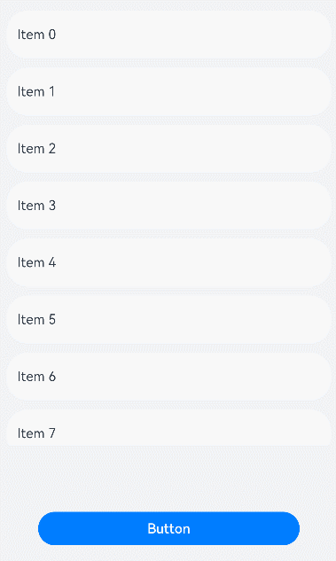

# 自定义事件分发

ArkUI在处理触屏事件时，会在触屏事件触发前进行按压点和组件区域的触摸测试，来收集需要响应触屏事件的组件，再基于触摸测试结果分发相应的触屏事件。在父节点，开发者可以通过onChildTouchTest决定如何让子节点去做触摸测试，影响子组件的触摸测试，最终影响后续的触屏事件分发，具体影响参考[TouchTestStrategy](#touchteststrategy枚举说明)枚举说明。

>  **说明：**
>
>  - 从API Version 11开始支持。后续版本如有新增内容，则采用上角标单独标记该内容的起始版本。
>
>  - onClick以及旋转、捏合手势经过自定义事件分发之后可能会因为触摸热区没有命中导致事件不响应。

## onChildTouchTest

onChildTouchTest(event: (value: Array&lt;TouchTestInfo&gt;) => TouchResult): T

当前组件可通过设置回调来自定义子节点如何去做触摸测试。

**原子化服务API：** 从API version 12开始，该接口支持在原子化服务中使用。

**系统能力：** SystemCapability.ArkUI.ArkUI.Full

**参数：** 

| 参数名 | 类型                                       | 必填 | 说明                   |
| ------ | ------------------------------------------ | ---- | ---------------------- |
| value  | Array<[TouchTestInfo>](#touchtestinfo) | 是   | 包含子节点信息的数组。 |

**返回值：** 

| 类型 | 说明 |
| -------- | -------- |
| T | 返回当前组件。 |

>**说明：**
>
>子节点信息数组中只包含命名节点的信息，即开发者通过id属性设置了id的节点。

## TouchTestInfo

当前按压点所在组件的坐标系、id和尺寸相关信息。

**原子化服务API：** 从API version 12开始，该接口支持在原子化服务中使用。

**系统能力：** SystemCapability.ArkUI.ArkUI.Full

| 名称          | 类型   | 描述                                       |
| ------------- | ------ | ---------------------------------------- |
| windowX | number | 按压点相对于窗口左上角的x轴坐标。 |
| windowY   | number |按压点相对于窗口左上角的y轴坐标。|
| parentX   | number |按压点相对于父组件左上角的x轴坐标。  |
| parentY   | number |按压点相对于父组件左上角的y轴坐标。  |
| x   | number | 按压点相对于子组件左上角的x轴坐标。 |
| y   | number | 按压点相对于子组件左上角的y轴坐标。 |
| rect   | [RectResult](ts-types.md#rectresult10) |子组件的大小。  |
| [id](ts-universal-attributes-component-id.md)   | string | 通过id属性设置的组件id。 |

## TouchResult

自定义事件分发结果，开发者通过返回结果来影响事件分发。

**原子化服务API：** 从API version 12开始，该接口支持在原子化服务中使用。

**系统能力：** SystemCapability.ArkUI.ArkUI.Full

| 名称      | 类型                                     | 必填   | 描述                                |
| --------- | --------- | ---- |--------------------------------------- |
| strategy  | [TouchTestStrategy](#touchteststrategy枚举说明) | 是    | 事件派发策略。                     |
| id  | string | 否    | 通过id属性设置的组件id。<br>当strategy为TouchTestStrategy.DEFAULT时，id是可选的；当strategy是TouchTestStrategy.FORWARD_COMPETITION或TouchTestStrategy.FORWARD时，id是必需的（如果没有返回id，则当成TouchTestStrategy.DEFAULT处理）。 |

## TouchTestStrategy枚举说明

事件派发策略。

**卡片能力：** 从API version 11开始，该接口支持在ArkTS卡片中使用。

**原子化服务API：** 从API version 12开始，该接口支持在原子化服务中使用。

**系统能力：** SystemCapability.ArkUI.ArkUI.Full

| 名称          | 描述                                       |
| ------------| ----------------------------------------- |
| DEFAULT     | 自定义分发不产生影响，系统按当前节点命中状态分发事件。 |
| FORWARD_COMPETITION       | 应用指定分发事件到某个子节点，其他兄弟节点是否分发事件交由系统决定。 |
| FORWARD | 应用指定分发事件到某个子节点，系统不再处理分发事件到其他兄弟节点。 |

## 示例

### 示例1（设置事件派发策略为FORWARD_COMPETITION）

该示例点击List下方空白区域后拖动，能够拖动List滑动。点击Button按钮，Button会响应onClick事件。

```ts
// xxx.ets
import { promptAction } from '@kit.ArkUI';

@Entry
@Component
struct ListExample {
  private arr: number[] = [0, 1, 2, 3, 4, 5, 6, 7, 8, 9, 10, 11, 12]
  @State text: string = 'Button'

  build() {
    Column() {
      List({ space: 12, initialIndex: 0 }) {
        ForEach(this.arr, (item: number) => {
          ListItem() {
            Text('Item ' + item)
              .width('100%')
              .height(56)
              .fontSize(16)
              .textAlign(TextAlign.Start)
          }.borderRadius(24)
          .backgroundColor(Color.White)
          .padding({ left: 12, right: 12 })
        }, (item: string) => item)
      }
      .listDirection(Axis.Vertical)
      .scrollBar(BarState.Off)
      .edgeEffect(EdgeEffect.Spring)
      .onScrollIndex((start: number, end: number) => {
        console.info('first' + start)
        console.info('last' + end)
      })
      .onDidScroll((scrollOffset: number, scrollState: ScrollState) => {
        console.info(`onScroll scrollState = ScrollState` + scrollState + `, scrollOffset = ` + scrollOffset)
      })
      .width('100%')
      .height('65%')
      .id('MyList')

      Button(this.text)
        .width(312)
        .height(40)
        .id('Mybutton')
        .fontSize(16)
        .fontWeight(FontWeight.Medium)
        .margin({ top: 80 })
        .onClick(() => {
          this.text = 'click the button'
          promptAction.showToast({ message: 'you click the button.', duration: 3000 })
        })
    }
    .width('100%')
    .height('100%')
    .backgroundColor(0xF1F3F5)
    .justifyContent(FlexAlign.End)
    .padding({ left: 12, right: 12, bottom: 24 })
    .onChildTouchTest((touchinfo) => {
      for (let info of touchinfo) {
        if (info.id == 'MyList') {
          return { id: info.id, strategy: TouchTestStrategy.FORWARD_COMPETITION }
        }
      }
      return { strategy: TouchTestStrategy.DEFAULT }
    })
  }
}
```



### 示例2（设置事件派发策略为FORWARD）

点击List下方空白区域后拖动，能够拖动List滑动。点击Button按钮，Button不会响应onClick事件。

```ts
// xxx.ets
import { promptAction } from '@kit.ArkUI';

@Entry
@Component
struct ListExample {
  private arr: number[] = [0, 1, 2, 3, 4, 5, 6, 7, 8, 9, 10, 11, 12]
  @State text: string = 'Button'

  build() {
    Column() {
      List({ space: 12, initialIndex: 0 }) {
        ForEach(this.arr, (item: number) => {
          ListItem() {
            Text('Item ' + item)
              .width('100%')
              .height(56)
              .fontSize(16)
              .textAlign(TextAlign.Start)
          }.borderRadius(24)
          .backgroundColor(Color.White)
          .padding({ left: 12, right: 12 })
        }, (item: string) => item)
      }
      .listDirection(Axis.Vertical)
      .scrollBar(BarState.Off)
      .edgeEffect(EdgeEffect.Spring)
      .onScrollIndex((start: number, end: number) => {
        console.info('first' + start)
        console.info('last' + end)
      })
      .onDidScroll((scrollOffset: number, scrollState: ScrollState) => {
        console.info(`onScroll scrollState = ScrollState` + scrollState + `, scrollOffset = ` + scrollOffset)
      })
      .width('100%')
      .height('65%')
      .id('MyList')

      Button(this.text)
        .width(312)
        .height(40)
        .id('Mybutton')
        .fontSize(16)
        .fontWeight(FontWeight.Medium)
        .margin({ top: 80 })
        .onClick(() => {
          this.text = 'click the button'
          promptAction.showToast({ message: 'you click the button.', duration: 3000 })
        })
    }
    .width('100%')
    .height('100%')
    .backgroundColor(0xF1F3F5)
    .justifyContent(FlexAlign.End)
    .padding({ left: 12, right: 12, bottom: 24 })
    .onChildTouchTest((touchinfo) => {
      for (let info of touchinfo) {
        if (info.id == 'MyList') {
          return { id: info.id, strategy: TouchTestStrategy.FORWARD }
        }
      }
      return { strategy: TouchTestStrategy.DEFAULT }
    })
  }
}
```


### 示例3（设置事件派发策略为DEFAULT）

点击List下方空白区域后拖动，List不会滑动。点击Button按钮，Button会响应onClick事件。

```ts
// xxx.ets
import { promptAction } from '@kit.ArkUI';

@Entry
@Component
struct ListExample {
  private arr: number[] = [0, 1, 2, 3, 4, 5, 6, 7, 8, 9, 10, 11, 12]
  @State text: string = 'Button'

  build() {
    Column() {
      List({ space: 12, initialIndex: 0 }) {
        ForEach(this.arr, (item: number) => {
          ListItem() {
            Text('Item ' + item)
              .width('100%')
              .height(56)
              .fontSize(16)
              .textAlign(TextAlign.Start)
          }.borderRadius(24)
          .backgroundColor(Color.White)
          .padding({ left: 12, right: 12 })
        }, (item: string) => item)
      }
      .listDirection(Axis.Vertical)
      .scrollBar(BarState.Off)
      .edgeEffect(EdgeEffect.Spring)
      .onScrollIndex((start: number, end: number) => {
        console.info('first' + start)
        console.info('last' + end)
      })
      .onDidScroll((scrollOffset: number, scrollState: ScrollState) => {
        console.info(`onScroll scrollState = ScrollState` + scrollState + `, scrollOffset = ` + scrollOffset)
      })
      .width('100%')
      .height('65%')
      .id('MyList')

      Button(this.text)
        .width(312)
        .height(40)
        .id('Mybutton')
        .fontSize(16)
        .fontWeight(FontWeight.Medium)
        .margin({ top: 80 })
        .onClick(() => {
          this.text = 'click the button'
          promptAction.showToast({ message: 'you click the button.', duration: 3000 })
        })
    }
    .width('100%')
    .height('100%')
    .backgroundColor(0xF1F3F5)
    .justifyContent(FlexAlign.End)
    .padding({ left: 12, right: 12, bottom: 24 })
    .onChildTouchTest((touchinfo) => {
      return { strategy: TouchTestStrategy.DEFAULT }
    })
  }
}
```

