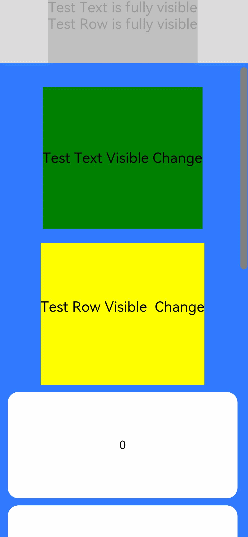

# 组件可见区域变化事件

组件可见区域变化事件是组件在屏幕中的显示区域面积变化时触发的事件，提供了判断组件是否完全或部分显示在屏幕中的能力，适用于广告曝光埋点之类的场景。

> **说明：**
>
>  从API Version 9开始支持。后续版本如有新增内容，则采用上角标单独标记该内容的起始版本。

## onVisibleAreaChange

onVisibleAreaChange(ratios: Array&lt;number&gt;, event: (isVisible: boolean, currentRatio: number) => void): T

组件可见区域变化时触发该回调。

**系统能力：** SystemCapability.ArkUI.ArkUI.Full

**参数：** 

| 参数名 | 类型                                                | 必填 | 说明                                                         |
| ------ | --------------------------------------------------- | ---- | ------------------------------------------------------------ |
| ratios | Array&lt;number&gt;                                 | 是   | 阈值数组。其中，每个阈值代表组件可见面积（即组件在屏幕显示区的面积，只计算父组件内的面积，超出父组件部分不会计算）与组件自身面积的比值。当组件可见面积与自身面积的比值接近阈值时，均会触发该回调。每个阈值的取值范围为[0.0, 1.0]，如果开发者设置的阈值超出该范围，则会实际取值0.0或1.0。<br/>**说明：** <br/>当数值接近边界0和1时，将会按照误差不超过0.001的规则进行舍入。例如，0.9997会被近似为1。 |
| event  | (isVisible: boolean, currentRatio: number) => void) | 是   | -isVisible：表示组件的可见面积与自身面积的比值与上一次变化相比的情况，比值变大为true，比值变小为false。<br/>-currentRatio：触发回调时，组件可见面积与自身面积的比值。 |

**返回值：**

| 类型 | 说明 |
| -------- | -------- |
| T | 返回当前组件。 |

> **说明：**
>
> 该接口只适用于组件布局区域超出或离开了当前屏幕显示区域的情况，不支持组件堆叠（[Stack](ts-container-stack.md)、[Z序控制](ts-universal-attributes-z-order.md)）导致的面积不可见、使用offset或translate等图形变换接口导致的面积超出情况。子组件超出父组件的区域，该区域视为不可见区域。


## 示例

```ts
// xxx.ets
@Entry
@Component
struct ScrollExample {
  scroller: Scroller = new Scroller()
  private arr: number[] = [0, 1, 2, 3, 4, 5, 6, 7, 8, 9]
  @State testTextStr: string = 'test'
  @State testRowStr: string = 'test'

  build() {
    Column() {
      Column() {
        Text(this.testTextStr)
          .fontSize(20)

        Text(this.testRowStr)
          .fontSize(20)
      }
      .height(100)
      .backgroundColor(Color.Gray)
      .opacity(0.3)

      Scroll(this.scroller) {
        Column() {
          Text("Test Text Visible Change")
            .fontSize(20)
            .height(200)
            .margin({ top: 50, bottom: 20 })
            .backgroundColor(Color.Green)
              // 通过设置ratios为[0.0, 1.0]，实现当组件完全显示或完全消失在屏幕中时触发回调
            .onVisibleAreaChange([0.0, 1.0], (isVisible: boolean, currentRatio: number) => {
              console.info('Test Text isVisible: ' + isVisible + ', currentRatio:' + currentRatio)
              if (isVisible && currentRatio >= 1.0) {
                console.info('Test Text is fully visible. currentRatio:' + currentRatio)
                this.testTextStr = 'Test Text is fully visible'
              }

              if (!isVisible && currentRatio <= 0.0) {
                console.info('Test Text is completely invisible.')
                this.testTextStr = 'Test Text is completely invisible'
              }
            })

          Row() {
            Text('Test Row Visible  Change')
              .fontSize(20)
              .margin({ bottom: 20 })

          }
          .height(200)
          .backgroundColor(Color.Yellow)
          .onVisibleAreaChange([0.0, 1.0], (isVisible: boolean, currentRatio: number) => {
            console.info('Test Row isVisible:' + isVisible + ', currentRatio:' + currentRatio)
            if (isVisible && currentRatio >= 1.0) {
              console.info('Test Row is fully visible.')
              this.testRowStr = 'Test Row is fully visible'
            }

            if (!isVisible && currentRatio <= 0.0) {
              console.info('Test Row is completely invisible.')
              this.testRowStr = 'Test Row is completely invisible'
            }
          })

          ForEach(this.arr, (item:number) => {
            Text(item.toString())
              .width('90%')
              .height(150)
              .backgroundColor(0xFFFFFF)
              .borderRadius(15)
              .fontSize(16)
              .textAlign(TextAlign.Center)
              .margin({ top: 10 })
          }, (item:number) => (item.toString()))

        }.width('100%')
      }
      .backgroundColor(0x317aff)
      .scrollable(ScrollDirection.Vertical)
      .scrollBar(BarState.On)
      .scrollBarColor(Color.Gray)
      .scrollBarWidth(10)
      .onScroll((xOffset: number, yOffset: number) => {
        console.info(xOffset + ' ' + yOffset)
      })
      .onScrollEdge((side: Edge) => {
        console.info('To the edge')
      })
      .onScrollStop(() => {
        console.info('Scroll Stop')
      })

    }.width('100%').height('100%').backgroundColor(0xDCDCDC)
  }
}
```


