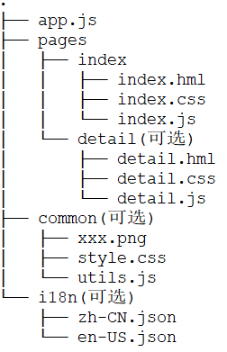

# 文件组织

## 目录结构

JS FA应用的JS模块(entry/src/main/js/module)的典型开发目录结构如下：

  **图1** 目录结构  

目录结构中文件分类如下：

- .hml结尾的HML模板文件，这个文件用来描述当前页面的文件布局结构。

- .css结尾的CSS样式文件，这个文件用于描述页面样式。

- .js结尾的JS文件，这个文件用于处理页面和用户的交互。

各个文件夹的作用：

- app.js文件用于全局JavaScript逻辑和应用生命周期管理。
- pages目录用于存放所有组件页面。
- common目录用于存放公共资源文件，比如：媒体资源和JS文件。
- i18n目录用于配置不同语言场景资源内容，比如应用文本词条，图片路径等资源。

>  **说明：**
>
>  - i18n是开发保留文件夹，不可重命名。
>
>
>  - 在使用DevEco Studio进行应用开发时，目录结构中的可选文件夹需要开发者根据实际情况自行创建。

## 文件访问规则

应用资源可通过绝对路径或相对路径的方式进行访问，本开发框架中绝对路径以"/"开头，相对路径以"./"或"../"。具体访问规则如下：

- 引用代码文件，需使用相对路径，比如：../common/utils.js。

- 引用资源文件，推荐使用绝对路径。比如：/common/xxx.png。

- 公共代码文件和资源文件推荐放在common下，通过以上两条规则进行访问。

- CSS样式文件中通过url()函数创建&lt;url&gt;数据类型，如：url(/common/xxx.png)。

>  **说明：**
>
>  当代码文件A需要引用代码文件B时：
>
>  - 如果代码文件A和文件B位于同一目录，则代码文件B引用资源文件时可使用相对路径，也可使用绝对路径。
>
>  - 如果代码文件A和文件B位于不同目录，则代码文件B引用资源文件时必须使用绝对路径。因为Webpack打包时，代码文件B的目录会发生变化。
>
>

## 媒体文件格式

  **表1** 支持的图片格式

| 格式   | 支持版本                     | 支持的文件类型 |
| ---- | ------------------------ | ------- |
| BMP  | API&nbsp;Version&nbsp;4+ | .bmp    |
| JPEG | API&nbsp;Version&nbsp;4+ | .jpg    |
| PNG  | API&nbsp;Version&nbsp;4+ | .png    |

## 存储目录定义

从API Version 5开始，[image](js-components-basic-image.md)组件支持应用私有目录内的图片资源访问。

| 目录类型   | 路径前缀            | 访问可见性  | 说明                          |
| ------ | --------------- | ------ | --------------------------- |
| 应用私有目录 | internal://app/ | 仅本应用可见 | 目录随应用卸载删除，路径禁止使用../等方式访问父目录 |