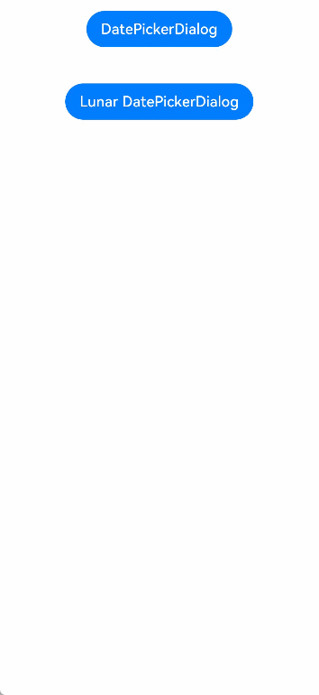

# 日期滑动选择器弹窗

根据指定的日期范围创建日期滑动选择器，展示在弹窗上。

>  **说明：**
>
> 该组件从API Version 8开始支持。后续版本如有新增内容，则采用上角标单独标记该内容的起始版本。


## DatePickerDialog.show

show(options?: DatePickerDialogOptions)

定义日期滑动选择器弹窗并弹出。

**DatePickerDialogOptions参数：**

| 参数名 | 参数类型 | 必填 | 默认值 | 参数描述 |
| -------- | -------- | -------- | -------- | -------- |
| start | Date | 否 | Date('1970-1-1') | 设置选择器的起始日期。 |
| end | Date | 否 | Date('2100-12-31') | 设置选择器的结束日期。 |
| selected | Date | 否 | 当前系统日期 | 设置当前选中的日期。 |
| lunar | boolean | 否 | false | 日期是否显示为农历。 |确定
| onAccept | (value: [DatePickerResult](ts-basic-components-datepicker.md#DatePickerResult对象说明)) => void | 否 | - | 点击弹窗中的“确定”按钮时触发该回调。 |
| onCancel | () => void | 否 | - | 点击弹窗中的“取消”按钮时触发该回调。 |
| onChange | (value: [DatePickerResult](ts-basic-components-datepicker.md#DatePickerResult对象说明)) => void | 否 | - | 滑动弹窗中的滑动选择器使当前选中项改变时触发该回调。 |

## 示例

```ts
// xxx.ets
@Entry
@Component
struct DatePickerDialogExample {
  selectedDate: Date = new Date("2010-1-1")

  build() {
    Column() {
      Button("DatePickerDialog")
        .margin(20)
        .onClick(() => {
          DatePickerDialog.show({
            start: new Date("2000-1-1"),
            end: new Date("2100-12-31"),
            selected: this.selectedDate,
            onAccept: (value: DatePickerResult) => {
              // 通过Date的setFullYear方法设置按下确定按钮时的日期，这样当弹窗再次弹出时显示选中的是上一次确定的日期
              this.selectedDate.setFullYear(value.year, value.month, value.day)
              console.info("DatePickerDialog:onAccept()" + JSON.stringify(value))
            },
            onCancel: () => {
              console.info("DatePickerDialog:onCancel()")
            },
            onChange: (value: DatePickerResult) => {
              console.info("DatePickerDialog:onChange()" + JSON.stringify(value))
            }
          })
        })

      Button("Lunar DatePickerDialog")
        .margin(20)
        .onClick(() => {
          DatePickerDialog.show({
            start: new Date("2000-1-1"),
            end: new Date("2100-12-31"),
            selected: this.selectedDate,
            lunar: true,
            onAccept: (value: DatePickerResult) => {
              this.selectedDate.setFullYear(value.year, value.month, value.day)
              console.info("DatePickerDialog:onAccept()" + JSON.stringify(value))
            },
            onCancel: () => {
              console.info("DatePickerDialog:onCancel()")
            },
            onChange: (value: DatePickerResult) => {
              console.info("DatePickerDialog:onChange()" + JSON.stringify(value))
            }
          })
        })
    }.width('100%')
  }
}
```

