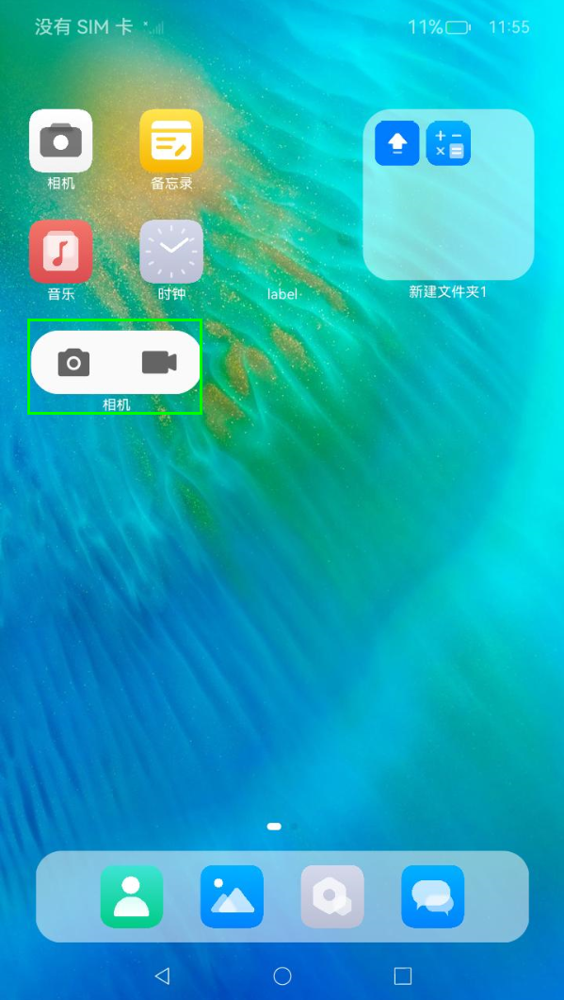

# 向用户申请单次授权

基于授权最小化的原则，防止应用获取和滥用用户数据，针对部分应用敏感权限，在弹窗向用户申请授权时，新增“允许本次使用”的授权选项。

开发者在开发应用时，无需额外配置，仍然调用requestPermissionsFromUser()[向用户申请授权](request-user-authorization.md)，系统会根据该能力[支持的权限](#支持范围)，弹出对应的弹窗。

授权弹窗如下图所示：

设置中的选项如下图所示：

路径：设置 > 隐私 > 权限管理 > 应用 > 目标应用 > 位置信息

## 支持范围

当前仅支持下列权限，当应用向用户申请下列权限时，弹窗将会出现“允许本次使用”的授权选项，设置中修改权限将会出现“每次询问”授权选项。

- 剪切板：<!--RP1-->["ohos.permission.READ_PASTEBOARD"](permissions-for-system-apps.md#ohospermissionread_pasteboard)<!--RP1End-->
- 模糊位置：["ohos.permission.APPROXIMATELY_LOCATION"](permissions-for-all.md#ohospermissionapproximately_location)
- 位置：["ohos.permission.LOCATION"](permissions-for-all.md#ohospermissionlocation)
- 后台位置：["ohos.permission.LOCATION_IN_BACKGROUND"](permissions-for-all.md#ohospermissionlocation_in_background)

## 使用限制

- 当用户点击了“允许本次使用”按钮，将会对应用授予临时的权限。

  - 当应用切换至前台、应用展开卡片且处于当前屏幕可见即[卡片可见](../../form/arkts-ui-widget-lifecycle.md)或者[设置后台长时任务](../../task-management/continuous-task.md#长时任务)的时候(当前仅支持定位导航长时任务)，应用的临时权限会一直保持。

     其他情况下启动计时器，十秒之后，取消临时权限，想要再次获取，需要重新授予。

  - 当应用切了后台，开始十秒计时，如果在计时期间，应用处于卡片可见下或者设置了后台长时任务，计时停止。
  
      直到卡片不可见或者长时任务结束，再次开启十秒计时，计时结束之后，取消临时授权。

      如下图样例所示，相机应用处于卡片可见状态：

      

- 当用户在权限设置中选择了“每次询问”按钮，将会对应用授予模糊位置与位置临时权限，取消临时授权同上。