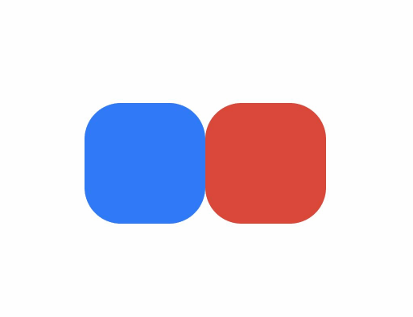

# 实现属性动画


通过可动画属性改变引起UI上产生的连续视觉效果，即为属性动画。属性动画是最基础易懂的动画，ArkUI提供两种属性动画接口[animateTo](../reference/apis-arkui/arkui-ts/ts-explicit-animation.md)和[animation](../reference/apis-arkui/arkui-ts/ts-animatorproperty.md)驱动组件属性按照动画曲线等动画参数进行连续的变化，产生属性动画。


| 属性动画接口 | 作用域 | 原理 | 使用场景 |
| -------- | -------- | -------- | -------- |
| animateTo | 闭包内改变属性引起的界面变化。<br/>作用于出现消失转场。 | 通用函数，对闭包前界面和闭包中的状态变量引起的界面之间的差异做动画。<br/>支持多次调用，支持嵌套。 | 适用对多个可动画属性配置相同动画参数的动画。<br/>需要嵌套使用动画的场景。 |
| animation | 组件通过属性接口绑定的属性变化引起的界面变化。 | 识别组件的可动画属性变化，自动添加动画。<br/>组件的接口调用是从下往上执行，animation只会作用于在其之上的属性调用。<br/>组件可以根据调用顺序对多个属性设置不同的animation。 | 适用于对多个可动画属性配置不同参数动画的场景。 |

## 使用animateTo产生属性动画


```
animateTo(value: AnimateParam, event: () => void): void
```

[animateTo](../reference/apis-arkui/arkui-ts/ts-explicit-animation.md)接口参数中，value指定[AnimateParam对象](../reference/apis-arkui/arkui-ts/ts-explicit-animation.md#animateparam对象说明)（包括时长、[Curve](../reference/apis-arkui/js-apis-curve.md#curve)等）event为动画的闭包函数，闭包内变量改变产生的属性动画将遵循相同的动画参数。

> **说明：**
> 
> 直接使用animateTo可能导致实例不明确的问题，建议使用[getUIContext](../reference/apis-arkui/js-apis-window.md#getuicontext10)获取[UIContext](../reference/apis-arkui/js-apis-arkui-UIContext.md#uicontext)实例，并使用[animateTo](../reference/apis-arkui/js-apis-arkui-UIContext.md#animateto)调用绑定实例的animateTo。

```ts
import { curves } from '@kit.ArkUI';

@Entry
@Component
struct AnimateToDemo {
  @State animate: boolean = false;
  // 第一步: 声明相关状态变量
  @State rotateValue: number = 0; // 组件一旋转角度
  @State translateX: number = 0; // 组件二偏移量
  @State opacityValue: number = 1; // 组件二透明度

  // 第二步：将状态变量设置到相关可动画属性接口
  build() {
    Row() {
      // 组件一
      Column() {
      }
      .rotate({ angle: this.rotateValue })
      .backgroundColor('#317AF7')
      .justifyContent(FlexAlign.Center)
      .width(100)
      .height(100)
      .borderRadius(30)
      .onClick(() => {
        this.getUIContext()?.animateTo({ curve: curves.springMotion() }, () => {
          this.animate = !this.animate;
          // 第三步：闭包内通过状态变量改变UI界面
          // 这里可以写任何能改变UI的逻辑比如数组添加，显隐控制，系统会检测改变后的UI界面与之前的UI界面的差异，对有差异的部分添加动画
          // 组件一的rotate属性发生变化，所以会给组件一添加rotate旋转动画
          this.rotateValue = this.animate ? 90 : 0;
          // 组件二的透明度发生变化，所以会给组件二添加透明度的动画
          this.opacityValue = this.animate ? 0.6 : 1;
          // 组件二的translate属性发生变化，所以会给组件二添加translate偏移动画
          this.translateX = this.animate ? 50 : 0;
        })
      })

      // 组件二
      Column() {

      }
      .justifyContent(FlexAlign.Center)
      .width(100)
      .height(100)
      .backgroundColor('#D94838')
      .borderRadius(30)
      .opacity(this.opacityValue)
      .translate({ x: this.translateX })
    }
    .width('100%')
    .height('100%')
    .justifyContent(FlexAlign.Center)
  }
}
```




## 使用animation产生属性动画

相比于animateTo接口需要把要执行动画的属性的修改放在闭包中，[animation](../reference/apis-arkui/arkui-ts/ts-animatorproperty.md)接口无需使用闭包，把animation接口加在要做属性动画的可动画属性后即可。animation只要检测到其绑定的可动画属性发生变化，就会自动添加属性动画，animateTo则必须在动画闭包内改变可动画属性的值从而生成动画。


```ts
import { curves } from '@kit.ArkUI';

@Entry
@Component
struct AnimationDemo {
  @State animate: boolean = false;
  // 第一步: 声明相关状态变量
  @State rotateValue: number = 0; // 组件一旋转角度
  @State translateX: number = 0; // 组件二偏移量
  @State opacityValue: number = 1; // 组件二透明度

  // 第二步：将状态变量设置到相关可动画属性接口
  build() {
    Row() {
      // 组件一
      Column() {
      }
      .opacity(this.opacityValue)
      .rotate({ angle: this.rotateValue })
      // 第三步：通过属性动画接口开启属性动画
      .animation({ curve: curves.springMotion() })
      .backgroundColor('#317AF7')
      .justifyContent(FlexAlign.Center)
      .width(100)
      .height(100)
      .borderRadius(30)
      .onClick(() => {
        this.animate = !this.animate;
        // 第四步：闭包内通过状态变量改变UI界面
        // 这里可以写任何能改变UI的逻辑比如数组添加，显隐控制，系统会检测改变后的UI界面与之前的UI界面的差异，对有差异的部分添加动画
        // 组件一的rotate属性发生变化，所以会给组件一添加rotate旋转动画
        this.rotateValue = this.animate ? 90 : 0;
        // 组件二的translate属性发生变化，所以会给组件二添加translate偏移动画
        this.translateX = this.animate ? 50 : 0;
        // 父组件column的opacity属性有变化，会导致其子节点的透明度也变化，所以这里会给column和其子节点的透明度属性都加动画
        this.opacityValue = this.animate ? 0.6 : 1;
      })

      // 组件二
      Column() {
      }
      .justifyContent(FlexAlign.Center)
      .width(100)
      .height(100)
      .backgroundColor('#D94838')
      .borderRadius(30)
      .opacity(this.opacityValue)
      .translate({ x: this.translateX })
      .animation({ curve: curves.springMotion() })
    }
    .width('100%')
    .height('100%')
    .justifyContent(FlexAlign.Center)
  }
}
```


> **说明：**
> - 在对组件的位置大小的变化做动画的时候，由于布局属性的改变会触发测量布局，性能开销大。[scale](../reference/apis-arkui/arkui-ts/ts-universal-attributes-transformation.md#scale)属性的改变不会触发测量布局，性能开销小。因此，在组件位置大小持续发生变化的场景，如跟手触发组件大小变化的场景，推荐适用scale。
> 
> - 属性动画应该作用于始终存在的组件，对于将要出现或者将要消失的组件的动画应该使用[转场动画](arkts-transition-overview.md)。
> 
> - 尽量不要使用动画结束回调。属性动画是对已经发生的状态进行的动画，不需要开发者去处理结束的逻辑。如果要使用结束回调，一定要正确处理连续操作的数据管理。
