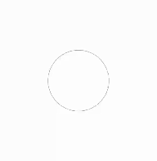

# 组件动画


ArkUI为组件提供了通用的属性动画和转场动画能力的同时，还为一些组件提供了默认的动画效果。例如，[List](../reference/apis-arkui/arkui-ts/ts-container-list.md)的滑动动效、[Button](../reference/apis-arkui/arkui-ts/ts-basic-components-button.md#button)的点击动效，是组件自带的默认动画效果。在组件默认动画效果的基础上，开发者还可以通过属性动画和转场动画对容器组件内的子组件动效进行定制。


## 使用组件默认动画

组件默认动效具备以下功能：

- 提示用户当前状态，例如用户点击Button组件时，Button组件默认变灰，用户即确定完成选中操作。

- 提升界面精致程度和生动性。

- 减少开发者工作量，例如列表滑动组件自带滑动动效，开发者直接调用即可。

更多效果，可以参考[组件说明](../reference/apis-arkui/arkui-ts/ts-container-flex.md)。

示例代码和效果如下。


```ts
@Entry
@Component
struct ComponentDemo {
  build() {
    Row() {
      Checkbox({ name: 'checkbox1', group: 'checkboxGroup' })
        .select(true)
        .shape(CheckBoxShape.CIRCLE)
        .size({ width: 50, height: 50 })
    }
    .width('100%')
    .height('100%')
    .justifyContent(FlexAlign.Center)
  }
}
```




## 打造组件定制化动效

部分组件支持通过[属性动画](arkts-attribute-animation-overview.md)和[转场动画](arkts-transition-overview.md)自定义组件子Item的动效，实现定制化动画效果。例如，[Scroll](../reference/apis-arkui/arkui-ts/ts-container-scroll.md)组件中可对各个子组件在滑动时的动画效果进行定制。

- 在滑动或者点击操作时通过改变各个Scroll子组件的仿射属性来实现各种效果。

- 如果要在滑动过程中定制动效，可在滑动回调onScroll中监控滑动距离，并计算每个组件的仿射属性。也可以自己定义手势，通过手势监控位置，手动调用ScrollTo改变滑动位置。

- 在滑动回调onScrollStop或手势结束回调中对滑动的最终位置进行微调。

定制Scroll组件滑动动效示例代码和效果如下。


```ts
import { curves, window, display, mediaquery } from '@kit.ArkUI';
import { UIAbility } from '@kit.AbilityKit';

export default class GlobalContext extends AppStorage{
  static mainWin: window.Window|undefined = undefined;
  static mainWindowSize:window.Size|undefined = undefined;
}
/**
 * 窗口、屏幕相关信息管理类
 */
export class WindowManager {
  private static instance: WindowManager|null = null;
  private displayInfo: display.Display|null = null;
  private orientationListener = mediaquery.matchMediaSync('(orientation: landscape)');

  constructor() {
    this.orientationListener.on('change', (mediaQueryResult: mediaquery.MediaQueryResult) => { this.onPortrait(mediaQueryResult) })
    this.loadDisplayInfo()
  }

  /**
   * 设置主window窗口
   * @param win 当前app窗口
   */
  setMainWin(win: window.Window) {
    if (win == null) {
      return
    }
    GlobalContext.mainWin = win;
    win.on("windowSizeChange", (data: window.Size) => {
      if (GlobalContext.mainWindowSize == undefined || GlobalContext.mainWindowSize == null) {
        GlobalContext.mainWindowSize = data;
      } else {
        if (GlobalContext.mainWindowSize.width == data.width && GlobalContext.mainWindowSize.height == data.height) {
          return
        }
        GlobalContext.mainWindowSize = data;
      }

      let winWidth = this.getMainWindowWidth();
      AppStorage.setOrCreate<number>('mainWinWidth', winWidth)
      let winHeight = this.getMainWindowHeight();
      AppStorage.setOrCreate<number>('mainWinHeight', winHeight)
      let context:UIAbility = new UIAbility()
      context.context.eventHub.emit("windowSizeChange", winWidth, winHeight)
    })
  }

  static getInstance(): WindowManager {
    if (WindowManager.instance == null) {
      WindowManager.instance = new WindowManager();
    }
    return WindowManager.instance
  }

  private onPortrait(mediaQueryResult: mediaquery.MediaQueryResult) {
    if (mediaQueryResult.matches == AppStorage.get<boolean>('isLandscape')) {
      return
    }
    AppStorage.setOrCreate<boolean>('isLandscape', mediaQueryResult.matches)
    this.loadDisplayInfo()
  }

  /**
   * 切换屏幕方向
   * @param ori 常量枚举值：window.Orientation
   */
  changeOrientation(ori: window.Orientation) {
    if (GlobalContext.mainWin != null) {
      GlobalContext.mainWin.setPreferredOrientation(ori)
    }
  }

  private loadDisplayInfo() {
    this.displayInfo = display.getDefaultDisplaySync()
    AppStorage.setOrCreate<number>('displayWidth', this.getDisplayWidth())
    AppStorage.setOrCreate<number>('displayHeight', this.getDisplayHeight())
  }

  /**
   * 获取main窗口宽度，单位vp
   */
  getMainWindowWidth(): number {
    return GlobalContext.mainWindowSize != null ? px2vp(GlobalContext.mainWindowSize.width) : 0
  }

  /**
   * 获取main窗口高度，单位vp
   */
  getMainWindowHeight(): number {
    return GlobalContext.mainWindowSize != null ? px2vp(GlobalContext.mainWindowSize.height) : 0
  }

  /**
   * 获取屏幕宽度，单位vp
   */
  getDisplayWidth(): number {
    return this.displayInfo != null ? px2vp(this.displayInfo.width) : 0
  }

  /**
   * 获取屏幕高度，单位vp
   */
  getDisplayHeight(): number {
    return this.displayInfo != null ? px2vp(this.displayInfo.height) : 0
  }

  /**
   * 释放资源
   */
  release() {
    if (this.orientationListener) {
      this.orientationListener.off('change', (mediaQueryResult: mediaquery.MediaQueryResult) => { this.onPortrait(mediaQueryResult)})
    }
    if (GlobalContext.mainWin != null) {
      GlobalContext.mainWin.off('windowSizeChange')
    }
    WindowManager.instance = null;
  }
}

/**
 * 封装任务卡片信息数据类
 */
export class TaskData {
  bgColor: Color | string | Resource = Color.White;
  index: number = 0;
  taskInfo: string = 'music';

  constructor(bgColor: Color | string | Resource, index: number, taskInfo: string) {
    this.bgColor = bgColor;
    this.index = index;
    this.taskInfo = taskInfo;
  }
}

export const taskDataArr: Array<TaskData> =
  [
    new TaskData('#317AF7', 0, 'music'),
    new TaskData('#D94838', 1, 'mall'),
    new TaskData('#DB6B42 ', 2, 'photos'),
    new TaskData('#5BA854', 3, 'setting'),
    new TaskData('#317AF7', 4, 'call'),
    new TaskData('#D94838', 5, 'music'),
    new TaskData('#DB6B42', 6, 'mall'),
    new TaskData('#5BA854', 7, 'photos'),
    new TaskData('#D94838', 8, 'setting'),
    new TaskData('#DB6B42', 9, 'call'),
    new TaskData('#5BA854', 10, 'music')

  ];

@Entry
@Component
export struct TaskSwitchMainPage {
  displayWidth: number = WindowManager.getInstance().getDisplayWidth();
  scroller: Scroller = new Scroller();
  cardSpace: number = 0; // 卡片间距
  cardWidth: number = this.displayWidth / 2 - this.cardSpace / 2; // 卡片宽度
  cardHeight: number = 400; // 卡片高度
  cardPosition: Array<number> = []; // 卡片初始位置
  clickIndex: boolean = false;
  @State taskViewOffsetX: number = 0;
  @State cardOffset: number = this.displayWidth / 4;
  lastCardOffset: number = this.cardOffset;
  startTime: number|undefined=undefined

  // 每个卡片初始位置
  aboutToAppear() {
    for (let i = 0; i < taskDataArr.length; i++) {
      this.cardPosition[i] = i * (this.cardWidth + this.cardSpace);
    }
  }

  // 每个卡片位置
  getProgress(index: number): number {
    let progress = (this.cardOffset + this.cardPosition[index] - this.taskViewOffsetX + this.cardWidth / 2) / this.displayWidth;
    return progress
  }

  build() {
    Stack({ alignContent: Alignment.Bottom }) {
      // 背景
      Column()
        .width('100%')
        .height('100%')
        .backgroundColor(0xF0F0F0)

      // 滑动组件
      Scroll(this.scroller) {
        Row({ space: this.cardSpace }) {
          ForEach(taskDataArr, (item:TaskData, index) => {
            Column()
              .width(this.cardWidth)
              .height(this.cardHeight)
              .backgroundColor(item.bgColor)
              .borderStyle(BorderStyle.Solid)
              .borderWidth(1)
              .borderColor(0xAFEEEE)
              .borderRadius(15)
                // 计算子组件的仿射属性
              .scale((this.getProgress(index) >= 0.4 && this.getProgress(index) <= 0.6) ?
                {
                  x: 1.1 - Math.abs(0.5 - this.getProgress(index)),
                  y: 1.1 - Math.abs(0.5 - this.getProgress(index))
                } :
                { x: 1, y: 1 })
              .animation({ curve: Curve.Smooth })
                // 滑动动画
              .translate({ x: this.cardOffset })
              .animation({ curve: curves.springMotion() })
              .zIndex((this.getProgress(index) >= 0.4 && this.getProgress(index) <= 0.6) ? 2 : 1)
          }, (item:TaskData) => item.toString())
        }
        .width((this.cardWidth + this.cardSpace) * (taskDataArr.length + 1))
        .height('100%')
      }
      .gesture(
        GestureGroup(GestureMode.Parallel,
          PanGesture({ direction: PanDirection.Horizontal, distance: 5 })
            .onActionStart((event: GestureEvent|undefined) => {
              if(event){
                this.startTime = event.timestamp;
              }
            })
            .onActionUpdate((event: GestureEvent|undefined) => {
              if(event){
                this.cardOffset = this.lastCardOffset + event.offsetX;
              }
            })
            .onActionEnd((event: GestureEvent|undefined) => {
              if(event){
                let time = 0
                if(this.startTime){
                  time = event.timestamp - this.startTime;
                }
                let speed = event.offsetX / (time / 1000000000);
                let moveX = Math.pow(speed, 2) / 7000 * (speed > 0 ? 1 : -1);

                this.cardOffset += moveX;
                // 左滑大于最右侧位置
                let cardOffsetMax = -(taskDataArr.length - 1) * (this.displayWidth / 2);
                if (this.cardOffset < cardOffsetMax) {
                  this.cardOffset = cardOffsetMax;
                }
                // 右滑大于最左侧位置
                if (this.cardOffset > this.displayWidth / 4) {
                  this.cardOffset = this.displayWidth / 4;
                }

                // 左右滑动距离不满足/满足切换关系时，补位/退回
                let remainMargin = this.cardOffset % (this.displayWidth / 2);
                if (remainMargin < 0) {
                  remainMargin = this.cardOffset % (this.displayWidth / 2) + this.displayWidth / 2;
                }
                if (remainMargin <= this.displayWidth / 4) {
                  this.cardOffset += this.displayWidth / 4 - remainMargin;
                } else {
                  this.cardOffset -= this.displayWidth / 4 - (this.displayWidth / 2 - remainMargin);
                }

                // 记录本次滑动偏移量
                this.lastCardOffset = this.cardOffset;
              }
            })
        ), GestureMask.IgnoreInternal)
      .scrollable(ScrollDirection.Horizontal)
      .scrollBar(BarState.Off)

      // 滑动到首尾位置
      Button('Move to first/last')
        .backgroundColor(0x888888)
        .margin({ bottom: 30 })
        .onClick(() => {
          this.clickIndex = !this.clickIndex;

          if (this.clickIndex) {
            this.cardOffset = this.displayWidth / 4;
          } else {
            this.cardOffset = this.displayWidth / 4 - (taskDataArr.length - 1) * this.displayWidth / 2;
          }
          this.lastCardOffset = this.cardOffset;
        })
    }
    .width('100%')
    .height('100%')
  }
}
```


<!--RP1--><!--RP1End-->