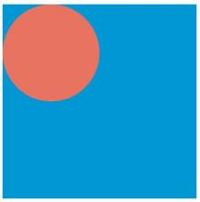
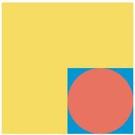
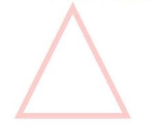
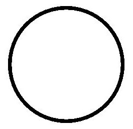
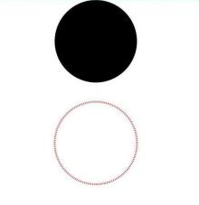

# 绘制几何图形 (Shape)


绘制组件用于在页面绘制图形，Shape组件是绘制组件的父组件，父组件中会描述所有绘制组件均支持的通用属性。具体用法请参考[Shape](../reference/apis-arkui/arkui-ts/ts-drawing-components-shape.md)。


## 创建绘制组件

绘制组件可以由以下两种形式创建：

- 绘制组件使用Shape作为父组件，实现类似SVG的效果。接口调用为以下形式：

  ```ts
  Shape(value?: PixelMap)
  ```

  该接口用于创建带有父组件的绘制组件，其中value用于设置绘制目标，可将图形绘制在指定的PixelMap对象中，若未设置，则在当前绘制目标中进行绘制。

  ```ts
  Shape() {
    Rect().width(300).height(50)
  }
  ```


- 绘制组件单独使用，用于在页面上绘制指定的图形。有7种绘制类型，分别为[Circle](../reference/apis-arkui/arkui-ts/ts-drawing-components-circle.md)（圆形）、[Ellipse](../reference/apis-arkui/arkui-ts/ts-drawing-components-ellipse.md)（椭圆形）、[Line](../reference/apis-arkui/arkui-ts/ts-drawing-components-line.md)（直线）、[Polyline](../reference/apis-arkui/arkui-ts/ts-drawing-components-polyline.md)（折线）、[Polygon](../reference/apis-arkui/arkui-ts/ts-drawing-components-polygon.md)（多边形）、[Path](../reference/apis-arkui/arkui-ts/ts-drawing-components-path.md)（路径）、[Rect](../reference/apis-arkui/arkui-ts/ts-drawing-components-rect.md)（矩形）。以Circle的接口调用为例：

  ```ts
  Circle(options?: {width?: string | number, height?: string | number}
  ```

    该接口用于在页面绘制圆形，其中width用于设置圆形的宽度，height用于设置圆形的高度，圆形直径由宽高最小值确定。

  ```ts
  Circle({ width: 150, height: 150 })
  ```

  


## 形状视口viewport


```ts
viewPort{ x?: number | string, y?: number | string, width?: number | string, height?: number | string }
```

形状视口viewport指定用户空间中的一个矩形，该矩形映射到为关联的SVG元素建立的视区边界。viewport属性的值包含x、y、width和height四个可选参数，x和y表示视区的左上角坐标，width和height表示其尺寸。

以下3个示例讲解viewport具体用法：

- 通过形状视口对图形进行放大与缩小。

  ```ts
  class tmp{
    x:number = 0
    y:number = 0
    width:number = 75
    height:number = 75
  }
  let viep:tmp = new tmp()
  class tmp1{
    x:number = 0
    y:number = 0
    width:number = 300
    height:number = 300
  }
  let viep1:tmp1 = new tmp1()
  // 画一个宽高都为75的圆
  Text('原始尺寸Circle组件')
  Circle({width: 75, height: 75}).fill('#E87361')

  Row({space:10}) {
    Column() {
      // 创建一个宽高都为150的shape组件，背景色为黄色，一个宽高都为75的viewport。用一个蓝色的矩形来填充viewport，在viewport中绘制一个直径为75的圆。
      // 绘制结束，viewport会根据组件宽高放大两倍
      Text('shape内放大的Circle组件')
      Shape() {
        Rect().width('100%').height('100%').fill('#0097D4')
        Circle({width: 75, height: 75}).fill('#E87361')
      }
      .viewPort(viep)
      .width(150)
      .height(150)
      .backgroundColor('#F5DC62')
    }
    Column() {
      // 创建一个宽高都为150的shape组件，背景色为黄色，一个宽高都为300的viewport。用一个绿色的矩形来填充viewport，在viewport中绘制一个直径为75的圆。
      // 绘制结束，viewport会根据组件宽高缩小两倍。
      Text('Shape内缩小的Circle组件')
      Shape() {
        Rect().width('100%').height('100%').fill('#BDDB69')
        Circle({width: 75, height: 75}).fill('#E87361')
      }
      .viewPort(viep1)
      .width(150)
      .height(150)
      .backgroundColor('#F5DC62')
    }
  }
  ```

  

- 创建一个宽高都为300的shape组件，背景色为黄色，一个宽高都为300的viewport。用一个蓝色的矩形来填充viewport，在viewport中绘制一个半径为75的圆。

  ```ts
  class tmp{
    x:number = 0
    y:number = 0
    width:number = 300
    height:number = 300
  }
  let viep:tmp = new tmp()
  class tmp1{
    x:number = -150
    y:number = -150
    width:number = 300
    height:number = 300
  }
  let viep1:tmp1 = new tmp1()
  Shape() {
    Rect().width("100%").height("100%").fill("#0097D4")
    Circle({ width: 150, height: 150 }).fill("#E87361")
  }
    .viewPort(viep)
    .width(300)
    .height(300)
    .backgroundColor("#F5DC62")
  ```

  

- 创建一个宽高都为300的shape组件，背景色为黄色，创建一个宽高都为300的viewport。用一个蓝色的矩形来填充viewport，在viewport中绘制一个半径为75的圆，将viewport向右方和下方各平移150。

  ```ts
  Shape() {
    Rect().width("100%").height("100%").fill("#0097D4")
    Circle({ width: 150, height: 150 }).fill("#E87361")
  }
    .viewPort(viep1)
    .width(300)
    .height(300)
    .backgroundColor("#F5DC62")

  ```

  


## 自定义样式

绘制组件支持通过各种属性对组件样式进行更改。

- 通过fill可以设置组件填充区域颜色。

  ```ts
  Path()
    .width(100)
    .height(100)
    .commands('M150 0 L300 300 L0 300 Z')
    .fill("#E87361")
  ```

  .jpg)

- 通过stroke可以设置组件边框颜色。

  ```ts
  Path()
    .width(100)
    .height(100)
    .fillOpacity(0)
    .commands('M150 0 L300 300 L0 300 Z')
    .stroke(Color.Red)
  ```

  

- 通过strokeOpacity可以设置边框透明度。

  ```ts
  Path()
    .width(100)
    .height(100)
    .fillOpacity(0)
    .commands('M150 0 L300 300 L0 300 Z')
    .stroke(Color.Red)
    .strokeWidth(10)
    .strokeOpacity(0.2)
  ```

  

- 通过strokeLineJoin可以设置线条拐角绘制样式。拐角绘制样式分为Bevel(使用斜角连接路径段)、Miter(使用尖角连接路径段)、Round(使用圆角连接路径段)。

  ```ts
  Polyline()
    .width(100)
    .height(100)
    .fillOpacity(0)
    .stroke(Color.Red)
    .strokeWidth(8)
    .points([[20, 0], [0, 100], [100, 90]])
     // 设置折线拐角处为圆弧
    .strokeLineJoin(LineJoinStyle.Round)
  ```

  

- 通过strokeMiterLimit设置斜接长度与边框宽度比值的极限值。
  斜接长度表示外边框外边交点到内边交点的距离，边框宽度即strokeWidth属性的值。strokeMiterLimit取值需大于等于1，且在strokeLineJoin属性取值LineJoinStyle.Miter时生效。

  ```ts
  Polyline()
    .width(100)
    .height(100)
    .fillOpacity(0)
    .stroke(Color.Red)
    .strokeWidth(10)
    .points([[20, 0], [20, 100], [100, 100]])
    // 设置折线拐角处为尖角
    .strokeLineJoin(LineJoinStyle.Miter)
    // 设置斜接长度与线宽的比值
    .strokeMiterLimit(1/Math.sin(45))
  Polyline()
    .width(100)
    .height(100)
    .fillOpacity(0)
    .stroke(Color.Red)
    .strokeWidth(10)
    .points([[20, 0], [20, 100], [100, 100]])
    .strokeLineJoin(LineJoinStyle.Miter)
    .strokeMiterLimit(1.42)
  ```

  

- 通过antiAlias设置是否开启抗锯齿，默认值为true（开启抗锯齿）。

  ```ts
  //开启抗锯齿
  Circle()
    .width(150)
    .height(200)
    .fillOpacity(0)
    .strokeWidth(5)
    .stroke(Color.Black)
  ```

  

  ```ts
  //关闭抗锯齿
  Circle()
    .width(150)
    .height(200)
    .fillOpacity(0)
    .strokeWidth(5)
    .stroke(Color.Black)
    .antiAlias(false)
  ```

  


## 场景示例

- 在Shape的(-80, -5)点绘制一个封闭路径，填充颜色0x317AF7，线条宽度3，边框颜色红色，拐角样式锐角（默认值）。

  ```ts
  @Entry
  @Component
  struct ShapeExample {
    build() {
      Column({ space: 10 }) {
        Shape() {
          Path().width(200).height(60).commands('M0 0 L400 0 L400 150 Z')
        }
        .viewPort({ x: -80, y: -5, width: 500, height: 300 })
        .fill(0x317AF7)
        .stroke(Color.Red)
        .strokeWidth(3)
        .strokeLineJoin(LineJoinStyle.Miter)
        .strokeMiterLimit(5)
      }.width('100%').margin({ top: 15 })
    }
  }
  ```

  

- 绘制一个直径为150的圆，和一个直径为150、线条为红色虚线的圆环（宽高设置不一致时以短边为直径）。

  ```ts
  @Entry
  @Component
  struct CircleExample {
    build() {
      Column({ space: 10 }) {
        //绘制一个直径为150的圆
        Circle({ width: 150, height: 150 })
        //绘制一个直径为150、线条为红色虚线的圆环
        Circle()
          .width(150)
          .height(200)
          .fillOpacity(0)
          .strokeWidth(3)
          .stroke(Color.Red)
          .strokeDashArray([1, 2])
      }.width('100%')
    }
  }
  ```

  
