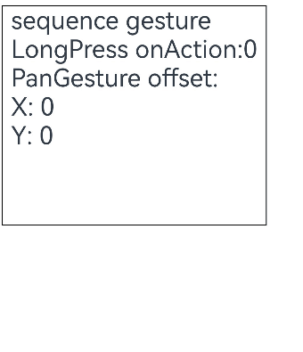
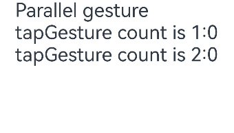
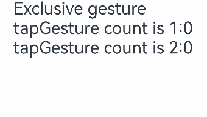

# 组合手势


组合手势由多种单一手势组合而成，通过在GestureGroup中使用不同的[GestureMode](../reference/apis-arkui/arkui-ts/ts-combined-gestures.md#gesturemode枚举说明)来声明该组合手势的类型，支持[顺序识别](#顺序识别)、[并行识别](#并行识别)和[互斥识别](#互斥识别)三种类型。

```ts
GestureGroup(mode:GestureMode, gesture:GestureType[])
```


- mode：为GestureMode枚举类。用于声明该组合手势的类型。

- gesture：由多个手势组合而成的数组。用于声明组合成该组合手势的各个手势。


## 顺序识别

顺序识别组合手势对应的GestureMode为Sequence。顺序识别组合手势将按照手势的注册顺序识别手势，直到所有的手势识别成功。当顺序识别组合手势中有一个手势识别失败时，后续手势识别均失败。顺序识别手势组仅有最后一个手势可以响应onActionEnd。

以一个由长按手势和拖动手势组合而成的连续手势为例：

在一个Column组件上绑定了translate属性，通过修改该属性可以设置组件的位置移动。然后在该组件上绑定LongPressGesture和PanGesture组合而成的Sequence组合手势。当触发LongPressGesture时，更新显示的数字。当长按后进行拖动时，根据拖动手势的回调函数，实现组件的拖动。

```ts
// xxx.ets
@Entry
@Component
struct Index {
  @State offsetX: number = 0;
  @State offsetY: number = 0;
  @State count: number = 0;
  @State positionX: number = 0;
  @State positionY: number = 0;
  @State borderStyles: BorderStyle = BorderStyle.Solid

  build() {
    Column() {
      Text('sequence gesture\n' + 'LongPress onAction:' + this.count + '\nPanGesture offset:\nX: ' + this.offsetX + '\n' + 'Y: ' + this.offsetY)
        .fontSize(28)
    }.margin(10)
    .borderWidth(1)
    // 绑定translate属性可以实现组件的位置移动
    .translate({ x: this.offsetX, y: this.offsetY, z: 0 })
    .height(250)
    .width(300)
    //以下组合手势为顺序识别，当长按手势事件未正常触发时不会触发拖动手势事件
    .gesture(
      // 声明该组合手势的类型为Sequence类型
      GestureGroup(GestureMode.Sequence,
        // 该组合手势第一个触发的手势为长按手势，且长按手势可多次响应
        LongPressGesture({ repeat: true })
          // 当长按手势识别成功，增加Text组件上显示的count次数
          .onAction((event: GestureEvent|undefined) => {
            if(event){
              if (event.repeat) {
                this.count++;
              }
            }
            console.info('LongPress onAction');
          })
          .onActionEnd(() => {
            console.info('LongPress end');
          }),
        // 当长按之后进行拖动，PanGesture手势被触发
        PanGesture()
          .onActionStart(() => {
            this.borderStyles = BorderStyle.Dashed;
            console.info('pan start');
          })
            // 当该手势被触发时，根据回调获得拖动的距离，修改该组件的位移距离从而实现组件的移动
          .onActionUpdate((event: GestureEvent|undefined) => {
            if(event){
              this.offsetX = (this.positionX + event.offsetX);
              this.offsetY = this.positionY + event.offsetY;
            }
            console.info('pan update');
          })
          .onActionEnd(() => {
            this.positionX = this.offsetX;
            this.positionY = this.offsetY;
            this.borderStyles = BorderStyle.Solid;
          })
      )
      .onCancel(() => {
        console.log("sequence gesture canceled")
      })
    )
  }
}
```





>**说明：**
>
>拖拽事件是一种典型的顺序识别组合手势事件，由长按手势事件和滑动手势事件组合而成。只有先长按达到长按手势事件预设置的时间后进行滑动才会触发拖拽事件。如果长按事件未达到或者长按后未进行滑动，拖拽事件均识别失败。


## 并行识别

并行识别组合手势对应的GestureMode为Parallel。并行识别组合手势中注册的手势将同时进行识别，直到所有手势识别结束。并行识别手势组合中的手势进行识别时互不影响。

以在一个Column组件上绑定点击手势和双击手势组成的并行识别手势为例，由于单击手势和双击手势是并行识别，因此两个手势可以同时进行识别，二者互不干涉。

```ts
// xxx.ets
@Entry
@Component
struct Index {
  @State count1: number = 0;
  @State count2: number = 0;

  build() {
    Column() {
      Text('Parallel gesture\n' + 'tapGesture count is 1:' + this.count1 + '\ntapGesture count is 2:' + this.count2 + '\n')
        .fontSize(28)
    }
    .height(200)
    .width('100%')
    // 以下组合手势为并行并别，单击手势识别成功后，若在规定时间内再次点击，双击手势也会识别成功
    .gesture(
      GestureGroup(GestureMode.Parallel,
        TapGesture({ count: 1 })
          .onAction(() => {
            this.count1++;
          }),
        TapGesture({ count: 2 })
          .onAction(() => {
            this.count2++;
          })
      )
    )
  }
}
```





>**说明：**
>
>当由单击手势和双击手势组成一个并行识别组合手势后，在区域内进行点击时，单击手势和双击手势将同时进行识别。
>
>当只有单次点击时，单击手势识别成功，双击手势识别失败。
>
>当有两次点击时，若两次点击相距时间在规定时间内（默认规定时间为300毫秒），触发两次单击事件和一次双击事件。
>
>当有两次点击时，若两次点击相距时间超出规定时间，触发两次单击事件不触发双击事件。


## 互斥识别

互斥识别组合手势对应的GestureMode为Exclusive。互斥识别组合手势中注册的手势将同时进行识别，若有一个手势识别成功，则结束手势识别，其他所有手势识别失败。

以在一个Column组件上绑定单击手势和双击手势组合而成的互斥识别组合手势为例。若先绑定单击手势后绑定双击手势，由于单击手势只需要一次点击即可触发而双击手势需要两次，每次的点击事件均被单击手势消费而不能积累成双击手势，所以双击手势无法触发。若先绑定双击手势后绑定单击手势，则触发双击手势不触发单击手势。

```ts
// xxx.ets
@Entry
@Component
struct Index {
  @State count1: number = 0;
  @State count2: number = 0;

  build() {
    Column() {
      Text('Exclusive gesture\n' + 'tapGesture count is 1:' + this.count1 + '\ntapGesture count is 2:' + this.count2 + '\n')
        .fontSize(28)
    }
    .height(200)
    .width('100%')
    //以下组合手势为互斥并别，单击手势识别成功后，双击手势会识别失败
    .gesture(
      GestureGroup(GestureMode.Exclusive,
        TapGesture({ count: 1 })
          .onAction(() => {
            this.count1++;
          }),
        TapGesture({ count: 2 })
          .onAction(() => {
            this.count2++;
          })
      )
    )
  }
}
```





>**说明：**
>
>当由单击手势和双击手势组成一个互斥识别组合手势后，在区域内进行点击时，单击手势和双击手势将同时进行识别。
>
>当只有单次点击时，单击手势识别成功，双击手势识别失败。
>
>当有两次点击时，手势响应取决于绑定手势的顺序。若先绑定单击手势后绑定双击手势，单击手势在第一次点击时即宣告识别成功，此时双击手势已经失败。即使在规定时间内进行了第二次点击，双击手势事件也不会进行响应，此时会触发单击手势事件的第二次识别成功。若先绑定双击手势后绑定单击手势，则会响应双击手势不响应单击手势。
