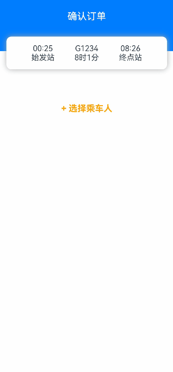
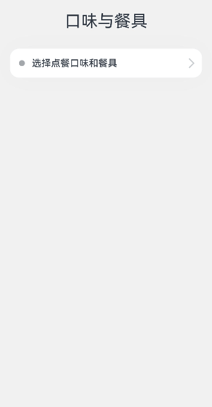
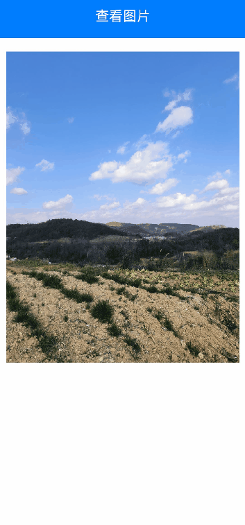
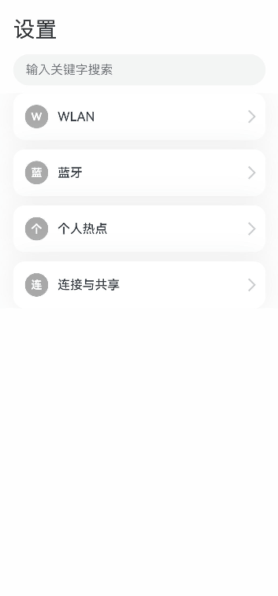

# 模态转场


模态转场是新的界面覆盖在旧的界面上，旧的界面不消失的一种转场方式。


**表1** 模态转场接口
| 接口                                       | 说明                | 使用场景                                     |
| ---------------------------------------- | ----------------- | ---------------------------------------- |
| [bindContentCover](../reference/apis-arkui/arkui-ts/ts-universal-attributes-modal-transition.md#bindcontentcover) | 弹出全屏的模态组件。        | 用于自定义全屏的模态展示界面，结合转场动画和共享元素动画可实现复杂转场动画效果，如缩略图片点击后查看大图。 |
| [bindSheet](../reference/apis-arkui/arkui-ts/ts-universal-attributes-sheet-transition.md#bindsheet) | 弹出半模态组件。          | 用于半模态展示界面，如分享框。                          |
| [bindMenu](../reference/apis-arkui/arkui-ts/ts-universal-attributes-menu.md#bindmenu11) | 弹出菜单，点击组件后弹出。     | 需要Menu菜单的场景，如一般应用的“+”号键。                 |
| [bindContextMenu](../reference/apis-arkui/arkui-ts/ts-universal-attributes-menu.md#bindcontextmenu12) | 弹出菜单，长按或者右键点击后弹出。 | 长按浮起效果，一般结合拖拽框架使用，如桌面图标长按浮起。             |
| [bindPopup](../reference/apis-arkui/arkui-ts/ts-universal-attributes-popup.md#bindpopup) | 弹出Popup弹框。        | Popup弹框场景，如点击后对某个组件进行临时说明。               |
| [if](../quick-start/arkts-rendering-control-ifelse.md)                                       | 通过if新增或删除组件。      | 用来在某个状态下临时显示一个界面，这种方式的返回导航需要由开发者监听接口实现。  |


## 使用bindContentCover构建全屏模态转场效果

[bindContentCover](../reference/apis-arkui/arkui-ts/ts-universal-attributes-modal-transition.md#bindcontentcover)接口用于为组件绑定全屏模态页面，在组件出现和消失时可通过设置转场参数ModalTransition添加过渡动效。

1. 定义全屏模态转场效果[bindContentCover](../reference/apis-arkui/arkui-ts/ts-universal-attributes-modal-transition.md#bindcontentcover)。

2. 定义模态展示界面。

   ```ts
   // 通过@Builder构建模态展示界面
   @Builder MyBuilder() {
     Column() {
       Text('my model view')
     }
     // 通过转场动画实现出现消失转场动画效果，transition需要加在builder下的第一个组件 
     .transition(TransitionEffect.translate({ y: 1000 }).animation({ curve: curves.springMotion(0.6, 0.8) }))
   }
   ```

3. 通过模态接口调起模态展示界面，通过转场动画或者共享元素动画去实现对应的动画效果。

   ```ts
   // 模态转场控制变量
   @State isPresent: boolean = false;

   Button('Click to present model view')
     // 通过选定的模态接口，绑定模态展示界面，ModalTransition是内置的ContentCover转场动画类型，这里选择None代表系统不加默认动画，通过onDisappear控制状态变量变换
     .bindContentCover(this.isPresent, this.MyBuilder(), {
               modalTransition: ModalTransition.NONE,
               onDisappear: () => {
                 if (this.isPresent) {
                   this.isPresent = !this.isPresent;
                 }
               }
             })
     .onClick(() => {
       // 改变状态变量，显示模态界面
       this.isPresent = !this.isPresent;
     })
   ```


完整示例代码和效果如下。

```ts
import { curves } from '@kit.ArkUI';

interface PersonList {
  name: string,
  cardnum: string
}

@Entry
@Component
struct BindContentCoverDemo {
  private personList: Array<PersonList> = [
    { name: '王**', cardnum: '1234***********789' },
    { name: '宋*', cardnum: '2345***********789' },
    { name: '许**', cardnum: '3456***********789' },
    { name: '唐*', cardnum: '4567***********789' }
  ];
  // 第一步：定义全屏模态转场效果bindContentCover
  // 模态转场控制变量
  @State isPresent: boolean = false;

  // 第二步：定义模态展示界面
  // 通过@Builder构建模态展示界面
  @Builder
  MyBuilder() {
    Column() {
      Row() {
        Text('选择乘车人')
          .fontSize(20)
          .fontColor(Color.White)
          .width('100%')
          .textAlign(TextAlign.Center)
          .padding({ top: 30, bottom: 15 })
      }
      .backgroundColor(0x007dfe)

      Row() {
        Text('+ 添加乘车人')
          .fontSize(16)
          .fontColor(0x333333)
          .margin({ top: 10 })
          .padding({ top: 20, bottom: 20 })
          .width('92%')
          .borderRadius(10)
          .textAlign(TextAlign.Center)
          .backgroundColor(Color.White)
      }

      Column() {
        ForEach(this.personList, (item: PersonList, index: number) => {
          Row() {
            Column() {
              if (index % 2 == 0) {
                Column()
                  .width(20)
                  .height(20)
                  .border({ width: 1, color: 0x007dfe })
                  .backgroundColor(0x007dfe)
              } else {
                Column()
                  .width(20)
                  .height(20)
                  .border({ width: 1, color: 0x007dfe })
              }
            }
            .width('20%')

            Column() {
              Text(item.name)
                .fontColor(0x333333)
                .fontSize(18)
              Text(item.cardnum)
                .fontColor(0x666666)
                .fontSize(14)
            }
            .width('60%')
            .alignItems(HorizontalAlign.Start)

            Column() {
              Text('编辑')
                .fontColor(0x007dfe)
                .fontSize(16)
            }
            .width('20%')
          }
          .padding({ top: 10, bottom: 10 })
          .border({ width: { bottom: 1 }, color: 0xf1f1f1 })
          .width('92%')
          .backgroundColor(Color.White)
        })
      }
      .padding({ top: 20, bottom: 20 })

      Text('确认')
        .width('90%')
        .height(40)
        .textAlign(TextAlign.Center)
        .borderRadius(10)
        .fontColor(Color.White)
        .backgroundColor(0x007dfe)
        .onClick(() => {
          this.isPresent = !this.isPresent;
        })
    }
    .size({ width: '100%', height: '100%' })
    .backgroundColor(0xf5f5f5)
    // 通过转场动画实现出现消失转场动画效果
    .transition(TransitionEffect.translate({ y: 1000 }).animation({ curve: curves.springMotion(0.6, 0.8) }))
  }

  build() {
    Column() {
      Row() {
        Text('确认订单')
          .fontSize(20)
          .fontColor(Color.White)
          .width('100%')
          .textAlign(TextAlign.Center)
          .padding({ top: 30, bottom: 60 })
      }
      .backgroundColor(0x007dfe)

      Column() {
        Row() {
          Column() {
            Text('00:25')
            Text('始发站')
          }
          .width('30%')

          Column() {
            Text('G1234')
            Text('8时1分')
          }
          .width('30%')

          Column() {
            Text('08:26')
            Text('终点站')
          }
          .width('30%')
        }
      }
      .width('92%')
      .padding(15)
      .margin({ top: -30 })
      .backgroundColor(Color.White)
      .shadow({ radius: 30, color: '#aaaaaa' })
      .borderRadius(10)

      Column() {
        Text('+ 选择乘车人')
          .fontSize(18)
          .fontColor(Color.Orange)
          .fontWeight(FontWeight.Bold)
          .padding({ top: 10, bottom: 10 })
          .width('60%')
          .textAlign(TextAlign.Center)
          .borderRadius(15)// 通过选定的模态接口，绑定模态展示界面，ModalTransition是内置的ContentCover转场动画类型，这里选择DEFAULT代表设置上下切换动画效果，通过onDisappear控制状态变量变换。
          .bindContentCover(this.isPresent, this.MyBuilder(), {
            modalTransition: ModalTransition.DEFAULT,
            onDisappear: () => {
              if (this.isPresent) {
                this.isPresent = !this.isPresent;
              }
            }
          })
          .onClick(() => {
            // 第三步：通过模态接口调起模态展示界面，通过转场动画或者共享元素动画去实现对应的动画效果
            // 改变状态变量，显示模态界面
            this.isPresent = !this.isPresent;
          })
      }
      .padding({ top: 60 })
    }
  }
}
```





## 使用bindSheet构建半模态转场效果

[bindSheet](../reference/apis-arkui/arkui-ts/ts-universal-attributes-sheet-transition.md#bindsheet)属性可为组件绑定半模态页面，在组件出现时可通过设置自定义或默认的内置高度确定半模态大小。构建半模态转场动效的步骤基本与使用[bindContentCover](../reference/apis-arkui/arkui-ts/ts-universal-attributes-modal-transition.md#bindcontentcover)构建全屏模态转场动效相同。

完整示例和效果如下。


```ts
@Entry
@Component
struct BindSheetDemo {
  // 半模态转场显示隐藏控制
  @State isShowSheet: boolean = false;
  private menuList: string[] = ['不要辣', '少放辣', '多放辣', '不要香菜', '不要香葱', '不要一次性餐具', '需要一次性餐具'];

  // 通过@Builder构建半模态展示界面
  @Builder
  mySheet() {
    Column() {
      Flex({ direction: FlexDirection.Row, wrap: FlexWrap.Wrap }) {
        ForEach(this.menuList, (item: string) => {
          Text(item)
            .fontSize(16)
            .fontColor(0x333333)
            .backgroundColor(0xf1f1f1)
            .borderRadius(8)
            .margin(10)
            .padding(10)
        })
      }
      .padding({ top: 18 })
    }
    .width('100%')
    .height('100%')
    .backgroundColor(Color.White)
  }

  build() {
    Column() {
      Text('口味与餐具')
        .fontSize(28)
        .padding({ top: 30, bottom: 30 })
      Column() {
        Row() {
          Row()
            .width(10)
            .height(10)
            .backgroundColor('#a8a8a8')
            .margin({ right: 12 })
            .borderRadius(20)

          Column() {
            Text('选择点餐口味和餐具')
              .fontSize(16)
              .fontWeight(FontWeight.Medium)
          }
          .alignItems(HorizontalAlign.Start)

          Blank()

          Row()
            .width(12)
            .height(12)
            .margin({ right: 15 })
            .border({
              width: { top: 2, right: 2 },
              color: 0xcccccc
            })
            .rotate({ angle: 45 })
        }
        .borderRadius(15)
        .shadow({ radius: 100, color: '#ededed' })
        .width('90%')
        .alignItems(VerticalAlign.Center)
        .padding({ left: 15, top: 15, bottom: 15 })
        .backgroundColor(Color.White)
        // 通过选定的半模态接口，绑定模态展示界面，style中包含两个参数，一个是设置半模态的高度，不设置时默认高度是Large，一个是是否显示控制条DragBar，默认是true显示控制条，通过onDisappear控制状态变量变换。
        .bindSheet(this.isShowSheet, this.mySheet(), {
          height: 300,
          dragBar: false,
          onDisappear: () => {
            this.isShowSheet = !this.isShowSheet;
          }
        })
        .onClick(() => {
          this.isShowSheet = !this.isShowSheet;
        })
      }
      .width('100%')
    }
    .width('100%')
    .height('100%')
    .backgroundColor(0xf1f1f1)
  }
}
```




## 使用bindMenu实现菜单弹出效果

[bindMenu](../reference/apis-arkui/arkui-ts/ts-universal-attributes-menu.md#bindmenu)为组件绑定弹出式菜单，通过点击触发。完整示例和效果如下。


```ts
class BMD{
  value:ResourceStr = ''
  action:() => void = () => {}
}
@Entry
@Component
struct BindMenuDemo {

  // 第一步: 定义一组数据用来表示菜单按钮项
  @State items:BMD[] = [
    {
      value: '菜单项1',
      action: () => {
        console.info('handle Menu1 select')
      }
    },
    {
      value: '菜单项2',
      action: () => {
        console.info('handle Menu2 select')
      }
    },
  ]

  build() {
    Column() {
      Button('click')
        .backgroundColor(0x409eff)
        .borderRadius(5)
          // 第二步: 通过bindMenu接口将菜单数据绑定给元素
        .bindMenu(this.items)
    }
    .justifyContent(FlexAlign.Center)
    .width('100%')
    .height(437)
  }
}
```


## 使用bindContextMenu实现菜单弹出效果

[bindContextMenu](../reference/apis-arkui/arkui-ts/ts-universal-attributes-menu.md#bindcontextmenu8)为组件绑定弹出式菜单，通过长按或右键点击触发。

完整示例和效果如下。


```ts
@Entry
@Component
struct BindContextMenuDemo {
  private menu: string[] = ['保存图片', '收藏', '搜一搜'];
  private pics: Resource[] = [$r('app.media.icon_1'), $r('app.media.icon_2')];

  // 通过@Builder构建自定义菜单项
  @Builder myMenu() {
    Column() {
      ForEach(this.menu, (item: string) => {
        Row() {
          Text(item)
            .fontSize(18)
            .width('100%')
            .textAlign(TextAlign.Center)
        }
        .padding(15)
        .border({ width: { bottom: 1 }, color: 0xcccccc })
      })
    }
    .width(140)
    .borderRadius(15)
    .shadow({ radius: 15, color: 0xf1f1f1 })
    .backgroundColor(0xf1f1f1)
  }

  build() {
    Column() {
      Row() {
        Text('查看图片')
          .fontSize(20)
          .fontColor(Color.White)
          .width('100%')
          .textAlign(TextAlign.Center)
          .padding({ top: 20, bottom: 20 })
      }
      .backgroundColor(0x007dfe)

      Column() {
        ForEach(this.pics, (item: Resource) => {
          Row(){
            Image(item)
              .width('100%')
              .draggable(false)
          }
          .padding({ top: 20, bottom: 20, left: 10, right: 10 })
          .bindContextMenu(this.myMenu, ResponseType.LongPress)
        })
      }
    }
    .width('100%')
    .alignItems(HorizontalAlign.Center)
  }
}
```




## 使用bindPopUp实现气泡弹窗效果

[bindpopup](../reference/apis-arkui/arkui-ts/ts-universal-attributes-popup.md#bindpopup)属性可为组件绑定弹窗，并设置弹窗内容，交互逻辑和显示状态。

完整示例和代码如下。


```ts
@Entry
@Component
struct BindPopupDemo {

  // 第一步：定义变量控制弹窗显示
  @State customPopup: boolean = false;

  // 第二步：popup构造器定义弹框内容
  @Builder popupBuilder() {
    Column({ space: 2 }) {
      Row().width(64)
        .height(64)
        .backgroundColor(0x409eff)
      Text('Popup')
        .fontSize(10)
        .fontColor(Color.White)
    }
    .justifyContent(FlexAlign.SpaceAround)
    .width(100)
    .height(100)
    .padding(5)
  }

  build() {
    Column() {

      Button('click')
        // 第四步：创建点击事件，控制弹窗显隐
        .onClick(() => {
          this.customPopup = !this.customPopup;
        })
        .backgroundColor(0xf56c6c)
          // 第三步：使用bindPopup接口将弹窗内容绑定给元素
        .bindPopup(this.customPopup, {
          builder: this.popupBuilder,
          placement: Placement.Top,
          maskColor: 0x33000000,
          popupColor: 0xf56c6c,
          enableArrow: true,
          onStateChange: (e) => {
            if (!e.isVisible) {
              this.customPopup = false;
            }
          }
        })
    }
    .justifyContent(FlexAlign.Center)
    .width('100%')
    .height(437)
  }
}
```


## 使用if实现模态转场

上述模态转场接口需要绑定到其他组件上，通过监听状态变量改变调起模态界面。同时，也可以通过if范式，通过新增/删除组件实现模态转场效果。

完整示例和代码如下。


```ts
@Entry
@Component
struct ModalTransitionWithIf {
  private listArr: string[] = ['WLAN', '蓝牙', '个人热点', '连接与共享'];
  private shareArr: string[] = ['投屏', '打印', 'VPN', '私人DNS', 'NFC'];
  // 第一步：定义状态变量控制页面显示
  @State isShowShare: boolean = false;
  private shareFunc(): void {
    this.getUIContext()?.animateTo({ duration: 500 }, () => {
      this.isShowShare = !this.isShowShare;
    })
  }

  build(){
    // 第二步：定义Stack布局显示当前页面和模态页面
    Stack() {
      Column() {
        Column() {
          Text('设置')
            .fontSize(28)
            .fontColor(0x333333)
        }
        .width('90%')
        .padding({ top: 30, bottom: 15 })
        .alignItems(HorizontalAlign.Start)

        TextInput({ placeholder: '输入关键字搜索' })
          .width('90%')
          .height(40)
          .margin({ bottom: 10 })
          .focusable(false)

        List({ space: 12, initialIndex: 0 }) {
          ForEach(this.listArr, (item: string, index: number) => {
            ListItem() {
              Row() {
                Row() {
                  Text(`${item.slice(0, 1)}`)
                    .fontColor(Color.White)
                    .fontSize(14)
                    .fontWeight(FontWeight.Bold)
                }
                .width(30)
                .height(30)
                .backgroundColor('#a8a8a8')
                .margin({ right: 12 })
                .borderRadius(20)
                .justifyContent(FlexAlign.Center)

                Column() {
                  Text(item)
                    .fontSize(16)
                    .fontWeight(FontWeight.Medium)
                }
                .alignItems(HorizontalAlign.Start)

                Blank()

                Row()
                  .width(12)
                  .height(12)
                  .margin({ right: 15 })
                  .border({
                    width: { top: 2, right: 2 },
                    color: 0xcccccc
                  })
                  .rotate({ angle: 45 })
              }
              .borderRadius(15)
              .shadow({ radius: 100, color: '#ededed' })
              .width('90%')
              .alignItems(VerticalAlign.Center)
              .padding({ left: 15, top: 15, bottom: 15 })
              .backgroundColor(Color.White)
            }
            .width('100%')
            .onClick(() => {
              // 第五步：改变状态变量，显示模态页面
              if(item.slice(-2) === '共享'){
                this.shareFunc();
              }
            })
          }, (item: string): string => item)
        }
        .width('100%')
      }
      .width('100%')
      .height('100%')
      .backgroundColor(0xfefefe)

      // 第三步：在if中定义模态页面，显示在最上层，通过if控制模态页面出现消失
      if(this.isShowShare){
        Column() {
          Column() {
            Row() {
              Row() {
                Row()
                  .width(16)
                  .height(16)
                  .border({
                    width: { left: 2, top: 2 },
                    color: 0x333333
                  })
                  .rotate({ angle: -45 })
              }
              .padding({ left: 15, right: 10 })
              .onClick(() => {
                this.shareFunc();
              })
              Text('连接与共享')
                .fontSize(28)
                .fontColor(0x333333)
            }
            .padding({ top: 30 })
          }
          .width('90%')
          .padding({bottom: 15})
          .alignItems(HorizontalAlign.Start)

          List({ space: 12, initialIndex: 0 }) {
            ForEach(this.shareArr, (item: string) => {
              ListItem() {
                Row() {
                  Row() {
                    Text(`${item.slice(0, 1)}`)
                      .fontColor(Color.White)
                      .fontSize(14)
                      .fontWeight(FontWeight.Bold)
                  }
                  .width(30)
                  .height(30)
                  .backgroundColor('#a8a8a8')
                  .margin({ right: 12 })
                  .borderRadius(20)
                  .justifyContent(FlexAlign.Center)

                  Column() {
                    Text(item)
                      .fontSize(16)
                      .fontWeight(FontWeight.Medium)
                  }
                  .alignItems(HorizontalAlign.Start)

                  Blank()

                  Row()
                    .width(12)
                    .height(12)
                    .margin({ right: 15 })
                    .border({
                      width: { top: 2, right: 2 },
                      color: 0xcccccc
                    })
                    .rotate({ angle: 45 })
                }
                .borderRadius(15)
                .shadow({ radius: 100, color: '#ededed' })
                .width('90%')
                .alignItems(VerticalAlign.Center)
                .padding({ left: 15, top: 15, bottom: 15 })
                .backgroundColor(Color.White)
              }
              .width('100%')
            }, (item: string): string => item)
          }
          .width('100%')
        }
        .width('100%')
        .height('100%')
        .backgroundColor(0xffffff)
        // 第四步：定义模态页面出现消失转场方式
        .transition(TransitionEffect.OPACITY
          .combine(TransitionEffect.translate({ x: '100%' }))
          .combine(TransitionEffect.scale({ x: 0.95, y: 0.95 })))
      }
    }
  }
}
```


