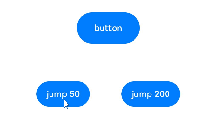
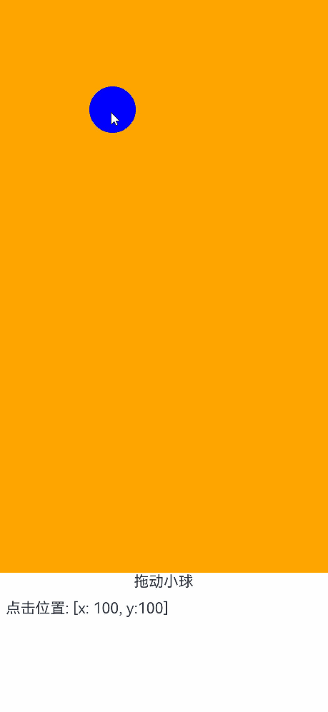

# 弹簧曲线动画


ArkUI提供了[预置动画曲线](../reference/arkui-ts/ts-appendix-enums.md#curve)，指定了动画属性从起始值到终止值的变化规律，如Linear、Ease、EaseIn等。同时，ArkUI也提供了由弹簧振子物理模型产生的弹簧曲线。通过弹簧曲线，开发者可以设置超过设置的终止值，在终止值附近震荡，直至最终停下来的效果。弹簧曲线的动画效果比其他曲线具有更强的互动性、可玩性。


弹簧曲线的接口包括两类，一类是[springCurve](../reference/apis/js-apis-curve.md#curvesspringcurve9)，另一类是[springMotion](../reference/apis/js-apis-curve.md#curvesspringmotion9)和[responsiveSpringMotion](../reference/apis/js-apis-curve.md#curvesresponsivespringmotion9)，这两种方式都可以产生弹簧曲线。


## 使用springCurve

springCurve的接口为：


```ts
springCurve(velocity: number, mass: number, stiffness: number, damping: number)
```

构造参数包括初速度，弹簧系统的质量、刚度、阻尼。构建springCurve时，可指定质量为1，根据springCurve中的参数说明，调节刚度、阻尼两个参数，达到想要的震荡效果。


```ts
import curves from '@ohos.curves';
@Entry
@Component
struct SpringTest {
  @State translateX: number = 0;

  private jumpWithSpeed(speed: number) {
    this.translateX = -1;
    animateTo({ duration: 2000, curve: curves.springCurve(speed, 1, 1, 1.2) }, () => {
      // 以指定初速度进行x方向的平移的弹簧动画
      this.translateX = 0;
    })
  }

  build() {
    Column() {
      Button("button")
        .fontSize(14)
        .width(100)
        .height(50)
        .margin(30)
        .translate({ x: this.translateX })
      Row({space:50}) {
        Button("jump 50").fontSize(14)
          .onClick(() => {
            // 以初速度50的弹簧曲线进行平移
            this.jumpWithSpeed(50);
          })
        Button("jump 200").fontSize(14)
          .onClick(() => {
            // 以初速度200的弹簧曲线进行平移
            this.jumpWithSpeed(200);
          })
      }.margin(30)
    }.height('100%').width('100%')
  }
}
```





以上示例中，点击不同的按钮，给定springCurve的不同初速度，button会有“弹性”的到达指定位置，且button的振幅随着速度的增大而变大。另外也可以修改springCurve的质量、刚度、阻尼参数，达到想要的弹性的程度。


>**说明：**
>
>速度只是放大了振荡的效果，但系统能否产生振荡的效果，取决于弹簧振子本身的物理参数，即质量、刚度、阻尼三个参数。刚度越小、阻尼越大，springCurve的“弹性”越弱，振荡效果越弱。随着刚度减小或阻尼变大，达到过阻尼状态后，无论速度为多大，都不会有在终点值附近振荡的效果。


## 使用springMotion和responsiveSpringMotion

[springMotion](../reference/apis/js-apis-curve.md#curvesspringmotion9)的接口为：


```ts
springMotion(response?: number, dampingFraction?: number, overlapDuration?: number)
```

[responsiveSpringMotion](../reference/apis/js-apis-curve.md#curvesresponsivespringmotion9)的接口为：


```ts
responsiveSpringMotion(response?: number, dampingFraction?: number, overlapDuration?: number)
```

它们的构造参数包括弹簧自然振动周期、阻尼系数、弹性动画衔接时长这三个可选参数，参数的含义请参考其文档。


使用springMotion和responsiveSpringMotion曲线时，duration不生效，适合于跟手动画。


```ts
import curves from '@ohos.curves';

@Entry
@Component
struct SpringMotionTest {
  @State positionX: number = 100;
  @State positionY: number = 100;
  diameter: number = 50;

  build() {
    Column() {
      Row() {
        Circle({ width: this.diameter, height: this.diameter })
          .fill(Color.Blue)
          .position({ x: this.positionX, y: this.positionY })
          .onTouch((event: TouchEvent) => {
            if (event.type === TouchType.Move) {
              // 跟手过程，使用responsiveSpringMotion曲线
              animateTo({ curve: curves.responsiveSpringMotion() }, () => {
                // 减去半径，以使球的中心运动到手指位置
                this.positionX = event.touches[0].screenX - this.diameter / 2;
                this.positionY = event.touches[0].screenY - this.diameter / 2;
                console.info(`move, animateTo x:${this.positionX}, y:${this.positionY}`);
              })
            } else if (event.type === TouchType.Up) {
              // 离手时，使用springMotion曲线
              animateTo({ curve: curves.springMotion() }, () => {
                this.positionX = 100;
                this.positionY = 100;
                console.info(`touchUp, animateTo x:100, y:100`);
              })
            }
          })
      }
      .width("100%").height("80%")
      .clip(true) // 如果球超出父组件范围，使球不可见
      .backgroundColor(Color.Orange)

      Flex({ direction: FlexDirection.Row, alignItems: ItemAlign.Start, justifyContent: FlexAlign.Center }) {
        Text("拖动小球").fontSize(16)
      }
      .width("100%")

      Row() {
        Text('点击位置: [x: ' + Math.round(this.positionX) + ', y:' + Math.round(this.positionY) + ']').fontSize(16)
      }
      .padding(10)
      .width("100%")
    }.height('100%').width('100%')
  }
}
```


以上代码是跟手动画的一个示例。通过在onTouch事件中，捕捉触摸的位置，改变组件的translate或者position属性，使其在跟手过程中运动到触摸位置，松手后回到原位置。跟手动画的效果如下：





跟手过程推荐使用responsiveSpringMotion曲线，松手过程推荐使用springMotion曲线。跟手过程随着手的位置变化会被多次触发，所以会接连启动多次responsiveSpringMotion动画，松手时启动一次springMotion动画。跟手、松手过程在对同一对象的同一属性上执行动画，且使用了springMotion或responsiveSpringMotion曲线，每次新启动的动画会继承上次动画使用的速度，实现平滑过渡。


>**说明：**
>
>  1. springCurve可以设置初速度，单一属性存在多个动画时不会互相影响，观察到的是多个动画效果的叠加。
>
>  2. springMotion虽然内部有速度机制，但不可由开发者设置。在单一属性存在多个动画时，后一动画会取代前一动画，并继承前一动画的速度。
