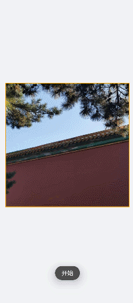
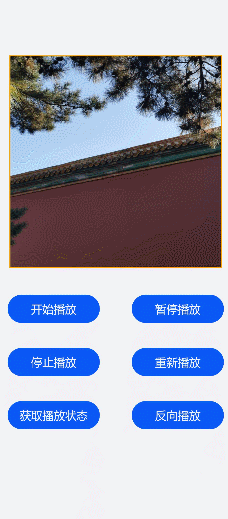

# image-animator开发指导


image-animator组件为图片帧动画播放器。具体用法请参考[image-animator](../reference/arkui-js/js-components-basic-image-animator.md)。


## 创建image-animator组件

在pages/index目录下的hml文件中创建一个image-animator组件，css文件中编写组件样式，js文件中引用图片。


```html
<!-- xxx.hml -->
<div class="container">
  <image-animator class="animator" images="{{frames}}" duration="3s"/>
</div>
```


```css
/* xxx.css */
.container {
  width: 100%;
  height: 100%;
  flex-direction: column;
  justify-content: center;
  align-items: center;
  background-color: #F1F3F5;
}
.animator {
  width: 500px;
  height: 500px;
}
```


```js
// index.js
export default {
  data: {
    frames: [
      {
        src: "/common/landscape1.jpg",
      },
      {
        src: "/common/landscape2.jpg",
      }
    ],
  },
};
```


## 设置image-animator组件属性

添加iteration（播放次数）、reverse（播放顺序）、fixedsize（图片大小是否固定为组件大小）、duration（播放时长）和fillmode（执行结束后的状态）属性，控制图片的播放效果。


```html
<!-- xxx.hml -->
<div class="container">
  <image-animator class="animator" fixedsize="false" iteration='2' reverse="false" ref="animator" fillmode="none" images="{{frames}}"   duration="5s" />
</div>
```


```css
/* xxx.css */
.container {
  width: 100%;
  height: 100%;
  flex-direction: column;
  background-color: #F1F3F5;
}
.animator {
  width: 500px;
  height: 500px;
}
```


```js
// index.js
export default {
  data: {
    frames: [
      {
        src: 'common/landscape1.jpg',
        width: '250px',
        height: '250px',
        left: '150px',
        top: '50px',
      },
      {
        src: 'common/landscape2.jpg',
        width: '300px',
        height: '300px',
        left: '150px',
        top: '100px',
      },
      {
        src: 'common/landscape1.jpg',
        width: '350px',
        height: '350px',
        left: '150px',
        top: '150px',
      },
      {
        src: 'common/landscape2.jpg',
        width: '400px',
        height: '400px',
        left: '150px',
        top: '200px',
      },
      {
        src: 'common/landscape3.jpg',
        width: '450px',
        height: '450px',
        left: '150px',
        top: '250px',
      },
      {
        src: 'common/landscape4.jpg',
        width: '500px',
        height: '500px',
        left: '150px',
        top: '300px',
      },
    ],
  },
};
```


> **说明：**
> - 如果在images属性中设置了单独的duration属性，在image-animator组件中设置的duration属性无效。
>
> - 如果fixedsize属性值设置为true，图片的width 、height 、top 和left属性无效。
>
> - 如果reverse属性值设置为false，表示从第1张图片播放到最后1张图片。 如果reverse属性值设置为true，表示从最后1张图片播放到第1张图片。


## 绑定事件

向image-animator组件添加start、pause、stop和resume事件。当图片播放器开始播放时触发start事件，当图片播放器被点击时触发pause事件，长按图片播放器触发resume事件，图片播放器停止播放时触发stop事件。


```html
<!-- xxx.hml -->
<div class="doc-page">
  <image-animator class="img" id="img" images="{{imginfo}}" iteration="1" duration="10s" onstart="popstart" onpause="poppause"   onstop="popstop" onresume="popresume" onlongpress="setresume" onclick="setpause">
  </image-animator>
</div>
```


```css
/* xxx.css */
.doc-page {
  width: 100%;
  height: 100%;
  flex-direction: column;
  align-items: center;
  justify-content: center;
   background-color: #F1F3F5;
}
.img {
  width: 600px;
  height: 600px;
  border: 3px solid orange;
}
```


```js
// index.js
import promptAction from '@ohos.promptAction';
export default {
  data: {
    imginfo: [
      {
        src: 'common/landscape1.jpg',
      },{
        src: 'common/landscape2.jpg',
      },{
        src: 'common/landscape3.jpg',
      },{
        src: 'common/landscape4.jpg',
      }
    ],
  },
  onInit() {
  },
  setpause(e) {
    this.$element('img').pause()
  },
  setresume(e) {
    this.$element('img').resume()
  },
  popstart(e) {
    promptAction.showToast({
      message: '开始'
    })
  },
  poppause(e) {
    promptAction.showToast({
      message: '暂停'
    })
  },
  popstop(e) {
    promptAction.showToast({
      message: '停止'
    })
  },
  popresume(e) {
    promptAction.showToast({
      message: '恢复'
    })
  }
}
```




## 场景示例

在本场景中，开发者可通过开始播放、停止播放等按钮切换图片的播放状态。

image-animator组件通过调用start、pause、stop和resume方法控制图片的开始、暂停、停止和重新播放，通过getState方法查询图片的播放状态。


```html
<!-- xxx.hml -->
<div class="doc-page">
  <image-animator class="img" id="img" images="{{imginfo}}" iteration="2" reverse="{{rev}}" duration="10s">
  </image-animator>
  <div style="width: 700px;height:450px;margin-top: 40px;flex-direction:column;justify-content:space-around;">
    <div class="container">
      <button type="capsule" value="开始播放" onclick="startimg"></button>
      <button type="capsule" value="暂停播放" onclick="pauseimg"></button>
    </div>
    <div class="container">
      <button type="capsule" value="停止播放" onclick="stopimg"></button>
      <button type="capsule" value="重新播放" onclick="resumeimg"></button>
    </div>
    <div class="container">
      <button type="capsule" value="获取播放状态" onclick="getimgstate"></button>
      <button type="capsule" value="{{revVal}}" onclick="revimg"></button>
    </div>
  </div>
</div>
```


```css
/* xxx.css */
.doc-page {
  width: 100%;
  height: 100%;
  flex-direction: column;
  align-items: center;
  justify-content: center;
  background-color: #F1F3F5;
}
.img {
  width: 600px;
  height: 600px;
  border: 3px solid orange;
}
button{
  width: 260px
}
.container {
  width: 100%;
  height: 120px;
  align-items: center;
  justify-content: space-around;
}
```


```js
// index.js
import promptAction from '@ohos.promptAction';
export default {
  data: {
    rev:false,
    imginfo: [
      {
        src: 'common/landscape1.jpg',
      },{
        src: 'common/landscape2.jpg',
      },{
        src: 'common/landscape3.jpg',
      },{
        src: 'common/landscape4.jpg',
      }
    ],
    revVal: '反向播放'
  },
  onInit() {
  },
  startimg(e) {
    this.$element('img').start()
  },
  pauseimg(e) {
    this.$element('img').pause()
  },
  stopimg(e) {
    this.$element('img').stop()
  },
  resumeimg(e) {
    this.$element('img').resume()
  },
  getimgstate(e) {
    promptAction.showToast({
      message: '当前状态：' + this.$element('img').getState()
    })
  },
  revimg(e) {
    this.rev = !this.rev
    if (this.rev) {
      this.revVal = '正向播放'
    } else {
      this.revVal = '反向播放'
    }
  }
}
```




## 相关实例

针对image-animator开发，有以下相关实例可供参考：

- [image、image-animator（JS）（API8）](https://gitee.com/openharmony/codelabs/tree/master/JSUI/ClickableJsDemo)
