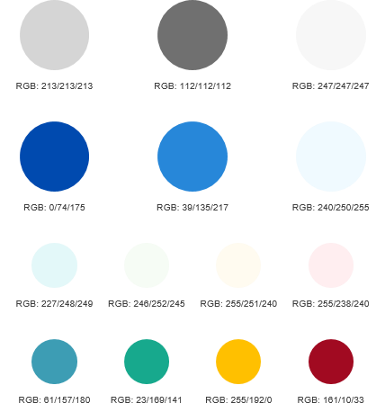
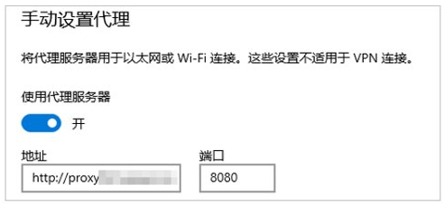
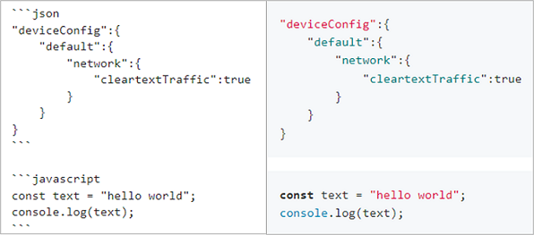

# 内容元素


## 项目列表

【规则】无序列表统一使用破折号（-）并紧跟一个空格，有序列表统一使用数字并紧跟一个英文句点和一个空格。

| **正例**                                                     | **反例**                                                     |
| ------------------------------------------------------------ | ------------------------------------------------------------ |
| \-&nbsp;无序列表第一项<br/>\-&nbsp;无序列表第二项<br/>\-&nbsp;无序列表第三项<br/>1.&nbsp;有序列表第一项<br/>2.&nbsp;有序列表第二项<br/>3.&nbsp;有序列表第三项 | \-&nbsp;无序列表第一项<br/>\*&nbsp;无序列表第二项<br/>\+&nbsp;无序列表第三项<br/>1)&nbsp;有序列表第一项<br/>2)&nbsp;有序列表第二项<br/>3)&nbsp;有序列表第三项 |

【规则】列表项采用相似结构、统一句式，例如，全部采用短语或句子。

| **正例**                                                     | **反例**                                                     |
| ------------------------------------------------------------ | ------------------------------------------------------------ |
| 播放事件回调类型，支持的事件包括&nbsp;`'play'|'stop'|'dataLoad'`&nbsp;：<br/>-&nbsp;`play`：完成play()调用，音频开始播放，触发该事件。<br/>-&nbsp;`stop`：完成stop()调用，音频停止播放，触发该事件。<br/>-&nbsp;`dataLoad`：完成音频数据加载后触发该事件，即src属性设置完成后触发该事件。 | 播放事件回调类型，支持的事件包括&nbsp;`'play'|'stop'|'dataLoad'`&nbsp;：<br/>-&nbsp;`play`：音频开始播放时触发。<br/>-&nbsp;`stop`：音频停止事件。<br/>-&nbsp;`dataLoad`：完成音频数据加载后触发该事件，即src属性设置完成后触发。 |

【规则】当项目列表项是术语、短语时，句末统一不加标点符号；当项目列表项是句子时，句末统一加句号。

| 正例 | 反例 |
| -------- | -------- |
| 支持格式包括：<br/>-&nbsp;video/h263<br/>-&nbsp;audio/mp4a-latm | 无 |

【建议】一个项目列表的列表项建议为2～9项。

【建议】只有一项的列表和前后上下文的内容合并，采用正文样式。

【建议】列表的层级不超过2层，包括有序列表和无序列表的组合。


## 表格

【规则】表格至少为两行两列。

【规则】表格行数（Rows）应≤9行，列数（Columns）应≤4列，推荐2～3列。大于4列的表格需要拆分或将列内容合并，以减少列数；也可采用项目列表等形式改写。每个单元格中，内容所占行数不宜超过5行。

【规则】Markdown中，如果表格预览效果不佳，请采用减少列数、减少单元格内容中单个英文字符串长度、或将表格改写为项目列表等方式调整，以免影响可读性。

【规则】相同类型的表标题、表头，风格保持一致，采用名词或名词词组的形式。

同样对参数进行说明的表，不应出现“参数说明”、“参数解释”、“参数含义”、“参数意义”等不同的表头内容，需要全文保持统一。

【规则】同一列信息的表达方式一致，句末的标点符号要保持一致。

- 如果表格一列全部为短语，句末不加句号。

- 如果表格一列全是句子或同时存在句子和短语，句末统一加句号。

【规则】不出现空白的单元格，无内容单元区分“无”和“不涉及”。如果大量的“不涉及”导致表格中重要信息不突出，则采用“－”表示“不涉及”。

【规则】Markdown语法不支持合并单元格，遇到对应场景需要进行表格拆分或将行内容直接合并。

【规则】表格内容默认使用左对齐。

【建议】如果表格的列数太多而行数较少，建议把表格的列转换成行。


## 图片


### 图片总体要求

【规则】严禁使用无版权图片。如无法确认是否拥有某图片的永久版权，请不要使用，改用自行绘制、拍摄的图片。

【规则】图片应清晰展示目标信息，避免使用人工合成或像素低的图片。

【规则】图片尺寸不能过大，在页面放大比例为100%的情况下，不能大于一屏。

【规则】图片禁止通过URL地址引用，需要存放到本地引用。

【规则】图片命名规范：

- 由字母、数字、中划线“-”组成。

- 语义化，图片名能体现图片展示内容的核心名词/动词，可从图标题、上下文、展示内容或目的等维度获取，原则上不超过4个英文单词。例如：typical-service-view.png。

- 同一文件夹下，图片名不允许重复。

【建议】为避免图片过大或过小，影响文档阅读体验，建议的图片宽度为：大图600磅（约800px）、中图360磅（约480px）、小图200磅（约260px）。


### 绘图

【规则】绘图中出现的英文单词大小写规则：术语、缩略语、专有名词（如开发板名称、设备名称）遵循[术语与缩略语](#%E6%9C%AF%E8%AF%AD%E5%8F%8A%E7%BC%A9%E7%95%A5%E8%AF%AD)的要求，全文统一大小写；其它英文单词遵循Sentence caps样式，即首个单词首字母大写。

【建议】字号：中英文正常字号均采用10.5pt（14px）。中文字号下限为9pt（12px），英文字号下限为8pt（11px）。

【建议】优先使用灰色、蓝色两套配色，一张图建议不超过3套配色。

建议配色如下：




### 截图

【规则】界面截图边缘应完整、清晰。没有明显边界的，应手动添加浅灰色外边框（RGB：217/217/217）。

【规则】截图中，不要截取非必要信息，如桌面上的其他图标、工具栏等。

【规则】截图中，不能包含敏感信息，如私人邮箱、公网IP地址等。



【建议】截图中需要突出显示的关键信息，统一使用1px的蓝色（RGB：37/79/247）线框框选。框选时，应使关键信息位于框线中心位置，且框线尽量贴近关键信息边缘。


## 提示与说明

【规则】当需要向用户提供区别于正文的重要提示或补充说明信息时，请使用以下信息标识符，以示强调。

| 标识符 | 用途/含义 | 典型使用场景举例 |
| -------- | -------- | -------- |
| 说明<br/>（英文为：Note） | 提供帮助提示或有用的参考信息。 | -&nbsp;支撑开发者做出决策的信息（参数选取原则、系统实现机制补充说明等）<br/>-&nbsp;可提升开发效率的信息<br/>-&nbsp;版本差异说明<br/>-&nbsp;依赖说明<br/>-&nbsp;相关参考信息 |
| 注意<br/>（英文为：Caution） | 如未按该注意事项操作，可能会导致任务中断或结果异常，但是可恢复。 | -&nbsp;导致功能异常<br/>-&nbsp;导致测试失败<br/>-&nbsp;影响系统开销/系统性能<br/>-&nbsp;特性约束限制/版本要求<br/>-&nbsp;影响应用成功安装<br/>-&nbsp;导致进程攻击<br/>-&nbsp;导致内存访问错误或内存损坏<br/>-&nbsp;导致安全类问题（如数据安全/设备安全/帐号安全等）<br/>-&nbsp;导致稳定性问题<br/>-&nbsp;导致兼容性问题<br/>-&nbsp;影响应用分发<br/>-&nbsp;影响设备安全等级评估<br/>-&nbsp;影响用户体验（影响可用带宽、服务使用、电池续航、对应用信任度等） |
| 警告<br/>（英文为：Warning） | 如未按该警告内容操作，可能会导致结果异常，且不可恢复。 | -&nbsp;导致用户数据丢失<br/>-&nbsp;导致硬件损坏 |

【规则】使用Markdown的引用语法“&gt;”对提示或补充信息进行描述。

&gt; **说明：**

&gt; 该接口从API Version 7 开始不再维护，建议使用newMethod替代。

【规则】提示或补充信息中不能包含表格和图片（图标除外）。

【规则】提示或补充信息内容不能过长，建议内容在一个段落范围内。

【规则】“注意”及更高级别的提示信息统一放在正文或步骤之前，用来提前警示相关事项，提醒用户避免损失。

【规则】禁止滥用“说明”。如果Web页面中一屏幕“说明”的数目超过2个，请考虑将其改为正文信息。


## 链接


### 链接规则

当需要参考其他手册内容、本手册中其他章节内容时，可添加到对应内容的链接。

【规则】跨文档或跨章节的链接，采用统一表达“请参见xxx”。

【规则】使用动词“单击”表示对网页类链接的操作。

【建议】对于内容很少（小于100字）但必须参考的内容，建议直接重述该内容；对于参考内容很多且不便重述的内容，添加链接。

【建议】一篇文档中应避免出现过多的交叉引用和外部链接。


### 链接样式

【规则】将链接URL写入内容，而不是直接在页面中暴露URL地址。

- 链接到其他手册、页面内容：\[术语]\(glossary/glossary.md)

- 链接到本页面内其他内容段落：\[FAQ]\(#faq)

- 链接到其他站点：\[示例]\(www.example.com)

  | **正例** | **反例** |
  | -------- | -------- |
  | 请参见\[OpenHarmony开源项目](https://gitee.com/openharmony) | OpenHarmony开源项目请参见https://gitee.com/openharmony |


## 术语及缩略语

【规则】术语/缩略语名称要同“[OpenHarmony术语表](https://gitee.com/openharmony/docs/blob/master/zh-cn/glossary.md)”保持一致，且全文统一。

【规则】对于“[OpenHarmony术语表](https://gitee.com/openharmony/docs/blob/master/zh-cn/glossary.md)”中未涵盖的行业通用术语/缩略语（如IP，MAC等），要同国际、国家、行业标准中的名称保持一致。

【规则】禁止随意缩写英文单词，自创缩略语。

【规则】除行业通用术语/缩略语外，正文中出现的所有术语/缩略语都需要在术语表中给出解释。

【规则】中文文档中，缩略语全称中对应的字母大写。

【规则】“[OpenHarmony术语表](https://gitee.com/openharmony/docs/blob/master/zh-cn/glossary.md)”中，术语名以“英文全称 (缩略语)；中文全称”的形式写作；术语解释直接陈述术语内涵，不需要重复术语名。

| **正例**                                                     | **反例**                                                     |
| ------------------------------------------------------------ | ------------------------------------------------------------ |
| - Hardware Driver Foundation (HDF)；硬件驱动框架<br>用于提供统一外设访问能力和驱动开发、管理框架。 | - HDF<br>Hardware Driver Foundation，硬件驱动框架，用于提供统一外设访问能力和驱动开发、管理框架。 |
| - ArkUI；方舟开发框架<br>一套极简、高性能、跨设备应用设计研发的UI开发框架，支撑开发者高效地构建跨设备应用UI界面。 | - ArkUI<br>是一套极简、高性能、跨设备应用设计研发的UI开发框架，支撑开发者高效地构建跨设备应用UI界面。 |

【建议】一篇文档中某缩略语首次出现的位置（标题和表头除外），提供英文全称，可选提供中文全称。

【建议】开发板名称、设备名称等不作为术语或缩略语，不在术语表中体现。建议在文档中单独以表格或其他形式介绍。


## 单位符号

【规则】用单位符号代替汉字名称。例如：mm代替毫米。

【规则】不能在组合单位中同时使用中文符号和单位符号。

| **正例** | **反例** |
| -------- | -------- |
| km/h | km/小时 |

【规则】词头不得孤立使用。

| **正例** | **反例** |
| -------- | -------- |
| 64Kbit/s | 64K |

【规则】常用单位符号请参考下表。

| 单位名称 | 符号 |
| -------- | -------- |
| [小]时 | h |
| 分 | min |
| 秒 | s |
| 毫秒 | ms |
| 比特 | bit |
| 千比特 | kbit （表示1000概念时，使用小写k；表示1024概念时，使用大写K） |
| 兆比特 | Mbit |
| 字节 | Byte |
| 千字节 | kB（表示1000概念时，使用小写k；表示1024概念时，使用大写K） |
| 兆字节 | MB |
| 吉字节 | GB |
| 比特/秒 | bit/s （bit/s和bps都正确，但前者更正式） |
| 字节/秒 | Byte/s |
| 千米 | km |
| 米 | m |
| 厘米 | cm |
| 毫米 | mm |
| 微米 | μm |
| 分贝 | dB |
| 摄氏度 | ℃ |
| 华氏度 | ℉ |
| 开[尔文] | K |
| 赫[兹] | Hz |
| 帕[斯卡] | Pa |
| 千克（公斤） | kg |
| 克 | g |


## 标点符号

  【规则】逗号：不可滥用，不可“一逗到底”。
| **正例** | **反例** |
| -------- | -------- |
| 帐务计费中心主要负责话单处理和帐务处理。帐务计费中心同计费网关之间有一个话单接口，用于帐务计费中心取用户话单。话单文件采用“\*.txt”的形式。 | 帐务计费中心主要负责话单处理和帐务处理，帐务计费中心同计费网关之间有一个话单接口，用于帐务计费中心取用户话单，话单文件采用“\*.txt”的形式。 |

【规则】句号：

- 在正文描述下紧接图或表时，句子说明已完整，以句号结束。
    | **正例** | **反例** |
  | -------- | -------- |
  | 具体参数说明如表1-2所示。 | 具体参数说明如表1-2所示： |

- 当一个句子包含在另一个句子中，并且前者属于后者的一部分时，前者句末不加句号。
    | **正例** | **反例** |
  | -------- | -------- |
  | 在使用xxx（以下简称为x）之前，请先仔细阅读本手册的内容。 | 在使用xxx（以下简称为x。）之前，请先仔细阅读本手册的内容。 |

- 括号中的内容不属于前一个句子，而是作为一个独立句子并且需要带括号时，句尾加句号。

【规则】冒号：不能在一个句子中连续使用冒号，避免导致冒号所提示的范围模糊。

| **正例** | **反例** |
| -------- | -------- |
| 正例1：<br/>计费策略：A1&nbsp;表示计费，A2&nbsp;表示不计费。<br/>正例2：<br/>计费策略：<br/>-&nbsp;A1：计费<br/>-&nbsp;A2：不计费 | 计费策略：表示计费：A1，表示不计费：A2。 |

【规则】圆括号：

- 中文文档中默认使用全角括号（代码块等特殊位置除外）。

- 不要在括号中出现太长的说明文字。如果有较长的说明信息，建议作为一个单独的“[说明](#提示与说明)”。

【规则】句号、问号、叹号、逗号、顿号、分号和冒号不出现在一行之首。

【规则】引号、括号、书名号的前一半不出现在一行之末，后一半不出现在一行之首。

【规则】破折号和省略号都占两个字的位置，中间不能断开。

【规则】引号：中文文档中默认使用全角引号（代码块等特殊位置除外）。

【建议】问号：界面提示、CLI操作提示、语音提示、FAQ中可以使用问号。其他场景限制使用问号。

【建议】感叹号：任何场景下，不建议使用感叹号。

【建议】省略号：为使文档中描述的信息准确、全面，应尽量少用省略号或“等”。

【建议】其他：谨慎使用“√”“×”，在不同国家对这两个符号的理解可能正好相反。


## 字符转义

【规则】要显示原本用于格式化Markdown文档的字符，请在字符前添加反斜杠\进行转义，确保显示正常。

常见的可用于转义的字符有：“\”、“、”、“\*”、“_”、“{}”、“[]”、“（）”、“\#”、“+”、“-”、“.”、“！”、“|”等。

| 正例 | 反例 |
| -------- | -------- |
| \\*&nbsp;文本内容 | \*&nbsp;文本内容 |

【规则】对于特殊字符需使用特定的转义符号：

- “&lt;”使用“&amp;lt”转义。

- “&gt;”使用“&amp;gt”转义。

- “&amp;”使用“&amp;amp”转义。


## 文件路径

文件路径指文件在计算机上的位置。

【规则】涉及电脑分区的文件，文件路径需包含明确的根目录。

【建议】文件路径尽量使用斜杠“/”来作为文件夹之间的分隔符。

【建议】尽量避免文件路径过长的情况。


## 代码与注释


### 行内代码

【规则】对于正文描述中涉及代码的内容，比如实际代码中的方法名、参数名或代码文件名等，使用`包裹显示。

| 正例 | 反例 |
| -------- | -------- |
| 在`index.js`文件中实现页面跳转。 | 在index.js文件中实现页面跳转。 |


### 代码块

【规则】对代码示例、命令行使用代码样式。在Markdown中，使用```呈现代码样式，同时指定语言类型。



【规则】代码块内容应符合对应语言的通用编程规范。

【规则】完整举例中的代码块复制后可直接执行，且执行结果与文档描述一致。

【规则】如果代码块中没有标识行号，则不添加行号标识。

【规则】代码块显示符合缩进要求。

【建议】代码块中的关键代码段提供注释说明。


### 注释

【规则】适时为代码块添加注释，特别是有解释说明、开发建议或注意事项的位置。恰当的注释可有效提升代码块可读性，帮助开发者快速掌握开发过程。

【规则】注释符与代码块语法保持一致，禁止自创注释符。注释符与注释内容间统一添加一个空格。例如：对于JavaScript代码块，注释写法为“// 注释内容”。

【规则】当一行注释内容过长时，注意断句切分到下一行呈现。


## IP及MAC地址

【规则】IP地址举例只能使用私网IP，禁止使用公网IP（严禁使用实际现网数据）。私网IP地址范围如下。

| 组网种类 | 地址范围 |
| -------- | -------- |
| A | 10.0.0.0～10.255.255.255 |
| B | 172.16.0.0～172.31.255.255 |
| C | 192.168.0.0～192.168.255.255 |

【规则】表示具体组网和路由信息时，IP地址和掩码必须同时出现。

- 图片和表格中可以使用如“x.x.x.x/24”的方式，“24”表示掩码长度。

- 正文中必须使用255.255.255.0格式表示掩码，如“IP地址为10.10.10.1，子网掩码为255.255.255.252”。

【规则】涉及域名示例时，使用开源网址：www.example.com。

【规则】涉及MAC地址示例时，在保持格式正确的情况下，使用“X”进行模糊处理。

| 正例 | 反例 |
| -------- | -------- |
| 00-01-XX-XX-XX-XX<br/>00:01:XX:XX:XX:XX | 无 |


## 个人信息

【规则】严禁使用真实的个人信息。

【规则】涉及个人电话号码示例时，在保持格式正确的情况下，使用“\*”进行模糊处理。

【规则】国际电话号码前添加国家码和地区码，并分别用括号括起，如(86)&nbsp;(755)&nbsp;\*\*\*\*\*\*\*\*&nbsp;[Shenzhen,&nbsp;China]。

【规则】涉及个人身份证号、帐号名示例时，在保证格式正确的情况下，使用“\*”进行模糊处理。

【规则】涉及邮箱示例时，在保证格式正确的情况下，进行模糊处理，例如：\*\*\*@example.com。

【建议】涉及个人姓名示例时，尽可能使用通用名。

