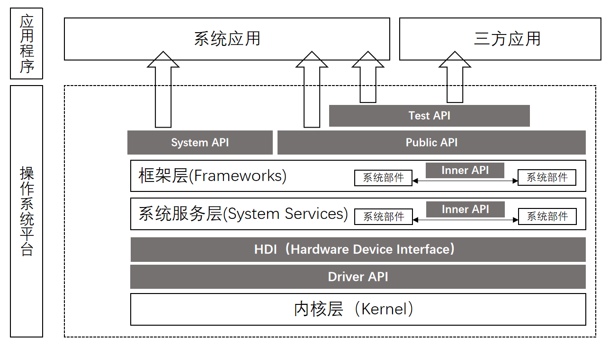
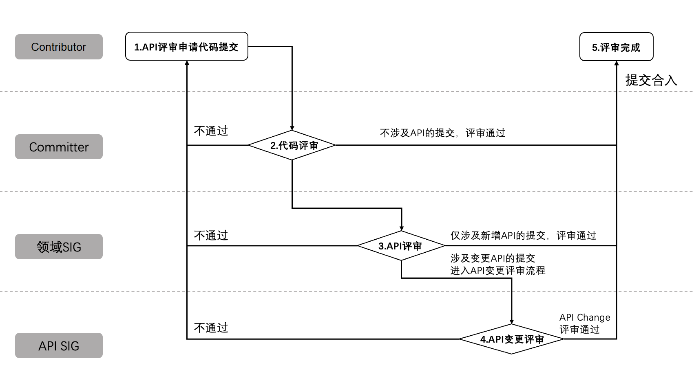

# OpenHarmony API治理章程

## 总览

为了引导OpenHarmony生态健康、有序发展和演进，本章程对OpenHarmony API的新增、变更、废弃、删除等生命周期与治理流程进行约束，同时定义了基本的API设计要求。

本章程由[API SIG](https://www.openharmony.cn/SIG/api/)制定，经[PMC](https://www.openharmony.cn/community/pmc/)批准发布；对本章程的修订必须经由API SIG评审后，由PMC批准发布。

## 概述

### 范围与定义

OpenHarmony软件栈中包含了多个角色，因此API也分作多种类型。

不同的API类型其兼容性要求也不一样，具体如下表所述：

| 类型 | 提供者 | 使用者 | 兼容性要求 | 看护手段|
|---|---|---|---|---|
| Public API | 系统与框架 | 所有应用开发者 | 5个API版本| XTS|
| Test API | 测试框架  | 所有应用开发者| 3个API版本| 待构建 |
| System API |  系统与框架 |系统应用开发者 |不承诺| 待构建 |
| HDI | HDF| 系统服务 | 4个API版本| XTS |
| Driver API | HDF | 驱动开发者 | 不承诺 | 无 |
| Inner API | 系统部件 | 系统部件 | 不承诺 | 无 |

各类型API说明如下：

* Public API：OpenHarmony对所有应用开发者公开的API。
* Test API：测试专用的API，仅在测试阶段使用。
* System API：提供给系统特权应用使用的API，普通应用无法使用。
* HDI：描述硬件能力的接口。
* Driver API：提供给驱动开发者使用的接口。
* Inner API：系统服务和框架实现彼此调用的API，仅供系统内部使用，不承诺兼容性。

### API与编程语言

OpenHarmony的目标是构建面向万物互联时代的新一代操作系统，其实现涵盖但不限于以下编程语言：

* C/C++
* JavaScript
* TypeScript
* ArkTS

本章程所描述的内容与编程语言无关。即：在不违反编程语言要求的情况下，API不分编程语言都要遵守章程的要求。

## API治理

### 角色与职责

|**涉及角色**|**API治理中的职责**|
| - | - |
|Contributor|API的设计和交付主体，负责API相关的代码与设计文档提交。|
|Committer|API相关的代码评审，涉及API提交预审。|
|领域SIG| 新增API相关的代码提交评审，领域SIG评审通过即可合入。 变更API相关的代码提交预审。|
|API SIG|变更API相关的代码提交评审。|
|PMC|API Version计划发布、API治理章程修订评审发布等。|

### API评审流程
API评审流程如下：

主要过程说明：

1. API评审申请、代码提交（Owner：Contributor），所有涉及API新增或变更需同步提交相应的API评审文档，详细说明API的需求来源、场景与使用方法、权限设计、隐私保护澄清等，详见后面的API评审申请要素。为避免后续的返工，Contributor可以在正式的API评审申请、代码提交之前，先通过邮件方式将API设计文档提交Committer、领域SIG、API SIG等相关人员预审。
1. 代码评审（Owner：Committer），代码评审和API预审，涉及API提交Code Review通过后，还需要进一步领域SIG评审。如果单次提交同时涉及多个领域的API新增或变更，相应的API评审申请和代码需要同时提交给相关领域的Committer评审，只有所有对应领域的Committer都完成CodeReview后才能进入下一评审环节。
1. API评审（Owner：领域SIG），新增API相关的代码提交评审，领域SIG评审通过即可代码合入；变更API相关的代码提交，领域SIG评审通过后，还需要进一步提交API SIG。如果单次提交同时涉及多个领域的API新增，相应的API评审申请和代码需要同时提交给相关领域的SIG评审，只需一个领域SIG评审通过即可代码合入。如果单次提交同时涉及多个领域的API变更，相应的API评审申请和代码需要同时提交给相关领域的SIG评审，只有所有对应领域的SIG都要评审通过才能进入下一评审环节。
1. API变更评审（Owner：API SIG），变更API相关的代码提交评审，评审通过即可编码。
1. 评审完成。

### API评审申请要素

如果涉及API新增或变更需同步提交相应的API评审文档。API评审文档使用[《OpenHarmony API 评审模板》](API-Review-Template.md)描述。

针对新增API，需要包含如下要素：
1. （必选）需求来源与使用场景。
1. （必选）API现状与差距分析，说明API新增或变更的必要性。
1. （可选）API原型设计与使用方法说明（必须）；必要时，可以进一步包含相应的使用样例。
1. （必选）API权限设计。
1. （必选）API隐私保护方案与要求满足情况澄清；
1. （可选）提交代码的同时提交相应的API参考（必须）；必要时，可同步提交相应的开发者指南文档。
1. （可选）兼容性/性能/功耗/可靠性/测试等相关情况说明（如不满足本章程 “API设计要求”，则必须包含相关说明）。

针对变更API，需要额外包含如下要素：
1. 针对老接口的处理方式（废弃、隐藏或彻底删除）以及对使用老SDK开发应用的兼容措施（必须）；
2. 变更影响、替代接口和相应的应用适配方案（必须）。
3. 刷新ChangeLog（必须） 和 API-diff文档（涉及JS/Native API变更，必须）。

## API的生命周期和兼容性要求

OpenHarmony API会以API version的形式逐步演进。每个版本会经历如下图的发布周期。

不同周期的API其兼容性要求如下所述：

   1. Canary版本：早期发布的预览版本，不承诺API稳定。
       1. 对上一Release发布版本保持API兼容。
       1. 相同API Version的多个Canary版本之间无API兼容性要求。
   1. Beta版本：公开发布的Beta测试版本，不承诺API稳定。
       1. 对上一Release发布版本保持API兼容。
       1. 对同一API Version的早期发布的Canary版本不兼容。
       1. 相同API Version的多个Beta版本之间无API兼容性要求。
       1. API Stable版本发布之后API即冻结，之后再发布的Beta版不允许任何形式的API新增或变更。
   1. Release版本：正式发布版本。
       通过Release版本对外发布的API，需要遵守对外部开发者的“契约承诺”，原则上不允许对已经Release发布的API进行不兼容修改，受限允许对已发布的API进行废弃。已经Release发布的API废弃基本要求包括：
       1. 废弃接口标记。
       1. 提供可替代接口。
       1. 废弃API至少保留5个API Version版本（对废弃5个API Version的API可以彻底删除，不再支持）。

### API 设计规范

关于这部分内容，请参见[《OpenHarmony API设计规范》](OpenHarmony-API-quality.md)。
