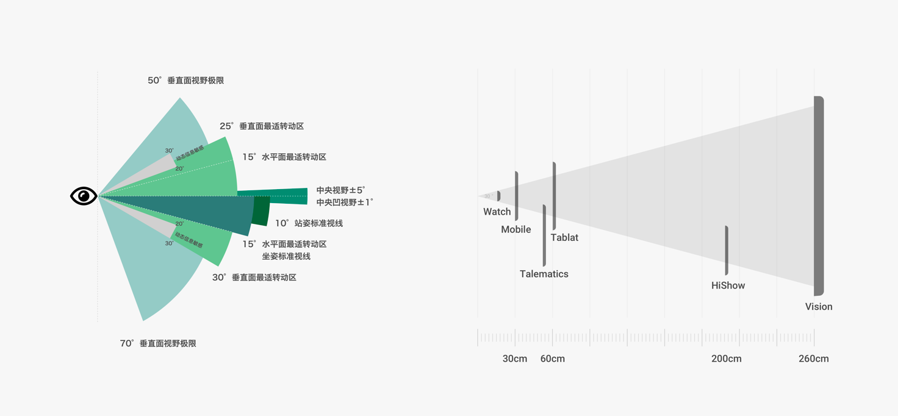

# 交互基础

在全场景的数字体验中，越来越多类型的智能终端设备分布在用户的日常生活中，可交互的用户界面广泛存在于默认设备、平板、PC、智能穿戴设备、智慧屏、车机、虚拟现实（VR）和增强现实（AR）等设备上。应用可能在多种设备上运行或在单一设备上被用户通过多种输入方式操控，也可能在多种距离上被用户操控。这需要其用户界面能够识别和支持不同的交互场景，以便用户以习惯的、舒适的方法与其进行交互。

## 输入方式

典型的输入方式包括但不限于触屏上手指/手写笔等直接交互、鼠标/触摸板/键盘/表冠/遥控器/车机摇杆/旋钮/手柄/隔空手势等间接交互、以及语音交互。

设计和开发应用时，**设计师和开发者应考虑到应用具有使用多种输入方式的可能性**，并实现相应的功能，保证在当前输入方式下应用能够以正确的、符合用户习惯的方式进行响应。

## 交互距离

典型的设备交互距离包括但不限于15cm（智能穿戴设备）、30cm（默认设备）、60cm（桌面设备）、260cm（大屏），具体距离会在用户使用过程中产生一定范围的变化。

设计和开发应用时，设计师和开发者应考虑到多种距离下使用的可能性，保证界面元素的大小、展示信息的密度符合用户的预期。

