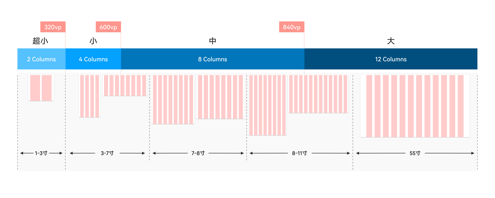

# 响应式布局

当基本的自适应布局无法满足多终端上屏幕的体验要求时，我们需要针对不同终端的屏幕特点，设定容器与栅格的关系达到响应式的布局。通常响应式布局能根据栅格断点变化进行有级变化。

## 栅格断点系统

根据设备的水平宽度，OpenHarmony提供了断点系统，覆盖超小、小、中、大 四种屏幕类型，并结合栅格系统默认提供了对应 Column 的数量关系。不同的设备根据自身屏幕水平宽度，在不同的断点范围，系统将自动匹配不同数量的栅格。应用也可针对具体界面自定义栅格。

栅格断点系统与日常使用的设备屏幕类型有一定的对应关系，例如：超小对应智能穿戴设备，小对应默认设备，中对应平板，大对应智慧屏与PC。设计师可面向希望运行的设备进行所属屏幕类型的适配。

随着智能设备种类的增加，越来越多产品在四种屏幕类型上具备不同的交互能力，如支持触摸的运动相机（小）、仅支持遥杆的手持云台（小-中）、不可移动的智能台灯（中-大）等，需结合具体设备交互进行对应设计，不可一概而论。

## 缩进布局

为了在宽屏上内容显示有更好的效果，在不同宽度的设备上进行不同缩进效果。

缩进适用于，因宽度明显变大，内容拉伸以后导致屏幕空白内容超过50%，或文本内容过长（每行大于30字），但没有上下级界面可供同时展示或上下级界面不适合同时显示的场景。

OpenHarmony提供的默认实现为，当栅格为8column或12column时可以响应6column和8column的缩进布局。

## 挪移布局

利用屏幕的宽度优势，将原先的上下布局切换成左右布局。

例如，上下排布的插画和文字，横屏后左右排布。

挪移布局适用于横竖屏切换，以及类似的宽高比明显变化（大于200%）同时希望保证内容完整的场景。

## 重复布局

利用屏幕的宽度优势，将相同属性的组件横向并列排布。

重复布局适用于对宽高比敏感的图片和及组合内容，当内容缩放以后导致原图放大超过150%的场景。

OpenHarmony栅格系统提供的分栏实现为，当栅格为8column或12column时可以将默认4栅格的页面整体进行重复布局。

响应式布局对应OpenHarmony系统提供的布局能力中的栅格断点系统和媒体查询，详见本文 “[响应式布局](responsive-layout.md)”。
