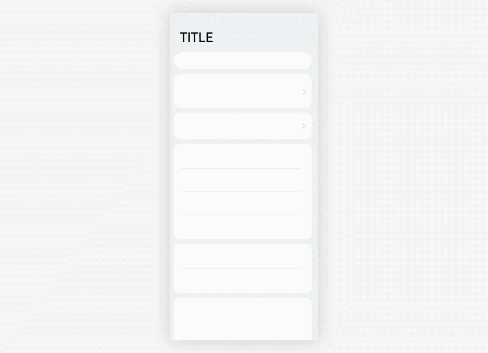
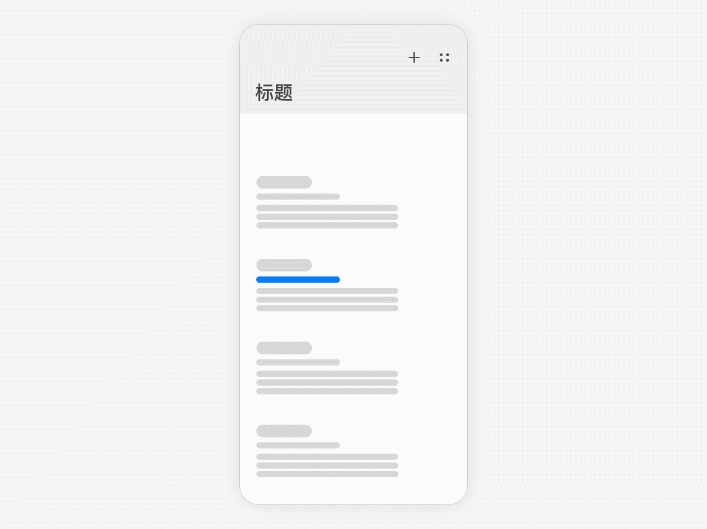

# 转场动效

衔接页面与页面间或元素与元素间的过渡动画称之为转场动效，帮助用户理解界面以及元素之间的逻辑关系，比如打开应用动效，日程切换动效，在系统占比最高的动效类型60%以上。在鸿蒙的转场动效设计上，我们推出了一镜到底的高级转场设计手法，可以提升视觉流畅性的同时又能增强动效品质感。

## 层级关系

层级关系由系统架构和应用架构定义，它确定了转场动效的交互目的。不同的转场设计会传递不同的交互层级隐喻，不合理的动效编排会让用户误解，从而导致用户主观感受下降，流畅体验感较差。在设计转场动效时，首先要理解应用之间和页面元素之间的架构关系，再运用合适的设计手法完成动效设计表达。

### 同层级

转场后的页面或元素与当前的在同一层级上 应用场景：编辑，页签，横竖屏转场等

编辑操作

### 上下层级

转场后的页面或元素与当前的存在上下层级关系 应用场景：上下级页面，新建，解锁，搜索转场等

|   |   | |
| -------- | -------- | -------- |
| 应用内的父子转场，两个界面通过左右切换明确了层级关系 | 新建转场 | 应用退出到桌面图标，清晰地展示了应用所在的位置 | 

### 跨层级

适用于应用之间的跳转 应用场景：从一个应用转到其他应用

## 运动编排

在界面变化过程中，将各个部分元素进行分类，协调相互之间的运动方式，使整个过程自然流畅，并合理引导用户的注意力。

### 场景解构

转场是由交互行为引起的界面变化，分析界面元素在过程中的意义，定义其在转场中所在的类型，并将它们进行分类，元素所属的类别会影响它们使用怎么的转场方式，同时也将决定用什么类型的曲线和时长。

- **进场元素**
  转场中新出现的元素，一般是结果界面上的构成元素

- **出场元素**
  转场中消失的元素，一般是上一界面中的构成元素

- **持续元素**
  转场中持续存在的元素，可以是元素在布局上的变化，也可以是某种连续性的动画效果，整个过程无中断

- **静止元素**
  转场中无任何变化的元素

  

  ①进场元素    ②出场元素    ③持续元素    ④静⽌元素

## 一镜到底

一镜到底属于是通过共享元素的一种转场编排方式，有助于提升用户操作任务的效率，增强视觉的流畅感，是转场设计中重点推荐的技法。

- 共享元素

- 共享容器

- 共享动势

### 共享元素

共享元素一般是转场前后持续存在的界面元素，即上文提到的持续元素，是在转场发生后希望用户关注到的焦点元素，它增强了转场的连续感。

此案例中，搜索框是共享元素

### 共享容器

当一组元素在过渡时包含明确的边界，可使用容器来让转换过程有连续感。容器通过大小、高度、圆角等属性进行补间过渡转换，容器内的元素可通过淡入淡出或共享元素的手法进行过渡。

通过共用容器将转场前后不同界面成组，一致的容器动画让过渡有连续感

### 共享动势

无中间属性，无法通过补间变化来实现柔和过渡，需要提取出可用的共享转换属性，来实现前后的平滑过渡。常用的共享运动属性有位移、缩放、旋转等。

|   |   |
| -------- | -------- |
| 共享缩放运动 | 共享旋转运动（大屏demo） | 

## 淡入淡出

淡入淡出是通过透明度变化来实现过渡转场，适用于无中间属性的组件或元素之间进行过渡变化，可参考以下手法：

### 1、单向淡入淡出

在前后层叠的场景中，只有前景元素进行淡入或淡出动作，下方元素无变化。

### 2、交叉淡入淡出

存在出场元素与进场元素的场景下，根据元素图形特点进行淡入淡出效果处理。一般进出场元素样式一致或近似，可考虑使用同时进行透明度变化的方式；视觉样式上不同类型的进出场元素，为避免交叠状态带来视觉上的混乱，可适当错开出场元素淡出和进场元素淡入的时机。

