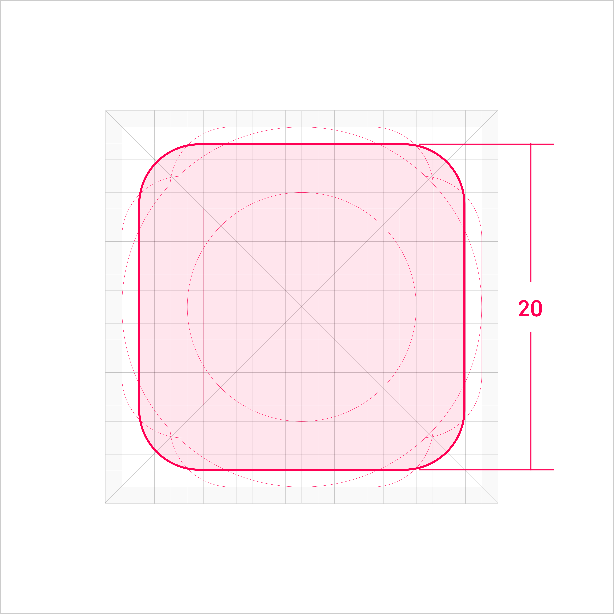
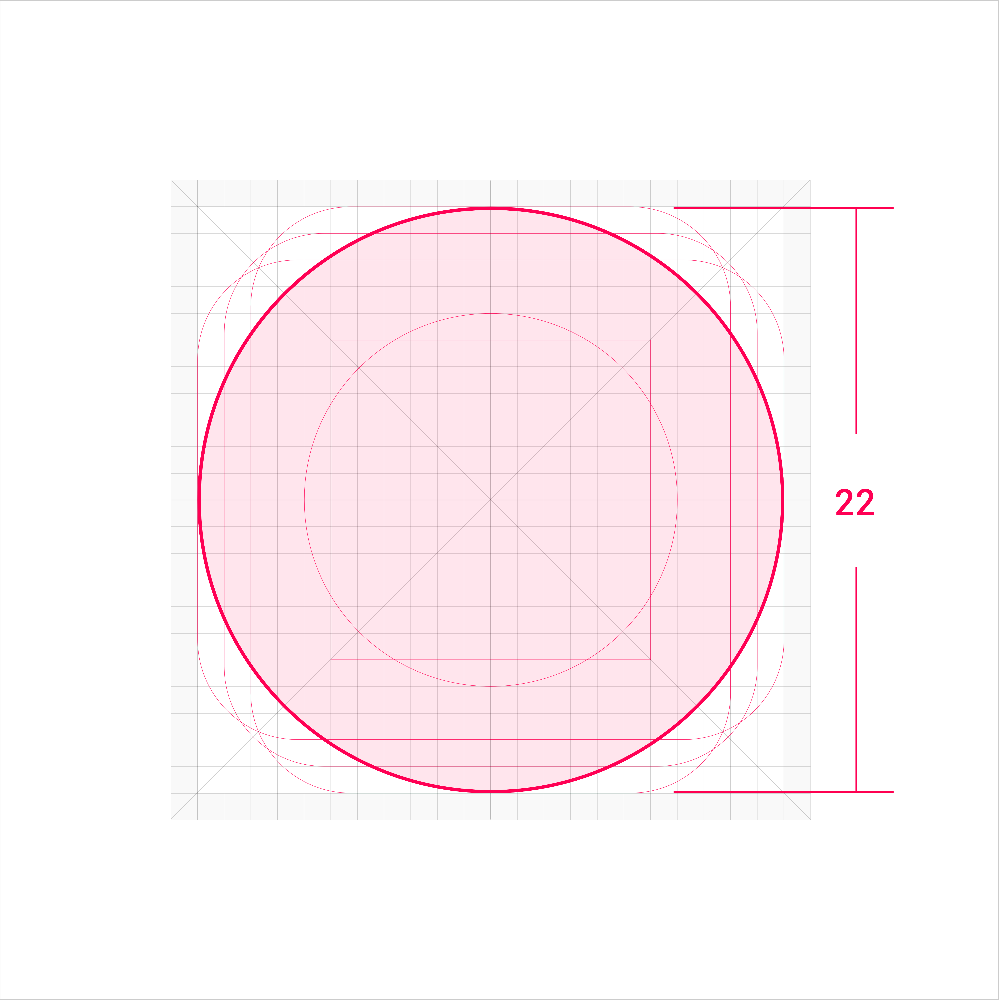
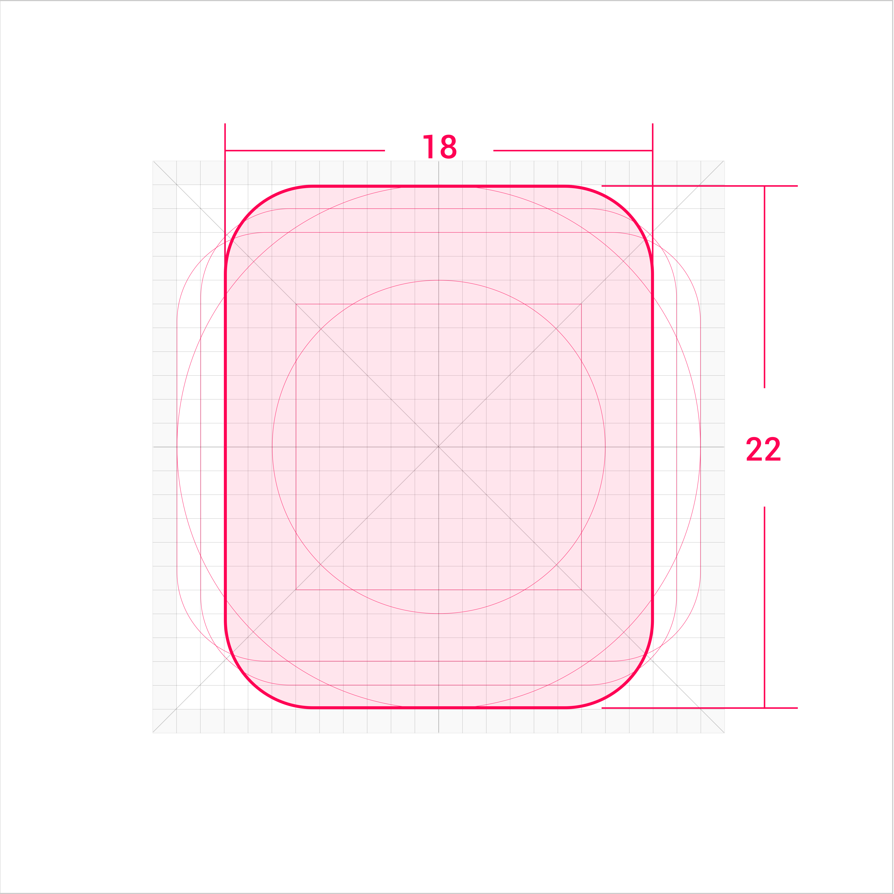
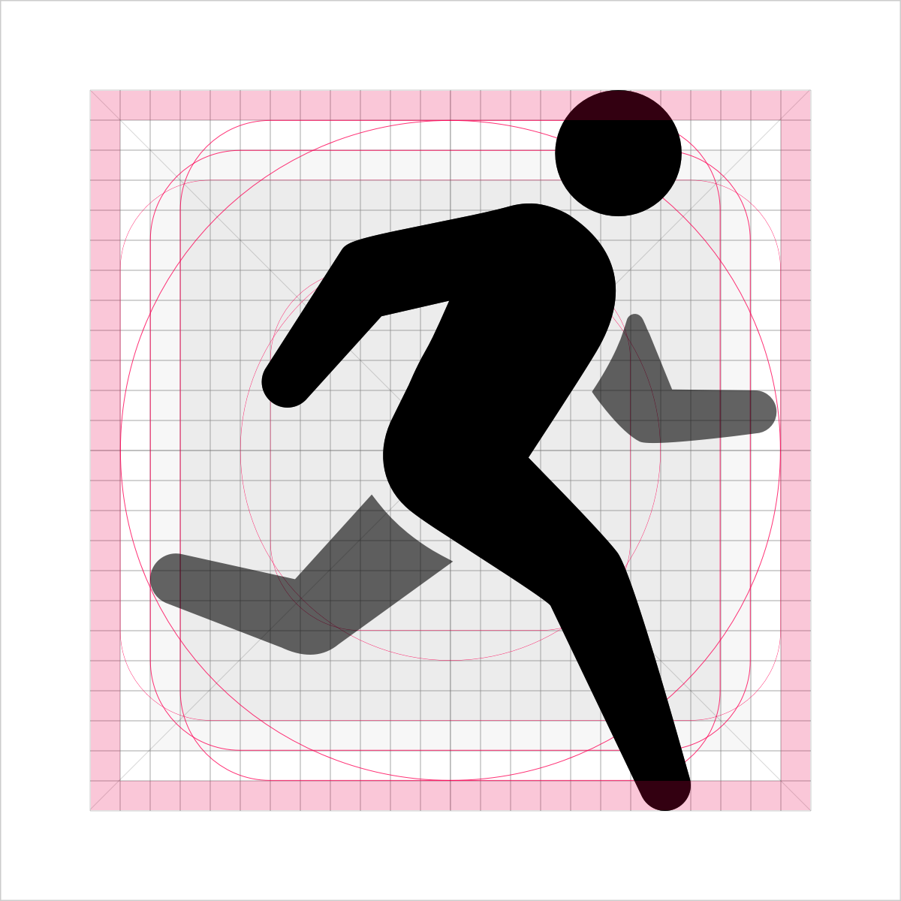
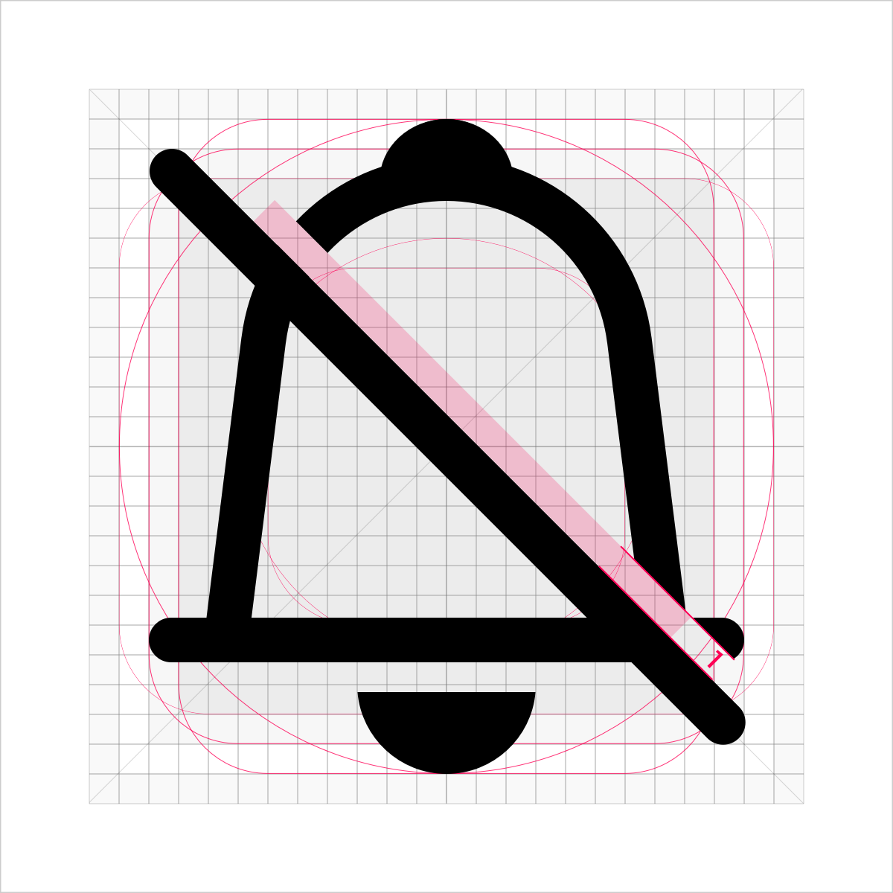

# 图标

图标是操作系统与用户界面关键的视觉元素之一。图标应当具备直接识别关键信息或语义的特质，帮助用户轻松辨别图标所代表的含义。为了保证用户在不同的设备中视觉体验的一致性，在图标的设计上应当保持应用图标的元素一致，再根据不同的设备匹配对应的图标背板以适应于各种场景。除此之外，图标在颜色的使用上应当遵循符合人因的色彩规则，满足用户阅读的舒适度以及整体界面的和谐程度。对于面状图标与线状图标的使用也应当遵循系统的设计规则，两种样式使用同一种图形结构，降低用户阅读时再次识别的成本。

## 设计原则

OpenHarmony系统图标追求精致简约、独特考究的设计原则，主要运用几何型塑造图形，精简线条的结构，精准把握比例关系。在造型和隐喻上增加年轻化的设计语言，使整体风格更加年轻时尚。避免尖锐直角的使用，在情感表达上给用户传递出亲近、友好的视觉体验。

| 
精致简约
 | 
独特考究
|
|  --------  |  --------  |
| 脱胎于几何形状，精简的线条，精确控制比例和结构位置。 | 运用开口细节交代线条的穿插和叠压关系，所形成的负型巧妙的体现结构产生的阴影和空间感。    | 
|  |      | 

## 图标样式

系统图标根据不同场景使用描边图形与填充图形两种样式，两种样式使用同一结构图形，使他们看起来具有一致的视觉体验。 图标根据不同的使用场景，分为单色图标和双色图标，单色图标用于系统界面中辅助表达基础功能。
  |  |  |
| -------- | -------- |
  | 描边图形 |填充图形 |
  
双色图标是基于填充图形样式做的多彩双色效果，多用于需要突出或强调功能的场景。
  |   |  |
| -------- | -------- |
| 状态图标-关 | 状态图标-开  |
|  |  | 
|功能型入口图标 | 运营类入口图标 | 

## 图形大小布局

系统图标设计以 24vp 为标准尺寸，中央 22vp 为图标主要绘制区域，上下左右各留 1vp 作为空隙。

  |  ||
| -------- | -------- |
  |活动区域&nbsp;Living&nbsp;area |空隙区域&nbsp;Space&nbsp;area |

**关键形状**

关键线的形状是网格的基础。利用这些核心形状做为向导，即可使整个产品相关的图标保持一致的视觉比例及体量。

  |  | |
| -------- | -------- |
|正方形 宽高&nbsp;20vp | 圆形 直径&nbsp;22vp | 
|  |  | 
|横长方形 宽&nbsp;22vp 高&nbsp;18vp |竖长方形 宽&nbsp;18vp 高&nbsp;22vp | 

**额外视觉重量**

若图标形状特殊，需要添加额外的视觉重量实现整体图标体量平衡，绘制区域可以延伸到空隙区域内，但图标整体仍应保持在24vp大小的范围之内。

  | |  |
| -------- | -------- |

**图形重心**
找准图标视觉重心，使其在图标区域中心；允许在保证图标重心稳定的情况下，图标部分超出绘制活动范围，延伸至间隙区域内。
  |  | |
| -------- | -------- |
| 推荐 | 不推荐 | 

## 图形特征

1. 描边粗细：1.5vp

2. 终点样式：圆头

3. 外圆角：4vp，内圆角：2.5vp

4. 断口宽度：1vp

  | | |
| -------- | -------- |
|  | **切断定义** 1.&nbsp;切断效果，保留上方的切断留白，下方保留连接 2.&nbsp;断口宽度：1vp 3.&nbsp;切断面应保持平直的被切效果 4.&nbsp;斜线从左上至右下，角度为45° | 

**图形叠加**

两个图形的叠加使用，表示群、组、集的概念。
图形与图形之间需留出1vp的间隙
  |  |  |
| -------- | -------- |
|  推荐 |  不推荐 | 

 图形间隙的拐角处同样需要添加3.5vp内圆角

|   |    |
|  --------  |  --------  |
|  推荐   | 不推荐   | 

## 图标资源命名规则

**命名逻辑顺序样例： ic_模块_功能_位置_颜色_状态_数字**

ic_模块_功能，为必选项；位置_颜色_状态_数字，可根据实际情况选填。

注： 资源名要求全部为小写字母，长字段可以尽量用缩写，命名中不能有空格，不同字段之间以“_”分隔。

关于OpenHarmony默认提供的图标库，详见：[资源](design-resources.md)
