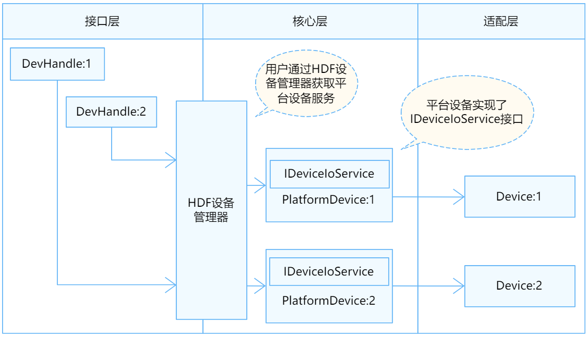

# Watchdog

## 概述

### 功能简介

看门狗（Watchdog），又称看门狗计时器（Watchdog timer），是一种硬件计时设备。一般有一个输入、一个输出，输入叫做喂狗，输出连接到系统的复位端。当系统主程序发生错误导致未及时清除看门狗计时器的计时值时，看门狗计时器就会对系统发出复位信号，使系统从悬停状态恢复到正常运作状态。

### 基本概念

系统正常工作的时候，每隔一段时间输出一个信号到喂狗端，给看门狗清零，这个操作就叫做喂狗。如果超过规定的时间不喂狗，看门狗定时超时，就会给出一个复位信号到系统，使系统复位。

### 运作机制

在HDF框架中，Watchdog接口适配模式采用独立服务模式（如图1所示）。在这种模式下，每一个设备对象会独立发布一个设备服务来处理外部访问，设备管理器收到API的访问请求之后，通过提取该请求的参数，达到调用实际设备对象的相应内部方法的目的。独立服务模式可以直接借助HDF设备管理器的服务管理能力，但需要为每个设备单独配置设备节点，增加内存占用。

独立服务模式下，核心层不会统一发布一个服务供上层使用，因此这种模式下驱动要为每个控制器发布一个服务，具体表现为：

- 驱动适配者需要实现HdfDriverEntry的Bind钩子函数以绑定服务。
- device_info.hcs文件中deviceNode的policy字段为1或2，不能为0。

Watchdog模块各分层作用：

- 接口层提供打开看门狗设备、获取看门狗设备状态、启动看门狗设备、设置看门狗设备超时时间、获取看门狗设备超时时间、喂狗、停止看门狗设备超时时间、关闭看门狗设备的接口。
- 核心层主要提供看门狗控制器的添加、移除以及管理的能力，通过钩子函数与适配层交互。
- 适配层主要是将钩子函数的功能实例化，实现具体的功能。

**图 1** Watchdog独立服务模式结构图



## 开发指导

### 场景介绍

对于无法直接观测到的软件异常，我们可以使用看门狗进行自动检测，并在异常产生时及时重置。当驱动开发者需要将Watchdog设备适配到OpenHarmony时，需要进行Watchdog驱动适配。下文将介绍如何进行Watchdog驱动适配。

### 接口说明

为了保证上层在调用Watchdog接口时能够正确的操作Watchdog控制器，核心层在//drivers/hdf_core/framework/support/platform/include/watchdog/watchdog_core.h中定义了以下钩子函数，驱动适配者需要在适配层实现这些函数的具体功能，并与钩子函数挂接，从而完成适配层与核心层的交互。

WatchdogMethod定义：

```c
struct WatchdogMethod {
    int32_t (*getStatus)(struct WatchdogCntlr *wdt, int32_t *status);
    int32_t (*setTimeout)(struct WatchdogCntlr *wdt, uint32_t seconds);
    int32_t (*getTimeout)(struct WatchdogCntlr *wdt, uint32_t *seconds);
    int32_t (*start)(struct WatchdogCntlr *wdt);
    int32_t (*stop)(struct WatchdogCntlr *wdt);
    int32_t (*feed)(struct WatchdogCntlr *wdt);
    int32_t (*getPriv)(struct WatchdogCntlr *wdt);  // 【可选】如果WatchdogCntlr中的priv成员存在，则按需实例化
    void (*releasePriv)(struct WatchdogCntlr *wdt); // 【可选】
};
```

**表1** WatchdogMethod成员的钩子函数功能说明

| 成员函数 | 入参 | 出参 | 返回值 | 功能 |
| -------- | -------- | -------- | -------- | -------- |
| getStatus | wdt：结构体指针，核心层Watchdog控制器 | status：int32_t类型指针，表示获取的看门狗的状态（打开或关闭） | HDF_STATUS相关状态 | 获取看门狗状态 |
| setTimeout | wdt：结构体指针，核心层Watchdog控制器；seconds：设置的看门狗超时时间 | 无 | HDF_STATUS相关状态 | 设置看门狗超时时间，单位秒，需要保证看门狗实际运行的时间符合该值 |
| getTimeout  | wdt：结构体指针，核心层Watchdog控制器                        | seconds：uint32_t类型指针，表示获取的超时时间                | HDF_STATUS相关状态 | 获取看门狗超时时间                                           |
| start       | wdt：结构体指针，核心层Watchdog控制器                        | 无                                                           | HDF_STATUS相关状态 | 启动看门狗                                                   |
| stop        | wdt：结构体指针，核心层Watchdog控制器                        | 无                                                           | HDF_STATUS相关状态 | 停止看门狗                                                   |
| feed | wdt：结构体指针，核心层Watchdog控制器 | 无 | HDF_STATUS相关状态 | 喂狗 |
| getPriv | wdt：结构体指针，核心层Watchdog控制器 | 无 | HDF_STATUS相关状态 | 获取看门狗驱动的私有数据 |
| releasePriv | wdt：结构体指针，核心层Watchdog控制器 | 无 | HDF_STATUS相关状态 | 释放看门狗驱动的私有数据 |

### 开发步骤

Watchdog模块适配包含以下四个步骤：

- 实例化驱动入口。
- 配置属性文件。
- 实例化Watchdog控制器对象。
- 驱动调试。

### 开发实例

下方将基于Hi3516DV300开发板以//device/soc/hisilicon/common/platform/watchdog/watchdog_hi35xx.c驱动为示例，展示需要驱动适配者提供哪些内容来完整实现设备功能。

1. 实例化驱动入口。

    驱动入口必须为HdfDriverEntry（在 hdf_device_desc.h 中定义）类型的全局变量，且moduleName要和device_info.hcs中保持一致。HDF框架会将所有加载的驱动的HdfDriverEntry对象首地址汇总，形成一个类似数组的段地址空间，方便上层调用。
    一般在加载驱动时HDF会先调用Bind函数，再调用Init函数加载该驱动。当Init调用异常时，HDF框架会调用Release释放驱动资源并退出。

    Watchdog驱动入口开发参考：

    ```c
    struct HdfDriverEntry g_watchdogDriverEntry = {
        .moduleVersion = 1,
        .Bind = Hi35xxWatchdogBind,               // 见Bind参考
        .Init = Hi35xxWatchdogInit,               // 见Init参考
        .Release = Hi35xxWatchdogRelease,         // 见Release参考
        .moduleName = "HDF_PLATFORM_WATCHDOG",    // 【必要且与HCS文件中里面的moduleName匹配】
    };
    HDF_INIT(g_watchdogDriverEntry);              // 调用HDF_INIT将驱动入口注册到HDF框架中
    ```

2. 配置属性文件。

   完成驱动入口注册之后，需要在device_info.hcs文件中添加deviceNode描述。deviceNode信息与驱动入口注册相关。本例以一个Watchdog控制器为例，如有多个器件信息，则需要在device_info文件增加对应的deviceNode描述。器件属性值与核心层WatchdogCntlr成员的默认值或限制范围有密切关系，比如Watchdog设备号，需要在watchdog_config.hcs文件中增加对应的器件属性。

   - device_info.hcs 配置参考：

      在//vendor/hisilicon/hispark_taurus/hdf_config/device_info/device_info.hcs文件中添加deviceNode描述。

      ```c
      root {
          device_info {
              match_attr = "hdf_manager";
              device_watchdog :: device {                                 // 设备节点
                  device0 :: deviceNode {                                 // 驱动的DeviceNode节点
                      policy = 2;                                         // policy字段是驱动服务发布的策略,如果需要面向用户态，则为2
                      priority = 20;                                      // 驱动启动优先级
                      permission = 0644;                                  // 驱动创建设备节点权限
                      moduleName = "HDF_PLATFORM_WATCHDOG";               // 【必要】用于指定驱动名称，该字段的值必须和驱动入口结构的moduleName值一致
                      serviceName = "HDF_PLATFORM_WATCHDOG_0";            // 【必要】驱动对外发布服务的名称，必须唯一。
                      deviceMatchAttr = "hisilicon_hi35xx_watchdog_0";    // 【必要】用于配置控制器私有数据，必须和驱动私有数据配置表watchdog_config.hcs中的match_attr值保持一致。
                  } 
              }
          }
      } 
      ```

   - watchdog_config.hcs 配置参考：

      在//device/soc/hisilicon/hi3516dv300/sdk_liteos/hdf_config/watchdog/watchdog_config.hcs文件配置器件属性，其中配置参数如下：

      ```c
      root {
          platform {
              template watchdog_controller {                     // 【必要】配置模板，如果下面节点使用时继承该模板，则节点中未声明的字段会使用该模板中的默认值
                  id = 0;                                        // watchdog ID号
                  match_attr = "";
                  regBase = 0x12050000;                          // 【必要】地址映射需要，物理基地址
                  regStep = 0x1000;                              // 【必要】地址映射需要，寄存器偏移步进
              }
              controller_0x12050000 :: watchdog_controller {     // 【必要】是作为设备驱动私有数据匹配的关键字
                  match_attr = "hisilicon_hi35xx_watchdog_0";    // 【必要】必须和device_info.hcs中的deviceMatchAttr值一致
              }
                                                                 // 如果存在多个watchdog设备时【必须】添加节点，否则不用
              ...
          }
      }
      ```

      需要注意的是，新增watchdog_config.hcs配置文件后，必须在产品对应的hdf.hcs文件中将其包含如下语句所示，否则配置文件无法生效。

      ```c
      #include "../../../../device/soc/hisilicon/hi3516dv300/sdk_liteos/hdf_config/watchdog/watchdog_config.hcs" // 配置文件相对路径
      ```

3. 实例化Watchdog控制器对象。

   完成驱动入口注册之后，下一步就是以核心层WatchdogCntlr对象的初始化为核心，包括驱动适配者自定义结构体（传递参数和数据），实例化WatchdogCntlr成员WatchdogMethod（让用户可以通过接口来调用驱动底层函数），实现HdfDriverEntry成员函数（Bind，Init，Release）。

   - 驱动适配者自定义结构体参考。

      从驱动的角度看，驱动适配者自定义结构体是参数和数据的载体，而且watchdog_config.hcs文件中的数值会被HDF读入通过DeviceResourceIface来初始化结构体成员，其中一些重要数值也会传递给核心层WatchdogCntlr对象，例如watchdog设备ID号。

      ```c
      struct Hi35xxWatchdog {
          struct WatchdogCntlr wdt;           // 【必要】是核心层控制对象，具体描述见下面
          OsalSpinlock lock;                  // 【必要】驱动适配者需要基于此锁变量对watchdog设备实现对应的加锁解锁
          volatile unsigned char *regBase;    // 【必要】地址映射需要，寄存器基地址
          uint32_t phyBase;                   // 【必要】地址映射需要，物理基址
          uint32_t regStep;                   // 【必要】地址映射需要，寄存器偏移步进
      };

      struct WatchdogCntlr {                  // WatchdogCntlr是核心层控制器结构体，其中的成员在Init函数中会被赋值。
          struct IDeviceIoService service;    // 驱动服务
          struct HdfDeviceObject *device;     // 驱动设备对象
          OsalSpinlock lock;                  // 自旋锁
          struct WatchdogMethod *ops;         // 钩子函数
          int16_t wdtId;                      // watchdog设备ID号
          void *priv;                         // 私有数据
      };
      ```

   - WatchdogCntlr成员钩子函数结构体WatchdogMethod的实例化，其他成员在Init和Bind函数中初始化。

      ```c
      static struct WatchdogMethod g_method = {      // 钩子函数实例化
          .getStatus = Hi35xxWatchdogGetStatus,      // 获取看门狗状态
          .start = Hi35xxWatchdogStart,              // 启动看门狗
          .stop = Hi35xxWatchdogStop,                // 停止看门狗
          .setTimeout = Hi35xxWatchdogSetTimeout,    // 设置看门狗超时时间
          .getTimeout = Hi35xxWatchdogGetTimeout,    // 获取看门狗超时时间
          .feed = Hi35xxWatchdogFeed,                // 喂狗
      };
      ```

   - Init函数和Bind函数开发参考：

      入参：

      HdfDeviceObject：HDF框架给每一个驱动创建的设备对象，用来保存设备相关的私有数据和服务接口。

      返回值：

      HDF_STATUS相关状态 （下表为部分展示，如需使用其他状态，可见//drivers/hdf_core/interfaces/inner_api/utils/hdf_base.h中HDF_STATUS的定义）。

      **表2** Init函数和Bind函数返回值和描述

      | 状态(值) | 问题描述 |
      | -------- | -------- |
      | HDF_ERR_INVALID_OBJECT | 控制器对象非法 |
      | HDF_ERR_MALLOC_FAIL | 内存分配失败 |
      | HDF_ERR_IO | I/O&nbsp;错误 |
      | HDF_SUCCESS | 初始化成功 |
      | HDF_FAILURE | 初始化失败 |

      函数说明：

      初始化自定义结构体对象，初始化WatchdogCntlr成员，调用核心层WatchdogCntlrAdd函数，完成看门狗控制器的添加。

      ```c
      // 一般而言，Init函数需要根据入参(HdfDeviceObject对象)的属性值初始化Hi35xxWatchdog结构体的成员，
      // 但watchdog_hi35xx.c示例中是在bind函数中实现的
      static int32_t Hi35xxWatchdogInit(struct HdfDeviceObject *device)
      {
          (void)device;
          return HDF_SUCCESS;
      }

      static int32_t Hi35xxWatchdogBind(struct HdfDeviceObject *device)
      {
          int32_t ret;
          struct Hi35xxWatchdog *hwdt = NULL;
          ...
          hwdt = (struct Hi35xxWatchdog *)OsalMemCalloc(sizeof(*hwdt)); //Hi35xxWatchdog 结构体指针的内存申请
          ...
          hwdt->regBase = OsalIoRemap(hwdt->phyBase, hwdt->regStep);    //地址映射
          ...
          hwdt->wdt.priv = (void *)device->property;                    // 【必要】此处是将设备属性的内容赋值给priv成员，但后续没有调用 priv 成员，
                                                                        // 如果需要用到priv成员，需要额外实例化WatchdogMethod的getPriv和releasePriv成员函数
          hwdt->wdt.ops = &g_method;                                    // 【必要】WatchdogMethod实例化对象的挂载
          hwdt->wdt.device = device;                                    // 【必要】这是为了方便HdfDeviceObject与WatchdogcCntlr相互转化
          ret = WatchdogCntlrAdd(&hwdt->wdt);                           // 【必要】调用此函数初始化核心层结构体，返回成功信号后驱动才完全接入平台核心层
          if (ret != HDF_SUCCESS) {                                     // 不成功的话，需要去除映射并释放Init函数申请的资源
              OsalIoUnmap((void *)hwdt->regBase);
              OsalMemFree(hwdt);
              return ret;
          }    
          return HDF_SUCCESS;
      }
      ```

   - Release函数开发参考：

      入参：

      HdfDeviceObject：HDF框架给每一个驱动创建的设备对象，用来保存设备相关的私有数据和服务接口。

      返回值：

      无。

      函数说明：

      该函数需要在驱动入口结构体中赋值给Release，当HDF框架调用Init函数初始化驱动失败时，可以调用Release释放驱动资源。该函数中需包含释放内存和删除控制器等操作。

      ```c
      static void Hi35xxWatchdogRelease(struct HdfDeviceObject *device)
      {
          struct WatchdogCntlr *wdt = NULL;
          struct Hi35xxWatchdog *hwdt = NULL;
          ...
          wdt = WatchdogCntlrFromDevice(device);    // 【必要】通过device获取WatchdogCntlr
          ...
          if (wdt == NULL) {
              return;
          }
          WatchdogCntlrRemove(wdt);                 // 【必要】调用WatchdogCntlrRemove函数来释放WatchdogCntlr对象的内容
          hwdt = (struct Hi35xxWatchdog *)wdt;      // 这里将WatchdogCntlr转化为Hi35xxWatchdog
          if (hwdt->regBase != NULL) {              // 【必要】解除地址映射
              OsalIoUnmap((void *)hwdt->regBase);
              hwdt->regBase = NULL;
          }
          OsalMemFree(hwdt);                        // 【必要】释放驱动适配者自定义对象占用的内存
      }
      ```

4. 驱动调试。

   【可选】针对新增驱动程序，建议验证驱动基本功能，例如挂载后的信息反馈，数据传输的成功与否等。