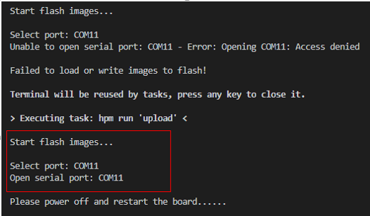
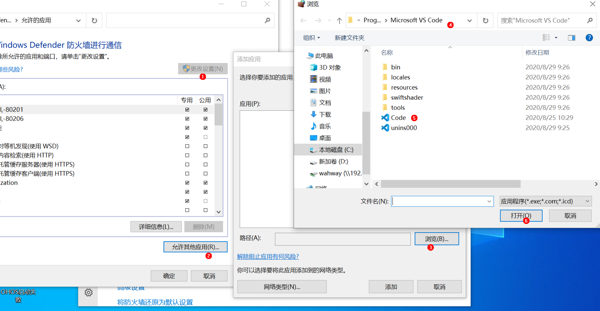

# 烧录常见问题

## 轻量和小型系统

### 烧写选择串口后提示“Error: Opening COMxx: Access denied”

- **现象描述**

  点击烧写并选择串口后，出现Error: Opening COMxx: Access denied。

    **图1** 打开串口失败图
    

- **可能原因**

  串口已经被占用。

- **解决办法**

  1. 按图依次选择下拉框，查找带有serial-xx的终端。
    

     **图2** 查找是否存在占用串口的终端
     

  2. 点击标号中的垃圾桶图标，关闭串口。
    
     **图3** 关闭串口终端 

     

  3. 重新点击烧写，选择串口并开始烧写程序。
    
     **图4** 重新启动烧写任务 

     

### 烧写失败

- **现象描述**

  点击烧写并选择串口后，出现无法烧写的情况。

- **可能原因**

  安装IDE插件DevEco后未重启。

- **解决方法**

  重启IDE。

### 串口无回显

- **现象描述**

  串口显示已连接，重启单板后，回车无任何回显。

- **可能原因1**

  串口连接错误。

- **解决办法**

  修改串口号。

  请查看设备管理器，确认连接单板的串口与终端中连接串口是否一致，若不一致，请按镜像运行内步骤1修改串口号。

- **可能原因2**

  单板U-boot被损坏。

- **解决办法**

  烧写U-boot。

  若上述步骤依旧无法连接串口，可能由于单板U-boot损坏，按下述步骤烧写U-boot。

  1. 获取引导文件U-boot。
     >  **须知：**
     > 单板的U-boot文件请在开源包中获取：
     > 
     > Hi3516DV300：device\hisilicon\hispark_taurus\sdk_liteos\uboot\out\boot\u-boot-hi3516dv300.bin
     > 
     > Hi3518EV300：device\hisilicon\hispark_aries\sdk_liteos\uboot\out\boot\u-boot-hi3518ev300.bin

  2. 根据USB烧写步骤烧写U-boot文件。
   按照[Hi3516系列USB烧写步骤](../quick-start/quickstart-ide-3516-burn.md)中描述的烧写方法，选择对应单板的U-boot文件进行烧写。

  3. 烧写完成后，登录串口如下图所示。

     **图5** U-boot烧写完成串口显示图 

     

### Windows电脑与单板网络连接失败

- **现象描述**

  点击烧写并选择串口后，无法获取文件。

    **图6** 网络不通，单板无法获取文件图 
  
    

- **可能原因**

  单板网络与Windows电脑不联通。

  Windows电脑防火墙未允许Visual Studio Code联网。

- **解决方法**

  1. 检查网线是否连接。

  2. 点击Windows防火墙。
    
     **图7** 网络防火墙设置图 
     
     

  3. 点击“允许应用通过防火墙”。
    
     **图8** 防火墙和网络保护界面图 
     
     

  4. 查找Visual Studio Code应用。
    
     **图9** 查找Visual Studio Code应用图 
    
     

  5. 勾选Visual Studio Code的专用和公用网络的访问权限。
    
     **图10** 允许Visual Studio Code应用访问网络 
  
     

### 烧录时无法识别到设备

- **现象描述**

  烧录操作时，烧录工具提示“没有发现设备”或“Check whether the board is connected”等信息。

- **可能原因**

  Windows电脑与开发板之间的线缆（烧录所需线缆，此处以USB线缆为例）未连接。  

  Windows电脑与开发板之间线缆对应的驱动未安装。

- **解决方法**

  1. 检查USB线缆是否连接。

  2. 在Windows环境中打开设备管理器。

  3. 打开“通用串行总线控制器”列表。
    
  4. 检查“USB Device”是否已安装驱动。如显示告警标识，说明Windows环境中未安装相应驱动。

  5. 请根据Windows环境的具体情况，安装“USB Device”的驱动（如FT23R USB UART Driver）后，重新操作。

  6. 如仍有其他问题，请查询对应FAQ。
   