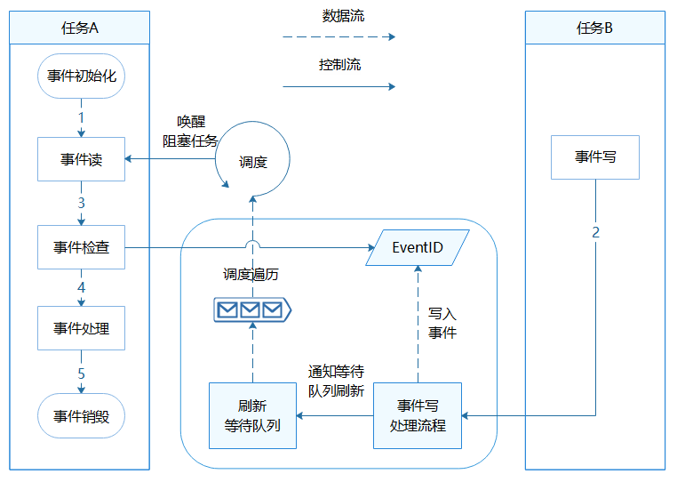

# 事件


## 基本概念

事件（Event）是一种任务间的通信机制，可用于任务间的同步操作。事件的特点是：

- 任务间的事件同步，可以一对多，也可以多对多。一对多表示一个任务可以等待多个事件，多对多表示多个任务可以等待多个事件。但是一次写事件最多触发一个任务从阻塞中醒来。

- 事件读超时机制。

- 只做任务间同步，不传输具体数据。

提供了事件初始化、事件读写、事件清零、事件销毁等接口。


## 运行机制

### 事件控制块

由事件初始化函数配置的一个结构体，在事件读写等操作时作为参数传入，用于标识不同的事件，控制块数据结构如下：


```
typedef struct tagEvent {
    UINT32 uwEventID;        /* 事件集合，表示已经处理（写入和清零）的事件集合 */
    LOS_DL_LIST stEventList; /* 等待特定事件的任务链表 */
} EVENT_CB_S, *PEVENT_CB_S;
```


### 事件运作原理

**事件初始化**：创建一个事件控制块，该控制块维护一个已处理的事件集合，以及等待特定事件的任务链表。

**写事件**：会向事件控制块写入指定的事件，事件控制块更新事件集合，并遍历任务链表，根据任务等待具体条件满足情况决定是否唤醒相关任务。

**读事件**：如果读取的事件已存在时，会直接同步返回。其他情况会根据超时时间以及事件触发情况，来决定返回时机：等待的事件条件在超时时间耗尽之前到达，阻塞任务会被直接唤醒，否则超时时间耗尽该任务才会被唤醒。

读事件条件满足与否取决于入参eventMask和mode，eventMask即需要关注的事件类型掩码。mode是具体处理方式，分以下三种情况：

- LOS_WAITMODE_AND：逻辑与，基于接口传入的事件类型掩码eventMask，只有这些事件都已经发生才能读取成功，否则该任务将阻塞等待或者返回错误码。

- LOS_WAITMODE_OR：逻辑或，基于接口传入的事件类型掩码eventMask，只要这些事件中有任一种事件发生就可以读取成功，否则该任务将阻塞等待或者返回错误码。

- LOS_WAITMODE_CLR：这是一种附加读取模式，需要与所有事件模式或任一事件模式结合使用（LOS_WAITMODE_AND | LOS_WAITMODE_CLR或 LOS_WAITMODE_OR | LOS_WAITMODE_CLR）。在这种模式下，当设置的所有事件模式或任一事件模式读取成功后，会自动清除事件控制块中对应的事件类型位。

**事件清零**：根据指定掩码，去对事件控制块的事件集合进行清零操作。当掩码为0时，表示将事件集合全部清零。当掩码为0xffff时，表示不清除任何事件，保持事件集合原状。

**事件销毁**：销毁指定的事件控制块。

  **图1** 轻量系统事件运作原理图

  


## 接口说明

| 功能分类 | 接口名 | 描述 |
| -------- | -------- | -------- |
| 事件检测 | LOS_EventPoll | 根据eventID，eventMask（事件掩码），mode（事件读取模式），检查用户期待的事件是否发生。<br/>&nbsp;&nbsp;**须知：**<br/>&nbsp;当mode含LOS_WAITMODE_CLR，且用户期待的事件发生时，此时eventID中满足要求的事件会被清零，这种情况下eventID既是入参也是出参。其他情况eventID只作为入参。 |
| 初始化 | LOS_EventInit | 事件控制块初始化。 |
| 事件读 | LOS_EventRead | 读事件（等待事件），任务会根据timeOut（单位：tick）进行阻塞等待；<br/>未读取到事件时，返回值为0；<br/>正常读取到事件时，返回正值（事件发生的集合）；<br/>其他情况返回特定错误码。 |
| 事件写 | LOS_EventWrite | 写一个特定的事件到事件控制块。 |
| 事件清除 | LOS_EventClear | 根据events掩码，清除事件控制块中的事件。 |
| 事件销毁 | LOS_EventDestroy | 事件控制块销毁。 |


## 开发流程

事件的典型开发流程：

1. 初始化事件控制块

2. 阻塞读事件控制块

3. 写入相关事件

4. 阻塞任务被唤醒，读取事件并检查是否满足要求

5. 处理事件控制块

6. 事件控制块销毁


>  **说明：**
> - 进行事件读写操作时，事件的第25bit(`0x02U << 24`)为保留bit位，不可以进行位设置。
> 
> - 对同一事件反复写入，算作一次写入。


## 编程实例


### 实例描述

示例中，任务ExampleEvent创建一个任务EventReadTask，EventReadTask读事件阻塞，ExampleEvent向该任务写事件。可以通过示例日志中打印的先后顺序理解事件操作时伴随的任务切换。

1. 在任务ExampleEvent创建任务EventReadTask，其中任务EventReadTask优先级高于ExampleEvent。

2. 在任务EventReadTask中读事件0x00000001，阻塞，发生任务切换，执行任务ExampleEvent。

3. 在任务ExampleEvent写事件0x00000001，发生任务切换，执行任务EventReadTask。

4. EventReadTask得以执行，直到任务结束。

5. ExampleEvent得以执行，直到任务结束。


### 示例代码

示例代码如下：

本演示代码在 ./kernel/liteos_m/testsuites/src/osTest.c 中编译验证，在TestTaskEntry中调用验证入口函数ExampleEvent。


```
#include "los_event.h"
#include "los_task.h"

/* 事件控制结构体 */
EVENT_CB_S g_exampleEvent;

/* 等待的事件类型 */
#define EVENT_WAIT 0x00000001

/* 等待超时时间 */
#define EVENT_TIMEOUT 100

/* 用例任务入口函数 */
VOID EventReadTask(VOID)
{
    UINT32 ret;
    UINT32 event;

    /* 超时等待方式读事件,超时时间为100 ticks, 若100 ticks后未读取到指定事件，读事件超时，任务直接唤醒 */
    printf("Example_Event wait event 0x%x \n", EVENT_WAIT);

    event = LOS_EventRead(&g_exampleEvent, EVENT_WAIT, LOS_WAITMODE_AND, EVENT_TIMEOUT);
    if (event == EVENT_WAIT) {
        printf("Example_Event, read event :0x%x\n", event);
    } else {
        printf("Example_Event, read event timeout\n");
    }
}

UINT32 ExampleEvent(VOID)
{
    UINT32 ret;
    UINT32 taskId;
    TSK_INIT_PARAM_S taskParam = { 0 };

    /* 事件初始化 */
    ret = LOS_EventInit(&g_exampleEvent);
    if (ret != LOS_OK) {
        printf("init event failed .\n");
        return LOS_NOK;
    }

    /* 创建任务 */
    taskParam.pfnTaskEntry = (TSK_ENTRY_FUNC)EventReadTask;
    taskParam.pcName       = "EventReadTask";
    taskParam.uwStackSize  = LOSCFG_BASE_CORE_TSK_DEFAULT_STACK_SIZE;
    taskParam.usTaskPrio   = 3;
    ret = LOS_TaskCreate(&taskId, &taskParam);
    if (ret != LOS_OK) {
        printf("task create failed.\n");
        return LOS_NOK;
    }

    /* 写事件 */
    printf("Example_TaskEntry write event.\n");

    ret = LOS_EventWrite(&g_exampleEvent, EVENT_WAIT);
    if (ret != LOS_OK) {
        printf("event write failed.\n");
        return LOS_NOK;
    }

    /* 清标志位 */
    printf("EventMask:%d\n", g_exampleEvent.uwEventID);
    LOS_EventClear(&g_exampleEvent, ~g_exampleEvent.uwEventID);
    printf("EventMask:%d\n", g_exampleEvent.uwEventID);

    /* 删除事件 */
    ret = LOS_EventDestroy(&g_exampleEvent);
    if (ret != LOS_OK) {
        printf("destory event failed .\n");
        return LOS_NOK;
    }

    return LOS_OK;
}
```


### 结果验证

编译运行得到的结果为：


```
Example_Event wait event 0x1
Example_TaskEntry write event.
Example_Event, read event :0x1
EventMask:1
EventMask:0
```
