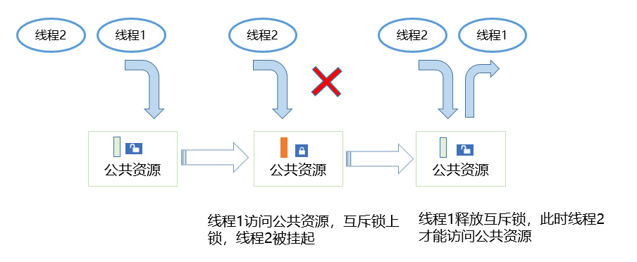

# 互斥锁


## 基本概念

互斥锁又称互斥型信号量，是一种特殊的二值性信号量，用于实现对共享资源的独占式处理。

任意时刻互斥锁的状态只有两种，开锁或闭锁。当任务持有互斥锁时，该互斥锁处于闭锁状态，这个任务获得该互斥锁的所有权。当该任务释放互斥锁时，该互斥锁被开锁，任务失去该互斥锁的所有权。当一个任务持有互斥锁时，其他任务将不能再对该互斥锁进行开锁或持有。

多任务环境下往往存在多个任务竞争同一共享资源的应用场景，互斥锁可被用于对共享资源的保护从而实现独占式访问。另外互斥锁可以解决信号量存在的优先级翻转问题。


## 运行机制

多任务环境下会存在多个任务访问同一公共资源的场景，而有些公共资源是非共享的，需要任务进行独占式处理。互斥锁怎样来避免这种冲突呢？

用互斥锁处理非共享资源的同步访问时，如果有任务访问该资源，则互斥锁为加锁状态。此时其他任务如果想访问这个公共资源则会被阻塞，直到互斥锁被持有该锁的任务释放后，其他任务才能重新访问该公共资源，此时互斥锁再次上锁，如此确保同一时刻只有一个任务正在访问这个公共资源，保证了公共资源操作的完整性。

  **图1** 轻量系统互斥锁运作示意图
  
  


## 接口说明

  **表1** 互斥锁模块接口

| 功能分类 | 接口描述 |
| -------- | -------- |
| 互斥锁的创建和删除 | LOS_MuxCreate：创建互斥锁。<br/>LOS_MuxDelete：删除指定的互斥锁。 |
| 互斥锁的申请和释放 | LOS_MuxPend：申请指定的互斥锁。<br/>LOS_MuxPost：释放指定的互斥锁。 |


## 开发流程

互斥锁典型场景的开发流程：

1. 创建互斥锁LOS_MuxCreate。

2. 申请互斥锁LOS_MuxPend。
   申请模式有三种：无阻塞模式、永久阻塞模式、定时阻塞模式。

   - 无阻塞模式：任务需要申请互斥锁，若该互斥锁当前没有任务持有，或者持有该互斥锁的任务和申请该互斥锁的任务为同一个任务，则申请成功。否则直接返回并继续运行当前任务，不会产生阻塞。
   - 永久阻塞模式：任务需要申请互斥锁，若该互斥锁当前没有被占用，则申请成功。否则，该任务进入阻塞态，系统切换到就绪任务中优先级高者继续执行。任务进入阻塞态后，直到有其他任务释放该互斥锁，阻塞任务才会重新得以执行。
   - 定时阻塞模式：任务需要申请互斥锁，若该互斥锁当前没有被占用，则申请成功。否则该任务进入阻塞态，系统切换到就绪任务中优先级高者继续执行。任务进入阻塞态后，指定时间超时前有其他任务释放该互斥锁，或者用户指定时间超时后，阻塞任务才会重新得以执行。

3. 释放互斥锁LOS_MuxPost。
   - 如果有任务阻塞于指定互斥锁，则唤醒被阻塞任务中优先级高的，该任务进入就绪态，并进行任务调度；
   - 如果没有任务阻塞于指定互斥锁，则互斥锁释放成功。

4. 删除互斥锁LOS_MuxDelete。

>  **说明：**
> - 互斥锁支持嵌套，即申请该互斥锁的任务与已经持有该互斥锁的任务为同一个任务时会认为申请成功，按申请次数对应的去释放该锁即可。
> 
> - 互斥锁不能在中断服务程序中使用。
> 
> - LiteOS-M内核作为实时操作系统需要保证任务调度的实时性，尽量避免任务的长时间阻塞，因此在获得互斥锁之后，应该尽快释放互斥锁。
> 
> - 持有互斥锁的过程中，不得再调用LOS_TaskPriSet等接口更改持有互斥锁任务的优先级。


## 编程实例


### 实例描述

本实例实现如下流程。

1. 任务ExampleMutex创建一个互斥锁，锁任务调度，创建两个任务ExampleMutexTask1、ExampleMutexTask2。ExampleMutexTask2优先级高于ExampleMutexTask1，解锁任务调度。

2. ExampleMutexTask2被调度，以永久阻塞模式申请互斥锁，并成功获取到该互斥锁，然后任务休眠100Tick，ExampleMutexTask2挂起，ExampleMutexTask1被唤醒。

3. ExampleMutexTask1以定时阻塞模式申请互斥锁，等待时间为10Tick，因互斥锁仍被ExampleMutexTask2持有，ExampleMutexTask1挂起。10Tick超时时间到达后，ExampleMutexTask1被唤醒，以永久阻塞模式申请互斥锁，因互斥锁仍被ExampleMutexTask2持有，ExampleMutexTask1挂起。

4. 100Tick休眠时间到达后，ExampleMutexTask2被唤醒， 释放互斥锁，唤醒ExampleMutexTask1。ExampleMutexTask1成功获取到互斥锁后，释放并删除互斥锁。


### 示例代码

示例代码如下：

本演示代码在 ./kernel/liteos_m/testsuites/src/osTest.c 中编译验证，在TestTaskEntry中调用验证入口函数ExampleMutex。


```
#include "los_mux.h"

/* 互斥锁句柄 */
UINT32 g_testMux;

VOID ExampleMutexTask1(VOID)
{
    UINT32 ret;

    printf("task1 try to get  mutex, wait 10 ticks.\n");
    /* 申请互斥锁 */
    ret = LOS_MuxPend(g_testMux, 10);
    if (ret == LOS_OK) {
        printf("task1 get mutex g_testMux.\n");
        /* 释放互斥锁，这个分支正常不应该进来 */
        LOS_MuxPost(g_testMux);
        LOS_MuxDelete(g_testMux);
        return;
    }
    
    if (ret == LOS_ERRNO_MUX_TIMEOUT ) {
        printf("task1 timeout and try to get mutex, wait forever.\n");
        /* 申请互斥锁 */
        ret = LOS_MuxPend(g_testMux, LOS_WAIT_FOREVER);
        if (ret == LOS_OK) {
            printf("task1 wait forever, get mutex g_testMux.\n");
            /* 释放互斥锁 */
            LOS_MuxPost(g_testMux);
            /* 删除互斥锁 */
            LOS_MuxDelete(g_testMux);
            printf("task1 post and delete mutex g_testMux.\n");
            return;
        }
    }
    
    return;
}

VOID ExampleMutexTask2(VOID)
{
    printf("task2 try to get  mutex, wait forever.\n");
    /* 申请互斥锁 */
    (VOID)LOS_MuxPend(g_testMux, LOS_WAIT_FOREVER);
    printf("task2 get mutex g_testMux and suspend 100 ticks.\n");

    /* 任务休眠100Ticks */
    LOS_TaskDelay(100);

    printf("task2 resumed and post the g_testMux\n");
    /* 释放互斥锁 */
    LOS_MuxPost(g_testMux);
    return;
}

UINT32 ExampleMutex(VOID)
{
    UINT32 ret;
    TSK_INIT_PARAM_S task1 = { 0 };
    TSK_INIT_PARAM_S task2 = { 0 };
    UINT32 taskId01;
    UINT32 taskId02;

    /* 创建互斥锁 */
    LOS_MuxCreate(&g_testMux);

    /* 锁任务调度 */
    LOS_TaskLock();

    /* 创建任务1 */
    task1.pfnTaskEntry = (TSK_ENTRY_FUNC)ExampleMutexTask1;
    task1.pcName       = "MutexTsk1";
    task1.uwStackSize  = LOSCFG_BASE_CORE_TSK_DEFAULT_STACK_SIZE;
    task1.usTaskPrio   = 5;
    ret = LOS_TaskCreate(&taskId01, &task1);
    if (ret != LOS_OK) {
        printf("task1 create failed.\n");
        return LOS_NOK;
    }

    /* 创建任务2 */
    task2.pfnTaskEntry = (TSK_ENTRY_FUNC)ExampleMutexTask2;
    task2.pcName       = "MutexTsk2";
    task2.uwStackSize  = LOSCFG_BASE_CORE_TSK_DEFAULT_STACK_SIZE;
    task2.usTaskPrio   = 4;
    ret = LOS_TaskCreate(&taskId02, &task2);
    if (ret != LOS_OK) {
        printf("task2 create failed.\n");
        return LOS_NOK;
    }

    /* 解锁任务调度 */
    LOS_TaskUnlock();

    return LOS_OK;
}
```


### 结果验证

  编译运行得到的结果为：

```
task2 try to get  mutex, wait forever.
task2 get mutex g_testMux and suspend 100 ticks.
task1 try to get  mutex, wait 10 ticks.
task1 timeout and try to get mutex, wait forever.
task2 resumed and post the g_testMux
task1 wait forever, get mutex g_testMux.
task1 post and delete mutex g_testMux.
```
