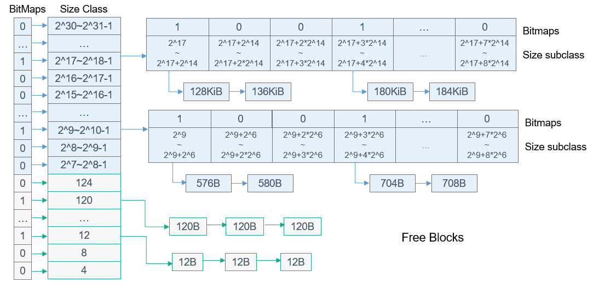
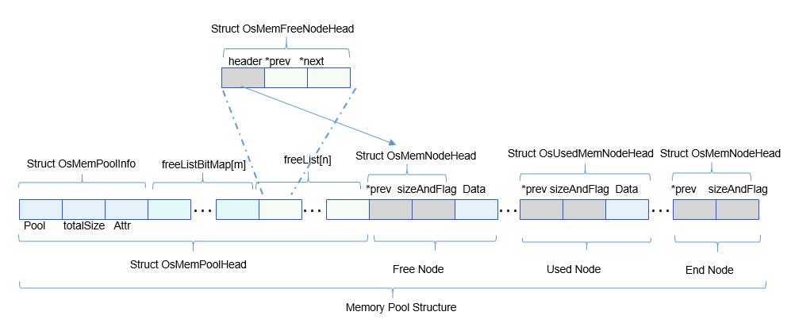

# 堆内存管理


## 基本概念

内存管理模块管理系统的内存资源，它是操作系统的核心模块之一，主要包括内存的初始化、分配以及释放。OpenHarmony LiteOS-A的堆内存管理提供内存初始化、分配、释放等功能。在系统运行过程中，堆内存管理模块通过对内存的申请/释放来管理用户和OS对内存的使用，使内存的利用率和使用效率达到最优，同时最大限度地解决系统的内存碎片问题。


## 运行机制

堆内存管理，即在内存资源充足的情况下，根据用户需求，从系统配置的一块比较大的连续内存（内存池，也是堆内存）中分配任意大小的内存块。当用户不需要该内存块时，又可以释放回系统供下一次使用。与静态内存相比，动态内存管理的优点是按需分配，缺点是内存池中容易出现碎片。OpenHarmony LiteOS-A堆内存在TLSF算法的基础上，对区间的划分进行了优化，获得更优的性能，降低了碎片率。动态内存核心算法框图如下：

  **图1** 小型系统动态内存核心算法

  

根据空闲内存块的大小，使用多个空闲链表来管理。根据内存空闲块大小分为两个部分：[4, 127]和[2<sup>7</sup>, 2<sup>31</sup>]，如上图size class所示：

1. 对[4,127]区间的内存进行等分，如上图下半部分所示，分为31个小区间，每个小区间对应内存块大小为4字节的倍数。每个小区间对应一个空闲内存链表和用于标记对应空闲内存链表是否为空的一个比特位，值为1时，空闲链表非空。[4,127]区间的31个小区间内存对应31个比特位进行标记链表是否为空。

2. 大于127字节的空闲内存块，按照2的次幂区间大小进行空闲链表管理。总共分为24个小区间，每个小区间又等分为8个二级小区间，见上图上半部分的Size Class和Size SubClass部分。每个二级小区间对应一个空闲链表和用于标记对应空闲内存链表是否为空的一个比特位。总共24\*8=192个二级小区间，对应192个空闲链表和192个比特位进行标记链表是否为空。

例如，当有40字节的空闲内存需要插入空闲链表时，对应小区间[40,43]，第10个空闲链表，位图标记的第10比特位。把40字节的空闲内存挂载第10个空闲链表上，并判断是否需要更新位图标记。当需要申请40字节的内存时，根据位图标记获取存在满足申请大小的内存块的空闲链表，从空闲链表上获取空闲内存节点。如果分配的节点大于需要申请的内存大小，进行分割节点操作，剩余的节点重新挂载到相应的空闲链表上。当有580字节的空闲内存需要插入空闲链表时，对应二级小区间[2^9,2^9+2^6]，第31+2\*8=47个空闲链表，并使用位图的第47个比特位来标记链表是否为空。把580字节的空闲内存挂载第47个空闲链表上，并判断是否需要更新位图标记。当需要申请580字节的内存时，根据位图标记获取存在满足申请大小的内存块的空闲链表，从空闲链表上获取空闲内存节点。如果分配的节点大于需要申请的内存大小，进行分割节点操作，剩余的节点重新挂载到相应的空闲链表上。如果对应的空闲链表为空，则向更大的内存区间去查询是否有满足条件的空闲链表，实际计算时，会一次性查找到满足申请大小的空闲链表。

内存管理结构如下图所示：

  **图2** 小型系统动态内存管理结构图
  
  

- 内存池池头部分
  内存池池头部分包含内存池信息、位图标记数组和空闲链表数组。内存池信息包含内存池起始地址及堆区域总大小，内存池属性。位图标记数组有7个32位无符号整数组成，每个比特位标记对应的空闲链表是否挂载空闲内存块节点。空闲内存链表包含223个空闲内存头节点信息，每个空闲内存头节点信息维护内存节点头和空闲链表中的前驱、后继空闲内存节点。

- 内存池节点部分
  包含3种类型节点：未使用空闲内存节点，已使用内存节点和尾节点。每个内存节点维护一个前序指针，指向内存池中上一个内存节点，还维护内存节点的大小和使用标记。空闲内存节点和已使用内存节点后面的内存区域是数据域，尾节点没有数据域。


## 开发指导


### 使用场景

堆内存管理的主要工作是动态分配并管理用户申请到的内存区间，主要用于用户需要使用大小不等的内存块的场景，当用户需要使用内存时，可以通过操作系统的动态内存申请函数索取指定大小的内存块。一旦使用完毕，通过内存释放函数释放所占用内存，使之可以重复使用。


### 接口说明

OpenHarmony LiteOS-A的堆内存管理主要为用户提供以下功能，接口详细信息可以查看[API参考](https://gitee.com/openharmony/kernel_liteos_m/blob/master/kernel/include/los_memory.h)。

  **表1** 堆内存管理接口

| 功能分类 | 接口描述 | 
| -------- | -------- |
| 初始化和删除内存池 | -&nbsp;LOS_MemInit：初始化一块指定的动态内存池，大小为size<br/>-&nbsp;LOS_MemDeInit：删除指定内存池，仅打开LOSCFG_MEM_MUL_POOL时有效 | 
| 申请、释放动态内存 | -&nbsp;LOS_MemAlloc：从指定动态内存池中申请size长度的内存<br/>-&nbsp;LOS_MemFree：释放从指定动态内存中申请的内存<br/>-&nbsp;LOS_MemRealloc：<br/>-&nbsp;按size大小重新分配内存块，并将原内存块内容拷贝到新内存块。如果新内存块申请成功，则释放原内存块<br/>-&nbsp;LOS_MemAllocAlign：从指定动态内存池中申请长度为size且地址按boundary字节对齐的内存 | 
| 获取内存池信息 | -&nbsp;LOS_MemPoolSizeGet：获取指定动态内存池的总大小<br/>-&nbsp;LOS_MemTotalUsedGet：获取指定动态内存池的总使用量大小<br/>-&nbsp;LOS_MemInfoGet：获取指定内存池的内存结构信息，包括空闲内存大小、已使用内存大小、空闲内存块数量、已使用的内存块数量、最大的空闲内存块大小<br/>-&nbsp;LOS_MemPoolList：打印系统中已初始化的所有内存池，包括内存池的起始地址、内存池大小、空闲内存总大小、已使用内存总大小、最大的空闲内存块大小、空闲内存块数量、已使用的内存块数量。仅打开LOSCFG_MEM_MUL_POOL时有效 | 
| 获取内存块信息 | LOS_MemFreeNodeShow：打印指定内存池的空闲内存块的大小及数量 | 
| 检查指定内存池的完整性 | LOS_MemIntegrityCheck：对指定内存池做完整性检查，仅打开LOSCFG_BASE_MEM_NODE_INTEGRITY_CHECK时有效 | 

>  **说明：**
> - 由于动态内存管理需要管理控制块数据结构来管理内存，这些数据结构会额外消耗内存，故实际用户可使用内存总量小于配置项OS_SYS_MEM_SIZE的大小。
> 
> - 对齐分配内存接口LOS_MemAllocAlign/LOS_MemMallocAlign因为要进行地址对齐，可能会额外消耗部分内存，故存在一些遗失内存，当系统释放该对齐内存时，同时回收由于对齐导致的遗失内存。


### 开发流程

本节介绍使用动态内存的典型场景开发流程。

1. 初始化LOS_MemInit。
   初始一个内存池后生成一个内存池控制头、尾节点EndNode，剩余的内存被标记为FreeNode内存节点。注：EndNode作为内存池末尾的节点，size为0。

1. 申请任意大小的动态内存LOS_MemAlloc。
   判断动态内存池中是否存在大于申请量大小的空闲内存块空间，若存在，则划出一块内存块，以指针形式返回，若不存在，返回NULL。如果空闲内存块大于申请量，需要对内存块进行分割，剩余的部分作为空闲内存块挂载到空闲内存链表上。

1. 释放动态内存LOS_MemFree。
   回收内存块，供下一次使用。调用LOS_MemFree释放内存块，则会回收内存块，并且将其标记为FreeNode。在回收内存块时，相邻的FreeNode会自动合并。


### 编程实例

本实例执行以下步骤：

1. 初始化一个动态内存池。

2. 从动态内存池中申请一个内存块。

3. 在内存块中存放一个数据。

4. 打印出内存块中的数据。

5. 释放该内存块。

示例代码如下：

  
```
#include "los_memory.h"

#define TEST_POOL_SIZE (2*1024*1024)
__attribute__((aligned(4))) UINT8 g_testPool[TEST_POOL_SIZE];

VOID Example_DynMem(VOID)
{
    UINT32 *mem = NULL;
    UINT32 ret;

    /*初始化内存池*/
    ret = LOS_MemInit(g_testPool, TEST_POOL_SIZE);
    if (LOS_OK  == ret) {
        printf("Mem init success!\n");
    } else {
        printf("Mem init failed!\n");
        return;
    }

    /*分配内存*/
    mem = (UINT32 *)LOS_MemAlloc(g_testPool, 4);
    if (NULL == mem) {
        printf("Mem alloc failed!\n");
        return;
    }
    printf("Mem alloc success!\n");

    /*赋值*/
    *mem = 828;
    printf("*mem = %d\n", *mem);

    /*释放内存*/
    ret = LOS_MemFree(g_testPool, mem);
    if (LOS_OK == ret) {
        printf("Mem free success!\n");
    } else {
        printf("Mem free failed!\n");
    }

    return;
}
UINT32 ExampleDynMemEntry(VOID) 
{     
    UINT32 ret;     
    TSK_INIT_PARAM_S initParam = {0};
    initParam.pfnTaskEntry = (TSK_ENTRY_FUNC)Example_DynMem;
    initParam.usTaskPrio = 10; 
    initParam.pcName = "Example_DynMem";
    initParam.uwStackSize = LOSCFG_BASE_CORE_TSK_DEFAULT_STACK_SIZE;
    initParam.uwResved   = LOS_TASK_STATUS_DETACHED;

    /* 创建高优先级任务，由于锁任务调度，任务创建成功后不会马上执行 */
    ret = LOS_TaskCreate(&g_taskHiID, &initParam);
    if (ret != LOS_OK) {
        LOS_TaskUnlock();
        PRINTK("Example_DynMem create Failed! ret=%d\n", ret);
        return LOS_NOK;
    }      
    PRINTK("Example_DynMem create Success!\n");
    while(1){};
    return LOS_OK;
}
```


### 结果验证

输出结果如下：

  
```
Mem init success!
Mem alloc success!
*mem = 828
Mem free success!
```
