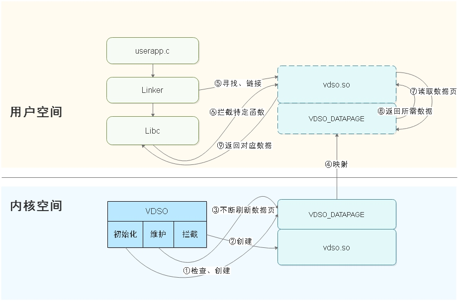

# 虚拟动态共享库

## 基本概念

VDSO（Virtual Dynamic Shared Object，虚拟动态共享库）相对于普通的动态共享库，区别在于其so文件不保存在文件系统中，存在于系统镜像中，由内核在运行时确定并提供给应用程序，故称为虚拟动态共享库。

OpenHarmony系统通过VDSO机制实现上层用户态程序可以快速读取内核相关数据的一种通道方法，可用于实现部分系统调用的加速，也可用于实现非系统敏感数据（硬件配置、软件配置）的快速读取。

## 运行机制

VDSO其核心思想就是内核看护一段内存，并将这段内存映射（只读）进用户态应用程序的地址空间，应用程序通过链接vdso.so后，将某些系统调用替换为直接读取这段已映射的内存从而避免系统调用达到加速的效果。

**VDSO总体可分为数据页与代码页两部分：**

- 数据页提供内核映射给用户进程的内核时数据；

- 代码页提供屏蔽系统调用的主要逻辑；

  **图1** VDSO系统设计
  

**如图1所示，当前VDSO机制有以下几个主要步骤：**

①  内核初始化时进行VDSO数据页的创建；

②  内核初始化时进行VDSO代码页的创建；

③  根据系统时钟中断不断将内核一些数据刷新进VDSO的数据页；

④  用户进程创建时将代码页映射进用户空间；

⑤  用户程序在动态链接时对VDSO的符号进行绑定；

⑥  当用户程序进行特定系统调用时（例如clock_gettime(CLOCK_REALTIME_COARSE， &amp;ts)），VDSO代码页会将其拦截；

⑦  VDSO代码页将正常系统调用转为直接读取映射好的VDSO数据页；

⑧  从VDSO数据页中将数据传回VDSO代码页；

⑨  将从VDSO数据页获取到的数据作为结果返回给用户程序；

>  **说明：**
>
>  - 当前VDSO机制支持LibC库clock_gettime接口的CLOCK_REALTIME_COARSE与CLOCK_MONOTONIC_COARSE功能，clock_gettime接口的使用方法详见POSIX标准。
>
>  - 用户调用C库接口clock_gettime(CLOCK_REALTIME_COARSE, &amp;ts)或者clock_gettime(CLOCK_MONOTONIC_COARSE, &amp;ts)即可使用VDSO机制。
>
>  - 使用VDSO机制得到的时间精度会与系统tick中断的精度保持一致，适用于对时间没有高精度要求且短时间内会高频触发clock_gettime或gettimeofday系统调用的场景，若有高精度要求，不建议采用VDSO机制。