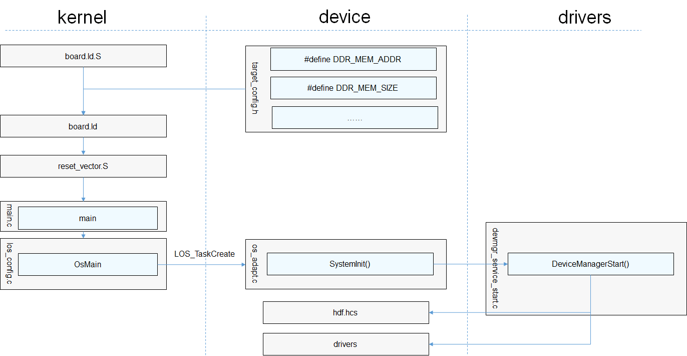
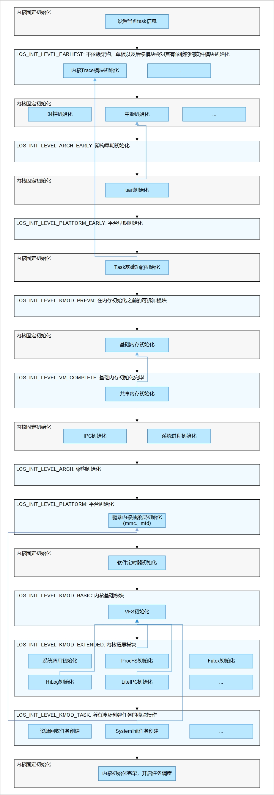

# LiteOS-A内核


## 移植概述


### 移植场景

LiteOS-A当前支持ARMv7-a指令集架构，如果三方芯片为ARMv7-a架构，可以进行内核基础适配；否则还需要先根据芯片的架构来新增内核对该芯片架构的支持，这个工作较为复杂，不在这篇文章范围内。


### 目录规范

LiteOS-A目录规范参考[LiteOS-A 简介](https://gitee.com/openharmony/kernel_liteos_a)。


## 基础适配

LiteOS-A提供系统运行所需的系统初始化流程和定制化配置选项。移植过程中，需要关注初始化流程中跟硬件配置相关的函数。


如下图所示，LiteOS-A的初始化流程主要包含以下七步：


1. 新增target_config.h文件，并且编写单板内存相关的配置宏DDR_MEM_ADDR和DDR_MEM_SIZE，分别表示内存起始地址和内存的长度，预链接脚本board.ld.S会根据这两个宏进行展开生成链接脚本board.ld。

2. 新增定义MMU映射全局数组(g_archMmuInitMapping)，指定各个内存段属性及虚实映射关系，内核启动阶段根据该表建立内存映射关系。

3. 如果是多核，需要新增定义从核操作函数句柄(struct SmpOps)，其中SmpOps-&gt;SmpCpuOn函数需要实现唤醒从核的功能；接着定义SmpRegFunc函数，调用LOS_SmpOpsSet接口进行句柄注册；最后通过启动框架完成注册过程，即LOS_MODULE_INIT(SmpRegFunc, LOS_INIT_LEVEL_EARLIEST)。

4. 链接阶段根据链接脚本board.ld生成内核镜像。

5. 单核CPU镜像运行入口为汇编文件reset_vector_up.S，多核CPU的入口为reset_vector_mp.S，在汇编文件中进行中断向量表初始化、MMU页表初始化等操作。

6. reset_vector.S汇编代码最终会跳转到C语言的main函数，进行硬件时钟、软件定时器、内存和任务等初始化，这个过程会依赖target_config.h的特性宏配置，最后会创建SystemInit任务，并且开启任务调度OsSchedStart()。

7. SystemInit任务在单板代码中实现，其中调用DeviceManagerStart函数进行HDF驱动初始化，这个过程会调用单板代码中的驱动配置文件hdf.hcs以及drivers源码实现


  整体启动流程如下图所示：

  **图1** 整体启动流程

  


从图1中可以看到，内核基础适配需要单板进行适配的代码包含三部分：


- 新增target_config.h文件，其中新增单板硬件配置参数和特性开关的配置参数，具体说明如下：
   
  **表1** target_config.h配置项说明
  
  | 配置项 | 说明 | 
  | -------- | -------- |
  | OS_SYS_CLOCK | 系统cycle的频率 | 
  | DDR_MEM_ADDR | 系统内存的起始地址 | 
  | DDR_MEM_SIZE | 系统内存的大小 | 
  | PERIPH_PMM_BASE | 外设寄存器的起始地址 | 
  | PERIPH_PMM_SIZE | 外设寄存器的长度大小 | 
  | OS_HWI_MIN | 系统中断最小值 | 
  | OS_HWI_MAX | 系统中断最大值 | 
  | NUM_HAL_INTERRUPT_UART0 | UART0中断号 | 
  | UART0_REG_BASE | UART0寄存器基址 | 
  | GIC_BASE_ADDR | GIC中断寄存器基址 | 
  | GICD_OFFSET | GICD相对GIC基址的偏移地址 | 
  | GICC_OFFSET | GICC相对GIC基址的偏移地址 | 

- SystemInit函数用于单板用户态业务初始化，典型的初始化场景如图2所示：
   
    **图2** 业务启动流程

    

- main函数用于内核基础初始化和单板内核态业务初始化，流程如下图3所示，整体由内核启动框架主导初始化流程，图中浅蓝色部分为启动框架中可接受外部模块注册启动的阶段。
  >  **注意：**
  > 同一层级内的模块不能有依赖关系。

    **图3** 内核启动框架

    

    **表2** 启动框架层级
  
  | 层级 | 说明 | 
  | -------- | -------- |
  | LOS_INIT_LEVEL_EARLIEST | 最早期初始化<br/>说明：不依赖架构，单板以及后续模块会对其有依赖的纯软件模块初始化<br/>例如：Trace模块 | 
  | LOS_INIT_LEVEL_ARCH_EARLY | 架构早期初始化<br/>说明：架构相关，后续模块会对其有依赖的模块初始化，如启动过程中非必需的功能，建议放到LOS_INIT_LEVEL_ARCH层 | 
  | LOS_INIT_LEVEL_PLATFORM_EARLY | 平台早期初始化<br/>说明：单板平台、驱动相关，后续模块会对其有依赖的模块初始化，如启动过程中必需的功能，建议放到LOS_INIT_LEVEL_PLATFORM层<br/>例如：uart模块 | 
  | LOS_INIT_LEVEL_KMOD_PREVM | 内存初始化前的内核模块初始化<br/>说明：在内存初始化之前需要使能的模块初始化 | 
  | LOS_INIT_LEVEL_VM_COMPLETE | 基础内存就绪后的初始化<br/>说明：此时内存初始化完毕，需要进行使能且不依赖进程间通讯机制与系统进程的模块初始化<br/>例如：共享内存功能 | 
  | LOS_INIT_LEVEL_ARCH | 架构后期初始化<br/>说明：架构拓展功能相关，后续模块会对其有依赖的模块初始化 | 
  | LOS_INIT_LEVEL_PLATFORM | 平台后期初始化<br/>说明：单板平台、驱动相关，后续模块会对其有依赖的模块初始化<br/>例如：驱动内核抽象层初始化（mmc、mtd） | 
  | LOS_INIT_LEVEL_KMOD_BASIC | 内核基础模块初始化<br/>说明：内核可拆卸的基础模块初始化<br/>例如：VFS初始化 | 
  | LOS_INIT_LEVEL_KMOD_EXTENDED | 内核扩展模块初始化<br/>说明：内核可拆卸的扩展模块初始化<br/>例如：系统调用初始化、ProcFS初始化、Futex初始化、HiLog初始化、HiEvent初始化、LiteIPC初始化 | 
  | LOS_INIT_LEVEL_KMOD_TASK | 内核任务创建<br/>说明：进行内核任务的创建（内核线程，软件定时器任务）<br/>例如：资源回收系统常驻任务的创建、SystemInit任务创建、CPU占用率统计任务创建 | 

  进行单板移植适配，推荐关注LOS_INIT_LEVEL_ARCH至LOS_INIT_LEVEL_KMOD_TASK之间的层级，且尽可能拆分初始化行为进行细化阶段注册。

  >  **说明：**
  > 启动框架中同一层级内的注册模块不能有依赖关系，建议新增模块按照上述启动阶段进行模块初始化的拆分，按需注册启动。
  > 
  > 可通过查看系统编译生成文件OHOS_Image.map中.rodata.init.kernel.\*段内的符号表来了解当前已注册进内核启动框架中的各个模块初始化入口，以及检查新注册的模块初始化入口是否生效。


## 编程样例

  在单板SDK文件中
  
```
/* 内核启动框架头文件 */
#include "los_init.h"
......

/* 新增模块的初始化函数 */
unsigned int OsSampleModInit(void)
{
    PRINTK("OsSampleModInit SUCCESS!\n");
    ......
}
......
/* 在启动框架的目标层级中注册新增模块 */
LOS_MODULE_INIT(OsSampleModInit, LOS_INIT_LEVEL_KMOD_EXTENDED);
```


## 验证

  
```
main core booting up...
OsSampleModInit SUCCESS!
releasing 1 secondary cores
cpu 1 entering scheduler
cpu 0 entering scheduler
```

根据上述系统启动阶段的打印可知，内核在启动时进行了该注册模块的初始化函数调用，完成该模块的初始化操作。

系统启动完毕后进入内核态shell，能够运行task命令能够正常显示即可。

  
```
OHOS # help
***shell commands:*

arp           cat           cd            chgrp         chmod         chown         cp            cpup          
date          dhclient      dmesg         dns           format        free          help          hwi           
ifconfig      ipdebug       kill          log           ls            lsfd          memcheck      mkdir         
mount         netstat       oom           partinfo      partition     ping          ping6         pmm           
pwd           reset         rm            rmdir         sem           shm           stack         statfs        
su            swtmr         sync          systeminfo    task          telnet        touch         umount        
uname         v2p           virstatfs     vmm           watch         writeproc     

```
