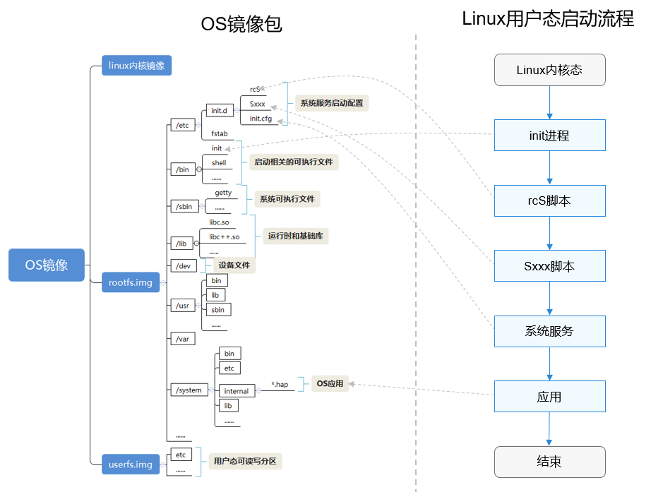

# Linux内核


## 移植概述

Linux内核移植主要涉及基于linux内核基线合入三方芯片补丁后，进行基础的内核编译构建及验证。


### 基本信息

当前Linux内核基线是基于Linux社区 5.10 LTS版本演进，合入CVE及bugfix补丁。具体信息参考[代码库](https://gitee.com/openharmony/kernel_linux_5.10)，对应repo工程代码路径为`kernel/linux-5.10`。


### Bootloader

可以使用芯片厂商自带的Bootloader，或者是开源Uboot等加载内核镜像。比如为支持Hi3516DV300开发板，OpenHarmony引入的开源[Uboot](https://gitee.com/openharmony/third_party_u-boot)。


## 适配编译和烧录启动

1. 准备内核config（特别是芯片相关的config）。

   config文件所在源码目录：`kernel/linux/config/`

   以hi3516dv300芯片为例，可在对应的`linux-5.10/arch/arm/configs/`目录下新建&lt;YOUR_CHIP&gt;_small_defconfig，如`hi3516dv300_small_defconfig`表示针对hi3516dv300小型系统的defconfig。该config文件可以由基础defconfig文件`small_common_defconfig`与该芯片相关的config组合生成。

2. 准备芯片补丁。

   补丁文件所在源码目录：`kernel/linux/patches/linux-5.10`

   以hi3516dv300芯片为例，参考已有的patch目录hi3516dv300_small_patch目录，新建&lt;YOUR_CHIP&gt;_patch目录，放置相关芯片补丁，注意hdf.patch等驱动补丁。

3. 编译。

   具体内核编译入口脚本位于工程目录`kernel/linux/patches/`下面，版本级整编命令会通过BUILD.gn进入`kernel_module_build.sh`和`kernel.mk`，需要在这2个文件中针对性进行patch及defconfig文件路径、编译器、芯片架构、内核Image格式等的适配。

   通过编译错误日志调整补丁，典型错误场景：

   （1）补丁合入失败，出现冲突，需要进行上下文适配修改。

   （2）编译失败，内核版本差异（函数实现调整等）需要针对性进行内核适配。

   >  **注意：**
   >
   > - 参考`kernel.mk`，在OpenHarmony工程的编译构建流程中会拷贝kernel/linux-5.10的代码环境后进行打补丁动作，在使用版本级编译命令前，需要kernel/linux-5.10保持原代码环境。
   > 
   > - 对应拷贝后的目录位于：`out/<***>/kernel/linux-5.10`，可以在该目录下进行补丁的修改适配。

4. 烧录启动。

   由于不同芯片的开发板的烧录方式不一样，此处不表述具体的烧录方式。需要注意烧录的各镜像的大小及启动参数的配置，参考hi3516dv300采用uboot启动参数：

   
   ```
   setenv bootargs 'mem=128M console=ttyAMA0,115200 root=/dev/mmcblk0p3 ro rootfstype=ext4 rootwait blkdevparts=mmcblk0:1M(boot),9M(kernel),50M(rootfs),50M(userfs)'
   ```


## 验证

调试init进程、启动shell和运行简单的用户态程序，验证内核移植是否成功。OpenHarmony小型系统的OS镜像结构以及linux用户态的启动流程如下图1所示：

  **图1** 基于linux内核的OS镜像结构和用户态程序启动流程

  

基于上述流程，推荐按以下步骤完成验证：

1. 制作根文件系统镜像。

   请参考[新建芯片解决方案和产品解决方案](../subsystems/subsys-build-all.md)生成根文件系统镜像`rootfs.img`。从上图可以看到启动过程与产品配置强相关，在制作rootfs.img过程中请完成如下四种配置：

   - 组件配置

     产品组件配置文件`vendor/{company}/{product}/config.json`需配置启动恢复子系统(startup)的init_lite组件和内核子系统的linux_5_1_0组件。

   - 系统服务配置

     系统服务配置文件`vendor/{company}/{product}/init_configs/init_xxx.cfg`需要启动shell服务。

   - 文件系统配置

     文件系统配置`vendor/{company}/{product}/fs.yml`中需要创建`/bin/sh -> mksh`和`/lib/ld-musl-arm.so.1 -> libc.so`软连接，这两个文件分别是shell可执行程序和可执行程序依赖的c库。

   - 启动配置

     启动配置在`vendor/{company}/{product}/init_configs/etc`目录下，包括fstab、rsS和Sxxx文件，请按开发板实际情况配置。

   编译完成后，可通过检查产品编译输出目录下的rootfs内容，确认rootfs.img文件生成是否符合预期。

2. 调试init进程和shell。

   烧录`rootfs.img`并调试init进程和shell，不同厂商的开发板的烧录工具和流程可能不同，请按芯片解决方案提供的流程进行烧录。烧录`rootfs.img`前请确认bootloader和linux内核启动正常。如果`rootfs.img`被内核正常挂载，接着将运行`/bin/init`程序，init进程为用户态的第一个应用程序，它的运行意味着用户态的开始。

   init程序首先会调用`/etc/init.d/rcS`脚本，rcS脚本执行第一条命令为`/bin/mount -a`，该命令会加载fstab文件，在fstab中的命令执行完后rcS将顺序调用Sxxx脚本完成设备节点创建和扫描、文件权限配置等操作。

   最后，init程序会读取`init.cfg`系统服务配置文件。根据步骤1中的设置，init程序将会启动shell。如果上述流程运行正常，系统则会进入shell。

   若串口有如下版本号日志打印，则表示init程序启动正常：

     **图2** init启动正常日志

     

   正常进入shell后执行ls命令，串口打印信息如下图：

     **图3** 正常进入shell后输入ls命令串口打印

     

3. 配置NFS。

   init进程和shell正常启动后，以服务端IP为192.168.1.22、客户端IP为192.168.1.4为例，可在根目录执行如下命令开启NFS:
     
   ```
   ifconfig eth0 192.168.1.4 netmask 255.255.255.0
   mkdir -p /storgage/nfs
   mount -t nfs -o nolock,addr=192.168.1.22 192.168.1.22:/nfs /storage/nfs
   ```
