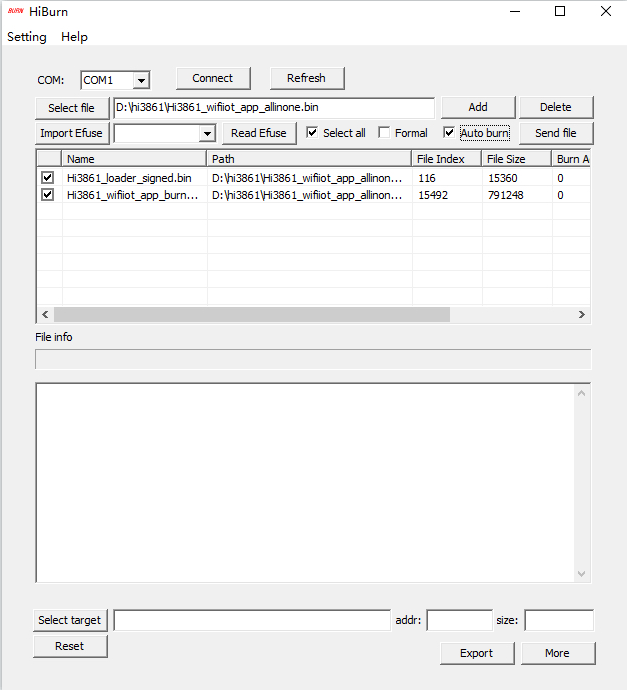
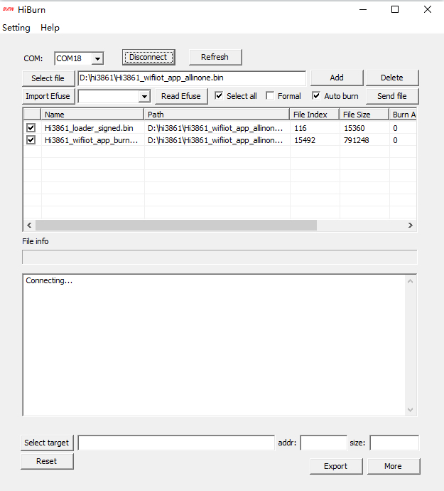
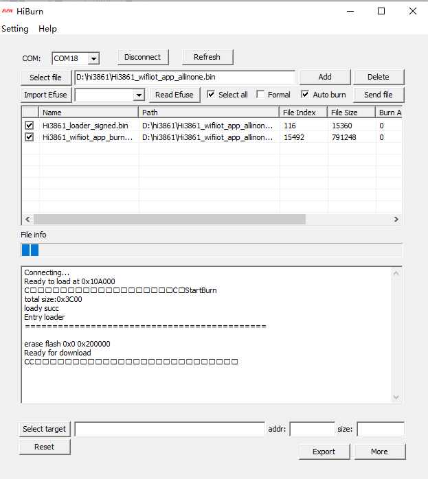
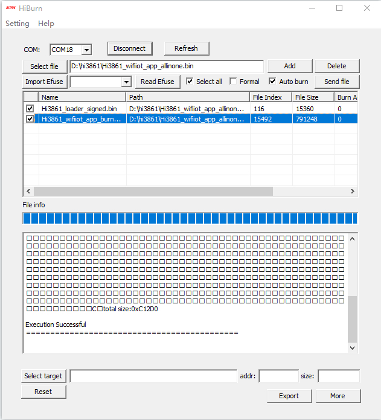

# 烧录

针对Hi3861开发板，除了DevEco Device Tool（操作方法请参考[烧录](quickstart-ide-3861-burn.md)）外，还可以使用Hiburn进行烧录。

## 前提条件

- 开发板相关源码已编译完成，已形成烧录文件。

- 客户端（操作平台，例如Windows系统）已下载并安装[HiBurn工具](https://gitee.com/hihope_iot/docs/tree/master/HiSpark_WiFi_IoT/Software/tools)。

- 客户端（操作平台，例如Windows系统）已安装USB驱动，可参考[USB驱动安装指导](https://device.harmonyos.com/cn/docs/documentation/guide/hi3861-drivers-0000001058153433)。

- 客户端已安装串口终端工具（例如IPOP）。

- 使用USB线缆连接客户端与开发板。

## 操作步骤

1. 准备烧录相关文件。
   1. 在客户端新建用于保存烧录文件的文件夹，例如“D:\hi3861”。
   2. 将编译完成的源码包下载至客户端并解压，将烧录相关文件拷贝至步骤1中新建的文件夹。
      烧写所需文件为：Hi3861_wifiiot_app_allinone.bin、Hi3861_loader_signed.bin

2. 使用HiBurn烧录。
   1. 打开HiBurn。
   2. 设置HiBurn参数，根据实际情况选择COM口，勾选“Select all”和“Auto burn”。
      
      **图1** HiBurn烧写界面参数设置  
      
      
      
   3. 单击Select file在步骤1创建的文件夹中选择烧写文件Hi3861_wifiiot_app_allinone.bin。
      
       **图2** hiburn文件选择完成  
     
       
       
   4. 确保COM口选择正确，然后单击Connect后，按一下开发板上串口旁的按钮（Reset键）开始烧写。
       烧录开始后，可以在HiBurn工具下方的控制台区域观察到烧录过程中的打印信息。

       烧录完成后，控制台区域会打印提示"Execution Successful"。

         **图3** 单击"Connect"后  
      
       

         **图4** 单击开发板重置按键后，烧写中  
      
       

         **图5** 烧写完成  
      
       
       
   5. 单击Disconnect断开连接。
