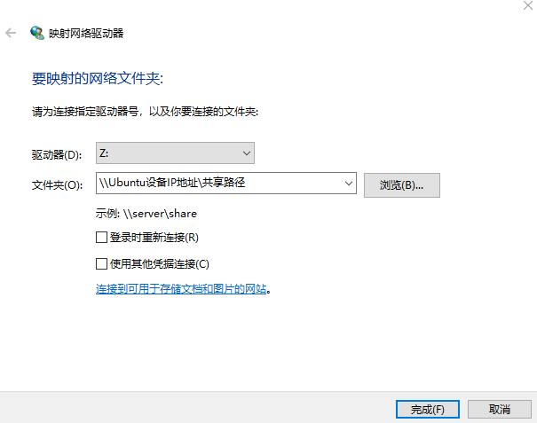
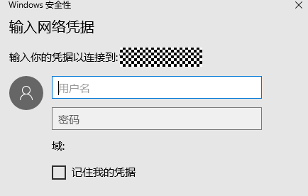

# 准备开发环境


在嵌入式开发中，很多开发者习惯于使用Windows进行代码的编辑，比如使用Windows的Visual Studio Code进行OpenHarmony代码的开发。但当前阶段，大部分的开发板源码还不支持在Windows环境下进行编译，如Hi3861、Hi3516系列开发板。因此，建议使用Ubuntu的编译环境对源码进行编译。同时，开发板的烧录需要在Windows环境中进行。

在基于命令行方式开发的过程中，除下述[Windows环境要求](#windows环境要求)、[Ubuntu环境要求](#ubuntu环境要求)外，不对开发设备做另外的要求，请用户自行准备Windows环境、Ubuntu环境。本章节主要介绍通过Samba服务器实现Windows环境远程连接Ubuntu环境的方法。


>  **说明：**
> OpenHarmony还为开发者提供了[Docker环境](https://gitee.com/openharmony/docs/blob/master/zh-cn/device-dev/get-code/gettools-acquire.md)，整合的docker包在很大程度上简化了编译前的环境配置，习惯使用命令行的开发者也可以选择Docker环境进行编译 。


进行工具安装之前，需要做如下准备。


## Windows环境要求

源码烧录需要Windows10 64位的系统环境。


## Ubuntu环境要求

- Ubuntu18.04及以上版本，X86_64架构，内存推荐16 GB及以上。

- Ubuntu系统的用户名不能包含中文字符。


## 远程访问准备

当在Windows下进行烧录时，开发者需要访问Ubuntu环境下的源码和镜像文件。您可以使用习惯的文件传输或共享工具实现文件的共享或传输。

此处介绍通过Samba服务器进行连接的操作方法。


### 配置Samba服务器

在Ubuntu环境下进行以下操作：

1. 安装Samba软件包。
   
   ```
   sudo apt-get install samba samba-common
   ```

2. 修改Samba配置文件，配置共享信息。
     打开配置文件：
     
   ```
   sudo gedit /etc/samba/smb.conf   
   ```

   在配置文件末尾添加以下配置信息（根据实际需要配置相关内容）：

   
   ```
   [Share]                    #在Windows中映射的根文件夹名称（此处以“Share”为例）
   comment = Shared Folder    #共享信息说明
   path = /home/share         #共享目录
   valid users = username     #可以访问该共享目录的用户（Ubuntu的用户名）
   directory mask = 0775      #默认创建的目录权限
   create mask = 0775         #默认创建的文件权限
   public = yes               #是否公开
   writable = yes             #是否可写
   available = yes            #是否可获取
   browseable = yes           #是否可浏览
   ```

3. 添加Samba服务器用户和访问密码。
   
   ```
   sudo smbpasswd -a username   #用户名为Ubuntu用户名。输入命令后，根据提示设置密码。
   ```

4. 重启Samba服务。
   
   ```
   sudo service smbd restart
   ```


### 设置Windows映射

在Windows环境下进行以下操作：

1. 右键计算机选择映射网络驱动器，输入共享文件夹信息。在文件夹输入框填入Ubuntu设备的IP地址和Ubuntu共享文件夹的路径。

   

2. 输入Samba服务器的访问用户名和密码（[在配置Samba服务器时已完成配置](#配置samba服务器)）。

   

3. 用户名和密码输入完成后即可在Windows下看到Linux的共享目录，并可对其进行访问。
