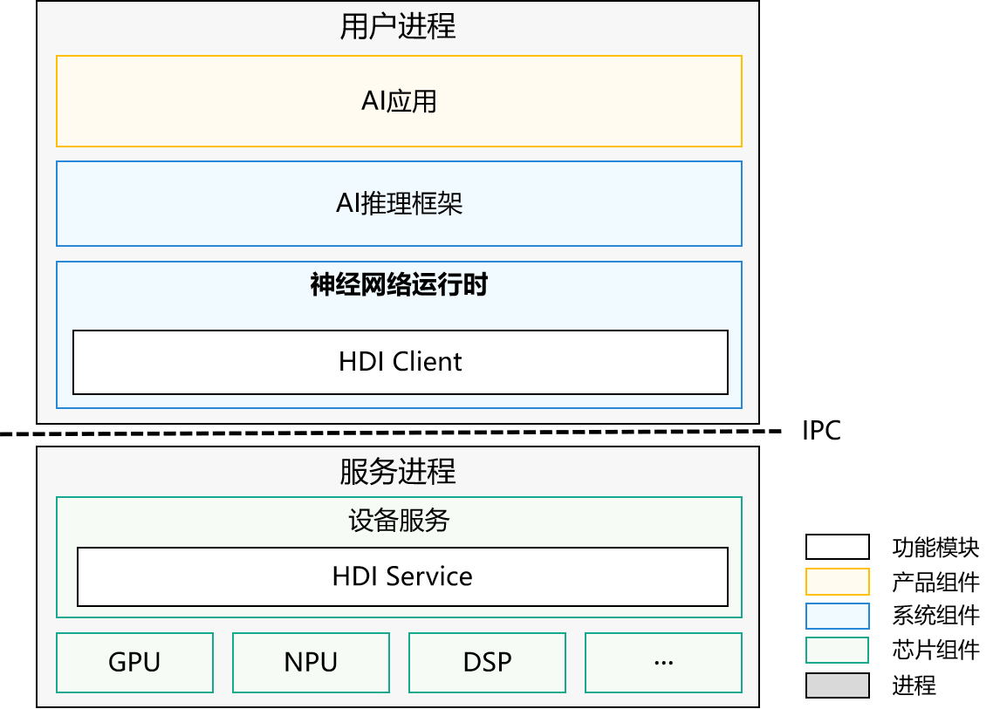

# NNRt接入适配指导

## 概述

### 功能简介

NNRt（Neural Network Runtime，神经网络运行时）是面向AI领域的跨芯片推理计算运行时，作为中间桥梁连通上层AI推理框架和底层加速芯片，实现AI模型的跨芯片推理计算。

NNRt开放了设备接口，芯片厂商通过设备接口将专有加速芯片接入NNRt，实现接入OpenHarmony的社区生态，以下将介绍芯片如何接入NNRt。

### 基本概念
在开发前，开发者需要先了解以下概念，以便更好地理解全文内容：

- HDI（Hardware Device Interface）：OpenHarmony硬件设备接口，定义系统中跨进程通信的接口，实现服务间的跨进程通信。
- IDL（Interface Description Language）：接口描述语言，是HDI接口的语言格式。

### 约束与限制
- 系统版本：OpenHarmony主干版本。
- 开发环境：Ubuntu 18.04及以上。
- 接入设备：具备AI计算能力的芯片。

### 运作机制
NNRt通过HDI接口实现与设备芯片的对接，由HDI接口实现跨进程通信。

**图1** NNRt架构图



整个架构主要分为三层，AI应用在应用层，AI推理框架和NNRt在系统层，设备服务在芯片层。AI应用如要使用专用加速芯片模型推理，需要经过AI推理框架和NNRt才能调用到底层专用加速芯片，而NNRt就是负责适配底层各种专用加速芯片，它开放了标准统一的设备接口，众多的第三方芯片设备都可以通过HDI接口接入OpenHarmony。

程序运行时，AI应用、AI推理框架、NNRt都在用户进程中，底层设备服务在服务进程中，NNRt根据HDI接口实现了HDI Client，服务端也需要根据HDI接口实现HDI Service，使得两个进程间能够跨进程通信。

## 开发指导

### 场景介绍
当需要将一款AI加速芯片接入NNRt的时候，可以参考下文。下文以RK3568芯片为例，展示RK3568 CPU如何通过HDI接口接入NNRt，并完成AI模型推理。
> 依赖说明：该教程展示的RK3568 CPU接入NNRt并没有实际去写CPU的驱动，而是借用了MindSpore Lite的CPU算子，故会依赖MindSpore Lite的动态库以及头文件，实际开发时并不需要依赖MindSpore Lite的任何库或者头文件。

### 开发流程
专用加速芯片接入NNRt的整体流程如下：

**图2** 专用加速芯片接入NNRt流程


### 开发步骤
开发者具体可通过以下步骤实现芯片对接NNRt：
#### 生成HDI头文件
开源社区下载OpenHarmony的代码，编译drivers_interface部件，生成HDI接口的头文件。

1. [下载源码](../get-code/sourcecode-acquire.md)。

2. 编译接口IDL文件。
    ```shell
    ./build.sh --product-name productname –ccache --build-target drivers_interface_nnrt
    ```
    > productname为产品名称，此处为RK3568。

    编译完成后，在```out/rk3568/gen/drivers/interface/nnrt```目录下生成HDI头文件，默认语言类型为C++。若需要生成C类型的头文件，请在编译之前使用如下命令对```drivers/interface/nnrt/v1_0/BUILD.gn```文件中的```language```配置项进行设置。

    ```shell
    language = "c"
    ```

    生成头文件目录如下所示：
    ```text
    out/rk3568/gen/drivers/interface/nnrt
    └── v1_0
        ├── drivers_interface_nnrt__libnnrt_proxy_1.0_external_deps_temp.json
        ├── drivers_interface_nnrt__libnnrt_stub_1.0_external_deps_temp.json
        ├── innrt_device.h                        # 设备接口头文件
        ├── iprepared_model.h                     # 编译AI模型对象头文件
        ├── libnnrt_proxy_1.0__notice.d
        ├── libnnrt_stub_1.0__notice.d
        ├── model_types.cpp                       # AI模型结构定义实现文件
        ├── model_types.h                         # AI模型结构定义头文件
        ├── nnrt_device_driver.cpp                # 设备驱动实现参考样例
        ├── nnrt_device_proxy.cpp
        ├── nnrt_device_proxy.h
        ├── nnrt_device_service.cpp               # 设备服务端实现参考样例
        ├── nnrt_device_service.h                 # 设备服务端头文件
        ├── nnrt_device_stub.cpp
        ├── nnrt_device_stub.h
        ├── nnrt_types.cpp                        # 数据类型定义实现文件
        ├── nnrt_types.h                          # 数据类型定义头文件
        ├── node_attr_types.cpp                   # AI模型算子属性定义实现文件
        ├── node_attr_types.h                     # AI模型算子属性定义
        ├── prepared_model_proxy.cpp
        ├── prepared_model_proxy.h
        ├── prepared_model_service.cpp            # 编译AI模型对象服务端实现参考样例
        ├── prepared_model_service.h              # 编译AI模型对象服务端头文件
        ├── prepared_model_stub.cpp
        └── prepared_model_stub.h
    ```

#### 实现HDI服务

1. 在drivers/peripheral目录下新建开发目录，用于HDI服务开发，开发目录结构如下所示：
    ```text
    drivers/peripheral/nnrt
    ├── BUILD.gn                                  # 代码编译脚本文件
    ├── bundle.json
    └── hdi_cpu_service                           # 自定义目录
        ├── BUILD.gn                              # 代码编译脚本文件
        ├── include
        │   ├── nnrt_device_service.h             # 设备服务端头文件
        │   ├── node_functions.h                  # 非必须，由具体实现决定
        │   ├── node_registry.h                   # 非必须，由具体实现决定
        │   └── prepared_model_service.h          # 编译AI模型对象服务端头文件
        └── src
            ├── nnrt_device_driver.cpp            # 设备驱动实现文件
            ├── nnrt_device_service.cpp           # 设备服务端实现文件
            ├── nnrt_device_stub.cpp              # 非必须，由具体实现决定
            ├── node_attr_types.cpp               # 非必须，由具体实现决定
            ├── node_functions.cpp                # 非必须，由具体实现决定
            ├── node_registry.cpp                 # 非必须，由具体实现决定
            └── prepared_model_service.cpp        # 编译AI模型对象服务端实现文件
    ```

2. 实现设备驱动，无特殊需求可直接使用步骤1中生成的nnrt_device_driver.cpp文件，否则根据具体驱动开发。

3. 实现服务接口，可参考nnrt_device_service.cpp和prepared_model_service.cpp实现文件，接口定义可以参考[NNRt的HDI接口定义](https://gitee.com/openharmony/drivers_interface/tree/master/nnrt)。

4. 编译驱动和服务的实现文件为共享库。

    在```drivers/peripheral/nnrt/hdi_cpu_service/```下新建```BUILD.gn```文件，文件内容如下所示，相关参数配置内容可参考[Build教程](https://gitee.com/openharmony/build)。

    ```shell
    import("//build/ohos.gni")
    import("//drivers/hdf_core/adapter/uhdf2/uhdf.gni")

    ohos_shared_library("libnnrt_service_1.0") {
      include_dirs = []
      sources = [
        "src/nnrt_device_service.cpp",
        "src/prepared_model_service.cpp",
        "src/node_registry.cpp",
        "src/node_functions.cpp",
        "src/node_attr_types.cpp"
      ]
      public_deps = [ "//drivers/interface/nnrt/v1_0:nnrt_idl_headers" ]
      external_deps = [
        "hdf_core:libhdf_utils",
        "hiviewdfx_hilog_native:libhilog",
        "ipc:ipc_single",
        "c_utils:utils",
      ]

      install_images = [ chipset_base_dir ]
      subsystem_name = "hdf"
      part_name = "drivers_peripheral_nnrt"
    }

    ohos_shared_library("libnnrt_driver") {
      include_dirs = []
      sources = [ "src/nnr_device_driver.cpp" ]
      deps = [ "//drivers/peripheral/nnrt/hdi_cpu_service:libnnrt_service_1.0" ]

      external_deps = [
        "hdf_core:libhdf_host",
        "hdf_core:libhdf_ipc_adapter",
        "hdf_core:libhdf_utils",
        "hiviewdfx_hilog_native:libhilog",
        "ipc:ipc_single",
        "c_utils:utils",
      ]

      install_images = [ chipset_base_dir ]
      subsystem_name = "hdf"
      part_name = "drivers_peripheral_nnrt"
    }

    group("hdf_nnrt_service") {
      deps = [
        ":libnnrt_driver",
        ":libnnrt_service_1.0",
      ]
    }
    ```

    将```group("hdf_nnrt_service")```添加到```drivers/peripheral/nnrt/BUILD.gn```文件中，以便在更上目录层级就能引用。
    ```shell
    if (defined(ohos_lite)) {
      group("nnrt_entry") {
        deps = [ ]
      }
    } else {
      group("nnrt_entry") {
        deps = [
          "./hdi_cpu_service:hdf_nnrt_service",
        ]
      }
    }
    ```

    新建```drivers/peripheral/nnrt/bundle.json```用于定义新增的```drivers_peripheral_nnrt```部件。
    ```json
    {
      "name": "drivers_peripheral_nnrt",
      "description": "Neural network runtime device driver",
      "version": "3.2",
      "license": "Apache License 2.0",
      "component": {
        "name": "drivers_peripheral_nnrt",
        "subsystem": "hdf",
        "syscap": [""],
        "adapter_system_type": ["standard"],
        "rom": "1024KB",
        "ram": "2048KB",
        "deps": {
          "components": [
            "ipc",
            "hdf_core",
            "hiviewdfx_hilog_native",
            "c_utils"
          ],
          "third_part": [
            "bounds_checking_function"
          ]
        },
        "build": {
          "sub_component": [
            "//drivers/peripheral/nnrt:nnrt_entry"
          ],
          "test": [
          ],
          "inner_kits": [
          ]
        }
      }
    }
    ```

#### 声明HDI服务

  在对应产品的uhdf hcs配置文件中声明用户态驱动与服务，例如针对RK3568服务需要在```vendor/hihope/rk3568/hdf_config/uhdf/device_info.hcs```文件中新增如下配置：
  ```text
  nnrt :: host {
      hostName = "nnrt_host";
      priority = 50;
      uid = "";
      gid = "";
      caps = ["DAC_OVERRIDE", "DAC_READ_SEARCH"];
      nnrt_device :: device {
          device0 :: deviceNode {
              policy = 2;
              priority = 100;
              moduleName = "libnnrt_driver.z.so";
              serviceName = "nnrt_device_service";
          }
      }
  }
  ```
> 注意：修改hcs文件需要删除out目录重新编译，才能生效。

#### 配置host进程用户ID和组ID
  对于新增的nnrt_host进程的场景，需要配置对应进程的用户ID和组ID。 进程的用户ID在文件```base/startup/init/services/etc/passwd```中配置，进程的组ID在文件```base/startup/init/services/etc/group```中配置。 
  ```text
  # 在base/startup/init/services/etc/passwd新增
  nnrt_host:x:3311:3311:::/bin/false

  # 在base/startup/init/services/etc/group新增
  nnrt_host:x:3311:
  ```

#### 配置SELinux

OpenHarmony已经开启SELinux特性，需要对新增的进程和服务配置相应的SELinux规则，用于运行host进程启动访问某些资源、发布HDI服务。

1. 在```base/security/selinux/sepolicy/ohos_policy/drivers/adapter/vendor/type.te```文件中配置nnrt_host进程安全上下文，新增配置如下：
    ```text
    # 新增配置
    type nnrt_host, hdfdomain, domain;
    ```
    > nnrt_host为上文配置的进程名称。

2. 由于SeLinux是白名单访问的权限机制，需要根据实际权限需求配置。将服务启动之后，可通过以下dmesg命令查看avc告警，
avc告警会给出缺少的权限。SeLinux的配置也可以参考[OpenHarmony SeLinux子系统的说明](https://gitee.com/openharmony/security_selinux/blob/master/README.md)。
    ```shell
    hdc_std shell
    dmesg | grep nnrt
    ```

3. 新建nnrt_host.te配置文件，将权限配置到nnrt_host.te文件中。
    ```shell
    # 创建nnrt文件夹
    mkdir base/security/selinux/sepolicy/ohos_policy/drivers/peripheral/nnrt

    # 创建vendor文件夹
    mkdir base/security/selinux/sepolicy/ohos_policy/drivers/peripheral/nnrt/vendor

    # 创建nnrt_host.te文件
    touch base/security/selinux/sepolicy/ohos_policy/drivers/peripheral/nnrt/vendor/nnrt_host.te
    ```

4. 将所需的权限写入nnrt_host.te文件中，比如：
    ```text
    allow nnrt_host dev_hdf_kevent:chr_file { ioctl };
    allow nnrt_host hilog_param:file { read };
    allow nnrt_host sh:binder { transfer };
    allow nnrt_host dev_ashmem_file:chr_file { open };
    allow sh nnrt_host:fd { use };
    ```

#### 配置部件编译入口
以RK3568产品为例：
```shell
vim //productdefine/common/inherit/chipset_common.json
```
在"subsystems", "subsystem":"hdf", "components"中添加：
```shell
{
  "component": "drivers_peripheral_foo",
  "features": []
}
```

#### 删除out目录并编译整个系统
```shell
# 删除out目录
rm -rf ./out

# 编译
./build.sh --product-name rk3568 –ccache --jobs=4
```


### 调测验证
服务开发完成后，可以使用XTS用例验证基本功能和兼容性，开发者可通过以下步骤进行验证：

1. 编译NNRt的hats用例，用例在```test/xts/hats/hdf/nnrt```目录下。
    ```shell
    # 进入hats目录
    cd test/xts/hats

    # 编译hats测试用例
    ./build.sh suite=hats system_size=standard --product-name rk3568

    # 回到代码根目录
    cd -
    ```
    编译好的测试用例会输出到相对代码根目录的```out/rk3568/suites/hats/testcases/HatsHdfNnrtFunctionTest```路径下。

2. 将测试用例push到设备上。
    ```shell
    # 将测试用例可执行文件推送到设备上，HatsHdfNnrtFunctionTest是测试用例可执行文件。
    hdc_std file send out/rk3568/suites/hats/testcases/HartsHdfNnrtFunctionTest /data/local/tmp/

    # 给测试用例可执行文件加上权限。
    hdc_std shell "chmod +x /data/local/tmp/HatsHdfNnrtFunctionTest"
    ```

3. 执行用例并查看结果。
    ```shell
    # 执行测试用例
    hdc_std shell "/data/local/tmp/HatsHdfNnrtFunctionTest"
    ```

    所有hats用例执行成功，可以看到测试报告显示已通过47个用例，说明服务通过了兼容性测试。
    ```text
    ...
    [----------] Global test environment tear-down
    Gtest xml output finished
    [==========] 47 tests from 3 test suites ran. (515 ms total)
    [  PASSED  ] 47 tests.
    ```

### 开发实例
完整Demo代码可以参考[社区实现](https://gitee.com/openharmony/ai_neural_network_runtime/tree/master/example/drivers)。

1. 拷贝```example/driver/nnrt```目录到```drivers/peripheral```路径下。
    ```shell
    cp -r example/driver/nnrt drivers/peripheral
    ```

2. 补充bundle.json文件到```drivers/peripheral/nnrt```，bundle.json参考本教程上面的[开发步骤](#开发步骤)章节。

3. 由于Demo依赖MindSpore Lite CPU算子，故需要添加MindSpore Lite依赖文件。
    - 下载MindSpore Lite的头文件，[MindSpore Lite 1.5.0](https://ms-release.obs.cn-north-4.myhuaweicloud.com/1.5.0/MindSpore/lite/release/linux/mindspore-lite-1.5.0-linux-x64.tar.gz)。
    - 在```drivers/peripheral/nnrt```目录下新建mindspore目录，用于存放mindspore依赖库和头文件。
      ```shell
      mkdir drivers/peripheral/nnrt/mindspore
      ```
    - 解压mindspore-lite-1.5.0-linux-x64.tar.gz文件，将```runtime/include```目录拷贝到```drivers/peripheral/nnrt/mindspore```目录下。
    - Demo还依赖mindspore的schema文件。
      ```shell
      # 创建mindspore_schema目录
      mkdir drivers/peripheral/nnrt/hdi_cpu_service/include/mindspore_schema

      # 拷贝mindspore schema文件
      cp third_party/mindspore/mindspore/lite/schema/* drivers/peripheral/nnrt/hdi_cpu_service/include/mindspore_schema/
      ```
    - 编译MindSpore Lite的动态库，并将动态库放到mindspore目录下。
      ```shell
      # 编译mindspore动态库
      ./build.sh --product-name rk3568 -ccaache --jobs 4 --build-target mindspore_lib

      # 将mindspore动态库
      mkdir drivers/peripheral/nnrt/mindspore/mindspore

      # 将mindspore动态拷贝到drivers/peripheral/nnrt/mindspore/mindspore。
      cp out/rk3568/package/phone/system/lib/libmindspore-lite.huawei.so drivers/peripheral/nnrt/mindspore/mindspore/
      ```
4. 其他配置请参考本教程上面的[开发步骤](#开发步骤)章节。