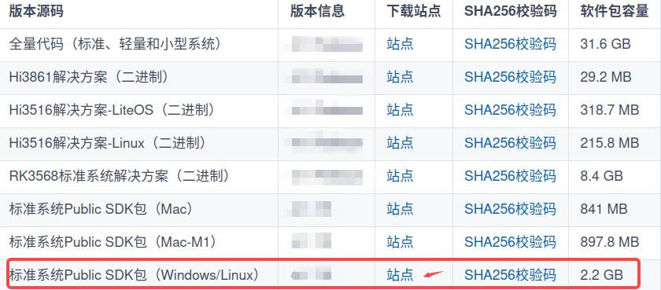

# Rust 工具链使用说明

## 简介

本文用于指导 Rust 语言开发者编译构建 OpenHarmony OS Rust 应用程序。

Rust 是一门静态强类型语言，具有更安全的内存管理、更好的运行性能、原生支持多线程开发等优势。

本工具链基于开源 rust 与 llvm 增量开发，适配了 OpenHarmony OS target 二进制构建。可将 rust 源码编译成能在 OpenHarmony OS 设备上使用的目标二进制。


## 使用场景

- 在 Linux x86环境本地编译 Linux x86 目标二进制或交叉编译 OpenHarmony OS 目标二进制。
- 在 Mac x86 环境本地编译 Mac x86 目标二进制。
- 在 Mac arm64 环境本地编译 Mac arm64 目标二进制。

## 操作指导

### OpenHarmony 社区代码编译

1. 下载或更新环境中 OpenHarmony 社区代码，下载方式可参考[获取源码](../get-code/sourcecode-acquire.md)。

2. 执行源码中脚本下载安装工具链。

   ```shell
   ./build/prebuilts_download.sh
   ```

3. 准备待编译代码。

   创建 build/rust/tests/test_bin_crate 目录，目录下新建如下所示文件与文件夹。

   ```shell
   ├── BUILD.gn
   └── src
        └── main.rs
   ```

   main.rs 代码示例。

   ```rust
   //! Hello world example for Rust.
   
   fn main() {
        println!("Hello, world!");
        println!(env!("RUSTENV_TEST"));
   }
   ```

   BUILD.gn 代码示例。

   ```shell
   import("//build/ohos.gni")
   
   ohos_rust_executable("test_bin_crate") {
     sources = [ "src/main.rs" ]
     rustenv = [ "RUSTENV_TEST=123" ]
     features = [ "std" ]
     if (is_mingw) {
       rust_static_link = true
     }
   }
   ```

4. 执行编译命令。

   ```shell
   ./build.sh --product-name {product_name} --build-target
   ```

   以RK3568为例，若要编译，请执行如下命令。

   ```shell
   ./build.sh --product-name rk3568 --build-target build/rust/tests/test_bin_crate:test_bin_crate –no-prebuilt-sdk
   ```

   编译生成的文件。

   ```shell
   ./out/rk3568/build/build_framework/test_bin_crate
   ```

###  非OpenHarmony 社区代码编译

#### 安装 rust 工具链

1. 下载 build 仓代码。

   ```shell
   git clone git@gitee.com:openharmony/build.git
   ```

2. 执行脚本下载安装工具链。

   ```shell
   ./build/prebuilts_download.sh
   ```

3. 查看安装情况。

   ```shell
   ./prebuilts/rustc/linux-x86_64/current/bin/rustc --version
   ```

   有类似如下显示表示安装成功。

   ```shell
   rustc 1.72.0-nightly (xxxx)
   ```

#### 安装 OpenHarmony OS Clang 工具

*说明*

> 用于在 Linux x86 环境下进行 OpenHarmony OS 的 target 交叉编译，不编译 OpenHarmony OS target 可不安装。

1. 在 OpenHarmony 的最新[版本说明](../../release-notes/Readme.md)中获取 SDK 包下载路径

   

2. 选择 Linux 环境 SDK 包下载，依次解压下载的压缩包。

   ```shell
   mv ohos-sdk-windows_linux-public.tar.gz /opt/
   cd /opt/
   tar -zxvf ohos-sdk-windows_linux-public.tar.gz
   cd ohos-sdk/linux
   unzip native-linux-x64-4.1.7.5-Release.zip
   ```

#### 编译代码

1. 代码用例main.rs。

   ```rust
   fn main() {
     println!("hello world");
   }
   ```

2. 编译 target 为本地环境时命令示例。

   ```shell
   ./prebuilts/rustc/linux-x86_64/current/bin/rustc main.rs
   ```

   执行构建结果。

   ```shell
   ./main
   hello world
   ```

3. 编译 target 为 armv7-unknown-linux-ohos时命令示例。

   ```shell
   ./prebuilts/rustc/linux-x86_64/current/bin/rustc main.rs --target=armv7-unknown-linux-ohos -C linker=/opt/ohos-sdk/linux/native/llvm/bin/armv7-unknown-linux-ohos-clang
   ```

4. 编译 target 为 aarch64-unknown-linux-ohos时命令示例。

   ```shell
   ./prebuilts/rustc/linux-x86_64/current/bin/rustc main.rs --target=aarch64-unknown-linux-ohos -C linker=/opt/ohos-sdk/linux/native/llvm/bin/aarch64-unknown-linux-ohos-clang
   ```

5. 编译 target 为 x86_64-unknown-linux-ohos时命令示例。

   ```shell
   ./prebuilts/rustc/linux-x86_64/current/bin/rustc main.rs --target=x86_64-unknown-linux-ohos -C linker=/opt/ohos-sdk/linux/native/llvm/bin/x86_64-unknown-linux-ohos-clang
   ```
