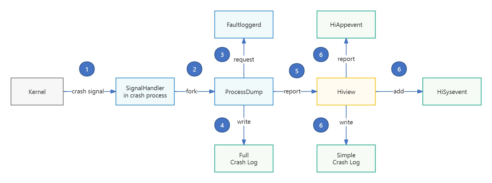

# Faultlogger开发指导


## 概述


### 功能简介

Faultlogger是OpenHarmony为开发者提供的一个维测日志框架，能够为应用、元能力、系统服务进程崩溃故障提供统一检测、日志采集、日志存储、日志上报功能，为应用崩溃故障提供详细的维测日志用以辅助故障定位。本章节内容适用于标准系统以及Linux内核的小型系统。

FaultLogger承载OpenHarmony系统上的故障记录功能，按照服务对象不同分别运行在两个部件中：

- Hiview部件中的服务：服务于应用层和native层的功能模块，功能是分类管理系统中发生的各类故障信息，并为模块提供查询故障的API。

- Faultloggerd部件中的服务：服务于崩溃进程，功能是收集C/C++运行时异常的守护进程和获取进程调用栈。

基于Faultlogger服务，进程崩溃的处理流程如下图所示：

  **图1** 进程崩溃处理流程图



1. 进程运行时崩溃，内核抛出崩溃信号，用户态SignalHandler响应（进程启动时硬编码注册）；

2. SignalHandler收集好崩溃现场信息（context、fatal message等），设置当前进程ptracer和dumpable状态后，fork出ProcessDump进程进行remote抓栈；

3. ProcessDump获取到signalhandler通过pipe传输过来的进程crash现场相关信息后，向Faultloggerd申请crash文件句柄；

4. 基于libunwinder自研回栈能力进行回栈，崩溃日志写入到`/data/log/faultlog/temp` 目录下的原始crash故障文件；

5. ProcessDump完成crash文件内容写入后，将精简的crash故障信息打包上报到hiview；

6. hiview faultlogger插件接收到添加的crash信息后，额外获取hilog信息，在`/data/log/faultlog/faultlogger`目录下生成面向开发者开发的日志。同时上报到hisysevent和hiappevent；

### 使用场景

Faultloggerd意在为开发者在开发测试过程中遇到的崩溃或卡死问题提供一种简单轻量的定位手段。

主要包含以下应用场景：

  **表1** Faultloggerd模块应用场景

| 场景描述 | 使用工具 | 使用方式 |
| -------- | -------- | -------- |
| 了解函数的调用顺序 | DumpCatcher API | 参见：[使用DumpCatcher接口获取调用栈](#使用dumpcatcher接口获取调用栈) |
| 应用卡死/CPU占用高 | DumpCatcher Command Tool | 参见：[使用DumpCatcher命令获取调用栈](#使用dumpcatcher命令获取调用栈) |
| 崩溃问题定位 | 崩溃日志和llvm-addr2line工具 | 参见：[基于崩溃日志定位问题](#基于崩溃日志定位问题) |


## 使用DumpCatcher接口获取调用栈


### 接口说明

DumpCatcher可以抓取OpenHarmony指定进程（线程）的调用栈。

  **表2** DumpCatcher接口说明

| 类 | 方法 | 描述 |
| -------- | -------- | -------- |
| DfxDumpCatcher | bool DumpCatch(const int pid, const int tid, std::string&amp; msg, size_t maxFrameNums, bool isJson) |   接口返回值：<br/>- true：回栈成功，回栈信息存储在msg字符串对象中；<br/>- false：回栈失败。<br/>  输入参数：<br/>- pid：目标进程号；<br/>- tid：目标线程号，如果需要回栈进程中的所有线程，则tid设定为0；<br/>- maxFrameNums：回栈最大帧数，如果pid不等于调用方pid，则忽略这个参数，该参数默认值为256；<br/>- isJson：堆栈消息是否为JSON格式化，该参数默认值为false；<br/>  输出参数：<br/>- msg：如果回栈成功，则通过msg返回调用栈信息。 |
| DfxDumpCatcher | bool DumpCatchMix(const int pid, const int tid, std::string&amp; msg) |   接口返回值：<br/>- true：回栈成功，回栈信息存储在msg字符串对象中；<br/>- false：回栈失败。<br/>  输入参数：<br/>- pid：目标进程号；<br/>- tid：目标线程号，如果需要回栈进程中的所有线程，则tid设定为0；<br/>  输出参数：<br/>- msg：如果回栈成功，则通过msg返回混合栈信息。 |
| DfxDumpCatcher | bool DumpCatchFd(const int pid, const int tid, std::string&amp; msg, int fd, size_t maxFrameNums) |   接口返回值：<br/>- true：回栈成功，回栈信息存储在msg字符串对象中；<br/>- false：回栈失败。<br/>  输入参数：<br/>- pid：目标进程号；<br/>- tid：目标线程号，如果需要回栈进程中的所有线程，则tid设定为0；<br/>- fd：指定写入的文件句柄号；<br/>- maxFrameNums：回栈最大帧数，如果pid不等于调用方pid，则忽略这个参数，该参数默认值为256；<br/>  输出参数：<br/>- msg：如果回栈成功，则通过msg返回调用栈信息。 |
| DfxDumpCatcher | bool DumpCatchMultiPid(const std::vector\<int> pidV, std::string&amp; msg) |   接口返回值：<br/>- true：回栈成功，回栈信息存储在msg字符串对象中；<br/>- false：回栈失败。<br/>  输入参数：<br/>- pidV：目标进程号列表；<br/>  输出参数：<br/>- msg：如果回栈成功，则通过msg返回调用栈信息。 |

>  **说明：**
> 当调用此接口的进程id与目标pid不一致时需要调用者是管理员（system，root）用户。


### 开发实例


系统应用开发者可以用DumpCatcher在自己的应用中获取指定进程（线程）的调用栈。下文以dumpcatcherdemo模块使用DumpCatcher基础接口获取调用栈作为实例进行讲解。


1. 编译构建文件添加dumpcatcher依赖：以`/base/hiviewdfx/faultloggerd/example/BUILD.gn`为例，在include_dirs中添加DfxDumpCatcher头文件路径，并在deps中添加`//base/hiviewdfx/faultloggerd/interfaces/innerkits/dump_catcher:lib_dfx_dump_catcher`模块依赖。

   ```
   import("//base/hiviewdfx/faultloggerd/faultloggerd.gni")

   config("dumpcatcherdemo_config") {
     visibility = [ ":*" ]

     include_dirs = [
       ".",
      "$faultloggerd_common_path/dfxutil",
      "$faultloggerd_interfaces_path/common",  # 添加dumpcatcher头文件路径
     ]
   }

   ohos_executable("dumpcatcherdemo") {
    sources = [ "dump_catcher_demo.cpp" ]
    configs = [ ":dumpcatcherdemo_config" ]
    deps = [
      "$faultloggerd_common_path/dfxlog:dfx_hilog",
      "$faultloggerd_interfaces_path/innerkits/dump_catcher:libdfx_dumpcatcher", # 添加dumpcathcer模块依赖
      "$faultloggerd_interfaces_path/innerkits/formatter:libjson_stack_formatter",
    ]
    external_deps = [
      "c_utils:utils",
      "hilog:libhilog",
      "jsoncpp:jsoncpp",
    ]
    install_enable = true
    part_name = "faultloggerd"
    subsystem_name = "hiviewdfx"
   }
   ```

    备注（如果其他仓想要依赖该模块，要通过faultloggerd部件进行依赖）
    ```
    external_deps += [
        "faultloggerd:libdfx_dumpcatcher",
        "faultloggerd:libjson_stack_formatter",
    ]
    ```

2. 头文件定义用到的函数：以`/base/hiviewdfx/faultloggerd/example/dump_catcher_demo.h`为例，本样例代码中，通过调用栈深度测试的测试函数来构造一个指定深度的调用栈。

   ```
   #ifndef DUMP_CATCHER_DEMO_H
   #define DUMP_CATCHER_DEMO_H

   #define NOINLINE __attribute__((noinline))

   // 定义该宏函数用于自动生成函数调用链
   #define GEN_TEST_FUNCTION(FuncNumA, FuncNumB)          \
       __attribute__((noinline)) int TestFunc##FuncNumA() \
       {                                                  \
           return TestFunc##FuncNumB();                   \
       }

   // 调用栈深度测试的测试函数
   int TestFunc0(void);
   int TestFunc1(void);
   int TestFunc2(void);
   int TestFunc3(void);
   int TestFunc4(void);
   int TestFunc5(void);
   int TestFunc6(void);
   int TestFunc7(void);
   int TestFunc8(void);
   int TestFunc9(void);

   #endif // DUMP_CATCHER_DEMO_H
   ```

3. 在源文件中调用DumpCatch接口：以`/base/hiviewdfx/faultloggerd/example/dump_catcher_demo.cpp`为例，引用dfx_dump_catcher.h头文件，声明DfxDumpCatcher对象，通过宏函数构造函数调用链，并最后调用DumpCatch接口方法，传入需要抓取调用栈的进程号、线程号。

   ```
    #include "dump_catcher_demo.h"

    #include <cstdint>
    #include <cstdlib>
    #include <cstring>
    #include <iostream>
    #include <string>
    #include <unistd.h>
    #include "dfx_define.h"
    #include "dfx_dump_catcher.h"
    #include "dfx_json_formatter.h"
    #include "elapsed_time.h"

    static NOINLINE int TestFuncDump(int32_t pid, int32_t tid, bool isJson)
    {
        OHOS::HiviewDFX::DfxDumpCatcher dumplog;
        std::string msg = "";
        OHOS::HiviewDFX::ElapsedTime counter;
        bool ret = dumplog.DumpCatch(pid, tid, msg, OHOS::HiviewDFX::DEFAULT_MAX_FRAME_NUM, isJson); // 调用DumpCatch接口获取调用栈
        time_t elapsed1 = counter.Elapsed();
        if (ret) {
            std::cout << msg << std::endl;
            if (isJson) {
                std::string outStr = "";
                OHOS::HiviewDFX::DfxJsonFormatter::FormatJsonStack(msg, outStr);
                std::cout << outStr << std::endl;
            }
        }
        time_t elapsed2 = counter.Elapsed();
        std::cout << "elapsed1: " << elapsed1 << " ,elapsed2: " << elapsed2 << std::endl;
        return ret;
    }

    static NOINLINE int TestFunc10(void)
    {
        return TestFuncDump(getpid(), gettid(), false);
    }

   // 通过宏函数自动生成函数调用链
    GEN_TEST_FUNCTION(0, 1)
    GEN_TEST_FUNCTION(1, 2)
    GEN_TEST_FUNCTION(2, 3)
    GEN_TEST_FUNCTION(3, 4)
    GEN_TEST_FUNCTION(4, 5)
    GEN_TEST_FUNCTION(5, 6)
    GEN_TEST_FUNCTION(6, 7)
    GEN_TEST_FUNCTION(7, 8)
    GEN_TEST_FUNCTION(8, 9)
    GEN_TEST_FUNCTION(9, 10)

    static bool ParseParameters(int argc, char *argv[], int32_t &pid, int32_t &tid)
    {
        switch (argc) {
            case 3:
                if (!strcmp("-p", argv[1])) {
                    pid = atoi(argv[2]);
                    return true;
                }
                if (!strcmp("-t", argv[1])) {
                    pid = getpid();
                    tid = atoi(argv[2]);
                    return true;
                }
                break;
            case 5:
                if (!strcmp("-p", argv[1])) {
                    pid = atoi(argv[2]);

                    if (!strcmp("-t", argv[3])) {
                        tid = atoi(argv[4]);
                        return true;
                    }
                } else if (!strcmp("-t", argv[1])) {
                    tid = atoi(argv[2]);

                    if (!strcmp("-p", argv[3])) {
                        pid = atoi(argv[4]);
                        return true;
                    }
                }
                break;
            default:
                break;
        }
        return false;
    }

    int main(int argc, char *argv[])
    {
        int32_t pid = 0;
        int32_t tid = 0;
        if (ParseParameters(argc, argv, pid, tid)) {
            TestFuncDump(pid, tid, true);
        } else {
            TestFunc0();
        }

        return 0;
    }
   ```


## 使用DumpCatcher命令获取调用栈


### 工具说明

DumpCatcher Command Tool是一个抓取调用栈的命令行工具，在OpenHarmony系统中可直接使用，该工具通过-p、-t参数指定进程和线程，命令执行后在命令行窗口打印指定进程的线程栈信息。还可通过添加-m参数来抓取应用进程的JS Native混合栈。

  **表3** DumpCatcher Command Tool使用说明

| 工具名称 | 命令行工具路径 | 执行命令 | 描述 |
| -------- | -------- | -------- | -------- |
| dumpcatcher | /system/bin | - dumpcatcher -p [pid]<br/>- dumpcatcher -p [pid] -t [tid]<br/>- dumpcatcher -m -p [pid]<br/>- dumpcatcher -m -p [pid] -t [tid]<br/> | **参数说明：**<br/>- -p [pid]：打印指定进程下面的所有线程栈信息。<br/>- -p [pid] -t [tid]：打印指定进程下面的指定线程信息。<br/>- -m -p [pid]：打印指定进程下面的所有线程混合栈信息。<br/>- -m -p [pid] -t [tid]：打印指定进程下面的指定线程混合栈信息。<br/>**返回值说明：**<br/>如果栈信息解析成功，则将信息显示到标准输出；失败则打印错误信息。 |


### 使用实例

通过dumpcatcher命令打印hiview进程的调用栈。


```
# ps -ef |grep hiview
hiview        2035     1 4 14:15:51 ?     00:08:24 hiview
root          6428  6425 12 17:31:51 pts/1 00:00:00 grep hiview
# dumpcatcher -p 2035 -t 2035
Result: 0 ( no error )
Timestamp:2024-05-06 17:32:05.000
Pid:2035
Uid:1201
Process name:/system/bin/hiview
Tid:2035, Name:hiview
#00 pc 000c3cac /system/lib/ld-musl-arm.so.1(ioctl+72)(d820b1827e57855d4f9ed03ba5dfea83)
#01 pc 0000efdf /system/lib/chipset-pub-sdk/libipc_common.z.so(OHOS::BinderConnector::WriteBinder(unsigned long, void*)+14)(cd26d6fe1883c088fa265a1eb112cd38)
#02 pc 000129b1 /system/lib/chipset-pub-sdk/libipc_single.z.so(OHOS::IPC_SINGLE::BinderInvoker::TransactWithDriver(bool)+216)(0d33aaefbd1542c521978a6b2a5e3591)
#03 pc 00012aab /system/lib/chipset-pub-sdk/libipc_single.z.so(OHOS::IPC_SINGLE::BinderInvoker::StartWorkLoop()+34)(0d33aaefbd1542c521978a6b2a5e3591)
#04 pc 00013abf /system/lib/chipset-pub-sdk/libipc_single.z.so(OHOS::IPC_SINGLE::BinderInvoker::JoinThread(bool)+34)(0d33aaefbd1542c521978a6b2a5e3591)
#05 pc 00028df7 /system/bin/hiview(OHOS::HiviewDFX::HiviewService::StartService()+14)(9db8e6c0a2e9e1f6f489bd2b0ddb432c)
#06 pc 00012d8d /system/bin/hiview(main+140)(9db8e6c0a2e9e1f6f489bd2b0ddb432c)
#07 pc 00072b98 /system/lib/ld-musl-arm.so.1(libc_start_main_stage2+56)(d820b1827e57855d4f9ed03ba5dfea83)
#08 pc 00012ce8 /system/bin/hiview(_start_c+84)(9db8e6c0a2e9e1f6f489bd2b0ddb432c)
#09 pc 00012c8c /system/bin/hiview(9db8e6c0a2e9e1f6f489bd2b0ddb432c)
```


## 基于崩溃日志定位问题

开发者可以通过faultloggerd生成的崩溃堆栈日志进行问题定位。本章节将主要介绍如何利用llvm-addr2line工具进行崩溃问题定位。

1. 程序自崩溃或构造崩溃。
   例如将如下代码植入自己的代码中，调用触发一个无效内存访问故障（SIGSEGV）。


   ```
   NOINLINE int TriggerSegmentFaultException()
   {
       printf("test TriggerSegmentFaultException \n");
       // 为构造崩溃，强制进行类型转换
       int *a = (int *)(&RaiseAbort);
       *a = SIGSEGV;
       return 0;
   }
   ```

2. 获取崩溃函数调用栈日志。
   因为存在未处理的异常，进程会在`/data/log/faultlog/temp`路径下生成临时的日志文件，其命名规则为：


   ```
   cppcrash-pid-time
   ```

   获取其生成的调用栈如下：


   ```
   Timestamp:2017-08-05 17:35:03.000
   Pid:816
   Uid:0
   Process name:./crasher_c
   Process life time:1s
   Reason:Signal:SIGSEGV(SEGV_ACCERR)@0x0042d33d
   Fault thread Info:
   Tid:816, Name:crasher
   #00 pc 0000332c /data/crasher(TriggerSegmentFaultException+15)(8bc37ceb8d6169e919d178fdc7f5449e)
   #01 pc 000035c7 /data/crasher(ParseAndDoCrash+277)(8bc37ceb8d6169e919d178fdc7f5449e)
   #02 pc 00003689 /data/crasher(main+39)(8bc37ceb8d6169e919d178fdc7f5449e)
   #03 pc 000c3b08 /system/lib/ld-musl-arm.so.1(__libc_start_main+116)
   #04 pc 000032f8 /data/crasher(_start_c+112)(8bc37ceb8d6169e919d178fdc7f5449e)
   #05 pc 00003284 /data/crasher(_start+32)(8bc37ceb8d6169e919d178fdc7f5449e)
   Registers:
   r0:0042d33d r1:0000000b r2:1725d4c4 r3:b6f9fa84
   r4:bec97e69 r5:b6fc0268 r6:0042d661 r7:bec97d60
   r8:00000000 r9:00000000 r10:00000000
   fp:bec97d20 ip:00000020 sp:bec97cd0 lr:b6f9fae4 pc:0042d32c
   ```

3. 利用llvm-addr2line工具进行调用栈分析。
   使用llvm-addr2line工具根据偏移地址解析行号:


   ```
   root:~/OpenHarmony/out/hi3516dv300/exe.unstripped/hiviewdfx/faultloggerd$ llvm-addr2line -e crasher 0000332c
   base/hiviewdfx/faultloggerd/tools/crasher/dfx_crasher.c:57
   ```

   这个崩溃是由赋值给一块不可写的区域导致的，代码行为dfx_crasher.c文件的57行，修改后可以避免发生此崩溃。
