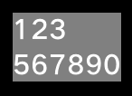

# 普通组件开发指导


普通组件均继承于基类UIView，不可以添加子组件，常用的普通组件有button、image、label等。


  **图1** 普通组件树结构
  
  


UIView为基础类，UIAbstractProgress、UIArcLabel（旋转字体）、UIButton（按键）、UICanvas（画布）、UILabel（字体）、UIImageView（图片）从UIView继承。UIBoxProgress、UICircleProgress从UIAbstractProgress继承，UILabelButton和UIRepeatButton从UIButton继承，UIImageAnimatorView和UITextureMapper从UIImageView继承。


## UIButton


### 使用场景

UIButton组件，提供可点击功能，同时可设置不同状态下样式。


### 接口说明

  **表1** button接口说明

| 方法 | 功能 | 
| -------- | -------- |
| void&nbsp;SetImageSrc&nbsp;(const&nbsp;char&nbsp;\*defaultImgSrc,&nbsp;const&nbsp;char&nbsp;\*triggeredImgSrc) | 设置button图片 | 
| void&nbsp;SetImagePosition&nbsp;(const&nbsp;int16_t&nbsp;x,&nbsp;const&nbsp;int16_t&nbsp;y) | 设置button图片位置 | 
| int16_t&nbsp;GetImageX&nbsp;()&nbsp;const | 获取图片X坐标 | 
| int16_t&nbsp;GetImageY&nbsp;()&nbsp;const | 获取图片Y坐标 | 
| const&nbsp;ImageInfo\*&nbsp;GetCurImageSrc()&nbsp;const | 获取当前状态图片 | 
| Style&amp;&nbsp;&nbsp;GetStyleForState&nbsp;(ButtonState&nbsp;state) | 设置button当前状态的style | 
| voidSetStyleForState&nbsp;(const&nbsp;Style&nbsp;&amp;style,&nbsp;ButtonState&nbsp;state) | 设置button指定状态的style | 
| void&nbsp;Disable&nbsp;() | 去使能button | 
| void&nbsp;Enable&nbsp;() | 使能button | 


### 开发步骤

1. 实现点击事件。
     
   ```
   class TestBtnOnClickListener : public OHOS::UIView::OnClickListener {
       bool OnClick(UIView& view, const ClickEvent& event) override
       {
           int16_t width = view.GetWidth() + 10;
           int16_t height = view.GetHeight() + 10;
           view.Resize(width, height);
           view.Invalidate();
           return true;
       }
   };
   ```

2. 创建一个UIButton。
     
   ```
   UIButton* button = new UIButton();
   button->SetPosition(50, 50);
   button->SetWidth(100);
   button->SetHeight(50);
   ```

3. 给UIButton注册点击事件回调。
     
   ```
   button->SetOnClickListener(new TestBtnOnClickListener());
   ```

4. 检查Button点击效果如下图所示，Button逐渐变大。
     
    **图2** UIButton点击效果
     
     


## UIImageView


### 使用场景

图片组件，提供图片显示，透明度设置，图片旋转、缩放功能。支持的图片格式为RGB565、RGB888、RGBA8888、PNG、JPG。


### 接口说明

  **表2** image接口说明

| 方法 | 功能 | 
| -------- | -------- |
| void&nbsp;SetSrc&nbsp;(const&nbsp;char&nbsp;\*src) | 设置二进制图片路径 | 
| void&nbsp;SetSrc&nbsp;(const&nbsp;ImageInfo&nbsp;\*src) | 设置图片指针 | 
| void&nbsp;SetAutoEnable&nbsp;(bool&nbsp;enable) | 设置组件大小跟随image大小变化 | 
| const&nbsp;void\*&nbsp;GetSrcType&nbsp;()&nbsp;const | 获取图片类型 | 
| bool&nbsp;GetAutoEnable&nbsp;()&nbsp;const | 获取组件大小是否跟随image大小变化 | 
| void&nbsp;SetBlurLevel(BlurLevel&nbsp;level) | 设置模糊等级 | 
| BlurLevel&nbsp;GetBlurLevel()&nbsp;const | 获取模糊等级 | 
| void&nbsp;SetTransformAlgorithm(TransformAlgorithm&nbsp;algorithm) | 设置旋转算法 | 
| TransformAlgorithm&nbsp;GetTransformAlgorithm()&nbsp;const | 获取旋转算法 | 


### 开发步骤（自适应）

1. 创建一个UIImageView。
     
   ```
   UIImageView* imageView = new UIImageView();
   imageView->SetPosition(0, 30);
   ```

2. 设置二进制格式的图片。
     
   ```
   imageView->SetSrc("..\\config\\images\\A021_001.bin");
   ```

3. 检查UIImageView控件大小与图片相同。
    
     **图3** 自适应模式图片效果图

     


### 开发步骤（平铺模式）

1. 创建一个UIImageView。
     
   ```
   UIImageView* imageView = new UIImageView();
   imageView->SetPosition(0, 30);
   ```

2. 设置图片。
     
   ```
   imageView->SetSrc("..\\config\\images\\A021_001.bin");
   ```

3. 取消图片自适应，设置图片大小，平铺显示效果。
     
   ```
   imageView->SetAutoEnable(false);
   imageView->Resize(454, 150);
   ```

4. 检查UIImageView控件显示为平铺效果。
    
     **图4** 平铺模式图片效果图
    
     


## UILabel


### 使用场景

标签（label）是在一块区域上显示文本字符串的组件，可设置区域背景色、文字的显示样式和长文本的显示效果等。


### 接口说明

  **表3** label接口说明

| 方法 | 功能 | 
| -------- | -------- |
| void&nbsp;SetText(const&nbsp;char\*&nbsp;text); | 设置文字 | 
| const&nbsp;char\*&nbsp;GetText()&nbsp;const; | 获取text | 
| void&nbsp;SetLineBreakMode(const&nbsp;uint8_t&nbsp;lineBreakMode); | 设置label模式，例如截断，自动扩展等。 | 
| uint8_t&nbsp;GetLineBreakMode()&nbsp;const | 获取label模式 | 
| void&nbsp;SetTextColor(ColorType&nbsp;color) | 设置文本颜色 | 
| ColorType&nbsp;GetTextColor()&nbsp;const | 获取文本颜色 | 
| void&nbsp;SetAlign(UITextLanguageAlignment&nbsp;horizontalAlign,<br/>UITextLanguageAlignment&nbsp;verticalAlign&nbsp;=&nbsp;TEXT_ALIGNMENT_TOP); | 设置文本对齐方式 | 
| UITextLanguageAlignment&nbsp;GetHorAlign()&nbsp;const | 获取文本水平对齐方式 | 
| UITextLanguageAlignment&nbsp;GetVerAlign()&nbsp;const | 获取文本竖直对齐方式 | 
| void&nbsp;SetDirect(UITextLanguageDirect&nbsp;direct) | 设置文本显示方向 | 
| UITextLanguageDirect&nbsp;GetDirect()&nbsp;const | 获取文本显示方向 | 
| void&nbsp;SetFontId(uint8_t&nbsp;fontId); | 设置动态字体id | 
| uint8_t&nbsp;GetFontId()&nbsp;const | 获取动态字体id | 
| void&nbsp;SetFont(const&nbsp;char&nbsp;\*name,&nbsp;uint8_t&nbsp;size); | 设置字的名字和大小 | 
| void&nbsp;SetAnimatorSpeed(uint16_t&nbsp;animSpeed); | 设置字体旋转的速度 | 
| uint16_t&nbsp;GetTextWidth(); | 获取字体的宽 | 
| uint16_t&nbsp;GetTextHeight(); | 获取字体的高 | 
| void&nbsp;SetRollStartPos(int16_t&nbsp;pos) | 设置旋转的位置 | 
| int16_t&nbsp;GetRollStartPos()&nbsp;const | 获取旋转的位置 | 
| void&nbsp;SetTextRotation(LabelRotateDegree&nbsp;angle) | 设置文本旋转角度枚举值 | 
| LabelRotateDegree&nbsp;GetTextRotation()&nbsp;const | 获取文本旋转角度枚举值 | 
| uint16_t&nbsp;GetTextRotateDegree()&nbsp;const | 获取文本旋转角度数值 | 


### 开发步骤（默认模式）

1. 创建label，设置大小和位置信息。
     
   ```
   UILabel* label = new UILabel();
   label->SetPosition(x, y);
   label->Resize(width, height);
   ```

2. 设置字形信息。
     
   ```
   label->SetFont("SourceHanSansSC-Regular.otf", 30);
   ```

3. 设置文本数据。
     
   ```
   label->SetText("label");
   ```

4. 检查label大小和显示效果正常，如下图所示。
    
     **图5** 默认模式显示效果图

     


### 开发步骤（背景色和透明度）

1. 创建label，设置大小和位置信息。
     
   ```
   UILabel* label = new UILabel();
   label->SetPosition(x, y);
   label->Resize(width, height);
   ```

2. 设置字形信息。
     
   ```
   label->SetFont("SourceHanSansSC-Regular.otf", 30);
   ```

3. 设置背景颜色及透明度效果。
     
   ```
   label->SetStyle(STYLE_BACKGROUND_COLOR, Color::Gray().full);
   label->SetStyle(STYLE_BACKGROUND_OPA, 127);
   label->SetText("Label");
   ```

4. 检查label背景色为Gray，如下图所示。
     
     **图6** 设置背景色显示效果图

     


### 开发步骤（字符间距）

1. 创建label，设置大小和位置信息。
     
   ```
   UILabel* label = new UILabel();
   label->SetPosition(x, y);
   label->Resize(width, height);
   ```

2. 设置字形信息。
     
   ```
   label->SetFont("SourceHanSansSC-Regular.otf", 30);
   ```

3. 设置字体颜色和字间距效果。
     
   ```
   label->SetStyle(STYLE_BACKGROUND_COLOR, Color::Gray().full);
   label->SetStyle(STYLE_LETTER_SPACE, 5);
   label->SetText("Label");
   ```

4. 检查label字符间距为5，如下图所示。
    
     **图7** 设置文字颜色、字间距显示效果图
  
     


### 开发步骤（大小自适应）

当文本过长时，可根据文本信息自动调整label组件大小，也可以设置文本截断或者文本滚动效果。

1. 创建label，设置大小和位置信息。
     
   ```
   UILabel* label = new UILabel();
   label->SetPosition(x, y);
   label->Resize(width, height);
   ```

2. 设置字形信息。
     
   ```
   label->SetFont("SourceHanSansSC-Regular.otf", 30);
   ```

3. 设置字体颜色为Gray，组件大小自适应文本内容。
     
   ```
   label->SetStyle(STYLE_BACKGROUND_COLOR, Color::Gray().full);
   label->SetLineBreakMode(UILabel::LINE_BREAK_ADAPT);
   label->SetText("123\n567890");
   ```

4. 检查label大小自适应文本内容，如下图所示。

     **图8** 自适应模式显示效果图

     


### 开发步骤（省略号模式）

省略号模式指文本内容显示不下时，在末尾显示省略号。

1. 创建label，设置大小和位置信息。
     
   ```
   UILabel* label = new UILabel();
   label->SetPosition(x, y);
   label->Resize(width, height);
   ```

2. 设置字形信息。
     
   ```
   label->SetFont("SourceHanSansSC-Regular.otf", 30);
   ```

3. 设置换行模式为DOT模式
     
   ```
   label->SetStyle(STYLE_BACKGROUND_COLOR, Color::Gray().full);
   label->SetLineBreakMode(UILabel::LINE_BREAK_ELLIPSIS);
   label->SetText("123567890");
   ```

4. 检查label DOT模式效果，如下图所示，末尾显示省略号。
    
     **图9** DOT模式显示效果图

     

### 开发步骤（滚动模式）

文本滚动显示。

1. 创建label，设置大小和位置信息。
     
   ```
   UILabel* label = new UILabel();
   label->SetPosition(x, y);
   label->Resize(width, height);
   ```

2. 设置字形信息。
     
   ```
   label->SetFont("SourceHanSansSC-Regular.otf", 30);
   ```

3. 设置换行模式为滚动模式
     
   ```
   label->SetStyle(STYLE_BACKGROUND_COLOR, Color::Gray().full);
   label->SetStyle(STYLE_BACKGROUND_OPA, 127);
   label->SetLineBreakMode(UILabel::LINE_BREAK_MARQUEE);
   label->SetText("123567890");
   ```

4. 检查label滚动模式效果，如下图所示。
     
     **图10** 滚动模式显示效果图

     
