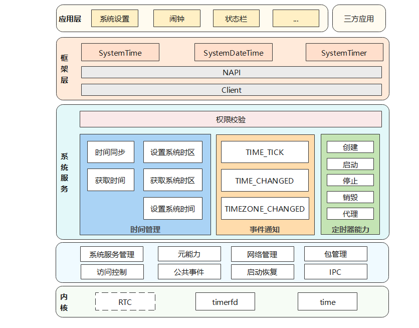

# 时间时区子系统

-   [简介](# 简介)
-   [系统架构](# 系统架构)
-   [目录](# 目录)
-   [相关仓](# 相关仓)

## 简介

 时间时区为OpenHarmony系统提供了管理系统时间时区和定时的能力，包括：

-   **管理时间时区**

    统一管理系统时间时区，包括设置/获取系统时间、日期、时区，同时提供获取系统启动时间。

-   **定时能力**

    提供系统定时器能力。包括定时器创建、启动、停止和销毁。定时器类型提供三种：系统启动时间计时类定时器、系统当前时间计时类定时器、唤醒类定时器。


## 系统架构

**图 1**  时间时区子系统架构图




## 目录

时间时区子系统源代码在/base/time目录下。

目录结构如下所示：

```
/base/time/time_service
├── etc                      # 组件包含的进程的配置文件
├── figures                  # 构架图
├── framework/js/napi        # js接口解析成napi接口
├── interfaces/inner_api     # 组件对外提供的接口代码
├── services                 # 时间服务实现
│   └── profile              # 组件包含的系统服务的配置文件和进程的配置文件
└── utils                    # 组件包含日志打印等工具类
```

## 相关仓

[time_service](https://gitee.com/openharmony/time_time_service)