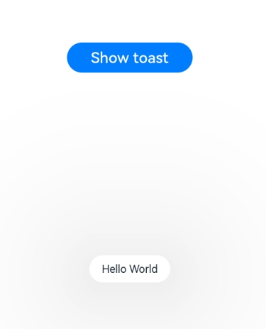
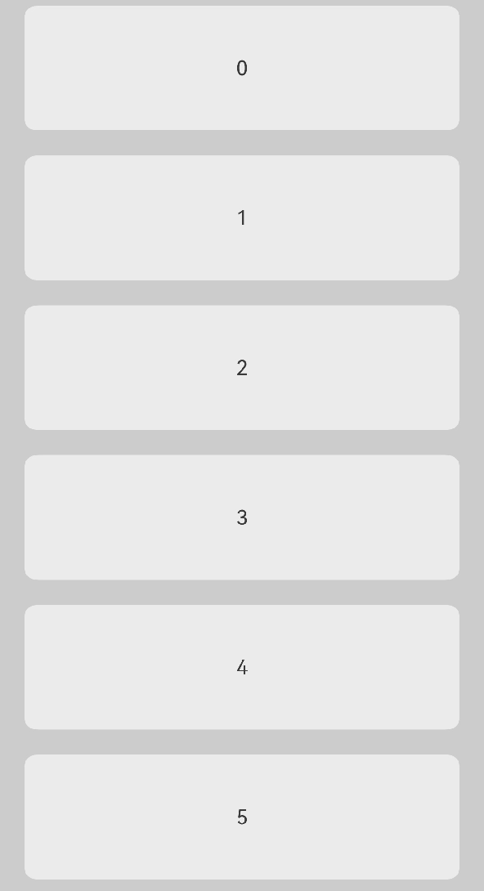
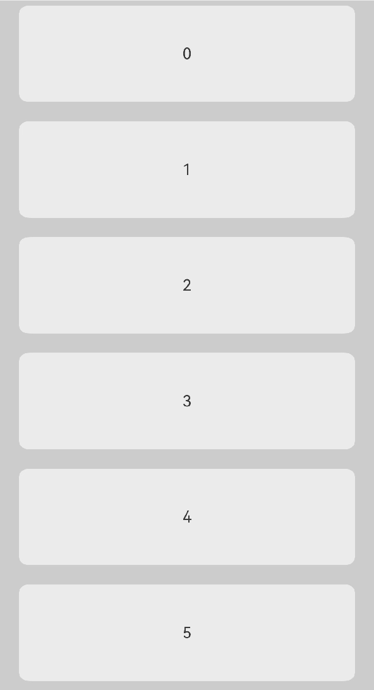

# ArkUI子系统变更说明

## cl.arkui.1 TextInput组件默认样式变更

**访问级别**

公开接口

**变更原因**

默认样式变更。

**变更影响**

该变更为非兼容性变更。

变更前：下划线模式输入框设置borderRadius未生效，还是默认样式radius为0。下划线模式输入框左右padding为12vp。非下划线模式输入框默认高度为48vp。


变更后：下划线模式输入框设置borderRadius正常生效，不设置则显示默认样式radius为0。下划线模式输入框左右padding为0vp。非下划线模式输入框默认高度为40vp。


示例：

```ts
@Entry
@Component
struct TextInputExample {
  @State Text: string = ''
  build() {
    Column({ space: 20 }) {
      Text(`下划线模式`)
        .width('95%')
      // 下划线模式
      TextInput({ placeholder: 'underline style' })
        .showUnderline(true)
        .backgroundColor(Color.Pink)
        .width(360)
        .borderRadius(10)
      Text(`非下划线模式`)
        .width('95%')
      TextInput({ placeholder: '请输入用户名', text: this.Text })
        .showUnderline(false)
        .width(360)
        .borderRadius(10)

    }.width('100%')
  }
}
```

**起始API Level**

10

**变更发生版本**

从OpenHarmony SDK 5.0.0.22开始。

**变更的接口/组件**

TextInput组件默认样式变更。

**适配指导**

默认效果变更，无需适配，但应注意变更后的默认效果是否符合开发者预期，如不符合则应自定义修改效果控制变量以达到预期。

## cl.arkui.2  Toast弹窗接口更改消息框背景色、字色，以及Toast的最大宽度及高度，界面语超长逐级缩小字号至12fp，超出截断。

**访问级别**

公开接口

**变更原因**

API version 12及之后更改Toast UX的显示样式。

**变更影响**

该变更为非兼容性变更。

- API version 11及之前，Toast弹窗背景色为深黑色、字色为白色，最大高度没有限制，界面语超长没有截断。<br/>

- API version 12及之后，Toast弹窗在常规亮色显示风格下toast透明模糊背景、字色黑色，暗色显示风格下透明模糊背景、字色白色，Toast的最大高度 =（屏幕高度-信号栏-导航条）*0.65，最大宽度：基于屏幕宽度-2侧margin，根据容器自适应，最大到400vp不再变化。界面语超长逐级缩小字号至12fp，超出截断。<br/>

- API version 11及之前对比API version 12及之后属性变更如下

 | 属性名 | 变更前 | 变更后 |
|---------|---------|---------|
| 背景色 | bg_color | COMPONENT_ULTRA_THICK |
| 圆角 | toast_border_radius | corner_radius_level9 |
| padding-left | toast_padding_horizontal | padding_level8 |
| padding-top | toast_padding_vertical | padding_level4 |
| padding-right | toast_padding_horizontal | padding_level8 |
| padding-bottom | toast_padding_vertical | padding_level4 |
| 字体大小 | text_font_size | Body_M |
| 字体颜色 | text_color | font_primary |
| 字重 | toast_text_font_weight | font_weight_regular |

**示例：**
如下图所示为变更前后效果对比：

 | 变更前 | 变更后 |
|---------|---------|
|   |    |

**API Level**

12

**变更发生版本**

从OpenHarmony SDK 5.0.0.22 版本开始。

**变更的接口/组件**

Toast弹窗接口

**适配指导**

UX默认行为变更，无需适配。

## cl.arkui.3 Text组件clip通用属性默认值变更

**访问级别**

公开接口

**变更原因**

默认值false符合更多应用场景。

**变更影响**

该变更为非兼容性变更。

API version 12 变更前：Text组件clip通用属性默认值为true, 超出组件区域内容会被截断不显示。


API version 12 变更后：Text组件clip通用属性默认值为false, 超出组件区域内容不会被截断全部显示。


示例：

```ts
@Entry
@Component
struct TextClipExample {
  build() {
    Column({ space: 20 }) {
      Text('This is set wordBreak to WordBreak text Taumatawhakatangihangakoauauotamateaturipukakapikimaungahoronukupokaiwhenuakitanatahu.')
        .fontSize(12)
        .border({ width: 1 })
        .wordBreak(WordBreak.NORMAL)
        .lineHeight(20)
        .maxLines(2)
    }.height(300).width(335).padding({ left: 35, right: 35, top: 35 })
  }
}
```

**起始API Level**

7

**变更发生版本**

从OpenHarmony SDK 5.0.0.22开始。

**变更的接口/组件**

Text组件clip通用属性默认值变更。

**适配指导**

默认效果变更，无需适配，但应注意变更后的默认效果是否符合开发者预期，如不符合则应自定义修改效果控制变量以达到预期。

## cl.arkui.4 TextInput,TextArea,Search组件caretPosition接口异常值处理变更

**访问级别**

公开接口

**变更原因**

优化Search、TextInput、TextArea组件设置光标时异常值处理逻辑。

**变更影响**

该变更为非兼容性变更。

API Version 11 以及之前的版本：TextInput.caretPosition()的入参是负数、undefined时，接口不生效。
TextInputController.caretPosition()、TextAreaController.caretPosition()、SearchController.caretPosition()的入参是负数时，
接口生效，移动光标到0的位置并记录光标位置是负数。

API Version 12 变更后：TextInput.caretPosition()的入参是负数、undefined时，当作0处理，接口生效。
TextInputController.caretPosition()、TextAreaController.caretPosition()、SearchController.caretPosition()的入参是负数时，
当作0处理，接口生效，移动光标到0的位置并记录光标位置是0。

**起始 API Level**

8

**变更发生版本**

从OpenHarmony SDK 5.0.0.22开始。

**适配指导**

光标位置的视觉效果不会发生变化。
如果此前设置光标位置的参数是负数、undefined，并且需要光标位置不发生变化，需要修改业务代码，输入合法数值。

## cl.arkui.5  ListItem横划UX行为变更。

**访问级别**

公开接口

**变更原因**

API version 12及之后更改ListItem横划UX行为。

**变更影响**

该变更为非兼容性变更。

- API version 11及之前，ListItem横划展开划出菜单以后，点击List组件非划出菜单区域，ListItem划出菜单不会自动收起，点击位置的组件可以响应点击事件。<br/>

- API version 12及之后，ListItem横划展开划出菜单以后，点击List组件非划出菜单区域，ListItem划出菜单会自动收起，点击位置的组件不响应点击事件。<br/>

**示例：**
如下图所示为变更前后效果对比：

 | 变更前 | 变更后 |
|---------|---------|
|   |    |

**API Level**

12

**变更发生版本**

从OpenHarmony SDK 5.0.0.22 版本开始。

**变更的接口/组件**

ListItem组件

**适配指导**

UX默认行为变更，无需适配。

## cl.arkui.6 相对布局对Visibility.None的处理规则变更

**访问级别**

公开接口

**变更原因**

UX规格增强

**变更影响**

该变更为非兼容性变更。

变更前：组件A的任一锚点的Visibility为None，组件A不被Measure。

变更后：组件A的任一锚点的Visibility为None，组件A依旧被Measure，锚点组件的位置不变，宽高均视为0。

**API Level**

该特性版本为API 7,变更版本为API 12。

**变更发生版本**

从OpenHarmony SDK 5.0.0.23开始。

**适配指导**

如果需要组件A在锚点组件的Visibility设置为None之后不被Measure，可将组件A的Visibility设置为Hidden或者None。

## cl.arkui.7 C-API 获取Native模块接口集合的接口变更

**访问级别**

公开接口

**变更原因**

兼容性增强

**变更影响**

该变更为非兼容性变更。

变更前：用户可通过 OH_ArkUI_GetNativeAPI 接口获取Native模块接口集合。

变更后：用户需通过 OH_ArkUI_GetModuleInterface 接口或者 OH_ArkUI_QueryModuleInterfaceByName 接口获取Native模块接口集合。

**起始API level**

该特性版本和变更版本均为API 12。

**变更发生版本**

从OpenHarmony SDK 5.0.0.22开始。

**适配指导**

用户可参考如下方式调用新的API 获取Native模块接口集合

方式1：

```
auto nodeAPI = reinterpret_cast<ArkUI_NativeNodeAPI_1*>(
  OH_ArkUI_QueryModuleInterfaceByName(ARKUI_NATIVE_NODE, "ArkUI_NativeNodeAPI_1"));
```

方式2：

```
ArkUI_NativeNodeAPI_1* nodeAPI = nullptr;
OH_ArkUI_GetModuleInterface(ARKUI_NATIVE_NODE, ArkUI_NativeNodeAPI_1, nodeAPI);
```

## cl.arkui.8 C-API 事件注册接口变更

**访问级别**

公开接口

**变更原因**

兼容性增强

**变更影响**

该变更为非兼容性变更。

变更前：

* 用户可通过 nodeAPI->registerNodeEvent(nodePtr, eventType, eventId) 方式为指定组件绑定指定事件，入参为三个，依次为待绑定事件的组件节点指针、待绑定的事件类型、待绑定事件的ID；

* 事件响应后，用户可在回调中获取到指向事件回调数据，类型为ArkUI_NodeEvent 的指针，并可以直接访问指针中的结构体和数据，如下所示：

代码示例：

```
nodeAPI->registerNodeEvent(button, NODE_ON_CLICK, 1); // 1 为注册的事件ID
auto onclick = [](ArkUI_NodeEvent *event) {
  if (event->eventId == 1) {
    auto offsetX = event->componentEvent.data[0].f32; // 获取点击位置相对于被点击组件左上角的X坐标
  }
};
nodeAPI->registerNodeEventReceiver(onclick); // 监听事件回调，当触发button组件的点击事件时会执行用户定义的onclick方法
```

变更后：

* 用户注册事件的接口新增了一位自定义参数的指针，形如 nodeAPI->registerNodeEvent(nodePtr, eventType, eventId，userData)。

* 事件响应后，用户可在回调中获取到指向事件回调数据，类型为ArkUI_NodeEvent 的指针，但不再暴露指针的具体结构体，用户需通过指定的函数方法获取指定的参数，如下所示：

代码示例：

```
nodeAPI->registerNodeEvent(button, NODE_ON_CLICK, 1, nullptr); // 暂无需要传入的自定义数据，可用nullptr代替
auto onclick = [](ArkUI_NodeEvent *event) {
  if (OH_ArkUI_NodeEvent_GetTargetId(event) == 1) { // 使用 OH_ArkUI_NodeEvent_GetTargetId 方法获取事件ID
    auto offsetX = OH_ArkUI_NodeEvent_GetNodeComponentEvent(event)->data[0].f32; // 获取点击位置相对于被点击组件左上角的X坐标
  }
};
nodeAPI->registerNodeEventReceiver(onclick);
```

**起始API level**

该特性版本和变更版本均为API 12。

**变更发生版本**

从OpenHarmony SDK 5.0.0.22开始。

**适配指导**

* 用户全局搜索 registerNodeEvent 函数，将所有使用此函数的入参改为4位入参，第四位可用 nullptr 空指针替代。

* 用户全局搜索 ArkUI_NodeEvent类型，将回调中的 event->eventId 修改为 OH_ArkUI_NodeEvent_GetTargetId(event)。

* 用户全局搜索 ArkUI_NodeEvent类型，将回调中的 event->kind 修改为 OH_ArkUI_NodeEvent_GetEventType(event)。

* 用户全局搜索 ArkUI_NodeEvent类型，将回调中的 event->componentEvent.data 修改为 OH_ArkUI_NodeEvent_GetNodeComponentEvent(event)->data。

* 用户全局搜索 ArkUI_NodeEvent类型，将回调中的 event->stringEvent.pStr 修改为 OH_ArkUI_NodeEvent_GetStringAsyncEvent(event)->pStr。

* 用户全局搜索 ArkUI_NodeEvent类型，将回调中的 event->touchEvent 修改为先使用 OH_ArkUI_NodeEvent_GetInputEvent(event) 方法获取到指向 ArkUI_UIInputEvent 类型的指针，再通过开放的各种获取 ArkUI_UIInputEvent 数据的函数方法获取详细的接口数据。

## cl.arkui.9 visibility异常参数处理规格变更

**访问级别**

公开接口

**变更原因**

接口异常值处理变更。

**变更影响**

变更前：异常值时当作hidden处理。

变更后：异常值时当作visible处理。

**起始API Level**

该特性版本为API 7,变更版本为API 12。

**变更发生版本**

从OpenHarmony SDK 5.0.0.22开始。

**适配指导**

异常值处理逻辑变更，不涉及适配，但应注意变更后的默认效果是否符合开发者预期，如不符合则自定义修改效果控制变量以达到预期。

## cl.arkui.10 矩阵变换接口transform行为变更

**访问级别**

公开接口

**变更原因**

接口功能完善。

**变更影响**

变更前：传入矩阵中的透视投影变换不进行处理，即不支持透视投影变换。

变更后：处理传入矩阵中的透视投影变换，即支持透视投影变换。

**示例：**
示例代码
```
import matrix4 from '@ohos.matrix4'
const matrixArr: [number, number, number, number,
  number, number, number, number,
  number, number, number, number,
  number, number, number, number] = [
  0.25, 0, 0, -0.0015,
  0, 1, 0, 0,
  0, 0, 1, 0,
  0, 0, 0, 1];

let matrix = matrix4.init(matrixArr);

@Entry
@Component
struct Tests {
  build() {
    Column() {
      Rect()
        .fill(Color.Gray)
        .scale({
          x: 1,
          centerX: 0,
          centerY: 0,
        })
        .width('500px')
        .height('500px')
        .transform(matrix)
    }.width('100%').height('100%').alignItems(HorizontalAlign.Center)
  }
}
```
如下图所示为变更前后效果对比：

 | 变更前 | 变更后 |
|---------|---------|
|   |    |

**起始API Level**

该特性版本为API 7。

**变更发生版本**

从OpenHarmony SDK 5.0.0.22开始。

**适配指导**

若传入的矩阵中涉及到透视投影变换，即矩阵最后一列的前三个参数不为0，则会出现变更前后不一致的现象。

适配方法：传入的矩阵中若是涉及到透视投影变换，处理透视投影相关的变换，因此变换效果会发生变化，若是想保持原样，将Matrix4Transit的最后一列的前三个参数（即第4,8,12个参数）置为0即可。
```
const matrixArr: [number, number, number, number,
  number, number, number, number,
  number, number, number, number,
  number, number, number, number] = [
  0.25, 0, 0, -0.0015,
  0, 1, 0, 0,
  0, 0, 1, 0,
  0, 0, 0, 1];
  
for (let i = 3;i < 12;i += 4) {
    matrixArr[i] = 0;
}

let matrix = matrix4.init(matrixArr);
```
