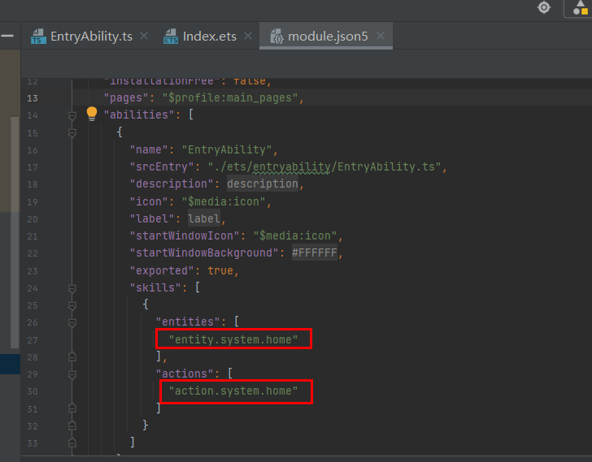

# 包管理子系统变更说明

## cl.bundlemanager.1 入口图标和入口标签规格变动

**访问级别**

公开接口

**变更原因**

[入口图标和名称](../../../application-dev/application-models/application-component-configuration-stage.md#入口图标和标签配置)(module.json5中abilities配置的icon和label)是应用安装后在桌面上展示的图标和名称，[应用图标和名称](../../../application-dev/application-models/application-component-configuration-stage.md#应用图标和标签配置)（app.json5中配置的icon和label）是应用安装后在设置的应用列表或者消息通知栏等标识应用处展示的图标和名称。

应用同时配置了应用图标、应用名称和入口图标和入口名称，会导致在桌面和设置中显示的图标和名称存在不同。同一个应用在设备不同地方展示的图标和名称应该保持一致，避免出现恶意应用配置不同的图标。

**变更影响**

该变更为兼容性变更。当应用存在入口UIAbility且配置了入口图标和入口标签则优先展示，如果不存在入口图标和入口标签，则展示应用图标和应用标签。

变更前

| 展示位置    | 取值       | 说明        |
| ----- | ---------- | --------- |
|  桌面展示图标和名称   |  入口图标和名称  |  当应用不存在入口UIAbility时会返回应用图标和名称  |
|  设置中应用列表展示图标和名称   |  应用图标和名称  |  必选字段，创建新工程时会有默认的图标和名称  |

变更后
| 展示位置    | 取值       | 说明        |
| ----- | ---------- | --------- |
|  桌面展示图标和名称   |  入口图标和名称  |  当应用不存在入口UIAbility时会返回应用图标和名称  |
|  设置中应用列表展示图标和名称   |  入口图标和名称  |  当应用存在入口UIAbility且配置了图标和名称后，优先返回入口图标和名称；如果不存在入口UIAbility或者没有配置入口图标和名称时，返回应用图标和名称。当存在多个入口UIAbility时，优先返回entry类型HAP的mainElement对应的UIAbility中配置的图标和名称。  |

**起始API Level**

不涉及接口版本

**变更发生版本**

从OpenHarmony SDK 5.0.0.31版本开始。

**变更的接口/组件**

包管理提供的查询接口返回的icon和label会按照优先级返回。

**适配指导**

建议开发者将应用图标和应用名称、入口图标和入口名称保持一致。

## cl.bundlemanager.2 同一个应用仅支持一个入口UIAbility

**访问级别**

系统接口

**变更原因**

应用存在多入口图标时，安装后会在桌面上展示出多个不同的图标和名称，会出现恶意应用仿冒其他应用图标和名称的行为，带来安全和隐私泄露风险。应用修改为仅支持一个入口UIAbility后，安装后在桌面上只会展示一个应用图标和名称。当一个应用配置了多个入口UIAbility时，仅entry类型HAP中的mainElement会生效。

入口UIAbility配置字段：
module.json5中的abilities里面的skills，entities包含"entity.system.home"，actions包含"action.system.home"。

**变更影响**

该变更为不兼容性变更。一个应用仅支持一个入口UIAbility。

变更前：

一个应用支持配置多个入口UIAbility，安装后会在桌面上展示多个图标和名称。

变更后：

一个应用值支持配置一个入口UIAbility，安装后会在桌面上展示一个图标和名称。当应用配置多个入口UIAbility时，也只会返回entry类型Hap的mainElement一个入口UIAbility。

**起始API Level**

7

**变更发生版本**

从OpenHarmony SDK 5.0.0.31版本开始。

**变更的接口/组件**

包管理提供的查询接口getLauncherAbilityInfo只会返回一个入口UIAbility信息。

**适配指导**

建议开发者只配置一个入口UIAbility。